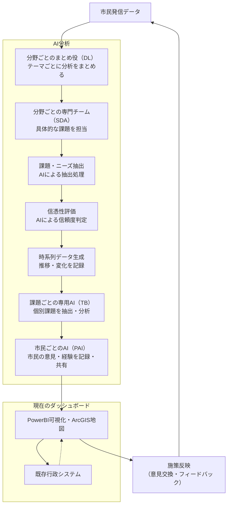

# 9. システム提案書 － 市民意見集約ダッシュボード

## 1. システム概要
　本システムは、市民の声をリアルタイムに集約・分析し、行政・市民・事業者が協働してまちづくりを推進するための「市民意見集約ダッシュボード」を中心に設計しています。ダッシュボードにはPower BIおよびArcGIS Onlineを活用し、SNS投稿、ハチペイコミュニティ、アンケート、イベント参加データなど多様な情報を一元管理し、時系列で可視化・分析します。

## 2. 主な機能

本システムの主な機能は以下の通りです。

● データ収集：SNS API、ハチペイ連携、アンケート、イベント参加データなど、多様な市民発信情報を一元管理します。
● AI分析：AIが課題・ニーズを抽出し、信憑性評価を行います。
● 可視化：タイムライン・推移グラフ・地域課題マップなどで、時系列・空間的に情報を表示します。
● 意見交換・フィードバック：行政・市民・事業者がダッシュボード上で意見交換・施策検討・フィードバックを行います。
● 参加促進：地域グループ・イベント・ポイント（ハチペイ連携）による市民参加を促進します。

## 3. システム構成

システムは以下の構成要素で成り立っています。

- データ収集基盤：SNS・ハチペイ・アンケート等からAPI連携でデータ取得
- AI分析基盤：自然言語処理・クラスタリング・信憑性判定
- ダッシュボード：Power BIおよびArcGIS Onlineによる可視化・操作画面（時系列・地図・グラフ）
- 既存行政システム連携：シティダッシュボード・オープンデータポータル等とのAPI連携

## 4. 技術要素

技術要素は以下の通りです。

- クラウド環境（例：AWS, Azure, GCP）
- Power BI（データ可視化・分析）
- ArcGIS Online（地理情報・マッピング）
- Webフロントエンド（React, Vue.js等）
- バックエンド（Python, Node.js等）
- データベース（PostgreSQL, MongoDB等）
- AI/機械学習（自然言語処理、分類、信憑性評価）
- API連携（SNS, ハチペイ, 行政システム）

### 市民意見集約ダッシュボード　技術要素・情報流通統合図

まとめ：

このフローは、市民が発信する声や情報を出発点とし、AIと組織的な役割分担によって都市課題や市民ニーズの抽出・分析・共有・解決を段階的に進めていく仕組みです。

主な流れは以下の通りです。

1. 市民発信データの収集：市民による声や情報をAI分析の起点として活用します。
2. 分野ごとのチーム構成：まとめ役（DL）が分野ごとに都市課題や市民ニーズをテーマ別に整理し、専門チーム（SDA）が交通・防災・子育てなど具体的な分野ごとに課題解決を担当します。
3. AIによる分析の深化：課題やニーズの抽出（EXTRACT）、情報信憑性の評価（VERIFY）、時系列データの生成（TIME）、専用AI（TB）による個別課題の抽出・分析、市民ごとのAI（PAI）による意見・経験の記録・共有を行います。
4. 最終的な目的：市民の声をもとにAIが段階的に課題やニーズを明らかにし、情報の信頼度や変化も記録。市民・分野の専門家・AIが連携して、課題解決に取り組める共創の仕組みとなっています。

#### データの保存場所・流れ

本システムにおけるデータは、主に以下の場所に保存・管理されます。

- データベース（PostgreSQL, MongoDB等）：SNS・アンケート・ハチペイ・行政システムなどから収集した元データやAI分析結果を格納。
- Power BI：データベースや外部データソースから取得したデータをダッシュボード上で可視化・分析。Power BIサービス上にもデータセットが一時的に保存される場合あり。
- ArcGIS Online：地理情報データ（地図、位置情報、空間分析結果など）をクラウド上で管理。Power BIダッシュボードに埋め込む場合はArcGIS Onlineから地図データを参照。

ダッシュボードはこれらのデータを参照・統合して表示します。

## 5. セキュリティ・プライバシー
- 個人情報保護・匿名化処理
- アクセス権限管理
- 通信暗号化（SSL/TLS）
- ログ管理・監査

## 6. 運用体制
- 行政・市民・事業者による運用協議会設置
- システム管理者・AI分析担当・サポート窓口の設置
- 継続的な機能改善・フィードバック体制

## 7. 今後の展望
- Power BI・ArcGIS Onlineの新機能活用や連携強化
- 機能拡張（新たなデータソース・分析手法の追加）
- 他自治体・地域への展開
- 市民参加型のシステム改善・共創イベント開催
