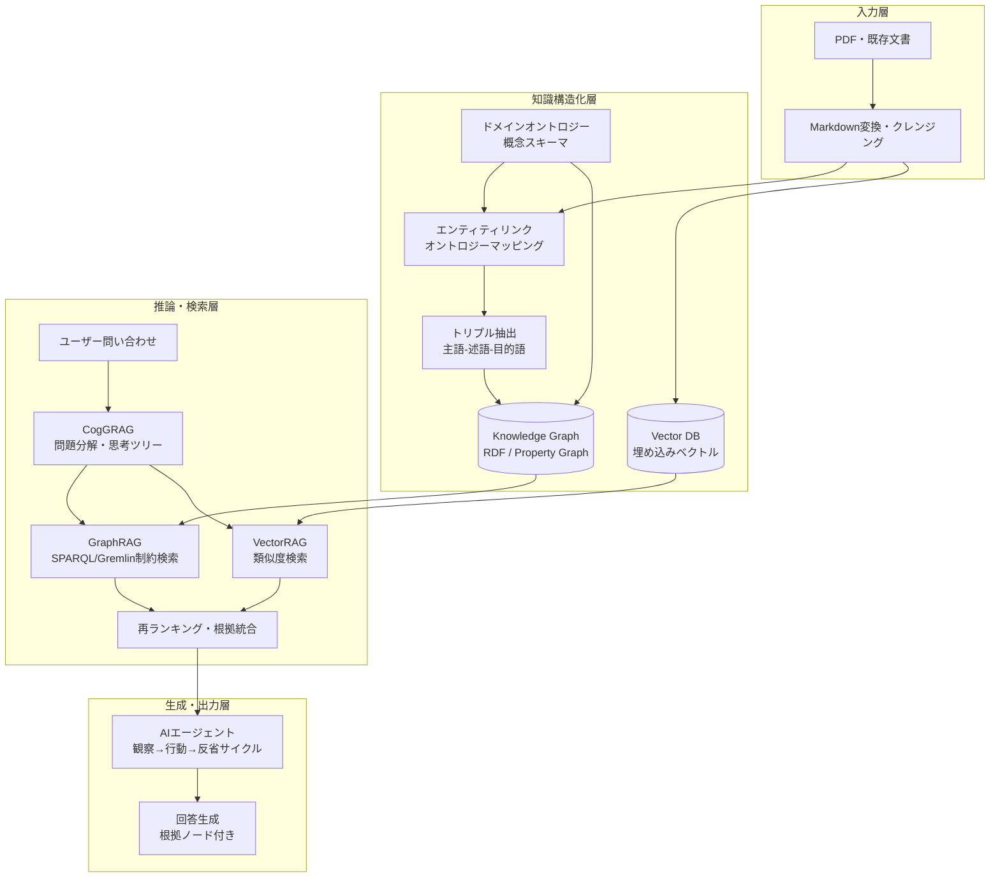

# 土木事業管理における知識・判断継承のためのRAGシステム構築提案書

**作成日**: 2026年5月  
**対象**: 事業管理部門・技術管理部門の意思決定者および技術担当者

---

## エグゼクティブサマリー

本提案は、土木事業管理における「ベテラン技術者の暗黙知・判断ロジックの消失」という構造的課題に対し、4つの先進技術を統合したRAGシステムで解決することを目指すものである。

| 技術要素 | 役割 | 主な効果 |
|---|---|---|
| **GraphRAG** | 法令・基準間の関係をグラフ構造で保持 | 多段推論（2ホップ以上）の実現 |
| **VectorRAG** | 非構造化テキストの意味検索 | 類似事例・実務知識の高速参照 |
| **ドメインオントロジー** | 概念・用語の公式スキーマ定義 | 用語の一意化・推論ルールの基盤 |
| **CogGRAG** | 人間の思考プロセスを模倣した問題分解 | 複雑な問いへの構造化した推論 |

従来のVectorRAG単体と比較して、**ハルシネーションの大幅抑制**・**根拠提示（Provenance）による説明可能性の向上**・**ナレッジ更新の自動化**を実現する。

**2トラック実装戦略**: 本提案は段階的に着手できる2トラック構成を採用する。

| トラック | アプローチ | 期間 | 対象 |
|---|---|---|---|
| **Track A（簡易）** | MD＋システムプロンプトで近似実現（§4-B） | 数日〜1週間 | PoC・試用・小規模運用 |
| **Track A+C（★主力推奨）** | MD＋マルチエージェント監理構造（§4-B/C） | 1〜2週間 | **大多数の実務用途に対応。AIの進歩を直接享受** |
| **Track B（本格）** | 7ステップ＋インフラ構築による完全実装（§4） | 2ヶ月〜 | 法的監査証跡・10万件超・複数組織スキーマ共有 |

---

## 1. 背景と目的

土木事業管理の実務は、河川法・道路法をはじめとする複雑な**法令**、膨大な**技術基準書**、および現場特有の専門用語（ドメイン知識）が高度に絡み合う領域である。

従来のVectorRAGでは、関連するテキスト断片（チャンク）を類似度だけで抽出するため、複数の文書や条文にまたがる「関係の連鎖」を辿ることができない。その結果、以下の土木実務特有の課題において回答精度が著しく低下していた。

- **多段推論の限界**: 「基準Aの改定が、それに紐づく基準Bの適用条件、さらには現場報告書Cの工法選択にどう波及するか」といった複数の関係性を順に辿る推論ができない。
- **知識の断片化**: 文書を機械的に分割してベクトル化するため、概念間の意味的なつながりや体系的な文脈が失われる。
- **用語の曖昧性**: 同一概念が複数の略語・表記で登場した際に同一エンティティとして認識できない。

本プロジェクトでは、「HybridRAG（GraphRAG × VectorRAG）」「CogGRAG」「ドメインオントロジー」を統合し、ベテラン技術者の判断ロジックをAIが正確に再現・継承できる知識基盤を構築する。

---

## 2. 全体アーキテクチャ

---

## 3. 採用技術の詳細

### 3.1 GraphRAG（ナレッジグラフ検索）

- **役割**: 法令・技術基準・マニュアル間の「依存関係」「包含関係」をノード（実体）とエッジ（関係）による知識グラフとして保持する。
- **適した問い**: 「〇〇工法の適用を制限する河川法の条文はどれか」など、事実に基づき明確に特定できる抽出的な問い。
- **利点**: 多段の依存関係を正確にトレースした回答生成が可能。

### 3.2 VectorRAG（ベクトル類似度検索）

- **役割**: 過去の施工トラブル報告書・現場進捗記録などの非構造化テキストから、意味的な類似性に基づいて類似事例を検索する。
- **適した問い**: 「過去の軟弱地盤対策におけるトラブルの共通傾向は何か」など、生データに直接明示されていない抽象的なニュアンスを汲み取る要約的な問い。

### 3.3 CogGRAG（認知思考型RAG）

- **役割**: 人間の専門家が複雑な問題に直面した際の「思考の構造化」を模倣するフレームワーク。
- **メカニズム**: 複雑な問いをマインドマップ状の「木構造」に自動分解し、各サブプロブレムに対してローカル・グローバル双方のナレッジグラフから構造的に検索し、ボトムアップで結論を導き出す。一足飛びの推論によるカスケードエラーを防ぐ。

### 3.4 ドメインオントロジー（知識の公式スキーマ）
