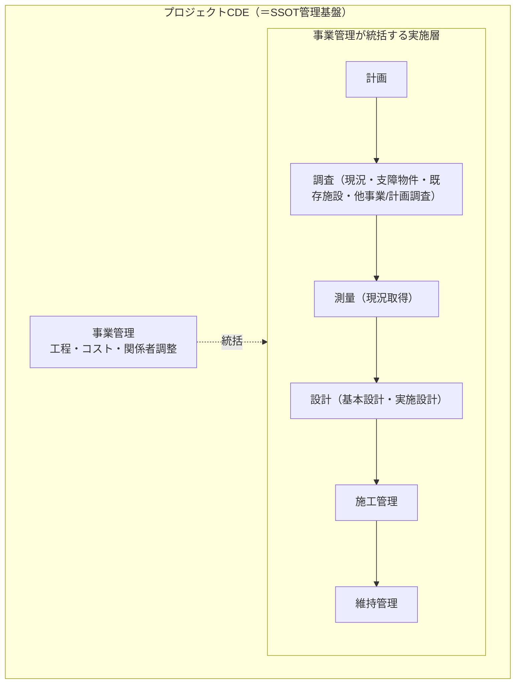
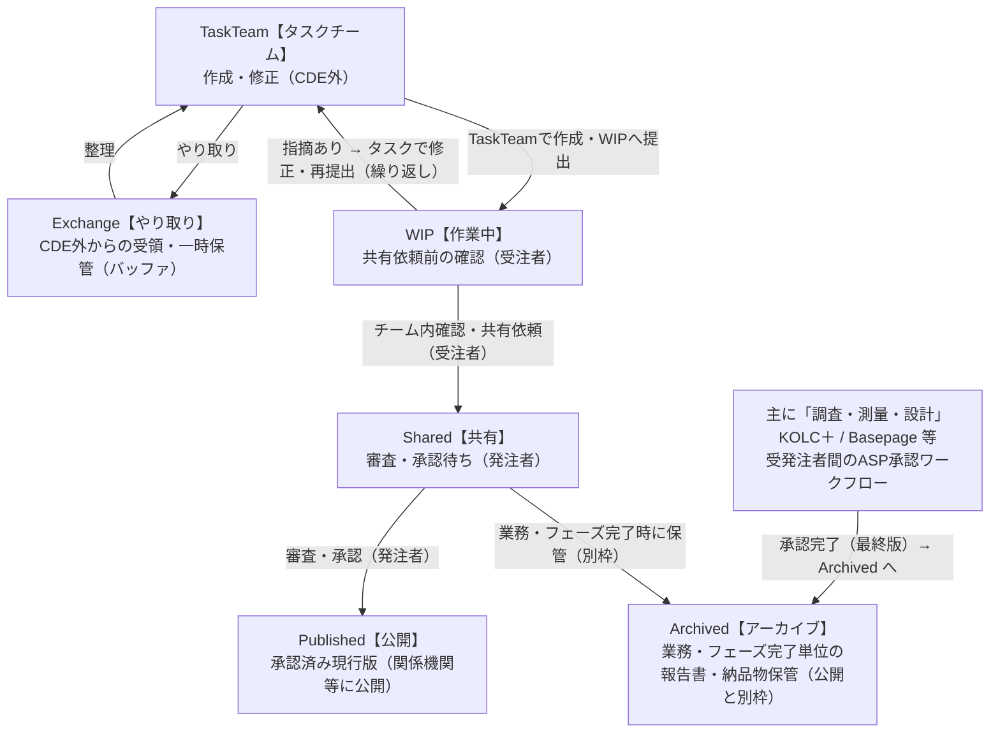
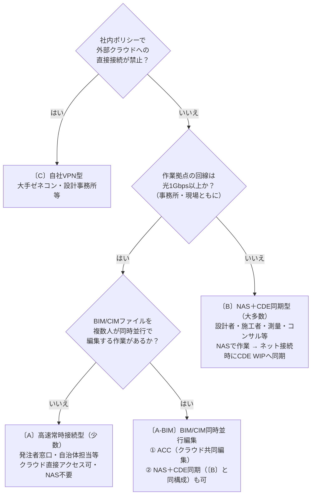

# プロジェクトCDE

本資料はプロジェクトCDEのアジャイルな検討を目的とした草案（ドラフト）です。内容は整理途中であり、本資料にはAI支援ツールを用いて整理・作成した情報が含まれます。AIの出力は参考情報であり、事実関係や技術的妥当性の最終判断・承認は人が行ってください。実務で使用したり外部へ提示する前に、必ず関係者による確認・検証・正式な承認を行ってください。

> 参考資料：[2025.3.7_プロジェクトCDEを中心としたデータマネジメントの取組案について（国土技術政策総合研究所）](https://www.nilim.go.jp/lab/peg/img/file2256.pdf)

---

## 目次

1. [プロジェクトCDEの定義と全体構造](#1-プロジェクトcdeの定義と全体構造)
2. [業務データ基盤（ストレージ選定）](#2-業務データ基盤ストレージ選定)
3. [アクセス制御とデータ共有](#3-アクセス制御とデータ共有)
4. [空間データ可視化基盤](#4-空間データ可視化基盤)
5. [承認フロー（ワークフロー）](#5-承認フローワークフロー)
6. [タスクチーム作業環境](#6-タスクチーム作業環境)
7. [付録](#7-付録)

---

# 1. プロジェクトCDEの定義と全体構造

## 1.1 定義と目的

- **定義**: プロジェクトCDEとは、事業の計画・設計・施工・維持管理にわたる**業務そのものをCDE（Common Data Environment）によって管理・統制する仕組み**であり、単なるデータ保管庫ではない。各業務フェーズで生まれるデータをSSOT（唯一の正本）として管理しながら、**可視化・共有**を通じて事業関係者全体の意思決定を支える。
- **目的**: 各フェーズで生成されるデータをSSOT（Single Source of Truth）として保持し、可視化・共有を通じて関係者の意思決定を支援する。公開用の派生物も必ずSSOTから生成・配信して整合性を担保する。
- **管理対象**: 文書・図面・BIM/IFC・点群・台帳系属性など、事業管理・設計・施工管理・維持管理に関わるすべての成果データ。
  


## 1.2 運用ワークフロー（ISO 19650準拠）

ISO 19650準拠のステータス管理により、権威あるマスター（SSOT）を確立する。タスクチームの作業はCDE外で準備され、WIPへの提出をもって正式なCDE管理が開始される。

| ステータス | 場所 | 公開対象 | 変更 | 用途 |
|-----------|------|---------|------|------|
| **Exchange【やり取り】** | CDE外 | 当該チームのみ | 可 | CDE外からのやり取りファイルの一時保管（例外措置） |
| **TaskTeam【タスクチーム】** | CDE外 | 当該チームのみ | 可 | 草稿・内部調整・WIP提出前の作業 |
| **WIP【作業中】** | CDE内 | 当該タスクチームのみ | 可 | 正式CDE管理の入口・作業・指摘対応 |
| **Shared【共有】** | CDE内 | プロジェクト関係者全員 | 不可 | 発注者による審査・承認待ち（契約上の受理） |
| **Published【公開】** | CDE内 | 関係機関・外部関係者 | 不可 | 承認済み現行版・関係機関等への公開 |
| **Archived【アーカイブ】** | CDE内 | 全関係者 | 不可（確定） | 業務・フェーズ完了単位の報告書・納品物の保管 |

## 1.3 管理対象業務フェーズ

プロジェクトCDEは以下の業務フェーズを包括的に管理する。




分割の趣旨:

- **調査（現況・支障物件・既存施設・他事業/計画調査）**: 既存施設（道路・水路・河川等）の実態確認、支障物件（既存構造物・埋設物）、および他事業・計画（進行中／予定）の確認、地質・土質調査等の非座標調査・台帳を含む調査全般を指す。調査報告書・支障物件台帳および他事業計画の参照情報は設計・施工判断に不可欠な基礎情報であり、CDEでの原本管理とメタデータ（位置参照・調査日・担当・信頼度・参照先）を必須化する。
- **測量（現況取得）**: 点群（LAS/LAZ）・写真・GNSS観測データなど、空間座標情報としての現況データを取得・処理するフェーズ。測量精度・座標系・メタデータ（取得日時・機器・処理方法）を明記し、設計・出来形管理で利用可能な形でCDEに保管する。
- **設計（基本設計・実施設計）**: 調査・測量データを基に図面・モデル・仕様書を作成するフェーズ。設計成果物のステータス管理（WIP→Shared→Published）と設計変更のトレーサビリティをCDEで担保する。

この分割により、成果物・責任範囲・CDE運用ルール（ファイル命名・メタデータ・承認ゲート）がより明確になり、実務での運用負荷が低減します。


> **プロジェクトCDEとは、実施層（計画・設計・施工管理・維持管理）を事業管理が統括しながら、すべての成果データをSSOTとして管理する基盤そのものである。**

### 1.3.1 調査・測量・設計で作成される主なデータと代表フォーマット
調査・測量・設計の各工程で生まれるデータ類と、CDE上での保存・可視化に向けた代表的なフォーマットを整理します。

- 調査（予備調査・現地調査）
    - 現地調査報告書：PDF, Word（PDF/A 推奨）
    - 写真・画像：JPEG/PNG（高解像度はTIFF/GeoTIFF）
    - 空撮・衛星画像：GeoTIFF, JPEG2000
    - 調査台帳・アンケート：Excel (.xlsx), CSV
    - 既存図面・資料：PDF, DWG/DXF, スキャン(TIFF)
    - 参照GISデータ：Shapefile, GeoPackage, GeoJSON, GML, PostGIS

- 測量（基準測量・詳細測量・観測）
    - 制御点・基準点座標：CSV/TXT（EPSG 明記）, GeoJSON, Shapefile, GPX
    - GNSS観測データ：RINEX, NMEA
    - トータルステーション出力：機器固有形式（.dat 等）/CSV
    - 点群データ（LiDAR/TLS）：LAS/LAZ, E57, XYZ/TXT
    - オルソモザイク・DSM/DTM：GeoTIFF, ASCII GRID
    - 等高線・地形ベクトル：Shapefile, GeoPackage, DXF
    - ジオタグ写真／動画：JPEG(+EXIF/GPS), MP4

- 設計（基本設計・実施設計・BIM）
    - 設計図面：DWG, DXF, PDF
    - BIM／3Dモデル：IFC, Revit (.rvt), OBJ, FBX
    - 土木設計データ（縦断・横断・線形）：LandXML, CSV/TXT（チェーンエイジ/標高）
    - 土量・切盛土モデル：TIN/メッシュ（OBJ/PLY）, LandXML, GeoTIFF DEM
    - 数量・積算：Excel (.xlsx), CSV, XML
    - 仕様書・技術報告書：PDF, Word
    - 施工用ステークアウトデータ：CSV（座標リスト）, DXF, LandXML

- 共通の運用ポイント（CDE連携）
    - 座標系（EPSG コード）とメタデータ（作成者・作成日・精度・処理履歴）を必須化（ISO 19115 推奨）。
    - 納品・保管はオープンフォーマット優先（GeoPackage, GeoJSON, GeoTIFF, LAS/LAZ, IFC 等）。
    - 可視化はCDEと連携：2DはGeoServer/QGIS Server＋Lizmap/Leaflet、3DはCesium/3DTiles、点群はEntwine/Potree、BIMはIFC.js/BIMserver 等を想定。
    - CAD⇄GIS、BIM⇄IFC、点群⇄メッシュの変換ルール、命名規則、バージョン管理を事前に合意し手順を文書化する。
    - 納品パッケージ例：図面(PDF/DWG) + 座標CSV + GISレイヤ(GeoPackage) + 点群(LAS) + 仕様書(PDF) + メタデータ(JSON)

    #### 空間データ可視化基盤への連携
    調査・測量・設計で生成されたデータはCDEでの原本管理と並行して、空間データ可視化基盤で統合・加工・配信されます。代表的な連携フローは次の通りです。

    - ベクタ（Shapefile/GeoJSON/GeoPackage） → PostGIS 等の空間 DB に格納 → GeoServer/QGIS Server 経由で OGC（WMS/WFS）やベクタタイル配信 → Lizmap/Leaflet 等で2D可視化
    - ラスタ（GeoTIFF / DSM / DTM） → タイル化（GeoServer/TMS）→ 地図・解析ビューで配信
    - 点群（LAS/LAZ/E57） → PDAL/Entwine による処理・タイル化 → Potree / 3DTiles 等でブラウザ表示
    - BIM/3Dモデル（IFC/Revit/OBJ） → IFC→3DTILES/glTF 変換（IFC.js, BIMserver 等）→ Cesium/3D ビューアで閲覧
    - 文書・図面（PDF/DWG/Excel） → CDEで原本管理、可視化基盤はサムネ・メタデータ・リンクを参照して関連情報を表示

    運用要点：
    - 全データに座標系（EPSG）とメタデータ（作成者・作成日・精度・処理履歴）を付与し、可視化基盤はこれを参照して整合性を担保する。
    - ETL（GDAL/OGR、PDAL、変換パイプライン）は自動化し、SSOT（CDE）→ 派生物（可視化用タイル/モデル）生成をCI化する。
    - アクセス制御はCDE側で原本を管理し、可視化基盤は派生ビューに対して公開レイヤ（認証／共有リンク／公開）を適用する。

    - 文書・図面は単なるリンク参照に留めず、GIS属性（SSOT ID／文書種別／承認ステータス／作成日／関連地物ID 等）として取り込み、地物の属性クエリや GetFeatureInfo で即時参照・ダウンロードできるようにする。これにより位置情報と文書が一体化し、事業全体の統合的参照・意思決定が可能になる。

        ##### 文書・図面の属性スキーマ（例）
        下は GIS の属性テーブルやメタデータカタログに保存する想定の最小スキーマ例です。プロジェクト要件に応じて拡張してください。

        - `ssot_id` (string, 必須): SSOT 一意 ID（例: UUID）
        - `doc_id` (string, 必須): 文書/図面の識別子（例: DOC-2026-001）
        - `title` (string): 文書タイトル
        - `doc_type` (string): 種別（例: 調査報告書／設計図／写真／点群）
        - `related_feature_id` (string, 任意): 関連する地物／要素の ID（地物側の主キーと整合）
        - `related_feature_type` (string, 任意): 地物種別（例: road, bridge, manhole）
        - `epsg` (integer, 推奨): 座標系 EPSG コード（該当する場合）
        - `created_at` (datetime): 作成日時
        - `creator` (string): 作成者（担当者名／組織）
        - `accuracy` (string/float, 任意): 精度・信頼度（例: 0.05m）
        - `approval_status` (string): 承認ステータス（WIP/Shared/Published）
        - `file_url` (string, 必須): CDE 上の原本ダウンロード／参照 URL
        - `thumbnail_url` (string, 任意): サムネ画像 URL
        - `metadata_json` (jsonb, 任意): 拡張メタデータ（元ファイルの処理履歴・センサー情報等）

        例：メタデータ JSON（GeoJSON の `properties` に埋める想定）

        {
            "ssot_id": "b6f9d8e2-4c2a-4f1a-9e2b-0a1b2c3d4e5f",
            "doc_id": "DOC-2026-001",
            "title": "現況写真_道路A_20260501",
            "doc_type": "photo",
            "related_feature_id": "FT-000123",
            "related_feature_type": "manhole",
            "epsg": 6669,
            "created_at": "2026-05-01T10:23:00+09:00",
            "creator": "測量チームA",
            "accuracy": null,
            "approval_status": "WIP",
            "file_url": "https://box.example.com/s/abcd1234",
            "thumbnail_url": "https://box.example.com/s/thumb_abcd1234.jpg",
            "metadata_json": {"camera_model":"CannonXYZ","exif_gps":true}
        }

        ##### 実装チェックリスト（導入時）
        - CDE に原本保管：ファイルとメタデータの分離（ファイルは Box 等、メタデータは PostGIS/Elasticsearch）
        - 一意 ID 運用：`ssot_id` を全システムでキーにする（UUID を推奨）
        - GIS 属性追加：地物テーブルに `doc_links` または `doc_count` 等の列を追加し GetFeatureInfo で参照可能にする
        - メタデータ格納：PostGIS の JSONB カラムか専用メタデータテーブルで管理し全文検索を有効化する
        - API/Viewer 統合：GeoServer の GetFeatureInfo / feature attributes で `file_url` を返すよう設定
        - 権限連携：CDE のアクセス権と可視化基盤の表示制御を紐付ける（SSO / token 検証）
        - ETL 自動化：ファイル登録時にメタデータを自動抽出・インジェストするパイプラインを構築（例: Lambda/Cloud Function / CI）
        - テスト：代表的な文書（PDF）、図面（DWG）、写真（ジオタグ付）で GetFeatureInfo→ファイル参照→ダウンロードまでの実行検証

        上記を実行すれば、GIS 上で地物をクリックすると該当する文書・図面が即参照でき、位置情報と文書が一体化した運用が実現します。

    「4. 空間データ可視化基盤」は、上の流れを前提に具体的な構成・技術選定・運用を記載します。

## 1.4 機能構成（全体像）

プロジェクトCDEの本質は**SSOTによる共有・公開**であり、以下の構造で機能群が成立する。

```
【目的】SSOTによる共有・公開
    ↑ SSOTを活用
【事業監理業務】進捗管理・資料整理・可視化・報告
    ↑ SSOTを構成
【データ基盤】空間データ可視化基盤 + 業務データ基盤（ストレージ）
```

**業務データ基盤**（ストレージ）
: データ取り込み（バッチ／ストリーム）、ETL/ELT、スキーマ・メタデータ管理、アクセス制御・監査、バックアップ、API公開、データガバナンス等を担い、SSOT（属性・履歴・トランザクション）を保持する。

**空間データ可視化基盤**
: CAD／BIM／CIM／GISの可視化・解析・配信（3DTILES/glTF、ベクタタイル、OGC/Web API、タイル化・キャッシュ等）を担い、閲覧・解析・住民向け公開を実現する。

## 1.5 業務フォルダとデータの使い分け方針

CDEで扱うデータは性質が異なるため、以下のように使い分けることが現実的である。

```
【文書・図面系】設計書・報告書・会議録・CAD図面・写真
    → ファイルストレージ（Box を標準推奨 / NAS は暫定）で管理

【GIS・BIM系】空間データ・IFC・点群・3Dモデル
    → GIS/BIMプラットフォームと連携（別途選定）
    ただし元ファイルの保管先はファイルストレージと統一が望ましい
```


**調査・測量・設計・監理の役割分担（事業管理視点）**

| 業務 | 主データ形式 | 管理ツール・方針 |
|------|------------|---------------|
| 調査（支障物件・既存施設・他事業/計画調査） | 調査報告書・支障物件台帳・他事業計画参照（CSV/GEOJSON等） | CDEで原本保管。メタデータ（位置・調査日・担当・信頼度・参照先）を必須化 |
| 測量（現況取得） | 点群（LAS/LAZ）・写真 | CDEの原本として保管。座標系・精度情報を付与しPotree等で共有 |
| 設計 | IFC・DWG | WIP→Shared→PublishedのCDEワークフローで運用 |
| 監理 | GIS（属性・台帳） | GISレイヤで一元管理。派生3D（3DTILES/glTF）を紐付けて可視化 |

- **ID連携**: BIM要素・点群領域・GIS地物に一意IDを付し、トレーサビリティを担保する。
- **ソース規定**: どのシステム上のどのステータスが権威（SSOT）かを明文化する（例: 設計は `Published` のIFC、監理は `Published` のGIS属性テーブル）。
- **派生物ワークフロー**: IFC/点群からは公開用の3DTILES/glTF/タイル点群を自動生成し、監理・公開用に配備する。

---

# 2. 業務データ基盤（ストレージ選定）

ストレージが決まらなければ、GIS基盤も業務データ連携も成立しない。まずデータを保存・管理できるストレージの選定を行う。

## 2.1 選定要件

要件は「**必須条件（KO条件）**」と「**評価要件（重みづけ）**」の2段階で設定する。KO条件を満たさない候補はその時点で不適合となる。

### 必須条件（KO条件）

| # | 要件 | 必須とする理由 |
|---|------|------------|
| **KO-A** | **認証付き外部共有（アカウント相当）** | 許認可機関・ライフライン事業者等との公式な協議・承認には、アカウント認証＋アクセス権限管理＋操作ログを備えた外部共有機能が必要。パスワード付きURLのみの場合はアクセス者の特定・証跡管理が困難なためKO-A不適合とする（住民向け閲覧公開等の低リスク用途には共有リンクで補完可） |
| **KO-B** | **国内データセンター（または同等のセキュリティ保証）** | 公共事業データの所在国要件・ガバメントクラウド方針への適合。発注者のセキュリティポリシー上、原則として国内DC必須 |

### 評価要件（重みづけ）

> 評価点：◎＝3点 ／ ○＝2点 ／ △＝1点　　R8（コスト）は低いほど高得点（低〜中＝3、中＝2、初期高＝1）

| # | 要件 | 重み | 重みの根拠 |
|---|------|:----:|----------|
| R1 | 複数人・複数組織からのアクセス | ×2 | 同時アクセス数・組織数に応じた品質差が業務に影響 |
| R2 | フォルダ・ファイル単位のアクセス権限管理 | ×3 | ISO 19650のWIP/Shared/PublishedステータスとSSOT管理の根幹。**最重要** |
| R3 | バージョン管理・変更履歴 | ×2 | SSOTの改訂履歴の保持。設計変更の追跡可能性に必要 |
| R4 | 大容量ファイル対応 | ×2 | BIM/CIM・点群データは数GB〜数十GBになる。**容量無制限**かどうかが評価の分岐点 |
| R7 | 既存業務ツールとの親和性 | ×1 | 導入効果・学習コストに関わるが教育で補える部分もある |
| R8 | 長期運用コスト | ×1 | セキュリティ・機能要件を優先したうえでの比較要素 |
| R9 | 外部関係機関の操作ログ・承認証跡 | ×2 | 公共事業の協議記録・承認は法的証跡としての意味を持つ |

## 2.2 ストレージ候補の比較・総合評価

> KO判定が⚠️・❌の候補の総合点は**参考値**（KO要件の解消を前提とした場合の機能評価）。

| ストレージ | 種別 | KO-A | KO-B | **KO判定** | R1×2 | R2×3 | R3×2 | R4×2 | R7×1 | R8×1 | R9×2 | **総合点**（/39点） |
|-----------|------|:---:|:---:|:---:|:---:|:---:|:---:|:---:|:---:|:---:|:---:|:---:|
| **Box** | クラウド | ◎ | ◎ | **✅ 適合** | ◎ | ◎ | ◎ | ◎ | ○ | 中 | ◎ | **37** |
| **SharePoint / OneDrive** | クラウド | ○（※4） | ◎ | **⚠️ 要確認** | ◎ | ◎ | ◎ | ○ | ◎ | 中 | ◎ | *36（参考）* |
| **Dropbox Business** | クラウド | ○（※3） | ○（※1） | **⚠️ 要確認** | ◎ | ○ | ◎ | ○ | ○ | 中 | △ | *28（参考）* |
| **Google Drive / Workspace** | クラウド | ○（※3） | △（※1） | **⚠️ 要確認** | ◎ | ○ | ○ | ○ | ○ | 低〜中 | △ | *27（参考）* |
| **NAS（オンプレミス）** | 自前サーバ | △（※2） | ◎ | **❌ 不適合** | △ | ○ | △ | ◎ | ○ | 初期高 | △ | *21（参考）* |

> ※1 Dropbox Business・Google WorkspaceはISMAP登録済みだが、データセンター所在国の扱いは発注者のセキュリティポリシー確認が必要なため「要確認」とする。  
> ※2 NASは外部組織との共有にVPN設定が必要で認証付き外部共有手段がなく、KO-A不適合とする。  
> ※3 Google Workspace・Dropbox BusinessのKO-Aは○。外部共有に相手方アカウントが必要で、アカウントを持たない場合は成立しない。KO判定が⚠️なのは**KO-B（国内DC）が満たせていないため**。  
> ※4 SharePointのKO-Aは○：Azure AD B2Bゲスト招待は相手方Microsoftアカウントまたは相手方組織のゲスト許可が前提。許認可機関・行政機関では制限されるケースが多く、M365非保持者への代替手段（ゲストリンク・パスワード付きURL）はKO-Aが定義する「パスワード付きURLのみ＝不適合」に該当するため、**公共事業では実質的にKO-A不適合となるケースが大半。CDE用途には推奨しない。**  
> ※R4評価：Box◎＝**容量無制限**（Business以上）／SharePoint○＝1TBベース＋ライセンス加算・1ファイル上限250GB／Dropbox○＝プランにより上限あり／Google○＝共有プール制／NAS◎＝増設で無制限だが初期コスト大

## 2.3 ISMAP登録状況

| 登録番号 | クラウドサービス名称 | 事業者名 | ホームページ | 備考 |
|:--------:|---------------------|---------|-------------|------|
| C21-0013-2 | Microsoft Office 365（SharePoint / OneDrive 等） | 日本マイクロソフト株式会社 | https://www.office.com/ | 2026/04/24：登録情報更新 |
| C21-0017-2 | Box | Box, Inc. | https://www.box.com/ja-jp/home | 2026/02/27：登録情報更新 |
| C21-0005-2 | Google Workspace | Google LLC | https://workspace.google.com/ | 2025/09/01：登録情報更新 |
| C24-0075-2 | Dropbox Business | Dropbox, Inc. | https://www.dropbox.com | 2025/12/22：登録情報更新 |
| — | NAS（オンプレミス） | — | — | クラウドサービスではないためISMAP対象外 |

> 出典：[ISMAPクラウドサービスリスト](https://www.ismap.go.jp/csm?id=cloud_service_list)（2026年4月時点）

## 2.4 推奨

| 状況 | 推奨 | 根拠 |
|------|------|------|
| **外部共有が伴うほぼすべての案件（標準推奨）** | **Box** | ISMAP登録済み（C21-0017-2）。アカウント（コラボレータ）共有とタイプA共有リンク（パスワード付き・有効期限・ダウンロード制御）の両方を提供できるため、相手方のアカウント有無にかかわらずKO-Aを満たせる。大容量ファイル（BIM/CIM・点群）も容量無制限で対応。 |
| **ISMAP要件確認が取れない・調達が間に合わない** | **NAS + VPN（暫定）** | 庁内・事務所内に閉じた環境として暫定利用可。外部共有はVPN接続が必要で長期運用には適さない。 |

> SharePoint (Microsoft 365) はISMAP登録済みだが、M365非保持者への代替手段（ゲストリンク・パスワード付きURL）がKO-Aの「パスワード付きURLのみ＝不適合」に該当する。公共事業では許認可機関・行政機関側でゲスト招待を制限しているケースが多く、CDEとしての採用要件を満たさないため推奨から除外した。

## 2.5 推奨フォルダ構成例（Box）

**フォルダ階層の設計方針**：ステータス（Exchange / TaskTeam / WIP / Shared / Published / Archived）を最上位に置く。業務フォルダを最上位にするとフォルダ数 × ステータス数の権限設定が必要になり設定漏れ・メンテナンスコストが増大する。ステータスを最上位にすれば各ステータスフォルダへの権限付与が各1回で全業務フォルダに継承される。

```
📁 [事業名]-プロジェクトCDE
│
├── 📁 Exchange【やり取り】   ← 【例外措置】CDE外でやり取りされたファイルを一時保管する場所
│   │              ※業務分類は行わず、年月等で管理。重要なものは後でShared等に移す。
│   ├── 📁 202604_〇〇省から受領
│   └── 📁 202604_地元説明会資料_送信控え
│
├── 📁 TaskTeam【タスクチーム】   ← CDE上の各チーム作業フォルダ（当該チームのみアクセス可）
│   └── 📁 [業務名]
│       ├── 📁 01_事業全体計画の整理
│       ├── 📁 02_測量・調査・設計業務等の指導・調整等
│       ├── 📁 03_地元及び関係行政機関等との協議
│       ├── 📁 04_事業管理
│       ├── 📁 05_施工管理
│       ├── 📁 06_BIM-CIM（統合モデル）活用支援
│       └── 📁 07_その他（維持管理・電子納品等）
│
├── 📁 WIP【作業中】        ← 当該タスクチームのみ書込可・正式CDE管理の入口
│   └── 📁 [業務名]
│       ├── 📁 01_事業全体計画の整理
│       ├── 📁 02_測量・調査・設計業務等の指導・調整等
│       ├── 📁 03_地元及び関係行政機関等との協議
│       ├── 📁 04_事業管理
│       ├── 📁 05_施工管理
│       ├── 📁 06_BIM-CIM（統合モデル）活用支援
│       └── 📁 07_その他（維持管理・電子納品等）
│
├── 📁 Shared【共有】     ← 承認済み・プロジェクト関係者全員閲覧可
│   ├── 📁 01_事業全体計画の整理
│   ├── 📁 02_測量・調査・設計業務等の指導・調整等
│   ├── 📁 03_地元及び関係行政機関等との協議
│   ├── 📁 04_事業管理
│   ├── 📁 05_施工管理
│   ├── 📁 06_BIM-CIM（統合モデル）活用支援
│   └── 📁 07_その他（維持管理・電子納品等）
│
├── 📁 Published【公開】  ← 関係機関等への公開版
│   ├── 📁 01_事業全体計画の整理
│   ├── 📁 02_測量・調査・設計業務等の指導・調整等
│   ├── 📁 03_地元及び関係行政機関等との協議
│   ├── 📁 04_事業管理
│   ├── 📁 05_施工管理
│   ├── 📁 06_BIM-CIM（統合モデル）活用支援
│   └── 📁 07_その他（維持管理・電子納品等）
│
└── 📁 Archived【アーカイブ】   ← 変更不可。業務・工事完了時の成果物・納品物を保管
    ├── 📁 01_土木設計業務等   ← 設計・測量・調査・事業管理等の業務完了時の報告書・成果品
    └── 📁 02_工事完成図書     ← 工事完了時の完成図・施工記録・出来形・品質管理書類等
```

## 2.6 Exchange【やり取り】の運用ルール（例外措置）

CDEの理想は「全関係者が同じシステム上で完結すること」だが、実務上はメール添付やチャット等でCDE外にファイルが流れる。`Exchange` フォルダはやり取りの一時バッファとして許容するが、正本（SSOT）と同列扱いにしてはいけない。

**位置づけ（一次受領）**
- 正式受領はアカウント（コラボレータ）共有（認証付き）で行う。`Exchange` はコラボレータ外からの例外的な受領や緊急時の一時バッファとしてのみ使用する。
- `Exchange` で受領したファイルは速やかに検査・分類し、重要なものはTaskTeamで整理した上でWIPに提出し、承認プロセスを経てShared/Published等の正式フォルダへ移行する。

**受信方針**
- 外部正式受領はBoxの `File Request` を使用する。
- 組織内のメール添付は `Box for Outlook` でBoxに保存し、共有リンクを利用して添付の重複と追跡不備を防ぐ。

**送信方針**
- 送信はアカウント（コラボレータ）共有（認証付き）を基本とする。共有リンクは、受信者がBoxアカウントを持たない等の例外的な場合に限定する。
- デフォルトの共有設定はview-only。必要に応じて有効期限・パスワード・ダウンロード可否を設定する。

**アクセス制御**
- `Exchange` は一次受領用バッファとし、`WIP`/`Shared`/`Published` 等の正式フォルダはコラボレータ限定で厳格に管理する。
- 移行期限: `Exchange` 内の重要ファイルは原則72時間以内に分類・WIPへ提出する。

---

# 3. アクセス制御とデータ共有

## 3.1 アクセス制御・データ共有の三層（概要）

プロジェクトCDEでは、データの共有方法とアクセス制御を「三つの共有レベル（層）」で定義します。各層ごとに許容されるデータ粒度・認証レベル・配信手段が異なり、適切な共有方法を選ぶことが設計上の重要課題です。

**意思決定フロー**
1. データ分類（機密度・個人情報の有無）
2. 層の決定（共有レベル：層1（設計編集） / 層2（関係者共有） / 層3（公開））
3. 必要なセキュリティ対策（認証・匿名化・ネットワーク制御・監査）
4. アプリ／配信方式の選定（例: Revit/Navisworks/KOLC+ は層1、Cesium は層2、Re:Earth/Lizmap は層1〜層3対応）
5. 公開タイミング（`Published` 承認後、派生物を配信）

ここでの「層」は、主に「共有方法（アカウント認証／共有リンクタイプA／共有リンクタイプB）」と「アクセス制御レベル」を指します。以下の表や説明は、この対応を前提としています。

| 層 | 共有方法 | 対象フェーズ | 対象者（想定） |
|---:|---|---|---|
| 層1 | アカウント（認証付き） | 設計・詳細設計・モデリング | 設計者、BIMコーディネータ、モデラー |
| 層2 | アカウント または 共有リンク（タイプA）※ | 調整・承認・施工前確認・施工管理 | 発注者担当、施工管理者、監理者、関係機関 |
| 層3 | 共有リンク（タイプB: 公開） | 広報・住民説明・公表資料 | 住民、広報担当、一般閲覧者 |

> ※ 層2の「または」は相手に応じた使い分けを意味し、**両方の方法を同時に提供できる状態にすることが必須**。アカウント共有のみに限定すると、許認可機関・ライフライン事業者・下請け等の共有先に有料アカウントの取得を強いることになり、ほとんどのニーズに対応できない。

### 共有方法

- **アカウント（認証付き）**: 組織アカウントでのアクセス。SSO/MFA・RBAC・監査ログにより高忠実度データの安全共有に適する。
- **共有リンク（タイプA: ID＋パスワード／短期署名）**: 外部委託先や関係機関向けの限定共有。有効期限・ダウンロード制御・パスワードで安全性を高める。
- **共有リンク（タイプB: 公開）**: アカウント不要の一般公開リンク。公開対象は匿名化・軽量化した派生物に限定する。

## 3.2 層1 — 設計編集（高保護・編集可）

- **共有方法**: CDE内のShared領域またはAPI経由の署名付き配布パイプライン。手動配布／メール添付は禁止。
- **認証**: SSO（OIDC/SAML）＋厳格MFA（ハードトークン/OTP）、短いセッション有効期限（例: 30分）。
- **認可**: RBAC＋細粒度ACL（オブジェクト／属性レベル）。最小権限で編集ロールを付与。
- **配布**: APIゲートウェイ経由、署名・ハッシュ付き派生物、バージョン管理。VPN/ゼロトラスト・IP制限を要求。
- **監査**: 変更ログを完全記録しSIEMへ集約。差分ロールバック対応。
- **運用**: 編集は承認ワークフロー必須（WIP→Shared）。エクスポート時の自動DLPチェックを実施。

## 3.3 層2 — 関係者共有（制御付き参照）

- **共有方法**: アカウントベース（SSO/MFA）と タイプA共有リンク（ID＋パスワード・有効期限・ダウンロード制御）の**両方を併用**する。プロジェクト内チームや主要パートナー等アカウントを取得できる相手にはアカウント共有、許認可機関・ライフライン事業者・下請け等アカウント取得が困難な相手にはタイプA共有リンクを使用する。アカウントのみに限定すると共有先に有料アカウント購入を強いる事態となり現実的でない。
- **認証**: SSO＋MFA推奨。外部ユーザはSCIM等でプロビジョニングし短期トークンを発行。
- **認可**: ロールベースに加え時間・用途ベース制御（スコープ・有効期限）。原本の直接ダウンロードは原則制限。
- **配布**: 必要最小属性で派生物を生成、署名・ハッシュで整合性を担保。
- **監査**: アクセス／ダウンロードログを保持し定期レビュー。承認メタデータ（承認者・日時・派生物ID）を必須化。
- **運用**: 共有リンクは申請→承認→発行履歴を残す。期限切れ後は自動無効化。

## 3.4 層3 — 公開（低リスク・広報向け）

- **共有方法**: タイプB公開リンク（CDN配信）で公開。公開前に完全匿名化・マスキング・解像度低減した派生物のみを公開し、公開期限と監視を設定する。
- **認証**: 閲覧は基本不要。公開設定変更は管理者のSSO権限（MFA）で保護。
- **認可**: 公開はPublishedを通過した派生物のみ許可。
- **配布**: CDN＋WAF＋RateLimitで配信。公開派生物は署名・バージョン・元SSOT IDを持つ。
- **監査**: アクセス統計・監視ログで追跡。個人情報を含む公開は厳禁。
- **運用**: 公開前にSSOTと照合し、公開後は定期チェックと期限管理。削除・訂正要求の対応フローを整備。

## 3.5 共通要件（全層）

- **認証基盤**: OIDC/SAML IdP、SCIMによるプロビジョニング。MFAを原則。
- **認可基盤**: RBAC／ABACの実装、APIゲートウェイでスコープ管理。
- **通信**: TLS 1.2/1.3による暗号化。
- **ログ/監査**: 全アクセス・操作ログをSIEMへ集約し最低90日保持。
- **データ所在**: 公共案件は国内DC／ISMAP等を確認。バックアップの所在を明示。
- **自動化**: 変換・バージョン・配信は自動パイプライン化し、配布前に承認チェックを必須化。手動配布は禁止。

## 3.6 事業管理の運用原則

- フェーズ毎に承認ゲート（WIP→Shared→Published）を設定し、承認済み派生物のみ上位層へ流通させる。
- 編集権限は最小権限で付与し、外部委託には期限付き・用途限定の編集ロールを発行する。
- 事業管理はアクセスレビューと定期監査を主導し、ポリシー適合性を担保する。
- フェーズ毎のアクセスポリシーと承認責任者を明記し、承認メタデータを必須化する。

## 3.7 役割別：工事関係者の可視化層割当（例）

| 役割 | 可視化層 | 推奨共有方法 | 推奨アプリ・備考 | アカウント要否 | KO条件 |
|---|---|---|---|---|---|
| 施工管理者（現場監督） | 層2 | アカウント（組織アカウント持ち向け）＋タイプA（アカウント不問の相手向け）— **両方を提供できる状態が必須** | Trimble Connect, Cesium | 相手による。組織アカウント持ちは要、持たない相手はタイプAで対応 | 要確認（官公庁案件は国内DC/ISMAP要件） |
| 現場技術者（測量・出来形担当） | 層1＋層2 | 層1: アカウント（認証付き）／層2: アカウント＋タイプA（**両方を提供できる状態が必須**） | Potree・Navisworks（層1）、QGIS/Cesium（層2） | 層1は要（有料ライセンスあり）。層2はタイプAで無アカウント対応可 | 要確認 |
| 下請け業者 | 層2 | タイプA（基本。アカウント購入を強いない）＋アカウント（継続参加者への付与を推奨） | Cesium / Lizmap | 原則不要（タイプAで対応）。継続参加者にはアカウント発行を推奨 | 要確認 |
| BIMコーディネータ / モデラー | 層1 | アカウント（認証付き） | Revit / Navisworks / Bentley iTwin | 要（有料ライセンス） | 要確認 |
| 品質管理・監理（第三者） | 層2 | アカウント（組織アカウント持ち向け）＋タイプA（アカウント取得困難な機関向け）— **両方を提供できる状態が必須** | QGIS/Lizmap、Cesium | 相手による。組織アカウント持ちは要、取得困難な場合はタイプAで対応 | 要確認 |
| 発注者・行政（窓口担当） | 層2＋層3（広報用抜粋） | 層2: アカウント（発注者組織・主要行政）＋タイプA（アカウント不問の関係行政機関）／層3: タイプB | 層2: Lizmap など（タイプA対応ツール）／層3: Re:Earth・ArcGIS Online | 発注者・主要行政は要。関係行政機関はタイプAで対応可 | KO: 国内DC/ISMAP等遵守が必須 |
| 広報担当 / 住民向け公開 | 層3 | タイプB（公開） | Re:Earth, ArcGIS Online, Lizmap | 不要（公開リンクで可） | 公開物は匿名化が必須 |

## 3.8 関係機関との情報共有

### 主な関係機関と共有内容

| 関係機関 | 共有が必要な情報 | タイミング | 共有手段 |
|----------|----------------|-----------|----------|
| 発注者（国・自治体） | 進捗・設計承認・出来形・報告書 | 随時・節目ごと | SSOT参照権限付与・報告書送付 |
| 許認可機関（河川・道路管理者等） | 設計図・施工計画・協議資料 | 協議時 | 図面・資料の外部共有URL |
| ライフライン事業者（電力・ガス・水道等） | 埋設物位置・施工範囲・工程 | 着工前・施工中 | GIS地図共有・平面図 |
| 地方自治体（市区町村） | 事業概要・工程・住民説明資料 | 計画〜施工中 | 閲覧URL・説明会資料 |
| 住民・地権者 | 事業概要・工程・影響範囲・騒音振動情報 | 説明会・随時 | パスワード付き閲覧URL・VR |
| 隣接工事・他事業者 | 施工範囲・工程・仮設計画 | 施工調整時 | 図面・工程表の共有 |

### 情報共有の設計方針

| 方針 | 内容 |
|------|------|
| SSOTからの派生共有 | 関係機関への提供データは必ずSSOT（Published）から生成し、手動複製・メール添付による情報の分岐を排除する |
| 機関別アクセス権限 | 各関係機関に必要最小限のデータへのアクセス権限のみを付与する |
| 共有ログの保持 | 誰にいつ何を共有したかを記録し、協議・承認の証跡として活用する |
| フォーマットの柔軟対応 | 相手機関のシステムに合わせてDWG・PDF・CSV・GEOJSONなど形式を変換して提供する |

---

# 4. 空間データ可視化基盤

## 4.1 全体構成と役割

空間データ可視化基盤は、CDEで管理されるSSOTデータを**位置情報（座標系）という共通軸**で統合・加工・配信し、関係者が地図・3D・グラフで直感的に状況を把握できるようにする。CDE本体（ストレージ・権限管理）とは分離するが、データの流れは一方向ではない。

- **CDE → GIS（派生物生成）**: SSOTの変更を起点に、ETLで自動変換した派生物をPostGIS・タイルストアに格納して配信する。
- **GIS固有属性の管理（GIS主導）**: 現地調査・台帳補正・新規地物追加など、GIS層が正本となる属性はPostGISに直接書き込み（OGC API - Features / WFS-T / QGISなど、層1のみ）、変更履歴を保持したうえでCDEへバックシンクしてSSOTとの整合性を維持する。

```
[SSOT（CDE / Box等）] ←── バックシンク（GeoPackage/GeoJSON・CDE WIPワークフロー経由）
    ↓ ETLパイプライン（GDAL / PDAL / IFC変換 等）
[空間DB（PostGIS）・タイルストア（MBTiles / 3DTILES）]
    ↑ GIS属性編集・補正・新規追加（OGC API - Features / WFS-T / QGIS等、層1のみ）
    ↓ OGC API / 3DTILES配信
[配信サーバ（GeoServer / TileServer GL / Cesium Server）]
    ↓ 認証・CDN
[クライアント（Cesium / MapLibre GL / Lizmap 等）]
```

| 構成要素 | 役割 |
|----------|------|
| ETLパイプライン | SSOT変更を起点に、座標変換・フォーマット変換・タイル生成を自動実行（CI化） |
| 空間DB（PostGIS） | ベクタ地物・属性・メタデータ・文書リンク（`file_url`）を一元管理。GIS固有属性の書き込み・補正・追加の起点でもある |
| タイル・3Dストア | 3DTILES（BIM/点群/地形）・MBTiles（ラスタ/ベクタタイル）を保管・配信 |
| 配信サーバ | GeoServer/TileServer GL等でOGC/3DTILES/MVTを配信。リバースプロキシで保護 |
| クライアント | Cesium（3D）・MapLibre GL（2D）・Lizmap（地図ポータル）等。層1/2/3の権限に応じて表示・編集制御 |

## 4.2 データ処理パイプライン（ETL自動化）

調査・測量・設計で生成された各データ（`1.3.1` 記載）はCDEで原本を保管した上で、ファイル登録イベントをトリガーに可視化用の「派生物」を自動生成する。

| データ種別 | 原本フォーマット | ETL処理 | 派生物 | 表示 |
|-----------|----------------|---------|-------|------|
| 調査（報告書・写真） | PDF/JPEG/GeoTIFF | サムネ生成・GeoTIFFタイル化（GDAL）・メタ抽出 | WMTSタイル・サムネ・GeoJSONメタ参照 | WMS/Webドキュメントリンク |
| 測量（点群） | LAS/LAZ/E57 | PDAL投影・フィルタ→Entwineタイル化 | タイル点群（Potree/3DTiles形式） | Potree/Cesium |
| 測量（DSM/DTM/オルソ） | GeoTIFF | gdalwarp→gdal2tiles | XYZ/WMTSタイル・等高線ベクタ | MapLibre GL/Cesium地形ドレープ |
| 設計（BIM/IFC） | IFC/Revit(.rvt) | IFC→3DTILES変換（IFC.js/ifcConvert/xeokit） | 3DTILES/glTF（LOD・Draco圧縮済） | Cesium/専用SaaSビューア |
| 設計（CAD） | DWG/DXF | OGR→GeoPackage変換 | GeoPackage/GeoJSON | GeoServer/MapLibre GL |
| 設計（土木/LandXML） | LandXML/CSV | 変換→PostGIS | GeoJSONフィーチャ/MVT | MapLibre GL/Cesium |
| GIS（ベクタ） | Shapefile/GeoJSON/GeoPackage | PostGISインポート→Tippecanoe | MVT（PBF）/GeoJSON | MapLibre GL/GeoServer |

**共通ETL要件**
- 全データに座標系（EPSG）整合・投影変換を実施
- `ssot_id`・作成日・作成者・精度・処理履歴をメタデータとして付与（PostGIS JSONB / GeoJSON properties）
- パイプラインはCI化し、SSOT更新→派生物再生成を自動実行（インクリメンタル差分更新対応）
- 公開層（層3）向けには属性削減・個人情報匿名化を施した別派生物を生成

## 4.3 GIS基盤（空間統合・属性管理）

すべての業務データを**位置情報という共通軸**で統合する中核。PostGISを主DBとして採用し、地物・属性・メタデータ・文書リンクを一元管理する。

| 機能 | 内容 |
|------|------|
| 空間・属性管理 | EPSGコードによる空間参照を全データに付与。地物ごとの属性・台帳をGIS属性テーブルで管理・検索・参照 |
| 台帳・属性連携 | 各業務フェーズの台帳（CSV/DB）をGIS属性として取り込み、地物との関連付けを維持 |
| 文書・図面リンク | `ssot_id`・`file_url`・`approval_status`等をGIS属性に保持。GetFeatureInfoで文書を即参照・ダウンロード可能にする |
| 専門データ取込 | IFC(BIM/CIM)・DWG(CAD)・LAS/LAZ(点群)を受け入れGIS座標系に統合 |
| 空間データ形式対応 | GeoJSON/Shapefile/GeoPackage/GMLを入出力し他システム・オープンデータとの相互運用性を確保 |
| 属性編集・補正 | PostGIS属性テーブルの値をQGIS・Web GIS（GeoServer/Lizmap）またはOGC API - Features（PUT/PATCH）経由で直接修正する。編集権限は層1に限定し、変更者・変更日・変更理由を `audit_log` に記録する |
| 新規地物・属性追加 | 現地調査・追加測量・台帳更新により新規地物または属性カラムを追加する。新規地物には `ssot_id`（UUID）を発番し、全システム共通キーとして使用する |
| 変更履歴管理 | 属性変更はトリガベースの履歴テーブル（`audit_log`）で全件記録し、変更前後の値・変更者・タイムスタンプを保持する |
| CDEへのバックシンク | GIS層で確定した属性・地物はGeoPackageまたはGeoJSONでエクスポートし、CDE（Box等）のWIP→Sharedワークフローを経てSSOTに反映する。GIS層が正本となる属性にのみ本手順を適用する |

**ID連携原則**
- `ssot_id`（UUID）を全システム共通キーとして使用し、BIM要素・点群領域・GIS地物・文書間のトレーサビリティを担保する
- GIS地物テーブルに `doc_links`（`ssot_id` 配列）または `doc_count` カラムを追加し、GetFeatureInfoで関連文書を参照可能にする

## 4.4 3D可視化（3DTILES統一）

3Dモデル配信は **`3DTILES`** を中間フォーマットの標準とし、取り込み→タイル化→配信→表示を一貫して自動化する。

**主要フロー**
1. **取り込み**: IFC/RVT/DWG・LAS/LAZ・写真測量モデル等を受け入れ
2. **前処理**: 座標（EPSG/ECEF）整合、階層・セマンティクス抽出、マテリアル統合
3. **タイル化**: メッシュ簡略化・LOD生成・Draco/KTX2圧縮 → `3DTILES` 生成
4. **デプロイ**: 3DサーバまたはS3+CDNへデプロイしストリーミング配信
5. **表示**: Cesium/Three.js等がビュー依存でタイルを逐次取得してレンダリング
6. **インタラクション**: 断面・距離・属性クエリ・ハイライト等の3D操作を提供

**BIM/CIM固有の考慮事項**
- 元IFC/DWGはCDEにSSOTとして保管し、公開用は軽量化した3DTILES/glTFを `Published` として配信
- IFC→3DTILES変換ツール: IFC.js / ifcConvert / xeokit-metadata-convert 等
- SaaS（Autodesk Forma, Trimble Connect等）はセキュリティ・国内保管要件を確認の上PoC評価を推奨
- ARクライアント非対応の場合、サーバ側でglTF/GLBへ自動変換して配信

**設計上の留意点**
- 3D固有メタデータ（階層ID・素材・耐荷重等のセマンティクス）をタイルメタに保持し、クライアントからの3Dクエリで利用可能にする
- ジオリファレンス（ECEF→ローカル変換）と高さ基準（地表面 vs ジオイド）を明示
- パフォーマンスはタイル粒度・LOD・圧縮・プリフェッチで制御。巨大モデルは領域分割とメタタイル設計が必要
- ファイル登録→変換→検証→デプロイのパイプラインをCI化し、差分更新（インクリメンタル）対応を実装

## 4.5 2D配信（OGC準拠）

2Dの地図・属性データ配信はOGC標準に準拠して相互運用性を確保しながら、3D表示（`3DTILES`）と整合した座標系・メタデータを保持する。

**推奨OGCプロトコル / フォーマット（優先順）**

| プロトコル | 用途 | 備考 |
|-----------|------|------|
| OGC API - Features（読込） | 属性フィーチャの取得・検索（GET）・フィルタクエリ | GeoJSONを標準ペイロードとして扱う |
| OGC API - Features（書込） | 地物・属性の新規登録（POST）・更新（PUT/PATCH）・削除（DELETE） | 書込は層1認証・トランザクション管理必須。WFS-T 2.0をレガシーGISツール（QGIS/ArcGIS等）互換として併用 |
| OGC API - Tiles / MVT（PBF） | 高速ベクトルタイル配信 | クライアント描画性能を最大化 |
| WMTS / XYZ | タイル化ラスタ背景（航空写真・オルソ）の高速配信 | CDNと組合せ |
| WMS | 動的ラスタ画像・GetFeatureInfo連携 | レガシーツール互換 |
| GeoPackage | 配布用・オフライン用アーカイブ | ベクタ/ラスタを単一ファイルで保持 |
| GeoJSON | APIレスポンス・軽量クライアント向け | デバッグ・軽量用途 |
| OGC API - Records / CSW | メタデータ検索・カタログ連携 | ISO 19115準拠 |

**3D連携**
- 背景ラスタ（XYZ/WMTS）・DEMはCesiumの地形ドレープに使用可能であることを要件とする
- 同一タイル座標系（EPSG:3857 / WebMercator）を採用し、タイル格子・ズームレベルの整合を保つ
- DEM/高さ基準はメタデータで明示（`height_reference`: `geoid` | `ellipsoid`）
- ベクタ（MVT）と3D（3DTILES）は `ssot_id` を共通キーとして双方向参照可能にする

**パフォーマンス対策**
- ラスタ: WMTS/XYZで事前タイル化（ズームレベル 0〜18）、CDN + Cache-Controlでエッジキャッシュ最大化
- ベクタ: MVT（Tippecanoe生成）で表示に最小限の属性のみ（`ssot_id`, `type`, `label`, `status`）。詳細属性は別APIで遅延取得
- DEM: 粗解像度は遠景用・詳細はローカル領域用に分割
- ベクタクエリはPostGIS側で処理しクライアント負荷を軽減
- クライアント側はWebGL（Cesium/MapLibre GL/deck.gl）でGPU描画し、CPU作業はワーカで分離

**推奨スタック**
- バックエンドDB: `PostGIS`（ジオメトリ・属性・バージョン管理を一元化）
- OGCサーバ: `GeoServer` / `QGIS Server(Lizmap)`（WMS/WMTS/WFS/OGC API）
- タイル生成: `tippecanoe`（ベクタ）・`gdal2tiles`/`gdalwarp`（ラスタ）
- ベクタタイル配信: `tegola` / `TileServer GL` / S3+CloudFront
- クライアント: `MapLibre GL`（2D）+ `Cesium`（3D）を組合せ、用途に応じて `Leaflet`/`deck.gl` を追加

**メタデータ（必須項目）**  
`ssot_id`, `title`, `created_at`, `creator`, `epsg`, `bbox`, `accuracy`, `license`, `file_url`, `processing_history`。  
カタログ登録時はISO 19115準拠フィールドを含め、OGC API - Records / CSWで検索可能にする。

**PoC/導入時チェック**
- WMS/WMTS/OGC API - Features のレスポンス互換性とGetFeatureInfoの整合性
- MVT（PBF）タイルの生成・ズーム整合性・スタイル適用テスト
- GeoPackageの作成・読み戻しおよびオフライン利用検証
- OGC API - Records / CSWでの検索・メタデータ表示確認
- 2D/3D間のID連携（`ssot_id`による双方向参照）

## 4.6 事業監理機能（SSOT活用層）

SSOTとして管理されたデータを活用し、事業管理が実施層を横断的に統括するための業務機能を可視化基盤から提供する。

| 機能 | 内容 |
|------|------|
| 進捗管理 | 各フェーズの成果データをSSOTから参照し、事業全体の進捗をリアルタイムに把握する |
| 資料整理 | 設計書・会議録・住民対応記録等をSSOTから集約・整理・検索できる状態に保つ |
| 可視化 | SSOTデータを地図・3D・グラフで表現し、関係者が直感的に把握できるようにする |
| 報告書作成支援 | 地図・3Dデータと属性情報を組み合わせ、高品質な報告書を効率的に生成する |
| 状況把握レベル選択 | 概略〜詳細の複数粒度で表示を切り替え、意思決定の目的に応じた情報密度の確認ができる |
| VR連携 | VRへのデータ出力に対応し、複雑な構造物のイメージ共有や住民説明に活用する |
| 関係機関連携 | 許認可機関・ライフライン事業者等との情報共有をSSOTから必要なデータを抽出・提供することで円滑化する |

## 4.7 アクセス制御・配信設計

可視化基盤のアクセス制御は「3. アクセス制御とデータ共有」の三層モデルに準拠する。

| 層 | 配信形態 | 認証 | 派生物の条件 |
|----|---------|------|------------|
| 層1（設計編集） | VPN/ゼロトラスト内の内部サービス | SSO+MFA。短いセッション有効期限 | 高解像度・完全属性。配信は署名付き |
| 層2（関係者共有） | 認証付きエンドポイント + タイプA短期署名URL | SSO+MFA推奨。外部はOTP/署名 | 必要最小属性。ダウンロード制御付き |
| 層3（住民公開） | CDN公開配信（WAF/RateLimit付き） | 不要（公開） | 完全匿名化・解像度低減済みの派生物のみ |

**共通要件**
- OGC/3DTILESエンドポイントはリバースプロキシ（Nginx/Caddy）で保護し、APIはOAuth2トークン/APIキーで制御
- 公開用（層3）はCDEのPublishedステータスを通過した派生物のみ配信を許可
- 全アクセス・操作ログをSIEMへ集約し最低90日保持

## 4.8 課題・PoC・ロードマップ

**優先PoC項目（高）**
- 大規模データ表示性能（複数IFC + 点群）での応答性と同時閲覧性能検証
- IFC→3DTILES/glTF、点群→タイル点群の自動生成パイプラインと処理時間評価
- CDEと可視化サービス間の認証・権限連携（SSO・ユーザ同期・ロールマッピング）
- 元データの完全エクスポート（可搬性）とリストア検証
- GIS属性編集ワークフローの検証（QGIS / OGC API - Features 経由の書き込み・`audit_log` 記録・CDE WIPへのバックシンク手順）

**運用ガバナンス（中）**
- SSOTの責任分界（どのデータが公式か・更新は誰が承認するか）の明文化
- GIS固有属性の責任分界（PostGISが正本となる属性の範囲・編集承認手順・CDE反映タイミング）の文書化
- 公開層の匿名化基準（写真・点群の個人情報除去ルール）とチェック手順
- ログ保管期間・監査プロセスの策定

**技術改善・コスト（低〜中）**
- 自前ホスティング vs SaaS のTCO比較と冗長化設計
- レンダリング最適化（LOD戦略・キャッシュ/タイル刷新の方針）
- 出来形差分検出の自動化とアラート連携

**体制・教育（継続課題）**
- 運用ハンドブックの作成（権限・承認・公開手順）
- 運用担当（CDEオーナー）とデータ管理担当の役割定義
- 関係者向けトレーニング計画とPoCフィードバックループ

まずはPoC設計書（試験データ・評価指標・スケジュール）を作成し、実行→評価→運用ルール反映のサイクルを回すことを推奨する。

## 4.9 データ利用方式の分岐

空間データの「使い方」は、**誰が・どの目的で使うか**によって大きく2方式に分かれる。「3. アクセス制御とデータ共有」の三層モデル（層1〜3）と対応させると、方式・共有方法・具体的アプリの選択が明確になる。

### 全体対応表（層・方式・共有方法・アプリ）

| 層 | 対象者 | 共有方法 | データ方式 | 代表的アプリ |
|----|--------|----------|-----------|------------|
| **層1** 設計・編集 | 設計者・BIM担当・測量担当 | アカウント（認証付き） | **方式A** 原本ネイティブ | `AutoCAD` / `Civil 3D`、`Revit`、`Navisworks`、`KOLC+`、`ArcGIS Pro`、`QGIS`、`Leica Cyclone`（点群） |
| **層2** 関係者共有 | 発注者・施工管理・関係機関 | アカウント ＋ 共有リンク（タイプA） | **方式A または 方式B** | 方式A: `Trimble Connect`、`BIM 360 Viewer` ／ 方式B: `torinome Base`（Admin認証・タイプA要確認）、`Lizmap`（認証付き）、`CesiumJS`（3D）、`MapLibre GL`（2D） |
| **層3** 公開 | 住民・一般閲覧者・広報 | 共有リンク（タイプB: 公開） | **方式B** タイル配信 | `Re:Earth`、`Lizmap`（公開モード）、`PLATEAU VIEW`、`CesiumJS`（公開）、`ArcGIS Online`（公開マップ）、`torinome Base`（公開モード） |
| **AR・現場** | 施工・監理担当・住民説明会 | アカウント または 公開 | **方式B** 3DTILES/glTF | `torinome AR`（iPad/iPhone）、`torinome WebAR`（スマートフォン・ブラウザのみ）、`Cesium for Unity`/`Cesium for Unreal`、`PLATEAU AR`、スマートフォンAR（ARCore/ARKit + CesiumJS） |

> 層2では方式AとBを並行して提供することで、専門ソフト利用者（設計者・施工管理者）と非専門者（関係機関・下請け）のどちらにも対応できる。

---

### 方式A — 原本ネイティブ運用（層1中心・設計・精度重視）

#### ひとことで言うと

> **「いつも使っている専門ソフトで、ファイルをそのまま開いて使う方法」**  
> 変換なしに原本を直接保管・編集・共有する。現場の進捗変化にもリアルタイムで追従できる。

#### わかりやすい説明

- 設計者が `DWG`（CAD図面）や `IFC`（BIMモデル）を毎日更新するとき、そのまま保存・上書きするだけで最新状態を維持できる。
- 出来形計測のたびに点群（`LAS`）を取り直しても、ファイルを差し替えるだけで対応できる。
- 変換作業が不要なので、専門担当者は普段どおりのツール・手順で継続作業できる。

#### 技術的根拠

- **精度・セマンティクス保持**: `DWG`/`DXF`・`LAS`/`LAZ`・`IFC`・`LandXML` 等のネイティブ形式は座標精度と属性・階層構造を完全保持する。変換時の精度劣化・属性欠損を回避できる。
- **随時更新への対応**: 設計変更・出来形計測・施工進捗の頻繁な反映には、ファイル差分上書きが最もコストが低くトレーサビリティも高い。バージョン管理（タイムスタンプ＋`ssot_id`）と組み合わせると変更履歴も確保できる。
- **ツール親和性**: `KOLC+`・`ArcGIS Pro`・`Revit`・`Navisworks`・`QGIS`・`AutoCAD Civil 3D`・`Leica Cyclone` 等の専門ツールがネイティブ読み込みに対応しており、高度な解析・設計・点群処理がそのまま可能。
- **アクセス制御**: 層1（認証付きアカウント・SSO/MFA）で厳格に保護。ファイルロック（排他制御）と CDE の WIP→Shared ワークフローを組み合わせる。
- **運用上の推奨**: CDE（SSOT）への登録は差分アップロード＋更新イベントで方式B の派生物自動再生成をトリガーとするパイプラインを構築すると安定する。

| 項目 | 評価 |
|------|------|
| 精度保持 | ◎ |
| 随時更新への対応 | ◎（施工進捗・出来形の頻繁な変化に最適） |
| 変換コスト | △（要検討：ツールにより変換/ネイティブの要否が異なる） |
| 対象層 | 層1（専門担当者） / 層2の一部（Trimble Connect 等ビューア経由） |
| Web公開・広域配信 | △（非専門者向けには方式Bへの変換が必要） |
| 多人数同時利用 | △（大量同時アクセスには不向き） |

---

注: 一般的な運用の目安として、`KOLC+`・`ArcGIS Pro` の場合は方式B等への変換で共有を賄えるケースが多い。一方で `Revit`、`Navisworks`、`QGIS`、`AutoCAD Civil 3D` を原本のままネイティブで高速に共有・参照させる用途では、機能・性能確保のために有償の `FORMA` 等の専用ソリューションが必要になる場合がある（予算と要件に応じ要検討）。


### 方式B — タイル配信統合（層2〜3・公開・AR向け、2D: XYZ/WMTS/MVT / 3D: 3DTILES）

#### ひとことで言うと

> **「データを地図タイルや3Dタイルに変換して、ブラウザやスマホでだれでも見られるようにする方法」**  
> 原本は保管しつつ、公開・共有・AR表示に適した軽量な「配信用ファイル」を自動生成して使う。  
> 方式Bの層2〜層3〜AR/VR/WebARを単一プラットフォームで一気通貫カバーできるツールとして **`torinome`（HoloLab）** が挙げられる。

#### わかりやすい説明

- 住民説明会で工事範囲をスマートフォンの地図で見せるとき、専門ソフト不要で地図タイルとして配信できる。
- 3D モデルを現地でスマートフォン AR に重ねて見せるとき、3DTILES をストリーミング取得してそのまま表示できる。
- データ量が大きくても「今見ている範囲の分だけ読み込む」仕組み（タイル分割）なのでサクサク動く。
- 発注者・関係機関向けには認証付きURL（タイプA）、住民・広報向けには公開URL（タイプB）を使い分けられる。

#### 技術的根拠

- **推奨中間フォーマット**:
    - 2D ラスタ（航空写真・オルソモザイク）: `XYZ` / `WMTS`（OGC標準）— CDNキャッシュ可能、ズームレベル 0〜18 の高速配信。
    - 2D ベクタ（道路・施設・境界）: `Vector tiles (MVT/PBF)` — クライアント側描画・スタイリング・属性連携が可能。
    - 3D（BIM/点群/都市モデル）: `3DTILES`（OGC標準） — LOD 付きストリーミング配信。軽量個別モデルは `glTF`/`GLB` を併用。
- **配信性能の根拠**: タイル形式はサーバ側で事前生成し CDN に乗せることで大人数同時閲覧・住民公開に対応できる。動的生成（WMS等）比でレスポンスが大幅に高速。
- **相互運用性**: `WMTS`/`XYZ` は `MapLibre GL`・`Leaflet`・`QGIS`・`ArcGIS`・`CesiumJS` 等が標準対応。`3DTILES` は OGC標準で `Cesium`・`Google Maps Platform`・`ArcGIS Pro` 等が対応済み。
- **アクセス制御との対応**:
    - 層2（関係者）: タイルエンドポイントに OAuth2/タイプA 短期署名URLを付与して認証。
    - 層3（公開）: CDN + WAF + RateLimit で公開配信。公開は匿名化・解像度低減した派生物のみ許可。
- **AR連携**: `3DTILES` は ECEF 座標系と LOD が組み込まれており、`Cesium for Unity`/`Cesium for Unreal` ・スマートフォン AR（ARCore/ARKit + CesiumJS）に直接利用できる。モバイル AR 向けは `glTF` + Draco 圧縮で軽量化。日本製の `torinome AR`（iPad/iPhone）・`torinome WebAR`（スマートフォン・ブラウザのみ）も 3DTILES・LAS・glTF・PLATEAU に対応しており、専用アプリ不要の住民向け AR 体験を届けられる点が特徴。
- **変換・維持コスト**: ETL 自動化（`GDAL`/`PDAL`/`Tippecanoe`/`Entwine`/`py3dtiles` 等）と CI 化で軽減できる。

| 項目 | 評価 |
|------|------|
| 精度保持 | ○（変換精度の設計・検証が必要） |
| 随時更新への対応 | ○（ETL自動化で対応可能、リアルタイムは別途設計） |
| 変換コスト | △（初期構築＋パイプライン維持が必要） |
| 対象層 | 層2（関係者）・層3（公開）・AR |
| Web公開・広域配信 | ◎（CDN・キャッシュで大量同時利用に対応） |
| 多人数同時利用 | ◎ |
| AR・3D表現 | ◎ |
| **方式Bトータルカバー代表ツール** | **`torinome`（HoloLab）— Base（Web GIS）・AR・WebAR・VR・Plannerを一気通貫で提供。3DTILES・LAS・glTF・PLATEAUに対応し、層2〜3〜ARの全域をカバー** |

---

### 推奨方針（ハイブリッド）

**原本（方式A）は CDE で SSOT として保管・管理し、共有・公開・AR 用には方式B の派生物を自動生成する。**

```
[CDE: 原本保管（SSOT）— 方式A]
    │  層1: アカウント認証で専門ソフトから直接利用
    ↓ 更新イベントをトリガーに自動ETL（方式B 生成）
[PostGIS + タイルストア]
    ├── 2D: XYZ/WMTS/MVT タイル  ← 層2（認証）/ 層3（公開）
    └── 3D: 3DTILES / glTF        ← 層2（認証）/ 層3（公開）/ AR
    ↓
[配信サーバ + CDN]
    ├── 層2（アカウント認証 ＋ タイプA共有リンク）: Lizmap / CesiumJS / torinome Base（認証付き）
    ├── 層3（タイプB公開）: Re:Earth / Lizmap / PLATEAU VIEW / CesiumJS / torinome Base（公開）
    └── AR: torinome AR / torinome WebAR / Cesium for Unity・Unreal（3DTILES/glTF ストリーミング）
```

- 自動 ETL（`GDAL`/`PDAL`/`Tippecanoe`/`Entwine`/`py3dtiles` 等）で変換を CI 化する。
- 座標系（EPSG）・精度・メタデータ（`ssot_id`・作成者・作成日・処理履歴）を各派生物に保持する。
- 公開層（層3）向けは属性削減・個人情報匿名化を施した専用派生物を生成し、`Published` ステータスを通過したものだけ配信を許可する。

---

## 4.10 方式A 代表事例: KOLC+（国内SaaS型・建設CIM/BIM向け）

国内事例として KOLC+（運営: KOLG Inc. / サービスページ: https://kolcx.com/）が挙げられる。BIM/CIM・点群・CADのネイティブ形式を CDE に保管したまま、設計者・施工管理者が普段どおりのツールで直接参照・編集できる方式A の典型例。3D タイル化によるブラウザ表示も備え、方式A/B の橋渡し役も担う。

> 注: KOLC+ 等のベンダー提供 API や Webhook を利用して、承認済みの最終成果を自動的に CDE の Archived に登録できるかを事前に検証することを推奨します（認証・メタデータ渡し・冪等性を PoC で確認）。

- **クラウドでのモデル統合**: BIM/CIM・点群・2D/3D CAD・地形・オルソ画像等を座標系で統合し、3D タイル化してブラウザ高速表示を実現。
- **運用機能群**: 4D（工程）共有・編集、土量計算、断面 DXF 出力、360 度写真管理、GNSS/現場カメラや計測データのリアルタイム連携、Navisworks クラウド共有、指摘・バージョン管理、ワークフロー（ASP）等を提供。
- **セキュリティ・ホスティング**: 国内データセンター稼働、ISO27001（ISMS）等の認証取得、ISMAP 登録。
- **料金感（公表値の例）**: 月額数万円〜のプラン（例: 3D プラン 3 万円/月、デジタルツイン向け 5 万円/月、DX プラン 24 万円/月、官公庁プラン 6 万円/月など。詳細は見積・問合せが必要）。

**評価と留意点**
- ISMAP 登録・国内 DC・官公庁プランがある点は公共事業での採用を容易にする。
- SaaS 導入は長期契約・データポータビリティ・コストが課題になり得るため、「元データの管理場所」「派生公開データの生成ルール」「API 連携・エクスポート可否」を事前に確認すること。
- 実務導入は PoC（大規模 IFC/点群での表示性能、API による CDE 連携、権限／保管場所の確認、コスト試算）を必須とする。

---

## 4.11 方式B 代表事例: torinome（XRデジタルツインPF・HoloLab）

ホロラボ（HoloLab Inc.）が開発・運営する XR デジタルツインプラットフォーム（サービスページ: https://hololab.co.jp/services/packages/torinome/）。方式B（タイル配信）の層2〜3・AR/VR/WebAR を単一プラットフォームで一気通貫カバーできる点が最大の特徴。

#### アプリケーション構成（7種）

| アプリ | 対応デバイス | 主な用途 |
|--------|------------|----------|
| **torinome Base** | PC / タブレット（Webブラウザ） | 3D 地球儀ベースの Web GIS。3D 都市モデル・点群・GIS データを重畳表示。作成した地図は URL で共有可能。全アプリの起点（母艦） |
| **torinome Spaces** | PC / タブレット（Webブラウザ） | 緯度経度に依存しない原点ベースの空間オーサリングツール。3D データをドラッグ＆ドロップで空間を構築・検証。乃村工藝社と共同開発 |
| **torinome Admin** | PC / タブレット（Webブラウザ） | ユーザー管理・アクセス制御・XR コンテンツ登録・一括編集・CSV 出力・外部連携設定。層2の認証管理を担う |
| **torinome AR** | iPad Pro / iPhone | Base に登録したデータを現実世界に AR 表示。実寸大または縮小サイズで確認。専用マーカーを使用 |
| **torinome Planner** | iPad Pro | AR カードと 3D モデルでテーブル上の空間レイアウト検討。複数人で同時議論でき、結果は Base にリアルタイム反映 |
| **torinome VR / for AVP / for Glasses** | Meta Quest 3 / Apple Vision Pro / MiRZA | 没入型 VR・高精細パススルー MR・ハンズフリー AR。Base や Spaces とシームレス連携 |
| **torinome WebAR** | スマートフォン（各種ブラウザ） | アプリ不要・ブラウザのみの AR 体験。マーカー読み込みで表示。住民説明会・観光・広報向け |

#### 対応データ形式

`glTF/GLB`（メッシュ）、`LAS`（点群）、`3D Tiles`（Gaussian Splatting・GIS データ・都市モデル）、`GeoJSON`、`CZML`、`KML`/`KMZ`、iPhone スキャンデータ（LiDAR）、テキスト・URL・動画・画像、PLATEAU / Photorealistic 3D Tiles（Google）

#### セキュリティ・アクセス制御

- **Admin 機能**: ユーザー・グループ管理、アクセス制御（層2相当）、コンテンツの一括管理が可能。
- **外部 API 連携**: 既存 DB や CMS との API 連携に対応。CDE（Box 等）からのデータ取り込みパイプラインを構築可能。
- **国内 DC/ISMAP**: 日本事業者（HoloLab Inc.）。詳細は要確認（公共案件では事前に契約書面で確認すること）。

#### プランと料金感

| プラン | 内容 |
|-------|------|
| **ベーシック** | Base・Spaces・Admin |
| **フルパック** | Base・Spaces・Admin + AR・Planner・VR・WebAR 全7アプリ |
| 有償トライアル | あり（詳細は問い合わせ） |

料金は非公開（要問い合わせ）。カスタマイズ開発・外部システム連携（API）のオプションあり。

#### 評価と留意点

- **強み**: 方式B の Web GIS（Base）→ 関係者共有（Admin 認証）→ AR/VR/WebAR を単一プラットフォームで提供できるのは現時点で torinome のみ。専用アプリ不要の WebAR は住民説明会・広報での即時展開に有効。
- **確認事項**: 層2（タイプA共有リンク: パスワード付き・有効期限・ダウンロード制御）への正式対応可否は要確認。公共案件では国内 DC の書面確認を取得すること。
- **留意点**: 方式A（DWG/IFC 等の原本ネイティブ編集）には非対応。設計・計画フェーズは方式A（KOLC+ 等）と併用するハイブリッド構成を推奨。
- **実務導入**: PoC（大規模点群・3DTILES の Base 表示性能、Admin による URL 共有の挙動、CDE 連携 API、コスト試算）を実施してから本採用を判断すること。

---

# 5. 承認フロー（ワークフロー）

## 5.1 CDEの決済フロー（WIP → Shared → Published / Archived）

ISO 19650のステータス遷移は単なるデータ管理の便宜ではなく、**正式な決済（承認）プロセス**を表す。



| 遷移 | アクション | 実行者 |
|------|--------|------|
| TaskTeam ↔ Exchange | 受領・一時保管・整理 | タスクチーム |
| WIP → Shared | チーム内確認・共有依頼 | 受注者（各担当） |
| Shared → Published | 審査・承認（契約上の受理） | 発注者（監督職員等） |
| Shared → Archived | 業務・フェーズ完了時に保管（公開とは独立した別枠） | 発注者/システム |
| ASP → Archived | ASP上で承認された最終成果を Webhook/API により `Archived` に登録（`ssot_id` 等のメタデータを付与） | 受注者 / ASP / システム |

> **最優先確認事項**: 発注者（国・自治体）の情報セキュリティポリシーおよびガバメントクラウド方針によりクラウド利用可否・使用可能サービスが限定される場合がある。ストレージ選定は事業開始前に発注者と合意が必要。


## 5.2 承認フロー推奨パターン

| 推奨度 | パターン | 例（サービス） | 概要 | 長所 | 短所 |
|---:|---|---|---|---|---|
| **1** | **【推奨ハイブリッド】タスク管理ツール + フルスタック** | Backlog + FastAPI + React/Next.js (Coolify) | フルスタック承認画面＋タスク管理のハイブリッド構成 | 監査証跡と高品質な承認UIを両立。`Shared→Published` に最適 | 初期開発コストが最大。PoCはP2単体から開始を推奨 |
| 2 | フルスタック | Coolify | React フロントで承認UIを提供。APIワーカーでBox操作・監査ログ・バッチ処理を実行 | UXと柔軟性が最大 | セルフホストの運用負荷が必要 |
| 3 | Serverless / Managed | Vercel | フロント/Serverless 関数で簡易UIを提供 | マネージドでスケーラブル | 監査証跡・トレーサビリティがP1に比べ弱い |
| 4 | タスク管理ツール + 外部APIワーカー | Backlog + FastAPI | Backlogタスク完了をWebhook起点にしてFastAPIがBox操作を実行 | 既存のタスク運用を活用でき導入が速い。PoC開始に最適 | 本番移行時はP1への移行を検討 |
| 5 | **【KO-U】** ローコード + 外部APIワーカー | Power Automate + Azure Functions | MS環境が整備済みの組織向け。受注者内部フロー限定 | Office/Teams との統合が容易 | 発注者正式承認フローへの適用は**KO-U** |
| 6 | **【KO-U】** ローコード + 外部APIワーカー | Box Relay + FastAPI | Box ネイティブで導入が速い。受注者内部フロー（WIP系）に限定 | Box ネイティブ | 差戻し理由の構造化・複数案件並行管理が困難。**KO-U** |
| 7 | **【KO-U】** ローコード + 外部APIワーカー | n8n + FastAPI | 受注者内部・PoC 限定 | 自ホストで柔軟に連携可能 | 承認UIは開発者向けで一般担当者には事実上使用不可。**KO-U** |

> **KO-U（承認UI/UX）**: 発注者担当者が直接操作する正式承認フロー（`Shared→Published`）でUI品質が低いと運用そのものが破綻する。P5〜P7の汎用UIは本フローへの適用不可。

## 5.3 得点順（承認パターン比較表）

評価基準（重み）: 監査性(40) / セキュリティ/コンプライアンス(30) / Usability(20) / インフラ・保守運用(7) / 導入コスト(3)

| パターン | KO-U | 得点(100) | 監査性(40) | セキュリティ(30) | Usability(20) | インフラ(7) | 導入コスト(3) |
|---|:---:|---:|---:|---:|---:|---:|---:|
| P1: タスク管理ツール + フルスタック | ✅ | **94** | 40 | 30 | 20 | 3 | 1 |
| P2: タスク管理ツール + 外部APIワーカー | ❌ KO-U | ~~88~~ | ~~36~~ | ~~30~~ | ~~15~~ | ~~4~~ | ~~3~~ |
| P3: フルスタック (Coolify) | ✅ | **76** | 28 | 25 | 18 | 3 | 2 |
| P4: ローコード + 外部APIワーカー (Power Automate) | ❌ KO-U | ~~76~~ | 32 | 30 | 6 | 6 | 2 |
| P5: ローコード + 外部APIワーカー (Box Relay) | ❌ KO-U | ~~76~~ | 32 | 30 | 6 | 6 | 2 |
| P6: Serverless / Managed (Vercel) | ✅ | **74** | 24 | 25 | 17 | 6 | 2 |
| P7: ローコード + 外部APIワーカー (n8n) | ❌ KO-U | ~~68~~ | 28 | 25 | 8 | 5 | 2 |

**推奨（事業監理観点）**: 本番運用では**P1ハイブリッド**を目標に据え、まず**P2単体**でPoCを実施し、承認UIの課題が顕在化した段階でP3のフルスタック承認画面を追加するロードマップが最も現実的。P4〜P7は受注者内部フロー（TaskTeam/WIP系）に限定する。

## 5.4 Webhook起点での実装方式（比較）

| 方式 | 向いている条件 | 汎用性/拡張性 | 監理・運用の注意点 |
|---|---|---|---|
| FastAPI（VM/コンテナ） | 仕様変更が多い、独自ロジックが厚い、ベンダロックを避けたい | 高い | ランタイム/パッチ適用/監視を自前運用する必要 |
| Azure Functions / AWS Lambda | 初期導入を速くしたい、サーバ運用を最小化したい | 中〜高 | 実行時間制約、ネットワーク制御、監査ログ設計を要確認 |
| Cloud Run / App Service | FastAPI資産を活かしつつ運用負荷を下げたい | 高い | IAM・ネットワーク境界・コスト監視の設計が必要 |
| n8n / Logic Apps 等のローコード | 早期PoC、ワークフロー可視化を重視 | 中 | 署名検証・冪等性・再試行制御を明示実装すること |

**非機能要件（実装言語・フレームワーク名より重要）**
- Webhook署名検証と再送時の冪等性
- キューによる非同期化（大容量処理・再試行）
- task_id等による監査トレーサビリティ
- シークレット分離と最小権限実行

## 5.5 承認対象ごとの推奨実装

| 承認対象 | 主な承認主体 | 推奨実装 | 理由 |
|---|---|---|---|
| TaskTeam 内部レビュー（草稿合意） | 受注者チーム内 | タスク管理ツール（Backlog 等） | 日常業務に近く、担当・期限・差戻しを管理しやすい |
| TaskTeam -> WIP 提出可否 | 受注者側責任者 | タスク管理ツール + 外部APIワーカー | 承認イベントをWebhook起点にして、WIPへの登録処理を自動化しやすい |
| WIP -> Shared 共有依頼 | 受注者側責任者 | タスク管理ツール + 外部APIワーカー | 監査で重要な遷移。task_idとファイルIDの紐付けを残しやすい |
| Shared -> Published 正式承認 | 発注者（監督職員等） | **ハイブリッド（タスク管理ツール + フルスタック）を強く推奨** | 発注者担当者が直接操作する正式承認フロー。UI/UXは事実上のKO条件 |
| Shared -> Archived 保管判断 | 発注者/PMO | **ハイブリッド（タスク管理ツール + フルスタック）** | 保存・証跡管理の一貫性確保のためP1統一を推奨 |
| 緊急差替え・取り下げ | 発注者責任者 + システム管理者 | 手動承認（オンコール）+ 証跡記録（P1） | 例外処理は即時性を優先し手動で実行、事後にP1で操作ログを永続化 |

---

# 6. タスクチーム作業環境

タスクチームの作業環境は**CDEの外側・各チーム裁量**であり、CDE（SSOT）ストレージとは目的・要件が根本的に異なる。CDE選定で課したKO-A（認証付き外部共有）・KO-B（国内DC）は**基本的に不要**。代わりに、チーム内共有・ツール統合・CDEへの搬入しやすさが重要な評価軸となる。

## 6.1 作業環境の分類（前提条件）

候補を評価する前に、**チームがどのネット環境で作業するか**を先に確認する。

> **重要**: 建設・インフラプロジェクトの大多数のチームは「事務所＋現場の両方で作業する」。オフライン同期の主体は**個人PCではなくNAS（チーム共有ストレージ）**である。個人PCのOneDrive/Box Driveキャッシュは各自に分散するため、チームで同じファイルに同時アクセスすると**同期競合が発生**する。**NASをチームの共有作業ベースに置き、ネット復帰時にNAS→CDEへ定期同期する構成**が現実的な標準パターン。



| 分類 | 典型的なチーム | 前提条件 | 作業環境の実態 |
|------|--------------|---------|--------------|
| **〔A〕高速常時接続型**（少数） | 発注者窓口・自治体担当 | **光1Gbps以上（事務所固定回線）が前提** | クラウド直接アクセス可。NAS不要 |
| **〔B〕NAS＋CDE同期型**（**大多数**） | 設計者・施工者・測量・コンサル | 現場・移動中はネット不安定 | **NASがチーム共有作業の基盤**。ネット復帰時にNAS→CDE WIPへ同期 |
| **〔A-BIM〕BIM/CIM同時並行編集** | BIM/CIM担当（Revit・Civil 3D等）かつ高速回線確保済み | 複数人がBIM/CIMファイルを同時並行編集する | **①ACCクラウド共同編集**または**②NAS＋CDE同期（〔B〕と同構成）** |
| **〔C〕自社VPN型** | 大手ゼネコン・設計事務所（VPN必須） | 社内ポリシー上、外部クラウドへの直接接続不可 | 自社サーバ＋VPN。CDEへの提出は専用経路 |

## 6.2 評価要件（T1〜T5）

| # | 要件 | 重み | 重みの根拠 |
|---|------|:----:|----------|
| T1 | チーム内共有・同時編集 | ×3 | 複数メンバーが並行して草稿を作成・調整する場面が日常的に発生 |
| T2 | 既存ツールとの統合（CAD・Office・BIM等） | ×3 | 設計者・施工者が普段使うツールと連携できれば学習コスト・摩擦がなくなる |
| T3 | バージョン管理・変更履歴 | ×2 | 草稿段階での誤上書き・誤削除からの復元 |
| T4 | CDEへの搬入しやすさ（WIP提出） | ×3 | WIPへの提出が手間だと提出漏れ・遅延が発生しSSOTが崩れる |
| T5 | コスト・導入障壁 | ×2 | 各チームが追加費用なく使えることが普及の前提 |

## 6.3 候補・総合評価

各チームが**すでに持っている環境を使うのが現実的**。強制統一はコスト・運用負荷が高く不要。

### 〔B〕NAS＋CDE同期型（大多数のチームが該当）

| 環境 | 想定チーム | T1×3 | T2×3 | T3×2 | T4×3 | T5×2 | **総合点**（/39点） |
|------|-----------|:---:|:---:|:---:|:---:|:---:|:---:|
| **NAS ＋ Box同期** | Box を CDE として採用（標準推奨） | ◎ | ◎ | ◎ | ◎（※a） | ○ | **37** |
| **NAS ＋ 手動アップロード** | クラウドサービス未契約チーム | ◎ | ◎ | ◎ | ○（※b） | ◎ | **35** |

### 〔A-BIM〕BIM/CIM同時並行編集

| 環境 | 想定チーム | T1×3 | T2×3 | T3×2 | T4×3 | T5×2 | **総合点**（/39点） |
|------|-----------|:---:|:---:|:---:|:---:|:---:|:---:|
| **ACC（Autodesk Construction Cloud）** | BIM/CIM担当・光1Gbps以上・ACCライセンスあり | ◎（※f） | ◎ | ◎ | △（※c） | ○ | **31** |
| **NAS ＋ Box同期**（〔B〕と同構成） | BIM/CIM担当・ACCライセンスなし等 | ◎ | ◎ | ◎ | ◎（※a） | ○ | **37** |

### 〔C〕自社VPN型

| 環境 | 想定チーム | T1×3 | T2×3 | T3×2 | T4×3 | T5×2 | **総合点**（/39点） |
|:----:|-----------|:---:|:---:|:---:|:---:|:---:|:---:|
| **自社サーバ・VPN環境** | ゼネコン・大手設計事務所（VPN必須） | ○ | ◎ | ○ | △（※c） | △ | **24** |

> ※a NASをCDEと同一サービスの同期対象に設定することで、NAS上の更新ファイルがWIPに自動または半自動で反映できる。  
> ※b 手動アップロードの場合は「提出ルール（ファイル命名・提出連絡）」の徹底が提出漏れ防止の鍵  
> ※c 提出時はNAS→CDEへのコピーまたはエクスポート操作が必要。提出ミス・タイムラグが生じやすい  
> ※f ACCはAutodesk専用プラットフォームであり、Box等の汎用クラウドストレージとは別物。BIM/CIM作業ファイルを汎用クラウドストレージに直接保存・同期することは非推奨または動作保証外。CDEをBoxとする場合、BIM/CIMチームの作業ファイルはACC内に留まり、完成成果物（IFC・PDF・点群等）をCDE（Box）のWIPへエクスポート提出するワークフローが基本。

## 6.4 CDEとの接続ルール（重要）

タスクチーム作業環境が何であれ、**WIPへの提出ルールを統一**することが最重要。環境を強制統一するより、提出プロセスを標準化する方が現実的。

```
提出ルール（例）
① 成果物がチーム内でレビュー・合意済みであること
② ファイル命名規則に従っていること（[事業コード]_[図面番号]_[版数]_[日付]）
③ CDEのWIPフォルダの所定の場所にアップロード
④ 提出連絡（チャット・メール等）で発注者担当に通知
→ 以降はCDE管理（Shared→Published）へ移行
```

> **統合パターン（理想）**: CDEをBoxとした場合、同一サービスの別フォルダをタスクチーム作業環境として使うことで、提出操作がフォルダ間の移動・コピーで完結する。ただしタスクチームフォルダのアクセス権限をCDE（WIP以降）と明確に分離することが必要。

---

# 7. 付録

## 7.1 可視化アプリ対応表

主要可視化アプリ・プラットフォームについて「主に対応する可視化層」「主な機能」「認証・連携」を整理する。実際の導入可否は各製品の最新仕様・契約条件で確認すること。

> 「可視化層」欄の凡例: 記載なし＝確認済み / **（調査中）**＝タイプA共有リンク対応・認証方式等の詳細が未確認。導入前に要確認。

| ツール | 可視化層 | 主な機能 | 認証・連携 | 国内DC/ISMAP |
|--------|:-------:|---------|-----------|:---:|
| **Cesium / 3D Tiles** | 層2/層3（調査中） | 3DTILES/glTF対応、自己ホスト可／Cesium ion SaaS。自己ホスト＋リバースプロキシで層2対応可能だが標準機能での対応範囲は要確認 | ionトークン、カスタムSSO/APIトークン | Cesium ionは海外SaaS。自己ホストで国内運用可 |
| **KOLC＋** | 層1 | 3Dタイル・点群・4D・注記・ワークフロー。SAML2.0（SSO）対応 | SAML2.0（SSO）・2段階認証 | 国内DC（さくら/AWS東京）・ISMAP登録・ISO27001 |
| **CIMPHONY Plus** | 層2（調査中） | 点群統合・注記・計測・断面出力。タイプA（パスワード付き期限付きリンク）対応状況は要確認 | SSO/法人向け連携 | NETIS登録済み |
| **Re:Earth** | 層1/層2/層3 | CesiumCMS・ストーリーテリング、自己ホスト可。認証連携・アクセス制御の設定により層1（管理者向け認証）・層2（共有リンク等による関係者共有）・層3（パブリック公開）の全層に対応。REST/GraphQL API、プラグインで認証連携可 | REST/GraphQL API、プラグインで認証連携可 | 日本事業者。ISMS/国内DC要確認 |
| **torinome**（HoloLab） | 層2（調査中）/層3/AR | XRデジタルツインプラットフォーム（HoloLab製）。3D都市モデル（PLATEAU）・点群（LAS）・3DTILES・glTF・GeoJSON等を3D地球儀上に重畳表示。Admin機能でユーザー・アクセス制御が可能で層2対応の可能性あり（タイプA共有リンク対応は要確認）。AR（iPad/iPhone）・WebAR（スマートフォン・ブラウザ）・VR（Meta Quest 3/Apple Vision Pro/MiRZA）に対応。外部API連携対応 | Admin機能によるユーザー管理。OAuth/SAML詳細は要確認 | 日本事業者（HoloLab Inc.）。SaaS型。国内DC/ISMAP要確認 |
| **Potree** | 層1/層2（調査中） | 点群ビューワー・タイル化ツール。標準では認証機能なし。リバースプロキシ/WAFで認証を追加すれば各層に対応可能だが設定内容による | 認証機能なし（リバースプロキシ/WAFで保護が必要） | 自己ホストで国内運用可 |
| **iTowns** | 層2/層3（調査中） | 地理空間3D表示・タイル対応。SSO連携はカスタム実装が必要。タイプA対応状況は要確認 | カスタム実装でSSO連携可 | 自己ホスト |
| **Autodesk (Forma / Construction Cloud)** | 層1/層2（調査中） | BIM表示・注記・4D/管理機能。有料SaaSでSSO/OAuth対応のため層1は確実。タイプA（パスワード付き期限付きリンク）対応状況は要確認 | SSO/OAuth対応（商用SaaS） | グローバルSaaS。国内DC/ガバメント向けは契約確認 |
| **Bentley iTwin** | 層1/層2（調査中） | IFC・BIM・デジタルツイン統合。有料エンタープライズSaaSでOAuth2/SSO対応のため層1は確実。タイプA対応状況は要確認 | OAuth2 / SSO、エンタープライズ向け | データセンター位置は要確認 |
| **Trimble Connect** | 層1/層2（調査中） | BIM点群データ共有・管理。有料SaaSでSSO/API対応のため層1は確実。タイプA対応状況は要確認 | SSO/API対応 | 要確認 |
| **QGIS / QGIS Server** | 層1/層2/層3 | デスクトップGIS・豊富な解析機能・プラグイン。自己ホストで全層対応可能 | LDAP/SSO連携可 | 自己ホストで国内運用可 |
| **Lizmap** | 層1/層2/層3 | QGISによる地図をWeb公開。LDAP等の認証連携・グループ管理可。認証設定により層1（管理者向け認証）・層2（関係者共有）・層3（パブリック公開）の全層に対応 | LDAP等の認証連携・グループ管理可 | 自己ホスト可 |
| **ArcGIS Online** | 層1/層3 | Webマップ・ダッシュボード・ストーリーマップ。組織アカウント（SSO/SAML対応）による層1利用と、パブリック公開による層3利用が可能。タイプA非対応のため層2には不適 | ArcGIS組織アカウント／SAML | グローバルSaaS。国内要件は契約確認 |

> 注意: 各アプリの「認証方式（SAML/OAuth/独自）」「APIの有無」「データ所在（国内DC要件）」は導入前に必ず確認する。**層2として使用する場合は、アカウント共有とタイプA共有リンク（パスワード付き・有効期限・ダウンロード制御）の両方に対応していることを事前に確認すること。** アカウント共有のみしか対応していないツールは、アカウントを持たない関係機関・下請け等への共有ができず、層2要件を単独では満たせない。

### KOLC+（方式A 代表事例）

> 詳細は **[4.10 方式A 代表事例: KOLC+](#410-方式a-代表事例-kolc国内saas型建設cimbim向け)** を参照。

### torinome（方式B 代表事例）

> 詳細は **[4.11 方式B 代表事例: torinome](#411-方式b-代表事例-torinomexrデジタルツインpfhololab)** を参照。

## 7.2 認証・API・国内DC 暫定まとめ

> 下表は公開情報を基にした暫定評価。公共案件でのKO判定（国内DC必須等）を想定する場合、各ベンダーの**官公庁向けプラン／ガバメントクラウド対応／契約書面での所在地明記**を必ず取得すること。

| ベンダー | 認証方式 | API / 開発者向け | 国内DC / ISMAP / ISMS | ソース |
|---|---|:---:|---|---|
| KOLC＋ | SAML2.0（SSO）・2段階認証 | REST API 提供 | 国内DC・ISMAP登録・ISO27001 | https://kolcx.com/feature/security/ |
| ArcGIS (Esri) | OAuth2 / SAML / APIキー | 豊富なREST API（ArcGIS Platform） | ArcGIS Online はグローバルSaaS。ArcGIS Enterprise はセルフホスト可 | https://trust.arcgis.com/ |
| Autodesk (APS) | OAuth2（2-legged/3-legged/PKCE） | APS（旧Forge）各種REST API | 基本はグローバルSaaS | https://aps.autodesk.com/ |
| Bentley iTwin | OAuth2 / SSO | iTwin Platform APIs | データセンター位置は要確認 | https://developer.bentley.com/ |
| Trimble Connect | SSO / OAuth 系 | Trimble Connect API | 要確認 | https://developer.trimble.com/ |
| Cesium / Cesium ion | ionトークン（APIキー） | CesiumJS（OSS）＋Cesium ion（SaaS tiler/API） | Cesium ionは海外SaaS。自己ホストで国内運用可 | https://cesium.com/docs/ |
| Re:Earth | REST / GraphQL API（CMS） | API でデータ管理・配信可能 | 日本事業者として国内運用を謳うが要確認 | https://reearth.io/ |
| Potree (OSS) | 認証機能なし（自己ホストで外部認証を追加） | ビューワ＋PotreeConverter | 自己ホストで国内DC運用可 | https://github.com/potree/potree |
| QGIS / QGIS Server | LDAP / HTTP認証 / 外部SSO連携可 | OGC（WMS/WFS/OGC API）および PyQGIS | 自己ホスティング中心で国内DC運用可 | https://qgis.org/ |
| Lizmap | LDAP等の認証連携・グループ管理可 | WMS/WMTS等。Lizmap Cloud（SaaS）あり | 自己ホスト可。Lizmap Cloud は契約確認 | https://docs.lizmap.com/ |
| torinome（HoloLab） | Admin機能によるユーザー管理・アクセス制御。OAuth/SAML詳細は要確認 | 外部API連携対応（既存DB/CMS連携） | 日本事業者（HoloLab Inc.）。国内DC/ISMAP要確認 | https://hololab.co.jp/services/packages/torinome/ |

## 7.3 NETIS と類似サービスの確認

- **NETIS**: 国土交通省が公開する新技術の情報データベース。技術の採用検討時はNETIS掲載や評価情報を確認することを推奨する — https://www.netis.mlit.go.jp/

| サービス | 概要 |
|---------|------|
| **KOLC＋**（国内SaaS） | BIM/CIM統合、3Dタイル化、4D工程管理、土量計算、写真管理、国内DC/ISMS対応 — https://kolcx.com/ |
| **CIMPHONY Plus**（福井コンピュータ） | 3次元点群・3Dモデル・2D図面・写真をクラウドで統合。NETIS登録済み — https://const.fukuicompu.co.jp/products/cimphonyplus/ |
| **Re:Earth**（Eukarya Inc.） | Cesiumを含むオープン技術を活用した都市データプラットフォーム。PLATEAU等の都市データ公開に強み — https://reearth.io/ |
| **torinome** | Cesium系の可視化ツール。ブラウザベースでの3D表示やタイル配信を想定 — https://torinome.jp/ |
| **Autodesk（Forma / Construction Cloud）** | 大規模モデルのクラウド配信・建設向けワークフロー（商用SaaS） — https://www.autodesk.com/ |
| **Bentley iTwin** | デジタルツイン・BIMの統合基盤。インフラ向けの大規模運用実績あり — https://www.bentley.com/ |
| **Trimble Connect** | 建設・測量系のデータ共有・管理プラットフォーム。現場連携に強みあり — https://connect.trimble.com/ |
| **Cesium + 3D Tiles / Cesium ion** | オープンなタイル配信＋ブラウザ表示の基盤。自前構築で可搬性高い — https://cesium.com/ |
| **Potree / iTowns / glTFワークフロー** | 点群や3D表示のオープンソースソリューション |

**推奨手順**: NETISで該当技術・事例の有無をまず確認し、関係者向けPoC（大規模データでの表示性能試験、API/ワークフロー連携、データ保管・エクスポート可否、総所有コスト比較）を実施したうえで採用を決定する。
