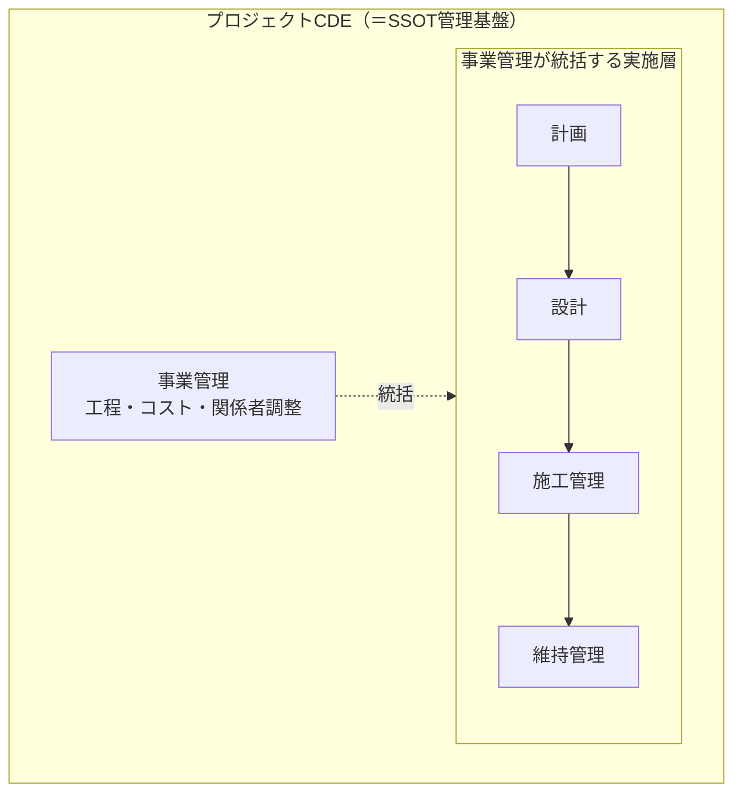
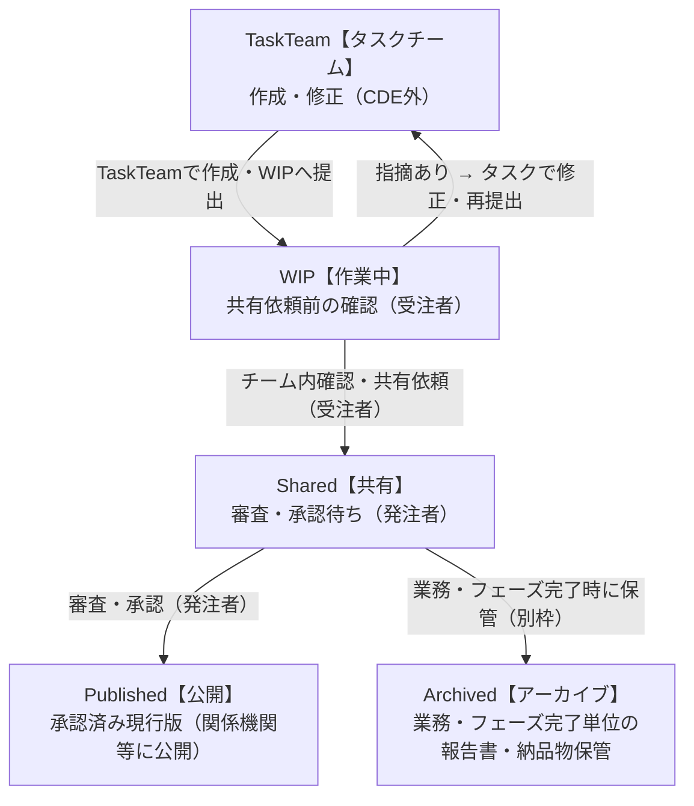

:::message
この記事は [GitHub Pages版](https://yamamoto-ryuzo.github.io/portal/プロジェクトCDE/) と自動同期しています。
:::

<!-- SYNC_SOURCE: プロジェクトCDE/index.md -->

> **注意（下書き）**  
> このページは調査・メモ用の下書きです。記載内容は暫定的であり、正確性は保証されません。重要な用途や公式な判断の前には、一次資料（出典）を必ずご確認ください。  
> ソースの一部はAIによる生成を含みます。誤りや省略が含まれる可能性があります。


> 参考資料：[2025.3.7_プロジェクトCDEを中心としたデータマネジメントの取組案について（国土技術政策総合研究所）](https://www.nilim.go.jp/lab/peg/img/file2256.pdf)

---


## 1. プロジェクトCDEとは

### 概要
- 本資料は「**プロジェクトCDE（事業管理基盤）**」の構想・機能整理を示す。プロジェクトCDEとは、事業の計画・設計・施工・維持管理にわたる**業務そのものをCDE（Common Data Environment）によって管理・統制する仕組み**であり、単なるデータ保管庫ではない。各業務フェーズで生まれるデータをSSOT（唯一の正本）として管理しながら、可視化・共有を通じて事業関係者全体の意思決定を支える。

---

## 2. CDEの根本概念（ISO 19650 / SSOT）
**CDE（ISO 19650準拠）がプロジェクトCDEの根本**である。CDEとは、事業ライフサイクル全体の業務（計画・設計・施工・維持管理・事業管理）を、関係者全員が唯一の正本（SSOT: Single Source of Truth）に基づいて遂行できるよう管理・統制する共通データ環境である。

> 「CDEを使って業務を管理する」のであり、「業務の結果をCDEに格納する」のではない。業務とCDEは不可分一体であることがプロジェクトCDEの根本である。

- **管理対象**: 事業管理・設計業務・施工管理・維持管理の全フェーズにわたる業務活動とその成果データ
- **空間的根幹**: GIS（地理情報システム）がすべてのデータを「位置」という共通軸で統合する
- **データの権威性**: タスクチーム（各専門チームの作業環境・各チーム裁量）から成果物を**CDEに提出**し、WIP【作業中】→ Shared【共有】→ Published【公開】のステータス管理で、業務上の判断・承認をCDE内で完結させる。**現実はタスクチームからすべてが始まる**が、その作業環境（ローカルPC・自社サーバ等）はCDEの外側であり、**WIPへの提出が正式CDE管理の入口**となる

---

## 3. CDEが管理する業務フェーズ

プロジェクトCDEは以下の**管理対象業務**を包括的に管理する。その管理を実現するために①〜④の機能群が必要となる。

### 管理対象業務：事業管理・設計業務（CDEが管理・統制する業務全体）

CDEは以下の各業務フェーズを**CDE内で遂行・承認・記録**する環境として機能する。各フェーズの業務はCDE外では行わず、CDE上で発生・管理されることでSSOTが保証される。



> **プロジェクトCDEとは、実施層（計画・設計・施工管理・維持管理）を事業管理が統括しながら、すべての成果データをSSOTとして管理する基盤そのものである。**

---

## 4. プロジェクトCDEの機能群

プロジェクトCDEの本質は**SSOTによる共有・公開**であり、関係者全員が唯一の正本にアクセスできる環境を提供することが目的である。その目的を実現するために、以下の構造で機能群が成立する。

```
【目的】SSOTによる共有・公開
    ↑ SSOTを活用
【事業監理業務】進捗管理・資料整理・可視化
    ↑ SSOTを構成
【データ基盤】GIS基盤 ＋ 業務データ連携
```

---

### 4.1 共有・公開（目的層）

プロジェクトCDEの存在目的。SSOTとして管理されたデータを、関係者の役割に応じて適切に届ける。

| 機能 | 内容 |
|------|------|
| データ共有基盤 | 事業全体〜工事単位の管理範囲で閲覧URLを発行し、誰でも利用できるブラウザベースの参照環境を提供する |
| アクセス権限管理 | パスワード設定により公開範囲を制御し、住民・施主・施工者など関係者ごとの閲覧制限を実現する |
| SSOT保証 | ISO 19650準拠の **WIP【作業中】→ Shared【共有】→ Published【公開】** のステータス管理により、共有・公開されるデータが常に唯一の正本であることを保証する |

---

### 4.2 事業監理業務（活用層）

| 機能 | 内容 |
|------|------|
| 進捗管理 | 各フェーズの成果データをSSOTから参照し、事業全体の進捗をリアルタイムに把握する |
| 資料整理 | 各フェーズで蓄積された設計書・会議録・住民対応記録等をSSOTから集約・整理する |
| 可視化 | SSOTのデータを地図・3D・グラフ等で表現し、複雑な事業状況を直感的に把握できるようにする |
| 報告書作成支援 | 地図・3Dデータと属性情報を組み合わせ、高品質な報告書を効率的に生成する |
| VR連携 | VRへのデータ出力に対応し、複雑な構造物のイメージ共有や住民説明に活用する |

---

### 4.3 関係機関との情報共有

| 関係機関 | 共有が必要な情報 | タイミング | 共有手段 |
|----------|----------------|-----------|----------|
| 発注者（国・自治体） | 進捗・設計承認・出来形・報告書 | 随時・節目ごと | SSOT参照権限付与 |
| 許認可機関 | 設計図・施工計画・協議資料 | 協議時 | 外部共有URL |
| ライフライン事業者 | 埋設物位置・施工範囲・工程 | 着工前・施工中 | GIS地図共有 |
| 住民・地権者 | 事業概要・工程・影響範囲 | 説明会・随時 | パスワード付き閲覧URL |

---

### 4.4 GIS基盤（空間統合軸）

| 機能 | 内容 |
|------|------|
| 空間・属性管理 | 座標系（EPSGコード）による空間参照を全データに付与し、地物ごとの属性情報を一元管理する |
| 空間データ形式対応 | GEOJSON・Shape・XYZ等のGIS標準形式を入出力し、他システムとの相互運用性を確保する |
| 3DTILES可視化 | 大容量3Dモデルのブラウザ表示に特化し、構造物・地形を立体的に確認できる |

### 4.5 業務データ連携（専門データ取込）

| 分類 | 機能 | 内容 |
|------|------|------|
| BIM/CIM | IFC対応 | IFC形式を含むBIM/CIMデータをGIS空間基盤と統合管理する |
| CAD | CAD連携 | MAP3D・Civil3D（DWG2013出力対応）と連携し、設計図面をDWGインポートで取り込む |
| 点群 | 点群データ対応 | 現地計測・LiDARで取得した点群データをGIS座標系に統合する |

---

## 5. 想定される利用シーン・期待される効果・対応データ形式

### 5.1 想定される利用シーン
- 設計フェーズ：概略〜詳細の状況把握、複雑情報の整理。
- 施工・工程管理：施工計画、積算（数量計算）との連携。
- 管理・報告：位置情報を用いた見える化、報告書作成の効率化。
- 住民共有：成果や進捗を関係者に共有（閲覧権限・パスワード設定可能）。

### 5.2 期待される効果
- 複雑な情報の整理・一元管理
- 位置情報による可視化で理解促進
- 高品質な報告書作成の工数削減
- 多様なデータ変換・出力で他システム連携が容易に

---

## 6. SSOTデータ保存先（ストレージ）の選定

プロジェクトCDEはSSOTによる共有・公開が目的であるが、**まずデータを保存・管理できるストレージが前提条件**となる。

### 6.1 文書・図面系とGIS・BIM系の使い分け

```
【文書・図面系】設計書・報告書・会議録・CAD図面・写真
    → ファイルストレージ（SharePoint / Box / NAS）で管理

【GIS・BIM系】空間データ・IFC・点群・3Dモデル
    → GIS/BIMプラットフォームと連携（別途選定）
```

---

### 6.2 選定要件

**必須条件（KO条件）**

| # | 要件 | 必須とする理由 |
|---|------|------------|
| **KO-A** | **認証付き外部共有** | 許認可機関等との公式な協議・承認には、アカウント認証＋アクセス権限管理＋操作ログを備えた外部共有機能が必要 |
| **KO-B** | **国内データセンター** | 公共事業データの所在国要件・ガバメントクラウド方針への適合 |

**評価要件（重みづけ）**

| # | 要件 | 重み |
|---|------|:----:|
| R1 | 複数人・複数組織からのアクセス | ×2 |
| R2 | フォルダ・ファイル単位のアクセス権限管理 | ×3 |
| R3 | バージョン管理・変更履歴 | ×2 |
| R4 | 大容量ファイル対応 | ×2 |
| R7 | 既存業務ツールとの親和性 | ×1 |
| R8 | 長期運用コスト | ×1 |
| R9 | 外部関係機関の操作ログ・承認証跡 | ×2 |

---

### 6.3 ストレージ候補の比較・総合評価

| ストレージ | KO判定 | **総合点**（/39点） |
|-----------|:------:|:---:|
| **Box** | ✅ 適合 | **37** |
| **SharePoint / OneDrive** | ⚠️ 要確認 | *36（参考）* |
| **Dropbox Business** | ⚠️ 要確認 | *28（参考）* |
| **Google Workspace** | ⚠️ 要確認 | *27（参考）* |
| **NAS（オンプレミス）** | ❌ 不適合 | *21（参考）* |

詳細な評価内訳・注釈は [GitHub Pages版](https://yamamoto-ryuzo.github.io/portal/プロジェクトCDE/) を参照。

---

### 6.4 ISMAP登録状況

| サービス | ISMAP登録番号 |
|---------|:------------:|
| SharePoint / OneDrive (Office 365) | C21-0013-2 |
| Box | C21-0017-2 |
| Google Workspace | C21-0005-2 |
| Dropbox Business | C24-0075-2 |
| NAS（オンプレミス） | — |

---

### 6.5 推奨

| 状況 | 推奨 |
|------|------|
| 国・自治体が発注者（ISMAP準拠必須） | **SharePoint (Microsoft 365)** |
| 建設コンソーシアム・外部共有が多い | **Box** |
| ISMAP要件の確認が取れない・調達が間に合わない | **NAS + VPN（暫定）** |

---

### 6.6 推奨フォルダ構成例（SharePoint / Box 共通）

**ステータス → 業務** の順でフォルダ階層を設計する（ISO 19650準拠）。

| ステータス | 公開対象 | 変更 | 用途 |
|-----------|---------|------|------|
| **Exchange【やり取り】** | 当該チームのみ | 可 | CDE外からのやり取りファイルの一時保管 |
| **TaskTeam【タスクチーム】** | 当該チームのみ（CDE外） | 可 | 草稿・内部調整・WIP提出前の作業 |
| **WIP【作業中】** | 当該タスクチームのみ | 可 | 正式CDE管理の入口・作業・レビュー |
| **Shared【共有】** | プロジェクト関係者全員 | 不可 | 発注者による審査・承認待ち |
| **Published【公開】** | 関係機関・外部関係者 | 不可 | 関係機関等への公開版・現行正本 |
| **Archived【アーカイブ】** | 全関係者 | 不可（確定・固定） | 業務・フェーズ完了単位の報告書・納品物 |

---

### 6.8 CDEの決済フロー（WIP → Shared → Published / Archived）



---

## 7. タスクチーム作業環境のストレージ（別枠検討）

タスクチームの作業環境は**CDEの外側・各チーム裁量**であり、CDE（SSOT）ストレージとは目的・要件が根本的に異なる。

### 7.1 位置づけの整理

```
【タスクチーム作業環境】            【CDE（SSOT）ストレージ】
  各チームの草稿・内部調整             WIP → Shared → Published
  自チーム裁量・組織内利用             発注者管理・全関係者参照
  ISMAP/外部共有 不要                 ISMAP/認証付き外部共有 必須
         ↓ 成果物をWIPへ提出
         ここが境界線
```

### 7.4 候補・総合評価（〔B〕NAS＋CDE同期型：大多数）

| 環境 | **総合点**（/39点） |
|------|:---:|
| NAS ＋ SharePoint同期（M365） | **37** |
| NAS ＋ Box同期 | **37** |
| NAS ＋ 手動アップロード | **35** |
| ACC（クラウド共同編集）〔A-BIM〕 | **31** |
| 自社サーバ・VPN〔C〕 | **24** |

詳細な評価基準・フローチャートは [GitHub Pages版](https://yamamoto-ryuzo.github.io/portal/プロジェクトCDE/) を参照。

### 7.5 CDEとの接続ルール（重要）

```
提出ルール（例）
① 成果物がチーム内でレビュー・合意済みであること
② ファイル命名規則に従っていること（[事業コード]_[図面番号]_[版数]_[日付]）
③ CDEのWIPフォルダの所定の場所にアップロード
④ 提出連絡（チャット・メール等）で発注者担当に通知
→ 以降はCDE管理（Shared→Published）へ移行
```
