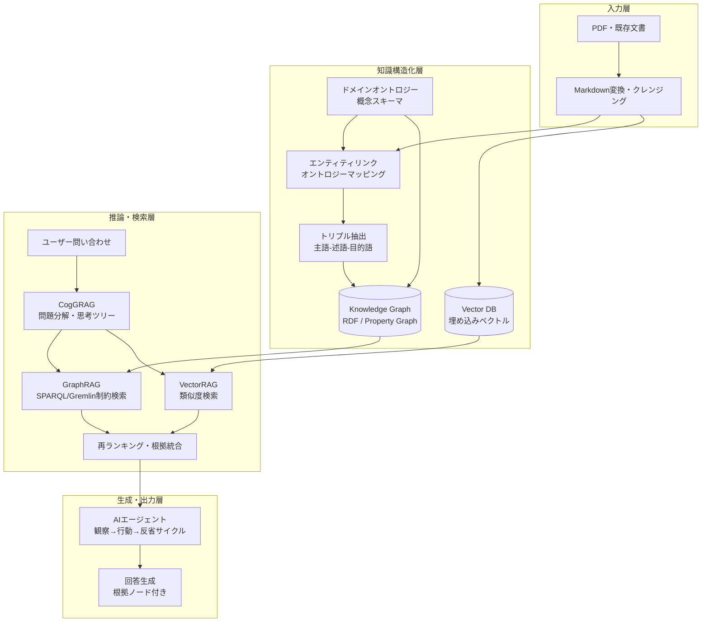

# 2. 全体アーキテクチャ

---

## 2.1 各層の役割

| 層 | 主な処理 | 使用技術 |
|---|---|---|
| **入力層** | PDF・既存文書をMarkdownに変換し、クレンジング | OCR、Pandoc等 |
| **知識構造化層** | エンティティ抽出・オントロジーマッピングを経てKnowledge GraphとVector DBの両方に格納 | RDF/Property Graph、Embedding |
| **推論・検索層** | ユーザーの問いをCogGRAGで分解し、GraphRAG（構造検索）とVectorRAG（類似検索）を並行実行して結果を統合 | SPARQL/Gremlin、cosine similarity |
| **生成・出力層** | AIエージェントが検索結果を観察・推論・反省サイクルで精緻化し、根拠ノード付き回答を生成 | LLM、ReAct/CoT |

---

## 2.2 RAG vs. エージェント：役割分担の整理

本システムは「RAG（知識検索パイプライン）」と「エージェント（自律推論エンジン）」を**補完関係**として組み合わせている。両者を混同しないよう、以下に整理する。

| 観点 | RAG | エージェント |
|---|---|---|
| **主な役割** | 外部知識を検索・取得して回答精度を高める | 目標に向けて自律的に計画・行動・反省する |
| **動作モデル** | 問い → 検索 → 生成（一方向パイプライン） | 観察 → 思考 → 行動 → 反省（ループ） |
| **知識の扱い** | KG・Vector DBから根拠を取得 | RAGを「ツール」として必要に応じて呼び出す |
| **土木業務での担当** | 法令・基準・事例の正確な参照 | 複数文書にまたがる多段推論・矛盾検証・差し戻し |
| **ハルシネーションリスク** | 根拠を提示するため低い | 推論ステップが増えるほど要注意 → 監理エージェントで制御 |

> **まとめ**: RAGは「正確な知識を届ける仕組み」、エージェントは「その知識を使って考える仕組み」。本システムでは **RAGが根拠を保証し、エージェントが推論を担う**という役割分担により、単独では達成できない回答品質を実現する。

### 実装トラックとの対応

本システムは規模・予算・期間に応じて3つの実装トラックを用意している。

- **Track A**：**ノーコード〜ローコード**。M365 Copilot Agent Builder・Dify・ChatGPT等のAIプラットフォームにMDファイル＋システムプロンプトを設定するだけ。プログラミング不要で数日以内に動作確認できる出発点。
- **Track B**：**フルコード（プロコード）**。GraphRAG・VectorRAG・知識グラフの設計〜実装を伴うエンジニアリングプロジェクト。大量データ・法的監査証跡・複数組織スキーマ共有が必要な本番環境向け。
- **Track C**：**ローコード**。M365 Copilot Studio・Dify等のマルチエージェント機能を活用し、Track Aで作成したMD資産を再利用しながらオーケストレーターを追加。1〜2週間で高機能化できる中間選択肢。

| トラック | RAG | エージェント | 詳細 |
|---|---|---|---|
| **Track A（簡易）** | MD＋システムプロンプトで近似 | LLM単体（暗黙的） | §6参照 |
| **Track A+C（★推奨）** | MD＋システムプロンプト | 7エージェント＋オーケストレーター | §7参照 |
| **Track B（本格）** | GraphRAG＋VectorRAG＋KG | フルエージェントパイプライン | §4〜5参照 |

---
