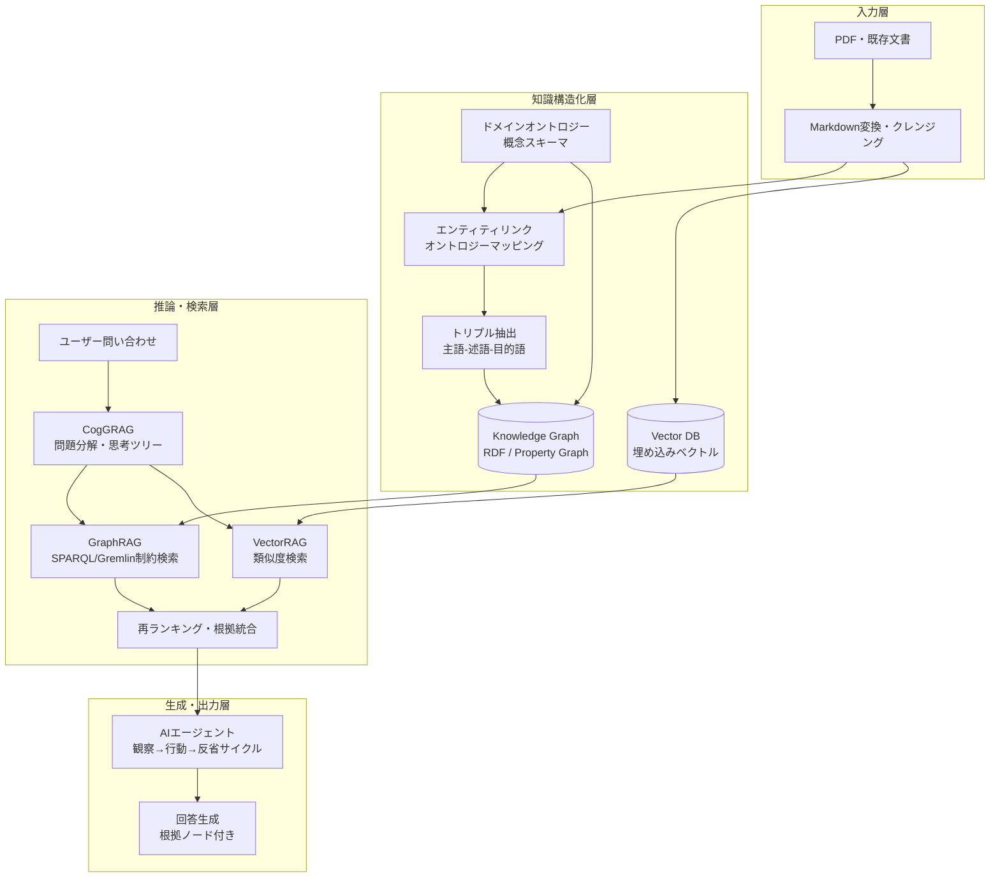

# 2. 全体アーキテクチャ

```mermaid
flowchart TD
    subgraph IN["入力層"]
        A["PDF・既存文書"] --> B["Markdown変換・クレンジング"]
    end

    subgraph KS["知識構造化層"]
        B --> C["エンティティリンク\nオントロジーマッピング"]
        C --> D["トリプル抽出\n主語-述語-目的語"]
        D --> E[("Knowledge Graph\nRDF / Property Graph")]
        B --> F[("Vector DB\n埋め込みベクトル")]
        G["ドメインオントロジー\n概念スキーマ"] --> C
        G --> E
    end

    subgraph RS["推論・検索層"]
        H["ユーザー問い合わせ"] --> I["CogGRAG\n問題分解・思考ツリー"]
        I --> J["GraphRAG\nSPARQL/Gremlin制約検索"]
        I --> K["VectorRAG\n類似度検索"]
        J --> L["再ランキング・根拠統合"]
        K --> L
    end

    subgraph OUT["生成・出力層"]
        L --> M["AIエージェント\n観察→行動→反省サイクル"]
        M --> N["回答生成\n根拠ノード付き"]
    end

    E --> J
    F --> K
```

---
