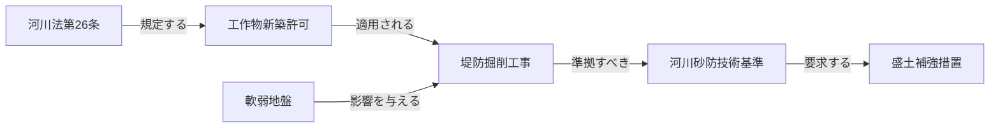

# 5. 採用技術の詳細（簡易実装）

§3 で定義した4技術を、**MDファイル＋システムプロンプト**で近似する場合、各技術はどのファイルに対応し、何ができて何ができないか。§3 と同じ構成でフル実装との対比を示す。

---

### 5.1 GraphRAG の代替：`knowledge_map.md` ＋ `entity_dictionary.md`

GraphRAGが保持する「ノード・エッジの知識グラフ」を、MarkdownのテーブルとMermaid図で**静的に**代替する。LLMがMermaid図を読んで関係を辿ることで、GraphRAGの役割を近似する。

#### 果たす役割（簡易実装版）

- **構造的関係の保持**: `knowledge_map.md` のMermaid図に法令・工法・基準のノードとエッジを記述し、LLMに参照させる。
- **明示的事実の取得**: `entity_dictionary.md` の各行に条文番号・適用条件・参照先を記載する。
- **根拠の可視化**: Mermaid図のエッジラベルが関係の根拠として機能する。

#### 適した問い

「〇〇工法の適用を制限する河川法の条文はどれか」など**抽出的な問い**。ただし3ホップ程度の関係追跡が実用限界。

#### 知識グラフの代替構造（`knowledge_map.md` の記述形式）

| フル実装（GraphRAG） | 簡易実装での記述方法 |
|---|---|
| ノード（法令） | Mermaid図のノード `["河川法第26条"]` |
| ノード（工法） | Mermaid図のノード `["堤防掘削工事"]` |
| エッジ（適用する） | Mermaid図の矢印 `-- "規定する" -->` |
| エンティティ定義 | `entity_dictionary.md` の各行 |
| 同義語統合 | `entity_dictionary.md` の同義語欄 |

#### MDサンプル（`knowledge_map.md` 記述例）

```markdown
---
doc_id: "knowledge_map"
doc_type: "ナレッジ図"
---

```

#### フル実装との差異

| 観点 | フル実装（GraphRAG） | 簡易実装（MD代替） |
|---|---|---|
| 探索方法 | SPARQL/Gremlinによる自動グラフ走査 | LLMがMermaid図を読んで辿る |
| ホップ数の上限 | 原理的に無制限 | コンテキスト長・LLM精度に依存（3ホップ程度） |
| 更新方法 | DB再構築が必要 | MDファイルを直接編集（即日反映） |
| ノード数の上限 | 数百万件以上 | 数百件程度（Mermaid図の可読性限界） |

---

### 5.2 VectorRAG の代替：`source_docs/` の直接参照

VectorRAGが行う「埋め込みベクトルによる意味的類似検索」を、Dify等のRAGが `source_docs/` フォルダのMDをチャンク分割してインデックス化することで代替する。構造的には最もフル実装に近い。

#### 果たす役割（簡易実装版）

- **非構造化テキストの検索**: `source_docs/` 内の施工報告書・現場記録MDをRAGが自動的にチャンク化・検索する。
- **意味的類似検索**: Dify等の内蔵ベクトルエンジンが類似チャンクを取得する（フル実装と構造的に同等）。
- **メタデータによるフィルタ**: MDのFrontMatter（YAMLヘッダー）に工事番号・日付を記載しフィルタを可能にする。

#### 適した問い

「過去の軟弱地盤対策におけるトラブルの共通傾向は何か」など**要約的な問い**。類似事例参照によるリスク予測にも有効。

#### `source_docs/` のファイル構造（MDフォーマット）

| 項目 | フル実装（VectorRAG） | 簡易実装（MD代替） |
|---|---|---|
| ベクトルインデックス | 専用Vector DB（FAISS/pgvector） | Dify等の内蔵ベクトルエンジン |
| 再ランキング | Cross-Encoderによる高精度スコアリング | RAGプラットフォームの標準機能 |
| ハイブリッド検索 | BM25 + ベクトルのRRF統合 | プラットフォーム依存 |
| 文書件数の上限 | 数十万件 | 数千件程度 |

#### MDサンプル（`source_docs/` のFrontMatter記述例）

```markdown
---
doc_id: "report_2022_X"
工事番号: "2022-X"
工事区分: "河川工事"
発注者: "国土交通省〇〇河川事務所"
日付: "2022-09-15"
キーワード: ["軟弱地盤", "盛土", "沈下"]
---
## 施工概要
〇〇地区堤防補強工事において、盛土完了後に地盤沈下が発生した。
原因は軟弱層の範囲が設計より広く…
```

#### フル実装との差異

| 観点 | フル実装（VectorRAG） | 簡易実装（MD代替） |
|---|---|---|
| インデックス構築 | 専用DB・定期バッチ処理 | RAGへのファイル登録のみ |
| メタデータ管理 | スキーマ定義・型チェックあり | FrontMatterの記述次第（自由形式） |
| 再ランキング | Cross-Encoder | プラットフォーム依存 |
| 文書規模 | 数十万件 | 数千件程度が実用限界 |

---

### 5.3 CogGRAG の代替：`system_prompt.md` の回答手順

CogGRAGが行う「問いの木構造分解 → 各サブ問いへの検索割り当て → ボトムアップ統合」を、`system_prompt.md` の回答手順としてLLMに指示することで代替する。

#### 果たす役割（簡易実装版）

- **思考の分解指示**: 回答手順の①〜④がCogGRAGの木構造分解に相当する。
- **検索割り当て**: 「まず法令を確認し、次に技術基準を確認する」という順序をプロンプトで明示する。
- **統合と整合確認**: 回答フォーマットで「根拠: [文書名, セクション]」の明示を義務付ける。

#### 適した問い

「設計変更は河川法・環境影響評価法のどの手続きに影響するか」など**複合的・多段的な問い**。ただし固定化された手順の範囲内のみ対応可能。

#### 思考分解の代替手順（`system_prompt.md` の記述形式）

| CogGRAGのステップ | `system_prompt.md` での代替記述 |
|---|---|
| ① 問いの解析 | 「問いを①法令・②行政手続・③基準・④事例・⑤リスクに分解する」と指示 |
| ② 木構造生成 | 固定の5観点テンプレートで代替 |
| ③ リーフ検索 | 「各観点について `source_docs/` を参照する」と指示 |
| ④ ボトムアップ統合 | 「5観点の結果を統合し矛盾を確認する」と指示 |
| ⑤ 最終回答生成 | 回答フォーマットで根拠明示を義務付け |

#### MDサンプル（`system_prompt.md` の回答手順記述例）

```markdown
## 回答手順
1. **問いの分解**: 問いを以下の観点に分解する
   - ① 関連する法令・条文は何か              → source_docs/ の法令MDを参照
   - ② 許認可・届出等の行政手続に漏れはないか  → source_docs/ の法令MDを参照
   - ③ 準拠すべき技術基準は何か              → source_docs/ の基準MDを参照
   - ④ 類似の過去事例はあるか              → source_docs/ の報告書MDを参照
   - ⑤ リスク要因に影響はあるか              → entity_dictionary.md のリスク欄を参照
2. **用語の正規化**: entity_dictionary.md を参照し略語・別称を正規名に統一する
3. **関係の確認**: knowledge_map.md の関係図を参照し関連ノードを辿る
4. **整合確認**: 制約ルールに違反しないか確認してから回答する
```

#### フル実装との差異

| 観点 | フル実装（CogGRAG） | 簡易実装（MD代替） |
|---|---|---|
| 分解の自動化 | LLMが動的に木を生成・実行 | プロンプトの固定手順に従う |
| 検索の並列化 | エージェントが並列に各サブ問いを検索 | LLMが逐次的に手順を実行 |
| 矛盾検出 | 監理エージェントが自動検証 | LLMの判断に依存 |
| 未定義パターン | 動的に分解戦略を変更 | プロンプト記載の手順の範囲のみ対応 |

---

### 5.4 ドメインオントロジーの代替：`entity_dictionary.md` ＋ 制約ルール

ドメインオントロジー（OWL/SHACL）が提供する「用語の一意定義」「関係タイプの定義」「推論ルール」を、2つのMDファイルで静的に代替する。

#### 果たす役割（簡易実装版）

- **用語の一意定義**: `entity_dictionary.md` の同義語欄で略語・別称を正規名に対応付ける。
- **概念間関係の明示**: `entity_dictionary.md` の関係定義テーブルで関係タイプを列挙する。
- **推論ルールの基盤**: `system_prompt.md` の制約ルール欄でSHACL相当の業務ルールをLLMへ指示する。

#### 適した問い

「HWL」「H.W.L」「計画高水位」を同一概念として扱いながら回答するなど、**用語正規化が必要な問い**や制約違反チェックが必要な問い。

#### オントロジーの代替構造

| オントロジーの要素 | 簡易実装での代替ファイル・記述 |
|---|---|
| クラス定義（法令・工法等） | `entity_dictionary.md` のタイプ欄 |
| 同義語統合（owl:sameAs） | `entity_dictionary.md` の同義語・略語欄 |
| 関係タイプ（適用する等） | `entity_dictionary.md` の関係定義テーブル |
| SHACL制約ルール | `system_prompt.md` の制約ルール欄 |
| OWL推論 | LLMがプロンプト指示に従い判断（不安定） |

#### MDサンプル（`entity_dictionary.md` 記述例）

```markdown
---
doc_id: "entity_dictionary"
doc_type: "辞書"
---
| ノードID   | 正規名      | タイプ      | 定義（1行）                     | 同義語・略語                              |
|-----------|------------|------------|--------------------------------|------------------------------------------|
| 設計洪水位 | 設計洪水位  | 技術基準値  | 設計に用いる洪水時の水位          | HWL, H.W.L, 計画高水位, 設計最高水位    |
| 河川法_26  | 河川法第26条 | 法令       | 河川区域内工作物の新築等の許可義務 | 河川法26条, 第26条（河川）               |

## 関係定義
| 関係タイプ  | 意味                   | 例 |
|-----------|----------------------|----|
| 規定する   | 法令が手続きを定める   | 河川法第26条 → 工作物新築許可 |
| 準拠すべき | 工法が技術基準に従う必要 | 盛土補強工法 → 河川砂防技術基準 |
```

#### フル実装との差異

| 観点 | フル実装（ドメインオントロジー） | 簡易実装（MD代替） |
|---|---|---|
| 用語の正規化 | OWL `owl:sameAs` で全略語を自動統合 | LLMがentity_dictionary.mdを参照して正規化（見落とし有り） |
| 制約の検証 | SHACLが全制約を自動・網羅的に検証 | system_prompt.mdに記載した項目のみLLMが確認 |
| 推論ルール | OWL公理・Droolsルールエンジンで自動推論 | LLMの指示ベース（不安定） |
| カバレッジ管理 | スキーマで未定義概念を明示的に管理 | entity_dictionary.mdに未記載の概念は無処理 |

---

### 5.5 簡易実装の全体像まとめ

§3 の4技術と §5 の簡易実装対応表：

| §3 の技術 | 役割 | 簡易実装での代替ファイル | できること | できないこと |
|---|---|---|---|---|
| **3.1 GraphRAG** | 構造的関係の保持・事実抽出 | `knowledge_map.md`（Mermaid図） | 明示した関係の参照・3ホップ程度の追跡 | 動的グラフ走査・大規模ノード管理 |
| **3.2 VectorRAG** | 意味的類似検索・事例横断 | `source_docs/`（MD群） | 意味的類似検索・メタデータフィルタ | Cross-Encoder再ランキング・数万件超 |
| **3.3 CogGRAG** | 思考分解・多段推論の制御 | `system_prompt.md`（回答手順） | 固定パターンの多段推論・手順の強制 | 動的分解・並列検索・自動矛盾検出 |
| **3.4 ドメインオントロジー** | 用語統一・制約検証・推論基盤 | `entity_dictionary.md` ＋ 制約ルール | 用語正規化・明示した制約の遵守 | 網羅的SHACL検証・OWL自動推論 |

> **簡易実装の本質**: フル実装が「AIが自律的に知識を探索する」のに対し、簡易実装は「人間が知識を整理してAIに渡す」アプローチである。LLMの推論能力向上により実用水準は年々上昇し、現時点でもPoC・小規模運用には十分な精度を発揮する。

