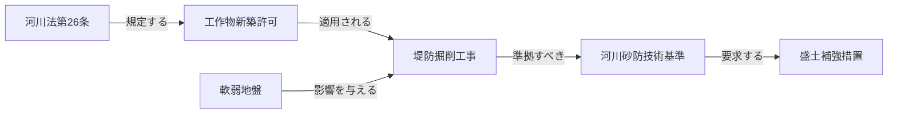
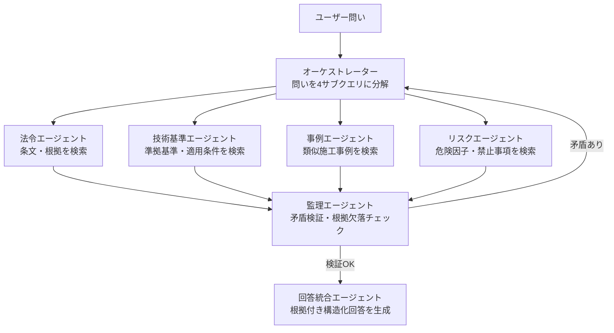
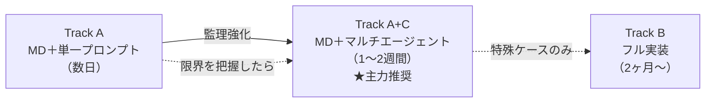
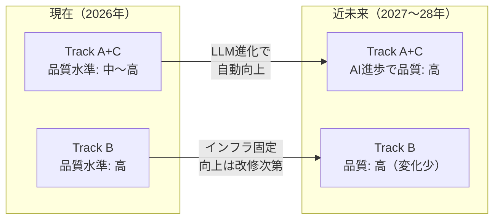
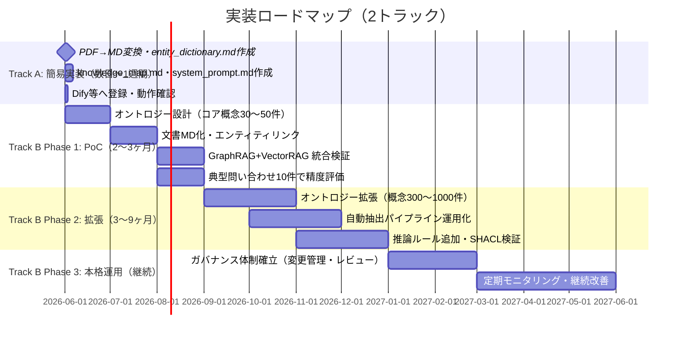

# 5. 採用技術の詳細（簡易実装）

§3 で定義した4技術を、**MDファイル＋システムプロンプト**で近似する場合、各技術はどのファイルに対応し、何ができて何ができないか。§3 と同じ構成でフル実装との対比を示す。

---

### 5.1 GraphRAG の代替：`knowledge_map.md` ＋ `entity_dictionary.md`

GraphRAGが保持する「ノード・エッジの知識グラフ」を、MarkdownのテーブルとMermaid図で**静的に**代替する。LLMがMermaid図を読んで関係を辿ることで、GraphRAGの役割を近似する。

#### 果たす役割（簡易実装版）

- **構造的関係の保持**: `knowledge_map.md` のMermaid図に法令・工法・基準のノードとエッジを記述し、LLMに参照させる。
- **明示的事実の取得**: `entity_dictionary.md` の各行に条文番号・適用条件・参照先を記載する。
- **根拠の可視化**: Mermaid図のエッジラベルが関係の根拠として機能する。

#### 適した問い

「〇〇工法の適用を制限する河川法の条文はどれか」など**抽出的な問い**。ただし3ホップ程度の関係追跡が実用限界。

#### 知識グラフの代替構造（`knowledge_map.md` の記述形式）

| フル実装（GraphRAG） | 簡易実装での記述方法 |
|---|---|
| ノード（法令） | Mermaid図のノード `["河川法第26条"]` |
| ノード（工法） | Mermaid図のノード `["堤防掘削工事"]` |
| エッジ（適用する） | Mermaid図の矢印 `-- "規定する" -->` |
| エンティティ定義 | `entity_dictionary.md` の各行 |
| 同義語統合 | `entity_dictionary.md` の同義語欄 |

#### MDサンプル（`knowledge_map.md` 記述例）

```markdown
---
doc_id: "knowledge_map"
doc_type: "ナレッジ図"
---

```

#### フル実装との差異

| 観点 | フル実装（GraphRAG） | 簡易実装（MD代替） |
|---|---|---|
| 探索方法 | SPARQL/Gremlinによる自動グラフ走査 | LLMがMermaid図を読んで辿る |
| ホップ数の上限 | 原理的に無制限 | コンテキスト長・LLM精度に依存（3ホップ程度） |
| 更新方法 | DB再構築が必要 | MDファイルを直接編集（即日反映） |
| ノード数の上限 | 数百万件以上 | 数百件程度（Mermaid図の可読性限界） |

---

### 5.2 VectorRAG の代替：`source_docs/` の直接参照

VectorRAGが行う「埋め込みベクトルによる意味的類似検索」を、Dify等のRAGが `source_docs/` フォルダのMDをチャンク分割してインデックス化することで代替する。構造的には最もフル実装に近い。

#### 果たす役割（簡易実装版）

- **非構造化テキストの検索**: `source_docs/` 内の施工報告書・現場記録MDをRAGが自動的にチャンク化・検索する。
- **意味的類似検索**: Dify等の内蔵ベクトルエンジンが類似チャンクを取得する（フル実装と構造的に同等）。
- **メタデータによるフィルタ**: MDのFrontMatter（YAMLヘッダー）に工事番号・日付を記載しフィルタを可能にする。

#### 適した問い

「過去の軟弱地盤対策におけるトラブルの共通傾向は何か」など**要約的な問い**。類似事例参照によるリスク予測にも有効。

#### `source_docs/` のファイル構造（MDフォーマット）

| 項目 | フル実装（VectorRAG） | 簡易実装（MD代替） |
|---|---|---|
| ベクトルインデックス | 専用Vector DB（FAISS/pgvector） | Dify等の内蔵ベクトルエンジン |
| 再ランキング | Cross-Encoderによる高精度スコアリング | RAGプラットフォームの標準機能 |
| ハイブリッド検索 | BM25 + ベクトルのRRF統合 | プラットフォーム依存 |
| 文書件数の上限 | 数十万件 | 数千件程度 |

#### MDサンプル（`source_docs/` のFrontMatter記述例）

```markdown
---
doc_id: "report_2022_X"
工事番号: "2022-X"
工事区分: "河川工事"
発注者: "国土交通省〇〇河川事務所"
日付: "2022-09-15"
キーワード: ["軟弱地盤", "盛土", "沈下"]
---
## 施工概要
〇〇地区堤防補強工事において、盛土完了後に地盤沈下が発生した。
原因は軟弱層の範囲が設計より広く…
```

#### フル実装との差異

| 観点 | フル実装（VectorRAG） | 簡易実装（MD代替） |
|---|---|---|
| インデックス構築 | 専用DB・定期バッチ処理 | RAGへのファイル登録のみ |
| メタデータ管理 | スキーマ定義・型チェックあり | FrontMatterの記述次第（自由形式） |
| 再ランキング | Cross-Encoder | プラットフォーム依存 |
| 文書規模 | 数十万件 | 数千件程度が実用限界 |

---

### 5.3 CogGRAG の代替：`system_prompt.md` の回答手順

CogGRAGが行う「問いの木構造分解 → 各サブ問いへの検索割り当て → ボトムアップ統合」を、`system_prompt.md` の回答手順としてLLMに指示することで代替する。

#### 果たす役割（簡易実装版）

- **思考の分解指示**: 回答手順の①〜④がCogGRAGの木構造分解に相当する。
- **検索割り当て**: 「まず法令を確認し、次に技術基準を確認する」という順序をプロンプトで明示する。
- **統合と整合確認**: 回答フォーマットで「根拠: [文書名, セクション]」の明示を義務付ける。

#### 適した問い

「設計変更は河川法・環境影響評価法のどの手続きに影響するか」など**複合的・多段的な問い**。ただし固定化された手順の範囲内のみ対応可能。

#### 思考分解の代替手順（`system_prompt.md` の記述形式）

| CogGRAGのステップ | `system_prompt.md` での代替記述 |
|---|---|
| ① 問いの解析 | 「問いを①法令・②基準・③事例・④リスクに分解する」と指示 |
| ② 木構造生成 | 固定の4観点テンプレートで代替 |
| ③ リーフ検索 | 「各観点について `source_docs/` を参照する」と指示 |
| ④ ボトムアップ統合 | 「4観点の結果を統合し矛盾を確認する」と指示 |
| ⑤ 最終回答生成 | 回答フォーマットで根拠明示を義務付け |

#### MDサンプル（`system_prompt.md` の回答手順記述例）

```markdown
## 回答手順
1. **問いの分解**: 問いを以下の観点に分解する
   - ① 関連する法令・条文は何か        → source_docs/ の法令MDを参照
   - ② 準拠すべき技術基準は何か        → source_docs/ の基準MDを参照
   - ③ 類似の過去事例はあるか          → source_docs/ の報告書MDを参照
   - ④ リスク要因に影響はあるか        → entity_dictionary.md のリスク欄を参照
2. **用語の正規化**: entity_dictionary.md を参照し略語・別称を正規名に統一する
3. **関係の確認**: knowledge_map.md の関係図を参照し関連ノードを辿る
4. **整合確認**: 制約ルールに違反しないか確認してから回答する
```

#### フル実装との差異

| 観点 | フル実装（CogGRAG） | 簡易実装（MD代替） |
|---|---|---|
| 分解の自動化 | LLMが動的に木を生成・実行 | プロンプトの固定手順に従う |
| 検索の並列化 | エージェントが並列に各サブ問いを検索 | LLMが逐次的に手順を実行 |
| 矛盾検出 | 監理エージェントが自動検証 | LLMの判断に依存 |
| 未定義パターン | 動的に分解戦略を変更 | プロンプト記載の手順の範囲のみ対応 |

---

### 5.4 ドメインオントロジーの代替：`entity_dictionary.md` ＋ 制約ルール

ドメインオントロジー（OWL/SHACL）が提供する「用語の一意定義」「関係タイプの定義」「推論ルール」を、2つのMDファイルで静的に代替する。

#### 果たす役割（簡易実装版）

- **用語の一意定義**: `entity_dictionary.md` の同義語欄で略語・別称を正規名に対応付ける。
- **概念間関係の明示**: `entity_dictionary.md` の関係定義テーブルで関係タイプを列挙する。
- **推論ルールの基盤**: `system_prompt.md` の制約ルール欄でSHACL相当の業務ルールをLLMへ指示する。

#### 適した問い

「HWL」「H.W.L」「計画高水位」を同一概念として扱いながら回答するなど、**用語正規化が必要な問い**や制約違反チェックが必要な問い。

#### オントロジーの代替構造

| オントロジーの要素 | 簡易実装での代替ファイル・記述 |
|---|---|
| クラス定義（法令・工法等） | `entity_dictionary.md` のタイプ欄 |
| 同義語統合（owl:sameAs） | `entity_dictionary.md` の同義語・略語欄 |
| 関係タイプ（適用する等） | `entity_dictionary.md` の関係定義テーブル |
| SHACL制約ルール | `system_prompt.md` の制約ルール欄 |
| OWL推論 | LLMがプロンプト指示に従い判断（不安定） |

#### MDサンプル（`entity_dictionary.md` 記述例）

```markdown
---
doc_id: "entity_dictionary"
doc_type: "辞書"
---
| ノードID   | 正規名      | タイプ      | 定義（1行）                     | 同義語・略語                              |
|-----------|------------|------------|--------------------------------|------------------------------------------|
| 設計洪水位 | 設計洪水位  | 技術基準値  | 設計に用いる洪水時の水位          | HWL, H.W.L, 計画高水位, 設計最高水位    |
| 河川法_26  | 河川法第26条 | 法令       | 河川区域内工作物の新築等の許可義務 | 河川法26条, 第26条（河川）               |

## 関係定義
| 関係タイプ  | 意味                   | 例 |
|-----------|----------------------|----|
| 規定する   | 法令が手続きを定める   | 河川法第26条 → 工作物新築許可 |
| 準拠すべき | 工法が技術基準に従う必要 | 盛土補強工法 → 河川砂防技術基準 |
```

#### フル実装との差異

| 観点 | フル実装（ドメインオントロジー） | 簡易実装（MD代替） |
|---|---|---|
| 用語の正規化 | OWL `owl:sameAs` で全略語を自動統合 | LLMがentity_dictionary.mdを参照して正規化（見落とし有り） |
| 制約の検証 | SHACLが全制約を自動・網羅的に検証 | system_prompt.mdに記載した項目のみLLMが確認 |
| 推論ルール | OWL公理・Droolsルールエンジンで自動推論 | LLMの指示ベース（不安定） |
| カバレッジ管理 | スキーマで未定義概念を明示的に管理 | entity_dictionary.mdに未記載の概念は無処理 |

---

### 5.5 簡易実装の全体像まとめ

§3 の4技術と §5 の簡易実装対応表：

| §3 の技術 | 役割 | 簡易実装での代替ファイル | できること | できないこと |
|---|---|---|---|---|
| **3.1 GraphRAG** | 構造的関係の保持・事実抽出 | `knowledge_map.md`（Mermaid図） | 明示した関係の参照・3ホップ程度の追跡 | 動的グラフ走査・大規模ノード管理 |
| **3.2 VectorRAG** | 意味的類似検索・事例横断 | `source_docs/`（MD群） | 意味的類似検索・メタデータフィルタ | Cross-Encoder再ランキング・数万件超 |
| **3.3 CogGRAG** | 思考分解・多段推論の制御 | `system_prompt.md`（回答手順） | 固定パターンの多段推論・手順の強制 | 動的分解・並列検索・自動矛盾検出 |
| **3.4 ドメインオントロジー** | 用語統一・制約検証・推論基盤 | `entity_dictionary.md` ＋ 制約ルール | 用語正規化・明示した制約の遵守 | 網羅的SHACL検証・OWL自動推論 |

> **簡易実装の本質**: フル実装が「AIが自律的に知識を探索する」のに対し、簡易実装は「人間が知識を整理してAIに渡す」アプローチである。LLMの推論能力向上により実用水準は年々上昇し、現時点でもPoC・小規模運用には十分な精度を発揮する。

---

## 5-B. 簡易実装アプローチ：MD＋AI指示による近似実現

§4（7ステップ）はフル実装版である。PoC・小規模運用では、**4種のMDファイル＋システムプロンプト**で同等の効果を近似できる。インフラ不要・構築期間は数日単位。

### 5-B.1 フル実装 vs 簡易実装の対応関係

| フル実装（7ステップ） | 採用技術 | 簡易実装での代替手段 |
|---|---|---|
| Step 1: PDF→MD変換 | VectorRAG | **同じ**（変換ツールは共通） |
| Step 2: エンティティ抽出 | GraphRAG / オントロジー | `entity_dictionary.md` の手動作成 |
| Step 3: ノード単語辞書 | GraphRAG / オントロジー | `entity_dictionary.md` の定義欄 |
| Step 4: 類似単語辞書 | VectorRAG / オントロジー | `entity_dictionary.md` の同義語欄 |
| Step 5: Mermaidナレッジ図 | GraphRAG | `knowledge_map.md`（Mermaid図のみ） |
| Step 6: OWL/SHACL オントロジー | ドメインオントロジー | `system_prompt.md` の制約ルール欄 |
| Step 7: CogGRAGテンプレート | CogGRAG | `system_prompt.md` の回答手順欄 |

### 5-B.2 簡易実装のファイル構成

```
knowledge/
├── source_docs/             # Step 1と同じ: PDF→MD変換済み文書
│   ├── 河川法抜粋.md
│   └── 河川砂防技術基準.md
├── entity_dictionary.md     # Steps 2-4の代替
├── knowledge_map.md         # Step 5と同じ（Mermaid図）
└── system_prompt.md         # Steps 6-7の代替（AIへの指示）
```

### 5-B.3 entity_dictionary.md（Steps 2-4 代替）

エンティティ定義・タイプ・同義語をMarkdownテーブルで管理する。LLMはこのファイルをRAGで参照して用語を正規化する。

```markdown
---
doc_id: "entity_dictionary"
doc_type: "辞書"
---
```

### 5-B.4 エンティティ辞書
| ノードID | 正規名 | タイプ | 定義（1行） | 同義語・略語 |
|---|---|---|---|---|
| 設計洪水位 | 設計洪水位 | 技術基準値 | 設計に用いる洪水時の水位 | HWL, H.W.L, 計画高水位, 設計最高水位 |
| 河川法_26 | 河川法第26条 | 法令 | 河川区域内工作物の新築等の許可義務 | 河川法26条, 第26条（河川） |
| 盛土補強工法 | 盛土補強工法 | 工法 | 軟弱地盤での盛土安定のための補強工法 | 盛土補強, 補強盛土 |
| 軟弱地盤 | 軟弱地盤 | リスク要因 | 沈下・液状化リスクのある地盤 | 軟弱地 |

### 5-B.5 関係定義

| 関係タイプ | 意味 | 例 |
|---|---|---|
| 規定する | 法令が手続きを定める | 河川法第26条 → 工作物新築許可 |
| 準拠すべき | 工法が技術基準に従う必要 | 盛土補強工法 → 河川砂防技術基準 |
| 影響を与える | リスク要因が工法選定に影響 | 軟弱地盤 → 盛土補強工法 |

### 5-B.6 knowledge_map.md（Step 5 代替）

Mermaid図で概念間の関係を可視化する。RAGのコンテキストに含めることで、LLMが関係を辿って回答できる。

```markdown
---
doc_id: "knowledge_map"
doc_type: "ナレッジ図"
---
```

### 5-B.7 土木事業管理ナレッジマップ


### 5-B.8 system_prompt.md（Steps 6-7 代替）

このファイルをDify・n8n等のRAGシステムの**システムプロンプト**として設定する。オントロジーの制約ルールとCogGRAGの分解手順をAIへの指示として記述する。

### 5-B.9 役割
あなたは土木事業管理専門のAIアシスタントです。
参照可能なファイルは `source_docs/`（法令・基準書）、
`entity_dictionary.md`（用語定義）、`knowledge_map.md`（概念関係図）です。

### 5-B.10 回答手順（CogGRAGの代替）
1. **問いの分解**: 問いを以下の観点に分解する
   - ① 関連する法令・条文は何か
   - ② 準拠すべき技術基準は何か
   - ③ 類似の過去事例はあるか
   - ④ リスク要因に影響はあるか
2. **用語の正規化**: `entity_dictionary.md` を参照し、略語・別称を正規名に統一する
3. **関係の確認**: `knowledge_map.md` の関係図を参照し、関連ノードを辿る
4. **回答の整合確認**: 以下の制約ルールに違反しないか確認してから回答する

### 5-B.11 制約ルール（オントロジー・SHACLの代替）
- **工法を提案する場合**: 必ず準拠すべき技術基準を明示すること
- **法令を引用する場合**: 条文番号（例: 第26条）まで特定すること
- **根拠の明示**: 回答の最後に「根拠: [文書名, セクション]」の形式で出典を記載すること
- **不明な場合**: 推測で回答せず「該当する規定が確認できませんでした」と明示すること

### 5-B.12 回答フォーマット
**回答**: [結論を1〜2文で]

**根拠**:
- 法令: [条文名・番号]
- 技術基準: [基準名・セクション]
- 事例: [関連文書名]（あれば）

---

### 5-B.13 3トラック比較

| 観点 | Track A<br>MD＋単一プロンプト | Track A+C<br>MD＋マルチエージェント | Track B<br>フル実装（7ステップ） |
|---|---|---|---|
| 構築期間 | 数日 | 1〜2週間 | 数ヶ月 |
| インフラ | 不要 | 不要 | Graph DB + Vector DB |
| **更新コスト** | **MD編集のみ（最低）** | **MD編集のみ（最低）** | 複数DB更新（高い） |
| **分業化** | **MD担当者のみで可** | **MD担当者のみで可** | 知識エンジニア必須 |
| 多段推論精度 | 低（LLM依存） | 中（エージェント連携） | 高（SPARQL厳密走査） |
| 整合性検証 | プロンプト依存 | 監理エージェントが検証 | SHACL自動検証 |
| 変化への対応 | **即日（MD更新のみ）** | **即日（MD更新のみ）** | 数時間〜数日（DB再構築） |
| AIの進歩の恩恵 | **直接受ける** | **直接受ける** | 限定的（インフラが固定） |
| **推奨用途** | **試用・小規模** | **★主力推奨** | 監査証跡・大規模・マルチ組織 |

---

## 5-C. マルチエージェント拡張：監理構造による品質向上

### 5-C.1 理論的な答え：「可能」— ただし限界は異なる

簡易実装（Track A）の弱点は「1回のLLM呼び出しがすべてを担う」ことにある。  
マルチエージェントで**役割を分離**し**相互監視**させることで、フル実装（Track B）の主要機能を段階的に代替できる。

### 5-C.2 マルチエージェント構成（5エージェント）



**各エージェントの役割**:

| エージェント | 役割 | 参照先 | 代替する技術 |
|---|---|---|---|
| **オーケストレーター** | 問いを「法令/基準/事例/リスク」に分解し各エージェントに指示 | `system_prompt.md`の回答手順 | CogGRAG（分解） |
| **法令エージェント** | 関連する法令・条文を特定し根拠を返す | `source_docs/` + `entity_dictionary.md` | GraphRAG（法令ノード） |
| **技術基準エージェント** | 適用すべき基準・仕様を特定する | `source_docs/` + `knowledge_map.md` | GraphRAG（基準ノード） |
| **事例エージェント** | 類似施工事例・トラブル事例を検索する | `source_docs/`（報告書類） | VectorRAG |
| **リスクエージェント** | 禁止事項・リスク要因・注意事項を検索する | `entity_dictionary.md`（リスク要因欄） | GraphRAG（リスクノード） |
| **監理エージェント** | 4エージェントの回答の矛盾・根拠欠落を検証し、不十分なら差し戻す | `entity_dictionary.md` + `system_prompt.md`の制約ルール | SHACL制約検証 |
| **回答統合エージェント** | 検証済み情報を構造化回答（根拠付き）に統合する | 監理エージェントの出力 | CogGRAG（統合） |

---

### 5-C.3 監理エージェントのプロンプト（チェックリスト）

```
以下の4エージェントの回答を検証してください。

【法令エージェント回答】: {law_agent_result}
【技術基準エージェント回答】: {standard_agent_result}
【事例エージェント回答】: {case_agent_result}
【リスクエージェント回答】: {risk_agent_result}

## 検証項目（全てYESなら統合エージェントに渡す、NOなら差し戻し）
1. [ ] 法令と技術基準に矛盾はないか
2. [ ] 工法を提案する場合、準拠すべき技術基準が明示されているか
3. [ ] 事例の工法と現在の法令状態が整合しているか（廃止・改定漏れ）
4. [ ] リスクエージェントが指摘した禁止事項と提案内容が衝突していないか
5. [ ] 各エージェントの回答に具体的な根拠（文書名・条番号）があるか

検証結果: OK / 差し戻し（理由: [具体的な矛盾点]）
```

---

### 5-C.4 理論的な品質向上の限界

マルチエージェントは品質を向上させるが、**フル実装と等価にはならない**。

| 課題 | マルチエージェントでの限界 | フル実装での解決 |
|---|---|---|
| 3ホップ以上の推論 | エージェントが順次推論できるが、見落としが起きやすい | SPARQLによる厳密なグラフ走査で網羅的 |
| 用語の正規化漏れ | `entity_dictionary.md` にない略語は見落とす | OWL `owl:sameAs` で全略語を自動統合 |
| 大量ノードの処理 | コンテキスト長に上限があり200ノード超で精度低下 | Graph DBは原理的にノード数無制限 |
| 整合性の網羅性 | 監理エージェントのチェックリストに書いた項目しか検証しない | SHACLは定義した全制約を自動的に検証 |

**結論**:  
マルチエージェント拡張により、簡易実装の品質は**「Track A + マルチエージェント」≒「Track B のPoC相当」**まで引き上げ可能である。ただし、大規模・高信頼性・厳密な整合性保証が求められる本番運用にはフル実装への移行が必要。

---

## 3段階のアップグレードパス



---

## 5-D. MD分業管理とAI進歩を活用した変化対応戦略

### Track A+C が主力になる理由

AIの推論能力・コンテキスト長の急速な向上を考慮すると、「MDファイル + マルチエージェント」は単なる代替手段ではなく、**変化対応力において Track B を超える優位性を持つ**。

| 視点 | Track A+C の優位性 |
|---|---|
| **AIの進歩の恩恵** | LLMの推論能力向上・コンテキスト長拡大は即座に品質向上に直結。Track B はインフラ固定のため恩恵が限定的 |
| **法令・基準の改定対応** | 担当者がMDを1ファイル更新するだけで完結。Track B はGraph DB再構築・SHACL再検証が必要 |
| **分業化の容易さ** | 専門知識がある担当者がMarkdownを書けばよい。知識エンジニア不要 |
| **障害点の少なさ** | インフラ障害なし。MDファイルが壊れることはない |
| **コスト構造** | ランニングコストはLLM API費用のみ。Track B はDB運用・保守費が継続発生 |


---

### MD分業管理マトリクス
誰が・どのMDを・いつ更新するかを明確にすることで、Track A+C はチーム運営可能な持続可能なシステムになる。

| MDファイル | 担当者 | 更新トリガー | 目安工数 |
|---|---|---|---|
| `source_docs/法令.md` | 法務担当者 | 法令・告示の改定時 | 1〜2時間/件 |
| `source_docs/技術基準.md` | 技術担当者 | 基準書改定・通知発出時 | 2〜4時間/件 |
| `source_docs/施工事例.md` | 現場担当者 | 工事完了・トラブル発生時 | 1時間/件 |
| `entity_dictionary.md` | 知識管理担当 | 新規用語登場・略語追加時 | 30分/件 |
| `knowledge_map.md` | 知識管理担当 | 新しい概念関係の発見時 | 1時間/件 |
| `system_prompt.md` | AI担当者 | AI品質問題・新しい問いパターン時 | 半日 |

> **運用ポイント**: 各担当者は自分の専門領域のMDのみを管理すればよく、他の仕組みを知る必要がない。法令担当者はMarkdownの書き方を覚えるだけでシステムの精度向上に直接貢献できる。

---

#### AIの進歩による品質曲線



---

### Track B が依然必要な条件（限定的）

Track A+C で対応できない領域は以下に限定される。

| 条件 | 理由 |
|---|---|
| **法的監査証跡の要求** | どの法令バージョンに基づいて判断したかを証明する義務がある場合 |
| **文書数10万件超** | コンテキスト長の物理的上限を超える規模 |
| **複数組織間スキーマ共有** | 標準化されたOWLオントロジーで組織をまたいだデータ統合が必要 |
| **リアルタイム整合性保証** | ミリ秒単位でSHACL違反を検知・阻止する必要がある |

これらの条件に該当しない限り、**Track A+C がコスト・変化対応・維持管理の全面において Track B より優れた選択**である。


---

## 5.14 導入効果と評価指標（KPI）

| 効果 | 説明 | KPI目標値 |
|---|---|---|
| **ハルシネーション抑制** | 全出力にグラフ上の具体ソース（根拠ノード）を明示 | 根拠提示率 ≥ 90% |
| **多段推論の自動化** | 2ホップ以上の法令依存を自動追跡 | 多段推論成功率 ≥ 80% |
| **用語の一意化** | 同義語・略語をオントロジーで正規化 | エンティティリンク精度（F1） ≥ 0.85 |
| **更新コスト削減** | 新規文書のKG統合を数時間で自動実行 | 文書統合工数 ≤ 4人時/件 |
| **ユーザー満足度** | 若手技術者・事業管理者の業務効率化 | 満足度スコア ≥ 4.0/5.0 |

---

## 5.15 実装ロードマップ



---

## 5.16 費用概算と人員計画

| フェーズ | 要員 | 期間 | 主なツール・インフラ |
|---|---|---|---|
| **PoC** | 知識エンジニア×1、ドメイン専門家×2（数日）、エンジニア×1 | 2〜3ヶ月 | Graph DB（Neo4j等）、Vector DB（Milvus等）、LLM API |
| **拡張** | 知識エンジニア×1〜2、SWE×1〜2、運用スタッフ×1 | 3〜9ヶ月 | ETLパイプライン、OWL推論エンジン、CI/CD |
| **運用** | 運用スタッフ×1（継続）、ドメイン専門家（レビュー体制） | 継続 | モニタリング基盤、ガバナンスツール |

---

## 5.17 リスク管理

| リスク | 影響 | 軽減策 |
|---|---|---|
| オントロジーのカバレッジ不足 | 未定義概念の検索精度低下 | PoCでコア概念に限定し段階的に拡張 |
| エンティティリンク誤認 | KGの汚染・回答誤り | 人手検査ループ＋モデル再学習のフィードバック |
| 運用コスト増大 | ガバナンス負荷の増加 | 変更管理のCI/CD化・自動整合性チェックの導入 |
| 文書改訂への追従遅れ | 旧情報による誤回答 | 文書更新トリガーによる差分自動再抽出パイプライン |
| LLM出力の不安定性 | 推論品質のばらつき | Dual-Process Verificationと人手エスカレーション閾値の設定 |

---

## 5.18 結論と次のアクション

本システム（HybridRAG × CogGRAG × ドメインオントロジー × 観察駆動型エージェント）は、単なるドキュメント検索を超えた「知識の構造と判断プロセスの継承」を実現する。

**PoC成功基準**:

- 根拠提示率 ≥ 90%
- 多段推論成功率 ≥ 80%
- 典型問い合わせ10件のうち8件以上で実務利用可能な回答

**次のアクション（2トラック）**:

| # | Track A（簡易：即日着手可能） | Track B（本格：計画的着手） |
|---|---|---|
| 1 | 対象文書を選定してPDF→MD変換（1日） | PoCスコープ確定（主要概念30〜50件・典型問い合わせ10件） |
| 2 | `entity_dictionary.md`・`knowledge_map.md` を手動作成（2〜3日） | 概算見積り・人員確保（知識エンジニア・ドメイン専門家） |
| 3 | `system_prompt.md` をDify/ChatGPT等に設定して試用（1日） | 評価基準の関係者合意（KPI定義と判定基準） |
| 4 | 精度確認 → 限界を把握 → Track Bへの移行判断 | キックオフ（2026年6月〜、Track Aの知見を引継ぎ） |

> **推奨**: まず Track A で1週間以内に動く実証環境を作り、現場担当者に触れさせてフィードバックを収集する。その知見（どんな問いが多いか・どこで精度が落ちるか）をTrack Bの設計に活かすことで、本格実装の精度と費用対効果を最大化できる。
