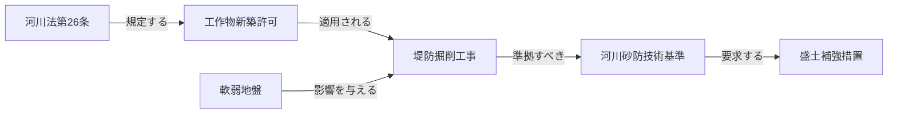

## 5-B. 簡易実装アプローチ：MD＋AI指示による近似実現

§4（7ステップ）はフル実装版である。PoC・小規模運用では、**4種のMDファイル＋システムプロンプト**で同等の効果を近似できる。インフラ不要・構築期間は数日単位。

### 5-B.1 フル実装 vs 簡易実装の対応関係

| フル実装（7ステップ） | 採用技術 | 簡易実装での代替手段 |
|---|---|---|
| Step 1: PDF→MD変換 | VectorRAG | **同じ**（変換ツールは共通） |
| Step 2: エンティティ抽出 | GraphRAG / オントロジー | `entity_dictionary.md` の手動作成 |
| Step 3: ノード単語辞書 | GraphRAG / オントロジー | `entity_dictionary.md` の定義欄 |
| Step 4: 類似単語辞書 | VectorRAG / オントロジー | `entity_dictionary.md` の同義語欄 |
| Step 5: Mermaidナレッジ図 | GraphRAG | `knowledge_map.md`（Mermaid図のみ） |
| Step 6: OWL/SHACL オントロジー | ドメインオントロジー | `system_prompt.md` の制約ルール欄 |
| Step 7: CogGRAGテンプレート | CogGRAG | `system_prompt.md` の回答手順欄 |

### 5-B.2 簡易実装のファイル構成

```
knowledge/
├── source_docs/             # Step 1と同じ: PDF→MD変換済み文書
│   ├── 河川法抜粋.md
│   └── 河川砂防技術基準.md
├── entity_dictionary.md     # Steps 2-4の代替
├── knowledge_map.md         # Step 5と同じ（Mermaid図）
└── system_prompt.md         # Steps 6-7の代替（AIへの指示）
```

### 5-B.3 entity_dictionary.md（Steps 2-4 代替）

エンティティ定義・タイプ・同義語をMarkdownテーブルで管理する。LLMはこのファイルをRAGで参照して用語を正規化する。

```markdown
---
doc_id: "entity_dictionary"
doc_type: "辞書"
---
```

### 5-B.4 エンティティ辞書
| ノードID | 正規名 | タイプ | 定義（1行） | 同義語・略語 |
|---|---|---|---|---|
| 設計洪水位 | 設計洪水位 | 技術基準値 | 設計に用いる洪水時の水位 | HWL, H.W.L, 計画高水位, 設計最高水位 |
| 河川法_26 | 河川法第26条 | 法令 | 河川区域内工作物の新築等の許可義務 | 河川法26条, 第26条（河川） |
| 盛土補強工法 | 盛土補強工法 | 工法 | 軟弱地盤での盛土安定のための補強工法 | 盛土補強, 補強盛土 |
| 軟弱地盤 | 軟弱地盤 | リスク要因 | 沈下・液状化リスクのある地盤 | 軟弱地 |

### 5-B.5 関係定義

| 関係タイプ | 意味 | 例 |
|---|---|---|
| 規定する | 法令が手続きを定める | 河川法第26条 → 工作物新築許可 |
| 準拠すべき | 工法が技術基準に従う必要 | 盛土補強工法 → 河川砂防技術基準 |
| 影響を与える | リスク要因が工法選定に影響 | 軟弱地盤 → 盛土補強工法 |

### 5-B.6 knowledge_map.md（Step 5 代替）

Mermaid図で概念間の関係を可視化する。RAGのコンテキストに含めることで、LLMが関係を辿って回答できる。

```markdown
---
doc_id: "knowledge_map"
doc_type: "ナレッジ図"
---
```

### 5-B.7 土木事業管理ナレッジマップ



### 5-B.8 system_prompt.md（Steps 6-7 代替）

このファイルをDify・n8n等のRAGシステムの**システムプロンプト**として設定する。オントロジーの制約ルールとCogGRAGの分解手順をAIへの指示として記述する。

### 5-B.9 役割
あなたは土木事業管理専門のAIアシスタントです。
参照可能なファイルは `source_docs/`（法令・基準書）、
`entity_dictionary.md`（用語定義）、`knowledge_map.md`（概念関係図）です。

### 5-B.10 回答手順（CogGRAGの代替）
1. **問いの分解**: 問いを以下の観点に分解する
   - ① 関連する法令・条文は何か
   - ② 準拠すべき技術基準は何か
   - ③ 類似の過去事例はあるか
   - ④ リスク要因に影響はあるか
2. **用語の正規化**: `entity_dictionary.md` を参照し、略語・別称を正規名に統一する
3. **関係の確認**: `knowledge_map.md` の関係図を参照し、関連ノードを辿る
4. **回答の整合確認**: 以下の制約ルールに違反しないか確認してから回答する

### 5-B.11 制約ルール（オントロジー・SHACLの代替）
- **工法を提案する場合**: 必ず準拠すべき技術基準を明示すること
- **法令を引用する場合**: 条文番号（例: 第26条）まで特定すること
- **根拠の明示**: 回答の最後に「根拠: [文書名, セクション]」の形式で出典を記載すること
- **不明な場合**: 推測で回答せず「該当する規定が確認できませんでした」と明示すること

### 5-B.12 回答フォーマット
**回答**: [結論を1〜2文で]

**根拠**:
- 法令: [条文名・番号]
- 技術基準: [基準名・セクション]
- 事例: [関連文書名]（あれば）

---

### 5-B.13 3トラック比較

| 観点 | Track A<br>MD＋単一プロンプト | Track A+C<br>MD＋マルチエージェント | Track B<br>フル実装（7ステップ） |
|---|---|---|---|
| 構築期間 | 数日 | 1〜2週間 | 数ヶ月 |
| インフラ | 不要 | 不要 | Graph DB + Vector DB |
| **更新コスト** | **MD編集のみ（最低）** | **MD編集のみ（最低）** | 複数DB更新（高い） |
| **分業化** | **MD担当者のみで可** | **MD担当者のみで可** | 知識エンジニア必須 |
| 多段推論精度 | 低（LLM依存） | 中（エージェント連携） | 高（SPARQL厳密走査） |
| 整合性検証 | プロンプト依存 | 監理エージェントが検証 | SHACL自動検証 |
| 変化への対応 | **即日（MD更新のみ）** | **即日（MD更新のみ）** | 数時間〜数日（DB再構築） |
| AIの進歩の恩恵 | **直接受ける** | **直接受ける** | 限定的（インフラが固定） |
| **推奨用途** | **試用・小規模** | **★主力推奨** | 監査証跡・大規模・マルチ組織 |

