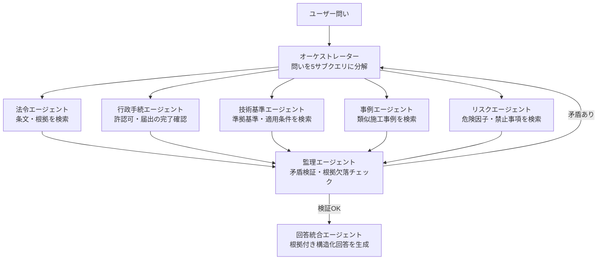
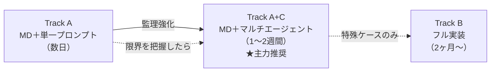

---
title: "マルチエージェント拡張：監理構造による品質向上"
---
# 7. マルチエージェント拡張：監理構造による品質向上

## 7.1 理論的な答え：「可能」— ただし限界は異なる

簡易実装（Track A）の弱点は「1回のLLM呼び出しがすべてを担う」ことにある。  
マルチエージェントで**役割を分離**し**相互監視**させることで、フル実装（Track B）の主要機能を段階的に代替できる。

## 7.2 マルチエージェント構成（7エージェント＋オーケストレーター）



**各エージェントの役割**:

| エージェント | 役割 | 参照先 | 代替する技術 |
|---|---|---|---|
| **オーケストレーター** | 問いを「法令/行政手続/基準/事例/リスク」に分解し各エージェントに指示 | `system_prompt.md`の回答手順 | CogGRAG（分解） |
| **法令エージェント** | 関連する法令・条文を特定し根拠を返す | `source_docs/` + `entity_dictionary.md` | GraphRAG（法令ノード） |
| **行政手続エージェント** | 許認可・届出・協議・検査・提出書類の完了確認（二重チェック役） | `source_docs/`（手続き系通達・要項・要領） | VectorRAG＋GraphRAG（手続きノード） |
| **技術基準エージェント** | 適用すべき基準・仕様を特定する | `source_docs/` + `knowledge_map.md` | GraphRAG（基準ノード） |
| **事例エージェント** | 類似施工事例・トラブル事例を検索する | `source_docs/`（報告書類） | VectorRAG |
| **リスクエージェント** | 禁止事項・リスク要因・注意事項を検索する | `entity_dictionary.md`（リスク要因欄） | GraphRAG（リスクノード） |
| **監理エージェント** | 5エージェントの回答の矛盾・根拠欠落を検証し、不十分なら差し戻す | `entity_dictionary.md` + `system_prompt.md`の制約ルール | SHACL制約検証 |
| **回答統合エージェント** | 検証済み情報を構造化回答（根拠付き）に統合する | 監理エージェントの出力 | CogGRAG（統合） |

---

## 7.3 監理エージェントのプロンプト（チェックリスト）

```
以下の5エージェントの回答を検証してください。

【法令エージェント回答】: {law_agent_result}
【行政手続エージェント回答】: {procedure_agent_result}
【技術基準エージェント回答】: {standard_agent_result}
【事例エージェント回答】: {case_agent_result}
【リスクエージェント回答】: {risk_agent_result}

## 検証項目（全てYESなら統合エージェントに渡す、NOなら差し戻し）
1. [ ] 法令と技術基準に矛盾はないか
2. [ ] 工法を提案する場合、準拠すべき技術基準が明示されているか
3. [ ] 事例の工法と現在の法令状態が整合しているか（廃止・改定漏れ）
4. [ ] リスクエージェントが指摘した禁止事項と提案内容が衝突していないか
5. [ ] 各エージェントの回答に具体的な根拠（文書名・条番号）があるか
6. [ ] 行政手続エージェントが確認した許認可・届出・協議に未完了・漏れはないか

検証結果: OK / 差し戻し（理由: [具体的な矛盾点]）
```

---

## 7.4 理論的な品質向上の限界

マルチエージェントは品質を向上させるが、**フル実装と等価にはならない**。

| 課題 | マルチエージェントでの限界 | フル実装での解決 |
|---|---|---|
| 3ホップ以上の推論 | エージェントが順次推論できるが、見落としが起きやすい | SPARQLによる厳密なグラフ走査で網羅的 |
| 用語の正規化漏れ | `entity_dictionary.md` にない略語は見落とす | OWL `owl:sameAs` で全略語を自動統合 |
| 大量ノードの処理 | コンテキスト長に上限があり200ノード超で精度低下 | Graph DBは原理的にノード数無制限 |
| 整合性の網羅性 | 監理エージェントのチェックリストに書いた項目しか検証しない | SHACLは定義した全制約を自動的に検証 |

**結論**:  
マルチエージェント拡張により、簡易実装の品質は**「Track A + マルチエージェント」≒「Track B のPoC相当」**まで引き上げ可能である。ただし、大規模・高信頼性・厳密な整合性保証が求められる本番運用にはフル実装への移行が必要。

---

## 7.5 3段階のアップグレードパス



---

> **第11章との関係**: 本章で定義した7エージェント＋オーケストレーター構成（法令・行政手続・技術基準・事例・リスク・監理・回答統合）に対し、**法令体系の階層（①〜⑰）に基づく各エージェントのRAGスコープ設計**については [第11章「適用エージェントとRAGスコープの推奨設計」](11_rag_agent_scope.md) を参照。

