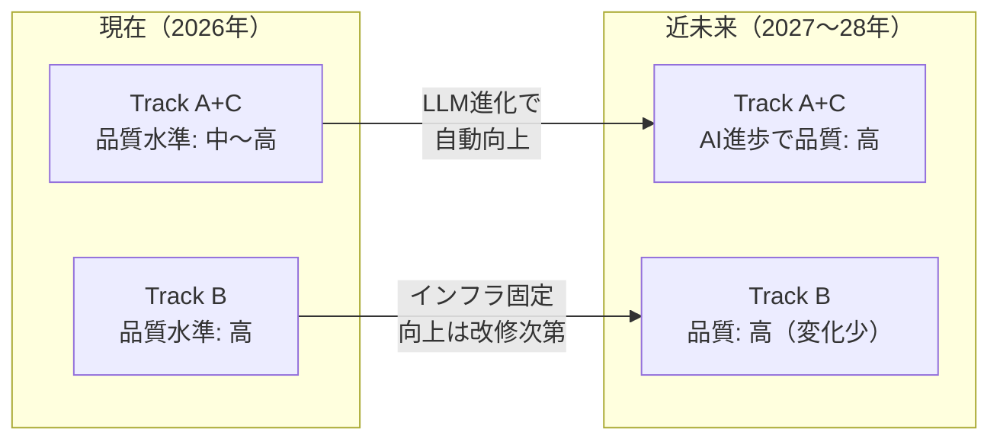

## 5-D. MD分業管理とAI進歩を活用した変化対応戦略

### Track A+C が主力になる理由

AIの推論能力・コンテキスト長の急速な向上を考慮すると、「MDファイル + マルチエージェント」は単なる代替手段ではなく、**変化対応力において Track B を超える優位性を持つ**。

| 視点 | Track A+C の優位性 |
|---|---|
| **AIの進歩の恩恵** | LLMの推論能力向上・コンテキスト長拡大は即座に品質向上に直結。Track B はインフラ固定のため恩恵が限定的 |
| **法令・基準の改定対応** | 担当者がMDを1ファイル更新するだけで完結。Track B はGraph DB再構築・SHACL再検証が必要 |
| **分業化の容易さ** | 専門知識がある担当者がMarkdownを書けばよい。知識エンジニア不要 |
| **障害点の少なさ** | インフラ障害なし。MDファイルが壊れることはない |
| **コスト構造** | ランニングコストはLLM API費用のみ。Track B はDB運用・保守費が継続発生 |

---

### MD分業管理マトリクス
誰が・どのMDを・いつ更新するかを明確にすることで、Track A+C はチーム運営可能な持続可能なシステムになる。

| MDファイル | 担当者 | 更新トリガー | 目安工数 |
|---|---|---|---|
| `source_docs/法令.md` | 法務担当者 | 法令・告示の改定時 | 1〜2時間/件 |
| `source_docs/技術基準.md` | 技術担当者 | 基準書改定・通知発出時 | 2〜4時間/件 |
| `source_docs/施工事例.md` | 現場担当者 | 工事完了・トラブル発生時 | 1時間/件 |
| `entity_dictionary.md` | 知識管理担当 | 新規用語登場・略語追加時 | 30分/件 |
| `knowledge_map.md` | 知識管理担当 | 新しい概念関係の発見時 | 1時間/件 |
| `system_prompt.md` | AI担当者 | AI品質問題・新しい問いパターン時 | 半日 |

> **運用ポイント**: 各担当者は自分の専門領域のMDのみを管理すればよく、他の仕組みを知る必要がない。法令担当者はMarkdownの書き方を覚えるだけでシステムの精度向上に直接貢献できる。

---

#### AIの進歩による品質曲線

---

### Track B が依然必要な条件（限定的）

Track A+C で対応できない領域は以下に限定される。

| 条件 | 理由 |
|---|---|
| **法的監査証跡の要求** | どの法令バージョンに基づいて判断したかを証明する義務がある場合 |
| **文書数10万件超** | コンテキスト長の物理的上限を超える規模 |
| **複数組織間スキーマ共有** | 標準化されたOWLオントロジーで組織をまたいだデータ統合が必要 |
| **リアルタイム整合性保証** | ミリ秒単位でSHACL違反を検知・阻止する必要がある |

これらの条件に該当しない限り、**Track A+C がコスト・変化対応・維持管理の全面において Track B より優れた選択**である。

