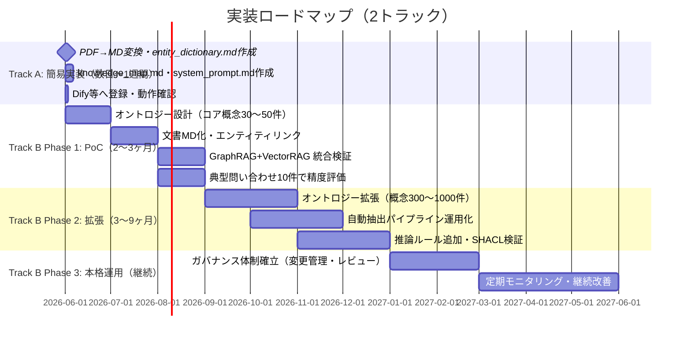

---
title: "導入効果・評価指標とロードマップ"
---
# 9. 導入効果・評価指標とロードマップ

## 9.1 導入効果と評価指標（KPI）

| 効果 | 説明 | KPI目標値 |
|---|---|---|
| **ハルシネーション抑制** | 全出力にグラフ上の具体ソース（根拠ノード）を明示 | 根拠提示率 ≥ 90% |
| **多段推論の自動化** | 2ホップ以上の法令依存を自動追跡 | 多段推論成功率 ≥ 80% |
| **用語の一意化** | 同義語・略語をオントロジーで正規化 | エンティティリンク精度（F1） ≥ 0.85 |
| **更新コスト削減** | 新規文書のKG統合を数時間で自動実行 | 文書統合工数 ≤ 4人時/件 |
| **ユーザー満足度** | 若手技術者・事業管理者の業務効率化 | 満足度スコア ≥ 4.0/5.0 |

---

## 9.2 実装ロードマップ

---

## 9.3 費用概算と人員計画

| フェーズ | 要員 | 期間 | 主なツール・インフラ |
|---|---|---|---|
| **PoC** | 知識エンジニア×1、ドメイン専門家×2（数日）、エンジニア×1 | 2〜3ヶ月 | Graph DB（Neo4j等）、Vector DB（Milvus等）、LLM API |
| **拡張** | 知識エンジニア×1〜2、SWE×1〜2、運用スタッフ×1 | 3〜9ヶ月 | ETLパイプライン、OWL推論エンジン、CI/CD |
| **運用** | 運用スタッフ×1（継続）、ドメイン専門家（レビュー体制） | 継続 | モニタリング基盤、ガバナンスツール |

---

## 9.4 リスク管理

| リスク | 影響 | 軽減策 |
|---|---|---|
| オントロジーのカバレッジ不足 | 未定義概念の検索精度低下 | PoCでコア概念に限定し段階的に拡張 |
| エンティティリンク誤認 | KGの汚染・回答誤り | 人手検査ループ＋モデル再学習のフィードバック |
| 運用コスト増大 | ガバナンス負荷の増加 | 変更管理のCI/CD化・自動整合性チェックの導入 |
| 文書改訂への追従遅れ | 旧情報による誤回答 | 文書更新トリガーによる差分自動再抽出パイプライン |
| LLM出力の不安定性 | 推論品質のばらつき | Dual-Process Verificationと人手エスカレーション閾値の設定 |

---

## 9.5 結論と次のアクション

本システム（HybridRAG × CogGRAG × ドメインオントロジー × 観察駆動型エージェント）は、単なるドキュメント検索を超えた「知識の構造と判断プロセスの継承」を実現する。

**PoC成功基準**:

- 根拠提示率 ≥ 90%
- 多段推論成功率 ≥ 80%
- 典型問い合わせ10件のうち8件以上で実務利用可能な回答

**次のアクション（2トラック）**:

| # | Track A（簡易：即日着手可能） | Track B（本格：計画的着手） |
|---|---|---|
| 1 | 対象文書を選定してPDF→MD変換（1日） | PoCスコープ確定（主要概念30〜50件・典型問い合わせ10件） |
| 2 | `entity_dictionary.md`・`knowledge_map.md` を手動作成（2〜3日） | 概算見積り・人員確保（知識エンジニア・ドメイン専門家） |
| 3 | `system_prompt.md` をDify/ChatGPT等に設定して試用（1日） | 評価基準の関係者合意（KPI定義と判定基準） |
| 4 | 精度確認 → 限界を把握 → Track Bへの移行判断 | キックオフ（2026年6月〜、Track Aの知見を引継ぎ） |

> **推奨**: まず Track A で1週間以内に動く実証環境を作り、現場担当者に触れさせてフィードバックを収集する。その知見（どんな問いが多いか・どこで精度が落ちるか）をTrack Bの設計に活かすことで、本格実装の精度と費用対効果を最大化できる。
