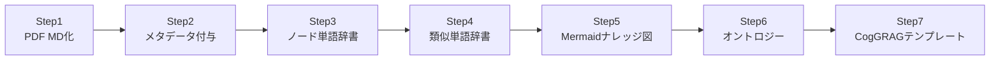
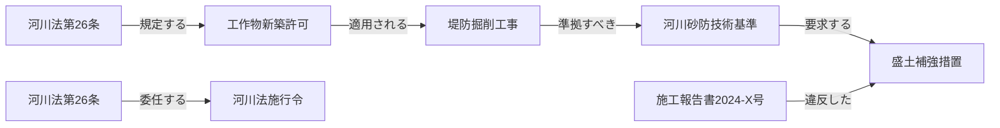
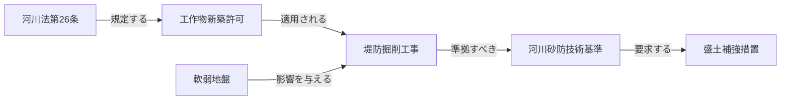

# 4. RAG知識整理の7ステップ実施手順

既存PDF等の資料をナレッジグラフ・オントロジーとして整備し、CogGRAGの推論テンプレートまで完成させるための具体的な実施手順を示す。各ステップは順番に依存しており、前ステップの成果物が次ステップのインプットとなる。



**各ステップと採用技術（§3）の対応**:

| Step | 作業内容 | 主に寄与する採用技術 | 成果物 |
|---|---|---|---|
| **1** | PDFのMD化 | **VectorRAG**（テキストチャンク生成） | `.md` ファイル群 |
| **2** | MDへのメタデータ付与 | **GraphRAG**（ノード候補の抽出） / **ドメインオントロジー**（エンティティ分類） | `.entities.json` |
| **3** | ノード単語辞書の作成 | **GraphRAG**（グラフノード定義） / **ドメインオントロジー**（クラスインスタンス登録） | `node_dictionary.json` |
| **4** | 類似単語辞書の作成 | **VectorRAG**（クエリ正規化・同義語展開） / **ドメインオントロジー**（`owl:sameAs`） | `synonym_dictionary.json` |
| **5** | Mermaidナレッジ図の作成 | **GraphRAG**（エッジ＝トリプルの可視化） | `triples.json` / Mermaid図 |
| **6** | オントロジーの作成 | **ドメインオントロジー**（クラス・推論ルール・SHACL制約の形式化） | `ontology.ttl` |
| **7** | CogGRAG推論テンプレートの作成 | **CogGRAG**（問題分解パターン・サブクエリ・推論チェーン設計） | `decomp_templates.yaml` |

> Step 1〜7 で4技術がすべてカバーされる。CogGRAG（Step 7）はStep 1〜6の成果物を組み合わせて機能するため、必ず最後に実施する。

---

### Step 1：PDFのMD化

**目的**: 原文書の構造（見出し・表・条文番号）を保持しながらテキストを機械処理可能な形式に変換する。

**推奨ツール**:

| ツール | 特徴 | 向いている文書 |
|---|---|---|
| `marker-pdf` | 高精度・レイアウト保持 | 技術基準書・マニュアル |
| `pymupdf4llm` | 高速・表変換が得意 | 表が多い仕様書 |
| `docling`（IBM） | 複雑レイアウト対応 | 図表混在の報告書 |

**出力フォーマット（YAMLフロントマター付き）**:

```markdown
---
doc_id: "kasen_law_26"
title: "河川法（抜粋）"
doc_type: "法令"
applicable_law: "河川法"
issue_date: "2023-04-01"
organization: "国土交通省"
work_type: ["河川", "堤防"]
---

## 第26条　工作物の新築等の許可

河川区域内の土地において工作物を新築し、改築し、又は除却しようとする者は、
国土交通省令で定めるところにより、河川管理者の許可を受けなければならない。
```

**チェックポイント**: 見出し階層・表・条文番号が正しく変換されているか人手で抜き取り確認する。

### Step 2：MDにノード単語のメタデータ付与

**目的**: MD内の専門用語をエンティティとして識別し、後続のノード辞書作成に必要なタグ情報を付与する。

**エンティティ種別（タイプ定義）**:

| タイプ | 例 |
|---|---|
| `法令` | 河川法第26条、道路法第32条 |
| `技術基準` | 河川砂防技術基準、道路設計要領 |
| `工法` | 盛土補強工法、深層混合処理工法 |
| `構造物` | 堤防、橋梁、擁壁 |
| `手続き` | 河川管理者許可、占用申請 |
| `リスク要因` | 軟弱地盤、出水期、液状化 |

**処理方法（LLMプロンプト例）**:

```
以下のMarkdownテキストから土木実務のエンティティを抽出し、
JSON形式で返してください。
タイプは[法令, 技術基準, 工法, 構造物, 手続き, リスク要因]から選択。

テキスト:
{chunk_text}

出力形式:
[{"text": "河川法第26条", "type": "法令", "start": 15, "end": 23}, ...]
```

**付与後のMD（サイドカーJSON方式）**:

```json
// kasen_law_26.entities.json
[
  {"text": "河川管理者の許可", "type": "手続き", "node_id": "河川管理者許可", "section": "第26条"},
  {"text": "工作物", "type": "構造物", "node_id": "工作物", "section": "第26条"}
]
```

> **注意**: サイドカーJSON方式のため、**MDファイル本体（`kasen_law_26.md`）は変更しない**。エンティティ情報は `kasen_law_26.entities.json` として隣に置く。Step 3でこのJSONをまとめてノード辞書へ統合する。

### Step 3：ノード単語辞書の作成

**目的**: Step 2で抽出した全エンティティを一元管理する辞書を作成し、ノードIDと正規形を確定する。

**辞書スキーマ（1レコード例）**:

```json
{
  "node_id": "河川法_第26条",
  "canonical_name": "河川法第26条",
  "entity_type": "法令",
  "definition": "河川区域内における工作物の新築・改築・除却に河川管理者の許可を義務付ける条文",
  "source": {
    "doc_id": "kasen_law_26",
    "section": "第26条",
    "page": 12
  },
  "aliases": []
}
```

**辞書MD版（人が読む形式）**:

```markdown
## 河川法第26条
- **ノードID**: 河川法_第26条
- **タイプ**: 法令
- **定義**: 河川区域内における工作物の新築・改築・除却に河川管理者の許可を義務付ける条文
- **出典**: 河川法 第26条（p.12）
```

**管理ファイル**: `node_dictionary.json` および `辞書MD/法令.md`, `辞書MD/工法.md` 等をタイプ別に分割して管理する。

### Step 4：ノード単語辞書の類似単語辞書の作成

**目的**: 同一概念の異なる表記・略語・関連語を一つの正規ノードに集約し、検索時の漏れを防ぐ。

**作成方法（2段階）**:

**① 埋め込みベクトルによる自動検出**:

```python
# 全ノードの canonical_name を埋め込みベクトル化
from sentence_transformers import SentenceTransformer
import numpy as np

model = SentenceTransformer("cl-nagoya/sup-simcse-ja-large")
names = [node["canonical_name"] for node in node_dict]
embeddings = model.encode(names)

# コサイン類似度でペアを抽出（閾値0.85以上を候補として提示）
from sklearn.metrics.pairwise import cosine_similarity
sim_matrix = cosine_similarity(embeddings)
```

**② LLMによる略語・同義語生成**:

```
以下の土木専門用語について、
同義語・略語・別称・関連表現を列挙してください。

用語: 設計洪水位
出力: ["H.W.L", "HWL", "計画高水位", "設計最高水位", "計画洪水位"]
```

**類似単語辞書スキーマ**:

```json
{
  "node_id": "設計洪水位",
  "canonical_name": "設計洪水位",
  "synonyms": ["H.W.L", "HWL", "計画高水位", "設計最高水位"],
  "related_terms": ["計画高水流量", "計画規模", "基本高水"],
  "narrower": [],
  "broader": ["洪水位"]
}
```

**辞書MD版（人が読む形式）**:

```markdown
## 設計洪水位
- **ノードID**: 設計洪水位
- **タイプ**: 技術基準値
- **同義語**: HWL, H.W.L, 計画高水位, 設計最高水位
- **関連語（上位）**: 洪水位
- **関連語（周辺）**: 計画高水流量, 計画規模, 基本高水
```

**管理ファイル**: `synonym_dictionary.json`（機械処理用）＋ `辞書MD/同義語.md`（人手レビュー用）。RAGの検索前処理でクエリ中の単語をこの辞書で正規化してから検索する。

### Step 5：ナレッジとしての単語連携Mermaid作成

**目的**: Step 3・4のノード間の関係（トリプル）を可視化し、ナレッジグラフの構造を人が確認・修正できる形にする。

**トリプル抽出プロンプト**:

```
以下のテキストから「主語 - 述語 - 目的語」の関係を抽出し、
JSON形式で返してください。
述語は[規定する, 適用される, 準拠すべき, 要求する, 委任する,
       定義する, 影響を与える, 違反した, 参照する]から選択してください。

テキスト: {chunk_text}

出力:
[{"subject": "河川法第26条", "predicate": "規定する", "object": "工作物新築許可", "source": "kasen_law_26:p12"}]
```

**Mermaid生成（トリプルからの自動変換）**:

```python
def triples_to_mermaid(triples: list[dict]) -> str:
    lines = ["graph LR"]
    for t in triples:
        s = t["subject"].replace(" ", "_")
        o = t["object"].replace(" ", "_")
        lines.append(f'    {s}["{t["subject"]}"] -- "{t["predicate"]}" --> {o}["{t["object"]}"]')
    return "\n".join(lines)
```

**出力例（土木事業管理コンテキスト）**:



**管理ファイル**: `triples.json`（全トリプル）＋ `knowledge_map/[テーマ名].md`（テーマ別Mermaid図）

**`knowledge_map/[テーマ名].md` のフォーマット**:

```markdown
---
doc_id: "knowledge_map_kasen"
title: "河川法関連ナレッジマップ"
doc_type: "ナレッジ図"
theme: "河川法"
source_steps: ["Step3", "Step4"]
---
```

## 河川法関連ナレッジマップ



## 収録トリプル一覧

| 主語 | 述語 | 目的語 | 出典 |
|---|---|---|---|
| 河川法第26条 | 規定する | 工作物新築許可 | kasen_law_26:p12 |
| 工作物新築許可 | 適用される | 堤防掘削工事 | kasen_law_26:p12 |
| 堤防掘削工事 | 準拠すべき | 河川砂防技術基準 | kasen_standard:p5 |


> テーマ別に1ファイル作成する（例: `knowledge_map/河川法.md`, `knowledge_map/道路法.md`）。収録トリプル一覧があることで、人手での確認・修正が容易になる。

---

### Step 6：オントロジー作成

**目的**: Step 3〜5で蓄積したノード・関係を形式化し、推論ルール・整合性制約を定義する。これによりRAGの検索精度と自動判定能力が向上する。

**① クラス・プロパティ定義（TTL形式）**:

```turtle
@prefix ex: <http://example.org/doboku#> .
@prefix owl: <http://www.w3.org/2002/07/owl#> .
@prefix rdfs: <http://www.w3.org/2000/01/rdf-schema#> .

# クラス定義
ex:法令      a owl:Class .
ex:技術基準  a owl:Class .
ex:工法      a owl:Class .
ex:構造物    a owl:Class .
ex:手続き    a owl:Class .
ex:リスク要因 a owl:Class .

# プロパティ定義
ex:規定する    a owl:ObjectProperty ; rdfs:domain ex:法令 ;     rdfs:range ex:手続き .
ex:適用される  a owl:ObjectProperty ; rdfs:domain ex:手続き ;   rdfs:range ex:工法 .
ex:準拠すべき  a owl:ObjectProperty ; rdfs:domain ex:工法 ;     rdfs:range ex:技術基準 .
ex:委任する    a owl:ObjectProperty ; rdfs:domain ex:法令 ;     rdfs:range ex:法令 .
ex:影響を与える a owl:ObjectProperty ; rdfs:domain ex:リスク要因 ; rdfs:range ex:工法 .
```

**② 同義語の統合（OWL sameAs）**:

```turtle
ex:設計洪水位 owl:sameAs ex:HWL .
ex:設計洪水位 owl:sameAs ex:計画高水位 .
```

**③ 推論ルール（SHACL制約の例）**:

```turtle
@prefix sh: <http://www.w3.org/ns/shacl#> .

ex:工法制約 a sh:NodeShape ;
    sh:targetClass ex:工法 ;
    sh:property [
        sh:path ex:準拠すべき ;
        sh:minCount 1 ;                  # 工法は必ず技術基準を持つ
        sh:class ex:技術基準 ;
        sh:message "工法には準拠すべき技術基準が必要です" ;
    ] .
```

**④ ステップ成果物とRAGへの接続**:

| 成果物 | 用途 |
|---|---|
| `ontology.ttl` | Knowledge GraphのスキーマとしてGraph DBに登録 |
| `node_dictionary.json` | エンティティリンク処理の正規化辞書 |
| `synonym_dictionary.json` | クエリ前処理・ベクトル検索の拡張辞書 |
| `triples.json` | Knowledge Graphのエッジデータ |
| `knowledge_map/*.md` | 人手レビュー・ドキュメント共有用 |

---

### Step 7：CogGRAG推論テンプレートの作成

**目的**: Step 1〜6で整備した知識基盤を活用して、CogGRAGが複雑な問いを「どう分解し・どの知識源をどの順で参照するか」を定義する問題分解テンプレートを作成する。これが存在しないとCogGRAGは汎用的な分解しかできず、土木実務特有の推論ができない。

**テンプレートの構成要素**:

| 要素 | 説明 |
|---|---|
| `query_pattern` | このテンプレートが対応する問いのパターン（正規表現またはキーワード） |
| `decomposition` | 問いを分解するサブクエリのリスト（順序・依存関係付き） |
| `knowledge_sources` | 各サブクエリで参照すべき知識源（GraphRAG / VectorRAG / オントロジー） |
| `reasoning_chain` | サブクエリの結果を統合するロジック（AND条件 / OR条件 / 推移的結合） |
| `validation_rule` | 最終回答の整合性チェックルール（例: SHACL制約との照合） |

**テンプレートYAMLサンプル**:

```yaml
# decomp_templates.yaml
templates:
  - id: "工法適用可否判定"
    query_pattern: "(?:工法|施工方法).+(?:適用|使用|採用).+(?:可能|問題|許可)"
    decomposition:
      - step: 1
        subquery: "対象工法はどの技術基準に準拠すべきか"
        source: GraphRAG        # triples.json + ontology.ttl
        sparql_hint: "SELECT ?standard WHERE { ?method ex:準拠すべき ?standard }"
      - step: 2
        subquery: "その技術基準に関連する法令条文は何か"
        source: GraphRAG        # 2ホップ: 工法→基準→法令
      - step: 3
        subquery: "現場条件（地盤・時期等）に類似した過去事例はあるか"
        source: VectorRAG       # synonym_dictionary.json で正規化後に検索
      - step: 4
        subquery: "法令・基準・事例に矛盾はないか"
        source: Ontology        # SHACL制約で整合性確認
    reasoning_chain: "step1 AND step2 → 法的根拠確定; step3 → 実績補強; step4 → 最終検証"
    validation_rule: "ex:工法制約（sh:minCount 1 on ex:準拠すべき）を満たすこと"

  - id: "法令改定影響分析"
    query_pattern: "(?:法令|基準|告示).+(?:改定|改正|変更).+(?:影響|波及|適用)"
    decomposition:
      - step: 1
        subquery: "改定された条文を参照しているノードを列挙"
        source: GraphRAG
        sparql_hint: "SELECT ?node WHERE { ?node ex:参照する <改定条文URI> }"
      - step: 2
        subquery: "そのノードに依存する工法・手続きを列挙（推移的閉包）"
        source: GraphRAG        # 多段ホップ
      - step: 3
        subquery: "影響を受ける工法の代替案はあるか"
        source: VectorRAG
    reasoning_chain: "step1 → step2（推移的）→ step3（代替案補完）"
    validation_rule: "影響ノード数 > 0 の場合は必ず根拠トリプルを出力"
```

**テンプレート作成手順**:

1. **典型問い収集**: 担当者へのヒアリングや過去のQAログから代表的な問いを20〜50件収集する。
2. **クラスタリング**: 問いを「工法適用可否」「法令解釈」「リスク評価」「手続き確認」等のカテゴリに分類する。
3. **分解パターン設計**: 各カテゴリに対してサブクエリ・知識源・統合ロジックをYAML化する。
4. **テスト検証**: `triples.json`・`node_dictionary.json`・`ontology.ttl` を使って実際にSPARQLクエリとベクトル検索を実行し、期待する回答が得られるか確認する。
5. **反復改善**: 回答が不十分な場合は Step 2〜6 に戻り、不足ノード・トリプル・制約を補強する。

**管理ファイル**: `decomp_templates.yaml`（全テンプレート）＋ `test_queries/[カテゴリ].md`（テストQAセット）

---
