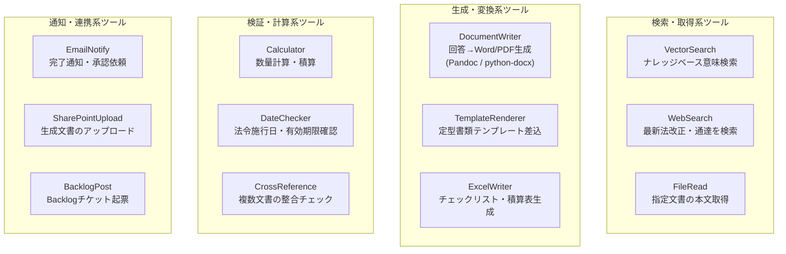

# 2. エージェントツール設計

> 本章では「各エージェントに持たせるツール」の全体構成を整理する。  
> RAG 検索だけでなく、**Pandoc 等による文書ファイル生成**も含めてツールセットを定義する。

## 2.1 ツールの種類と役割

## 2.2 エージェント別ツール割り当て

| エージェント | 必須ツール | 推奨追加ツール |
|---|---|---|
| **オーケストレーター** | なし（ルーティングのみ） | DateChecker（法改正時期確認） |
| **法令エージェント** | VectorSearch（kb-law系） | WebSearch（最新改正確認）/ CrossReference |
| **行政手続エージェント** | VectorSearch（kb-procedure） | TemplateRenderer（申請書雛形） |
| **技術基準エージェント** | VectorSearch（kb-technical） | Calculator（数量計算）/ FileRead |
| **事例エージェント** | VectorSearch（kb-cases） | FileRead（報告書全文取得） |
| **リスクエージェント** | VectorSearch（kb-risk系） | CrossReference |
| **監理エージェント** | CrossReference | なし（検索ツールは持たせない） |
| **回答統合エージェント** | DocumentWriter | TemplateRenderer / ExcelWriter |

---

## 2.3 DocumentWriter（Pandoc 連携）

### 2.3.1 Pandoc が解決すること

本システムの最終出力は **Markdown 形式の構造化回答**だが、実務では以下の形式が必要になる。

| 出力形式 | 用途 | Pandoc コマンド |
|---|---|---|
| Word (.docx) | 決裁文書・報告書 | `pandoc -o output.docx --reference-doc=template.docx` |
| PDF | 印刷・保管 | `pandoc -o output.pdf --pdf-engine=lualatex` |
