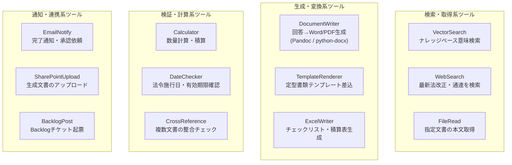
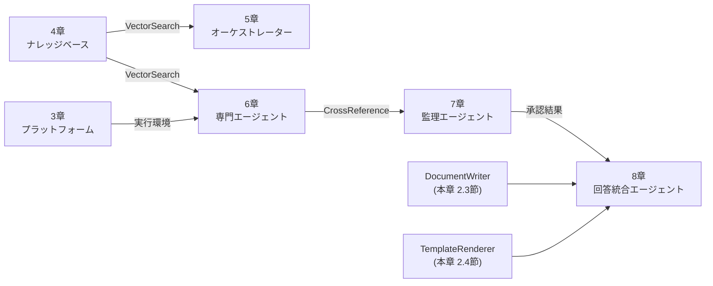

# 2. エージェントツール設計

> 本章では「各エージェントに持たせるツール」の全体構成を整理する。  
> RAG 検索だけでなく、**Pandoc 等による文書ファイル生成**も含めてツールセットを定義する。

## 2.1 ツールの種類と役割



## 2.2 エージェント別ツール割り当て

| エージェント | 必須ツール | 推奨追加ツール |
|---|---|---|
| **オーケストレーター** | なし（ルーティングのみ） | DateChecker（法改正時期確認） |
| **法令エージェント** | VectorSearch（kb-law系） | WebSearch（最新改正確認）/ CrossReference |
| **行政手続エージェント** | VectorSearch（kb-procedure） | TemplateRenderer（申請書雛形） |
| **技術基準エージェント** | VectorSearch（kb-technical） | Calculator（数量計算）/ FileRead |
| **事例エージェント** | VectorSearch（kb-cases） | FileRead（報告書全文取得） |
| **リスクエージェント** | VectorSearch（kb-risk系） | CrossReference |
| **監理エージェント** | CrossReference | なし（検索ツールは持たせない） |
| **回答統合エージェント** | DocumentWriter | TemplateRenderer / ExcelWriter |

---

## 2.3 DocumentWriter（Pandoc 連携）

### 2.3.1 Pandoc が解決すること

本システムの最終出力は **Markdown 形式の構造化回答**だが、実務では以下の形式が必要になる。

| 出力形式 | 用途 | Pandoc コマンド |
|---|---|---|
| Word (.docx) | 決裁文書・報告書 | `pandoc -o output.docx --reference-doc=template.docx` |
| PDF | 印刷・保管 | `pandoc -o output.pdf --pdf-engine=lualatex` |
| HTML | イントラネット公開 | `pandoc -o output.html` |
| Excel (.xlsx) | チェックリスト・積算 | python-openpyxl（Pandoc 非対応のため別実装） |

### 2.3.2 DocumentWriter ツール実装（Track B / Python）

```python
# tools/document_writer.py
import subprocess, tempfile, os
from pathlib import Path

def write_word(markdown_text: str, template_path: str = None) -> bytes:
    """Markdown → Word DOCX バイナリを返す"""
    with tempfile.NamedTemporaryFile(suffix=".md", delete=False, mode="w", encoding="utf-8") as f:
        f.write(markdown_text)
        src = f.name
    out = src.replace(".md", ".docx")
    cmd = ["pandoc", src, "-o", out, "--from=markdown", "--to=docx"]
    if template_path:
        cmd += [f"--reference-doc={template_path}"]
    subprocess.run(cmd, check=True, capture_output=True)
    data = Path(out).read_bytes()
    os.unlink(src); os.unlink(out)
    return data

def write_pdf(markdown_text: str) -> bytes:
    """Markdown → PDF バイナリを返す（日本語対応 LuaLaTeX）"""
    with tempfile.NamedTemporaryFile(suffix=".md", delete=False, mode="w", encoding="utf-8") as f:
        f.write(markdown_text)
        src = f.name
    out = src.replace(".md", ".pdf")
    cmd = [
        "pandoc", src, "-o", out,
        "--pdf-engine=lualatex",
        "-V", "documentclass=ltjsarticle",   # 日本語クラス
        "-V", "geometry:margin=25mm",
    ]
    subprocess.run(cmd, check=True, capture_output=True)
    data = Path(out).read_bytes()
    os.unlink(src); os.unlink(out)
    return data
```

> **前提**: Pandoc 3.x と TeX Live（LuaLaTeX + `luatexja`）のインストールが必要。
> ```
> # Windows (Scoop)
> scoop install pandoc texlive
> # Ubuntu / Debian
> apt install pandoc texlive-full
> ```

### 2.3.3 LangChain Tool としてのラップ

```python
from langchain_core.tools import tool

@tool
def generate_word_report(markdown_text: str, template: str = "") -> str:
    """
    土木事業管理の回答をWord文書として生成する。
    markdown_text: 回答統合エージェントの出力Markdown
    template:      Word テンプレートファイルパス（省略可）
    戻り値: 保存先ファイルパス
    """
    out_path = f"/tmp/report_{int(time.time())}.docx"
    data = write_word(markdown_text, template or None)
    Path(out_path).write_bytes(data)
    return out_path
```

### 2.3.4 Track A: Dify での Pandoc 連携

Dify には **コードノード（Python）** があるため、同様のロジックを直接実行できる。  
ただし Dify のサンドボックス環境では `subprocess` が制限される場合があるため、  
代替として **HTTP ノード** で Pandoc を外部 API サービス（自前 FastAPI）として呼び出す構成を推奨する。

```
[回答統合エージェント]
    ↓ final_answer (Markdown)
[HTTP ノード: POST /convert]  ←── FastAPI + Pandoc サーバー
    ↓ .docx バイナリ
[ファイル出力ノード]
```

```python
# Pandoc サーバー（FastAPI）
from fastapi import FastAPI
from fastapi.responses import Response

app = FastAPI()

@app.post("/convert/docx")
async def convert_to_docx(body: dict):
    docx_bytes = write_word(body["markdown"], body.get("template"))
    return Response(content=docx_bytes,
                    media_type="application/vnd.openxmlformats-officedocument.wordprocessingml.document")
```

---

## 2.4 TemplateRenderer（定型書類差込）

行政手続エージェントと連携し、**申請書・届出書のテンプレートに回答内容を自動差込**する。

```python
# tools/template_renderer.py
from docx import Document

def fill_template(template_path: str, fields: dict) -> bytes:
    """
    Word テンプレートの {{キー}} プレースホルダーを fields で置換する。
    fields 例: {"申請者名": "〇〇建設", "工事名": "△△橋梁補修工事", ...}
    """
    doc = Document(template_path)
    for para in doc.paragraphs:
        for key, val in fields.items():
            if f"{{{{{key}}}}}" in para.text:
                for run in para.runs:
                    run.text = run.text.replace(f"{{{{{key}}}}}", val)
    import io
    buf = io.BytesIO()
    doc.save(buf)
    return buf.getvalue()
```

---

## 2.5 ツール設計のチェックリスト

設計前に以下を確認する。

- [ ] 各エージェントのツール数は **3個以下**にする（多すぎるとLLMが選択ミスを起こす）
- [ ] 監理エージェントには**検索ツールを持たせない**（整合確認のみに専念）
- [ ] 回答統合エージェントは DocumentWriter を**最後の1回だけ**呼び出す設計にする
- [ ] Pandoc/外部コマンドを呼ぶツールは**タイムアウト設定**（30秒）を必ず付ける
- [ ] 生成した文書ファイルは**一時ディレクトリに保存**し、セッション終了時に削除する

## 2.6 本書全体のツール依存関係


