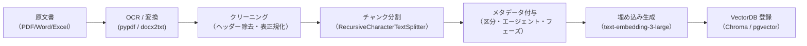

# 4. ナレッジベース構築

> 本章はすべてのエージェントの精度を左右する最重要工程である。  
> [設計書 11章のRAGスコープ設計](../rag-civil-engineering/11_rag_agent_scope.md)を参照し、  
> **エージェント別にナレッジベースを分割する**ことを原則とする。

## 4.1 文書分類とナレッジベース対応表

設計書 11章の①〜⑰区分に対応した登録先を決定する。

| ナレッジベース名 | 対応区分 | 参照エージェント |
|---|---|---|
| `kb-common-law` | ①法律 ②政令 ③府省令 | 全エージェント共通ベース |
| `kb-law-detail` | ④〜⑨（指針・省令詳細）⑪⑫ | 法令エージェント |
| `kb-procedure` | ⑨⑩（手続き系通達）⑪⑫ | 行政手続エージェント |
| `kb-technical` | ④⑩（技術系）⑬⑭⑰ | 技術基準エージェント |
| `kb-cases` | 施工報告書・トラブル記録・事例集 | 事例エージェント |
| `kb-risk` | ⑩（技術系）⑮⑯⑰ ＋ 事例文書 | リスクエージェント |

## 4.2 文書前処理パイプライン



### 4.2.1 チャンク設定（推奨値）

```python
from langchain_text_splitters import RecursiveCharacterTextSplitter

splitter = RecursiveCharacterTextSplitter(
    chunk_size=800,       # 日本語法令テキストは800字が目安
    chunk_overlap=150,    # 文脈保持のため約20%オーバーラップ
    separators=["\n\n", "\n", "。", "、", ""],
)
```

### 4.2.2 メタデータスキーマ

各チャンクに以下のメタデータを付与する。

```python
metadata = {
    "doc_id":       "河川法_2024改正",       # 文書識別子
    "category":     "①法律",                 # ①〜⑰区分
    "usage":        "law",                   # law / procedure / technical / estimation
    "phase":        ["plan", "design"],      # 適用フェーズ
    "agent":        ["law", "common"],       # 参照エージェント
    "last_updated": "2024-04-01",
    "source_url":   "https://elaws.e-gov.go.jp/...",
