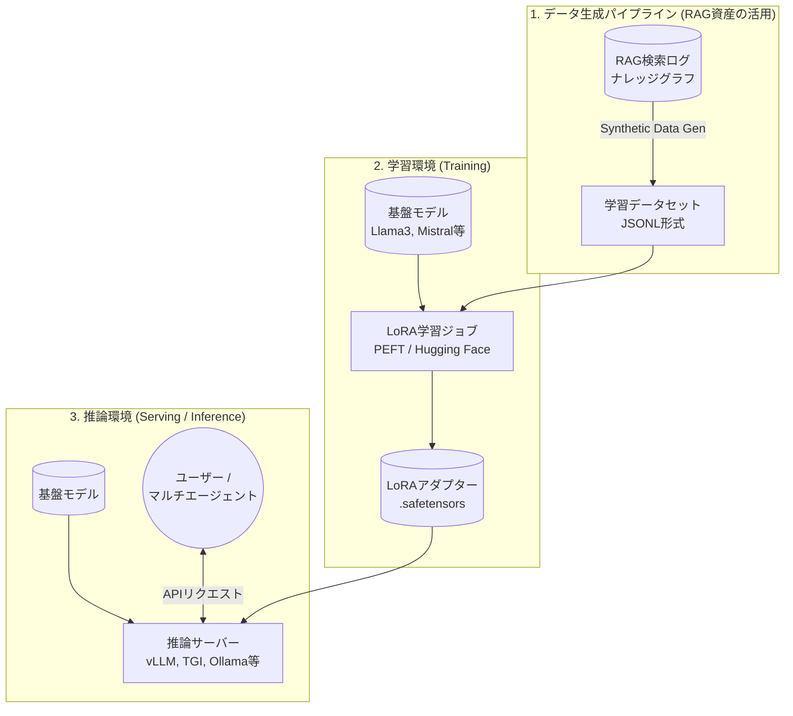

# 第5章 LoRAによる「背景知識」実装のシステムアーキテクチャ

第3章で述べたように、RAGの検索資産を活用してLLMに独自の「背景知識」を焼き付けるには、LoRA（Low-Rank Adaptation）等のファインチューニング技術への移行が不可欠です。本章では、RAGからLoRAへ学習データを流し込み、実際に推論システムとして稼働させるための**システムアーキテクチャ**と具体的な構成要素について解説します。

## 5.1 LoRA実装の全体アーキテクチャ

LoRAを用いたシステムは、大きく「データ生成パイプライン」「学習（Fine-Tuning）環境」「推論（Serving）環境」の3つのブロックで構成されます。

### 5.1.1 全体構成図（概念）



## 5.2 各構成要素の役割と技術スタック

### 5.2.1 データ生成パイプライン
既存のRAG資産（GraphRAGのグラフ、CogGRAGの推論ログなど）を、LLMが学習可能なフォーマット（主にJSONL形式のQ&AペアやCoTデータ）に変換するプロセスです。

*   **役割:** RAGの複雑な関係性を、一問一答形式やInstruction形式のテキストデータに変換する。
*   **技術スタック:** Python, Pandas, OpenAI API (GPT-4等を用いた合成データ生成), Argilla (データアノテーション・品質チェック)
*   **データの形:**
    ```json
    {"instruction": "法面工法Aの適用条件を説明して", "output": "法面工法Aは、地質がBの際に適用されます。ただし制約Cに注意が必要です。"}
    ```

### 5.2.2 学習環境 (Training)
数十GBある巨大な基盤モデル（Base Model）の重みは凍結し、ごくわずかなパラメータ（数MB〜数百MB）の「LoRAアダプター」のみを学習させる環境です。

*   **役割:** 用意したデータセットを用いて、計算資源（GPU）を効率的に使いながらLoRAアダプターを生成する。
*   **インフラ要件:** VRAMが豊富なGPU（NVIDIA A100, H100等）。ただし、LoRA/QLoRAを用いればコンシューマー向けGPU（RTX 4090等）でも学習可能な場合があります。
*   **技術スタック:**
    *   **フレームワーク:** Hugging Face `transformers`, `peft`, `trl` (Transformer Reinforcement Learning)
    *   **手軽なツール:** Unsloth (学習の高速化・省メモリ化), LLaMA-Factory (ノーコード/ローコードでの学習GUI)

### 5.2.3 推論環境 (Serving / Inference)
学習が完了した「LoRAアダプター」と、元の「基盤モデル」を合体させて、APIとしてユーザーやマルチエージェントに提供する環境です。

*   **役割:** 外部からのプロンプトを受け取り、基盤モデル＋LoRAの知識を使って高速に回答を生成する。
*   **アーキテクチャのポイント (Multi-LoRA):**
    最新の推論サーバーは、1つの中規模・大規模な基盤モデルをメモリに常駐させたまま、複数の軽量なLoRAアダプター（法務用、技術用など）を**同時に展開し、エージェントからのリクエストに応じて瞬時に付け替えて**推論する機能（Multi-LoRA Serving）を持っています。これにより、GPUメモリを節約しつつ、多数の専門家エージェントを同時に稼働させ、相互に連携・議論させることができます。
*   **技術スタック:**
    *   **vLLM:** 高速推論エンジン。Multi-LoRA (LoRAX) に強力に対応。
    *   **TGI (Text Generation Inference):** Hugging Face製。本番環境での安定性に優れる。
    *   **Ollama / LM Studio:** ローカルでの手軽な検証・実行環境。

## 5.3 RAGからLoRAへの継続的フィードバックループ

LoRAは一度学習して終わりではありません。日々追加される最新のドキュメントや、ユーザーの新たな質問に対応するため、**「RAGとLoRAのフライホイール（はずみ車）」**を回し続けるシステム構成が理想的です。

1.  **未知の質問:** ユーザーから新しい質問が来る。
2.  **RAGの出番:** LoRA（背景知識）にない最新情報のため、RAGが外部APIからドキュメントを検索し、回答を生成する。
3.  **ログの蓄積:** その「未知の質問」と「RAGが導き出した優れた回答」のペアをログとして保存する。
4.  **定期的なLoRA学習:** 蓄積されたログを定期的に（週次・月次など）バッチ処理で新しい学習データに変換し、LoRAアダプターを更新（差分学習）する。
5.  **背景知識化:** 次回以降、同じような質問が来た場合、RAGによる検索を待たずとも、更新されたLoRAが自身の背景知識として即座に回答できるようになる。

## 5.4 まとめ：LoRAインフラの構築がもたらすもの

LoRAを用いたシステム構成は、単にモデルをローカルで動かすだけでなく、データパイプラインから学習、推論サーバーまでのインフラ構築を伴います。

この環境が整うことで、RAGが拾い集めた「その場限りの情報」は、LoRAの定期学習を通じて自社モデルの「揺るぎない背景知識」へと結晶化していきます。次章では、このLoRA基盤の上に構築される、複数の専門家AIを協調させる「マルチエージェント」の実装について見ていきます。