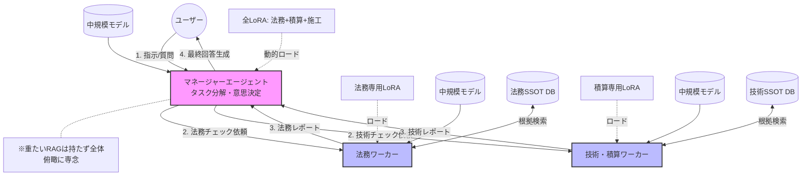

# 第6章 システム構成と公開・運用アーキテクチャ

## 6.1 概要

本書で構築する AutoGen アプリは **Azure Container Apps + Microsoft Entra ID（旧 Azure AD）** の組み合わせで、  
**インターネット経由・VPN不要・組織アカウント限定**での公開が可能である。

```
社外ネットワーク（自宅・出先・スマホ等）
  │
  │ HTTPS
  ▼
Azure Container Apps
  ├─ Easy Auth（組み込み認証）
  │    └─ Microsoftログイン画面にリダイレクト
  │         └─ Microsoft Entra ID で認証
  │              ├─ 認証成功 → AutoGen アプリへ到達 ✅
  │              └─ 認証失敗（未ログイン・別テナント） → 403 ❌
  │
  └─ AutoGen API（FastAPI / AutoGen Studio）
       └─ Azure OpenAI / OpenAI API（LLM推論）
```

## 6.2 構成コンポーネント

| コンポーネント | 役割 | 備考 |
|---|---|---|
| **Azure Container Apps** | AutoGen アプリのホスティング | スケールアウト対応・HTTPS自動付与 |
| **Azure Container Registry（ACR）** | Dockerイメージの保管 | Container Apps と同一RGに配置推奨 |
| **Microsoft Entra ID** | ユーザー認証・アクセス制御 | M365テナントをそのまま流用可 |
| **Easy Auth（組み込み認証）** | Entra ID との認証連携 | アプリコード変更不要 |
| **Azure OpenAI Service** | LLM推論エンドポイント | APIキー管理はKey Vault推奨 |

## 6.3 アクセス制御の粒度

| レベル | 設定箇所 | 効果 |
|---|---|---|
| **テナント全体（社員全員）** | Entra ID アプリ登録 → アカウント種別を「単一テナント」 | 組織メンバー全員がアクセス可 |
| **特定グループのみ** | エンタープライズアプリ → 「割り当て必須」ON → グループ追加 | 指定グループ外は弾く |
| **ロールベース（閲覧/管理）** | アプリロールを定義 → RBAC で割り当て | 権限レベルで機能を分岐 |

## 6.4 デプロイ手順（概要）

```bash
# 1. コンテナイメージをビルドして ACR へプッシュ
az acr build --registry <ACR名> --image myautogen:latest .

# 2. Container Apps を作成（外部公開・ポート8000）
az containerapp create \
  --name my-autogen-app \
  --resource-group <RG名> \
  --image <ACR名>.azurecr.io/myautogen:latest \
  --ingress external --target-port 8000

# 3. Entra ID 認証（Easy Auth）を有効化
az containerapp auth microsoft update \
  --name my-autogen-app \
  --resource-group <RG名> \
  --client-id <アプリ登録のクライアントID> \
  --client-secret <シークレット> \
  --tenant-id <テナントID>
```

> **前提条件**  
> - Azure サブスクリプションと M365（Entra ID）テナントが紐づいていること  
> - Azure CLI がインストール済みで `az login` 済みであること  
> - Entra ID でアプリ登録（App Registration）を事前に作成し、クライアントIDとシークレットを取得していること

## 6.5 開発・運用サイクル

本書の想定する開発から運用までのライフサイクルを以下に示す。

```
【開発】ローカル PC（デスクトップ）
  ├─ python main.py でエージェント動作確認
  ├─ プロンプト・ナレッジ・ツール設定を修正
  └─ git commit / git push → GitHub リポジトリ
          │
          │ CI/CD（GitHub Actions 等）
          ▼
【ビルド】Docker コンテナ化
  └─ az acr build → Azure Container Registry にイメージ登録
          │
          ▼
【公開】Azure Container Apps
  ├─ Entra ID 認証で組織内ユーザーに限定公開
  ├─ HTTPS エンドポイントを共有 → チームが利用開始
  └─ ログ・メトリクスを Azure Monitor で確認
          │
          │ 改善サイクル
          ▼
【改善】ローカルで修正 → push → 自動ビルド・再デプロイ
```

| フェーズ | 環境 | 主な作業 | 担当者 |
|---|---|---|---|
| **開発** | ローカル PC | エージェント実装・プロンプト調整・単体テスト | バックエンドエンジニア |
| **PoC公開** | Azure Container Apps | チームへの共有・受入テスト実施 | AI導入担当者 |
| **本番移行** | Azure Container Apps | アクセス制御・監視設定・SLA策定 | 運用担当者 |
| **継続改善** | ローカル → Azure | KPIモニタリング・精度改善・新機能追加 | 全担当者 |

> **ローカルと Azure の環境差異を最小化するポイント**  
> - 環境変数（APIキー・エンドポイント）は `.env` ファイルと Azure の「シークレット」で統一管理  
> - `requirements.txt` でライブラリバージョンを固定し、ローカルと Docker イメージを同一にする  
> - `docker run` でローカルからもコンテナ動作を検証できる構成にすることで、「ローカルでは動くがAzureで動かない」を防ぐ

## 6.6 Azure Container Apps で動かせるアプリの範囲

Azure Container Apps は **「Dockerコンテナが動く場所」** であり、AutoGen に限らずコンテナ化できるアプリであれば言語・フレームワークを問わず動作する。

| アプリ種別 | 動作 | 備考 |
|---|:---:|---|
| AutoGen（本書のメイン） | ✅ | ヘッドレス実行・FastAPI経由でWebUI公開 |
| FastAPI / Flask / Django | ✅ | WebサーバーとしてHTTPS公開 |
| LangGraph / CrewAI 等 | ✅ | 本書の他フレームワークも同様にデプロイ可 |
| Node.js / Go / Java 等 | ✅ | 言語不問・Dockerfile があれば動く |
| AutoGen Studio（Web UI） | ✅ | `autogenstudio ui` をコンテナ化して公開 |
| GUIアプリ（tkinter 等） | ❌ | サーバー側に画面がないため不可 |
| `C:\Users\...` 依存の処理 | ❌ | Windowsローカルパスはコンテナ内に存在しない |
| Windows専用DLL依存アプリ | ❌ | コンテナはLinuxベースが標準のため |

> **結論：「ヘッドレス（画面なし）で動くPythonアプリ」はそのままAzureへ持っていける。**  
> デスクトップで `python main.py` が動く構成であれば、`Dockerfile` を1枚追加するだけで Azure Container Apps にデプロイできる。

## 6.7 Docker を使わない場合の代替サービス

`Dockerfile` を書かずに Python アプリを Azure で公開したい場合は、**Azure App Service** が最も手軽な選択肢となる。

| サービス | Docker不要 | 向いているケース | Entra ID認証 |
|---|:---:|---|:---:|
| **Azure App Service** | ✅ | WebアプリをZIPまたはGitで直接デプロイ | ✅（Easy Auth） |
| **Azure Functions** | ✅ | イベント駆動・バッチ処理・API単体公開 | ✅ |
| **Azure Container Apps** | ❌（要Docker） | コンテナ化済みアプリの本番運用 | ✅（Easy Auth） |

**Azure App Service でのデプロイ（Docker不要）:**

```bash
# requirements.txt と main.py があればそのままデプロイできる
az webapp up \
  --name my-autogen-app \
  --resource-group <RG名> \
  --runtime "PYTHON:3.11" \
  --sku B1
```

> **App Service の制約**  
> - 常駐プロセス（長時間実行エージェント）は `B1` 以上のプランが必要  
> - AutoGen のような非同期・長時間タスクは **タイムアウト設定（230秒制限）** に注意  
> - 長時間実行が必要な場合は Azure Container Apps または Azure Functions（Durable Functions）を推奨

## 6.8 Windows EXE（コマンドライン）をAzureで動かす方法

デスクトップで動く `.exe` ファイルをAzure上で実行し、結果を取得したい場合の選択肢を示す。

| 方法 | 概要 | 向いているケース |
|---|---|---|
| **① App Service（Windowsプラン）+ subprocess** | Python から `subprocess.run("tool.exe")` で呼び出す。EXEをアプリと一緒にデプロイ | Webトリガーで単発実行・結果をAPIで返す |
| **② Azure VM（Windows）** | WindowsのVMをそのまま立ててEXEを常駐 | 既存の複雑なEXE・DLL依存・GUI補助ツール |
| **③ Azure Batch** | 大量ジョブをバッチ実行し結果をストレージに保存 | 定期バッチ・並列処理・大量ファイル変換 |
| **④ ローカル実行＋結果アップロード** | EXEはデスクトップで動かし、結果ファイルだけAzureに送る | EXEの移植が難しい場合の最小構成 |

**① App Service（Windowsプラン）でのEXE呼び出し例（Python）:**

```python
import subprocess
from fastapi import FastAPI

app = FastAPI()

@app.post("/run")
def run_tool(input: str):
    result = subprocess.run(
        ["mytool.exe", "--input", input],
        capture_output=True, text=True, timeout=60
    )
    return {"stdout": result.stdout, "returncode": result.returncode}
```

```bash
# Windows プランで App Service を作成（EXEが動くWindows環境）
az webapp up \
  --name my-tool-app \
  --resource-group <RG名> \
  --runtime "PYTHON:3.11" \
  --os-type Windows \
  --sku B1
```

**④ ローカル実行＋結果アップロード（最小構成）:**

```python
import subprocess, json
from azure.storage.blob import BlobServiceClient

# EXE をローカルで実行
result = subprocess.run(["mytool.exe", "--input", "data.csv"],
                        capture_output=True, text=True)

# 結果を Azure Blob Storage にアップロード
client = BlobServiceClient.from_connection_string("<接続文字列>")
client.get_blob_client("results", "output.json").upload_blob(
    json.dumps({"output": result.stdout}), overwrite=True
)
```

> **EXEをAzureで動かす際の注意点**  
> - Linux系（Container Apps / App Service Linux）では `.exe` は動かない → **Windows プランまたはVM必須**  
> - EXEが他のDLLや外部ツールに依存する場合は、依存ファイルも一緒にデプロイすること  
> - Entra ID 認証は方法①②③いずれでも Easy Auth または Azure AD で設定可能

## 6.9 Azure VM ベースの AutoGen 公開構成（推奨構成）

**Azure VM + Azure AD Application Proxy** の組み合わせは、  
Docker不要・EXEも動く・Entra ID認証付き という3条件を満たす構成として実用性が高い。

```
インターネット上のユーザー
  │ HTTPS
  ▼
Microsoft Entra ID（認証）
  │ 認証成功後
  ▼
Azure AD Application Proxy（中継・Entra ID認証ゲートウェイ）
  │ 内部転送（VMに公開IPなし）
  ▼
Azure VM（Windows / Linux）
  ├─ AutoGen API（FastAPI: python main.py）
  ├─ AutoGen Studio（autogenstudio ui）
  └─ Windows EXE ツール群（必要に応じて subprocess で呼び出し）
       └─ Azure OpenAI API（LLM推論）
```

**この構成の利点:**

| 項目 | 内容 |
|---|---|
| **Docker不要** | VMに直接 Python + AutoGen をインストール |
| **Windows EXE対応** | VM上でそのまま `.exe` が動く |
| **公開IPなし** | VMにパブリックIPを付けずに済む（セキュリティ高） |
| **Entra ID認証** | Application Proxy が認証ゲートウェイとして機能 |
| **VPN不要** | インターネットからEntra IDでアクセス可能 |

**セットアップ手順（概要）:**

```bash
# ① Azure VM を作成（Linux推奨・Windowsも可）
az vm create \
  --name autogen-vm \
  --resource-group <RG名> \
  --image Ubuntu2204 \
  --size Standard_B2s \
  --admin-username azureuser \
  --generate-ssh-keys

# ② VM上にAutoGenをインストール（SSHで接続後）
pip install autogen-agentchat autogen-ext fastapi uvicorn

# ③ AutoGen APIをサービスとして起動（systemd）
# /etc/systemd/system/autogen.service に登録して常駐化
uvicorn main:app --host 127.0.0.1 --port 8000

# ④ Azure AD Application Proxy コネクタをVM上にインストール
#    → Azure Portal: Entra ID > アプリケーション プロキシ > コネクタのダウンロード
#    → コネクタがVM内からAzureへのアウトバウンド接続を確立（インバウンド開放不要）

# ⑤ Application Proxy でアプリを公開
#    → Azure Portal: Entra ID > エンタープライズアプリケーション > 新しいアプリ
#    → 内部URL: http://127.0.0.1:8000
#    → 外部URL: https://autogen-app.msappproxy.net（自動発行）
#    → 事前認証: Microsoft Entra ID
```

> **Application Proxy の動作原理**  
> VMからAzureへのアウトバウンド接続（ポート80/443）のみで動作するため、  
> **VMのNSGでインバウンドを完全に閉じたまま**インターネット公開できる。  
> これはContainer Appsのインバウンド公開より安全な構成となる。

> **運用コスト目安（2026年時点）**  
> Standard_B2s（2vCPU/4GB）: 約 ¥6,000〜8,000／月  
> Application Proxy: Entra ID P1 ライセンスが必要（M365 Business Premium に含まれる場合あり）

## 6.10 閉鎖環境（オンプレミス・LAN内）でのOSSマルチエージェント構築

クラウド（Azure OpenAIなど）を利用せず、情報漏洩リスクを極限まで排除したい要件（行政、インフラ、防衛、機密R&Dなど）においては、外部インターネットと通信しない**完全閉鎖のLAN環境（オンプレミス）**での構築が求められる。

近年、Llama 3系やQwen、国内のELYZAなどのオープンソースLLM（OSS LLM）の性能が飛躍的に向上したこと、およびOllamaやvLLMなどの推論エンジンの進化により、閉鎖環境でも実用的なRAG・マルチエージェントシステムを構築することが十分に可能となっている。

### 6.10.1 閉鎖環境における技術スタック（クラウドとの対比）

クラウド依存のサービスを、ローカルで動作するOSSソフトウェアに置き換える。

| 役割 | クラウド構成（参考） | 閉鎖環境（オンプレミス）での推奨スタック | 備考 |
|---|---|---|---|
| **推論エンジン（API）** | Azure OpenAI | **Ollama** または **vLLM** | Ollamaは導入とモデル管理が容易。vLLMは複数同時リクエストの高速処理（本番運用向け）と、**後述するMulti-LoRA（複数LoRAの同時運用）**に優れる。どちらもOpenAI互換APIを提供するため、AutoGen等のコード変更を最小限に抑えられる。 |
| **LLMモデル（生成用）** | GPT-4o / Claude 3.5 | **Llama 3.1**, **Qwen 2.5**, **ELYZA** 等 | ハードウェア（VRAM容量）に合わせて、軽量な8Bクラスから高精度な70Bクラスまで選択する。 |
| **埋め込みモデル（検索用）** | text-embedding-3 | **multilingual-e5-large**, **BGE-M3** 等 | 日本語に強いOSSの埋め込みモデルをローカルで動かし、ベクトル化を行う。 |
| **ベクトルDB** | Azure AI Search | **Qdrant**, **Chroma**, **Milvus** | いずれもDockerコンテナとしてローカル環境にデプロイ可能。完全オフラインで動作する。 |
| **オーケストレーター** | Azure AI Foundry等 | **Dify (セルフホスト版)** または **AutoGen / LangGraph** | DifyはDocker Composeで社内サーバーに展開可。AutoGen/LangGraphはローカルのPython環境でそのまま動作する。 |
| **UI（フロントエンド）** | Copilot Studio等 | **Open WebUI** または **Dify標準UI** | Open WebUIはOllamaとの親和性が非常に高く、ChatGPTライクなUIを社内に提供できる。 |

### 6.10.2 代表的な2つの構築パターン

**パターンA：ローコード・早期展開（Difyセルフホスト）**
- **構成:** Dify (Docker) ＋ Ollama ＋ ローカルLLM
- **特徴:** DifyのGUIを用いて、RAGのナレッジ登録やエージェントフローを直感的に構築できる。すべてのコンポーネントがDockerコンテナ内で完結するため、必要なDockerイメージとモデルファイル（`.gguf`等）をLAN内に持ち込めば、完全にオフラインで動作する。

**パターンB：高度なマルチエージェント開発（Pythonコードベース）**
- **構成:** AutoGen / LangGraph ＋ vLLM (OpenAI互換API) ＋ Qdrant (ベクトルDB)
- **特徴:** エンジニアがコードで厳密なマルチエージェントを制御する。vLLMが「ローカルのOpenAI APIサーバー」として振る舞うため、AutoGen側のコードはクラウドを使う場合とほぼ同じ（エンドポイントURLを `http://localhost:8000/v1` のように変更するだけ）で機能する。

### 6.10.3 閉鎖環境構築におけるハードルと運用上の注意点

1. **ハードウェア（GPU）の調達とサイジング**
   高度な推論を実用的な速度で行うには、GPUを搭載したローカルサーバーが必須となる。
   - **8Bクラス（軽量・高速）:** VRAM 16GB〜24GB（RTX 4090等のコンシューマGPUでも可）
   - **70Bクラス（高精度・複雑な推論）:** VRAM 80GB以上（NVIDIA A100/H100や、複数GPUの連結が必要）
   マルチエージェント環境では複数モデルを同時に動かす、あるいは大量のコンテキスト（RAGソース）を入力するため、VRAMの余裕を持ったサイジングが重要である。

2. **オフライン環境への「データ移送」（エアギャップ対策）**
   外部と遮断されているため、構築やアップデートのたびに以下のデータをインターネット接続環境でダウンロードし、セキュアな手段（暗号化USBメモリ等）で閉鎖環境へ物理的に移送する作業が発生する。
   - ソフトウェアのインストールパッケージ（Dockerイメージ、Pythonの `pip` パッケージ一式 `*.whl`）
   - LLMモデルのファイル（`.gguf` や `.safetensors`）
   - ※依存関係のあるライブラリを全てオフラインでインストールするためのリポジトリミラーリング等、インフラ運用面の工夫が必要となる。

### 6.10.4 閉鎖環境とLoRA（背景知識）の完全統合

第5章で解説した「LoRAによる背景知識の実装」は、実は**完全閉鎖のOSS環境においてこそ最大の価値を発揮する**。

外部のクラウドAPI（Azure OpenAI等）を使用する場合、自社の機密データを含んだ学習データをクラウド側のファインチューニングサービスにアップロードする必要がある。しかし、閉鎖環境のローカルサーバーであれば、**学習データの生成（GraphRAG等の活用）から、LoRAアダプターの学習（Training）、そして実運用での推論（Serving）に至るまで、機密データを外部に一切出さずに完結できる**。

また、閉鎖環境でのマルチエージェント運用において、LoRAは以下のような技術アーキテクチャで組み込まれる：

**【図解】中規模モデル＋Multi-LoRAによる非対称マルチエージェント構成（完成形）**



1. **Multi-LoRA Serving（vLLMの活用）**
   - マルチエージェントでは、「法務エージェント」「技術エージェント」など複数の専門家が同時に稼働する。
   - すべてのエージェントごとに巨大な基盤モデル（数十GB）をメモリ（VRAM）にロードすると、ハードウェアコストが膨大になる。
   - `vLLM` 等の最新推論サーバーは **Multi-LoRA（動的アダプター切り替え）** に対応している。巨大な基盤モデル（例：Llama 3.1 70B）をVRAM上に1つだけ常駐させ、リクエストが来たエージェントに応じて、超軽量な「法務用LoRA（数MB）」や「技術用LoRA」を一瞬で適用して推論を行うことができる。
   - これにより、限られたGPU資源で多数の専門家AI（マルチエージェント）をオンプレミスで効率的に稼働させることが可能となる。

**なぜ「巨大な単一モデル」ではなく「中規模モデル＋複数LoRAの同時・動的切り替え」が良いのか？**

ここでのポイントは、エージェントを構成するモデルを「巨大な汎用モデル（例: 400Bクラス）」にするのではなく、**「取り回しの良い中規模モデル（例: 8B〜70Bクラス）＋ 特定業務に特化した複数LoRAの同時展開」**にするという点である。

実際の業務（例えば「土木事業管理」という1つのドメイン）においては、エージェントの単位が細分化され、「法務確認」「積算チェック」「施工計画レビュー」など複数の専門エージェントが同時に稼働することが想定される。これらは独立しているようでいて、常に1つの業務プロセスとして深く関連づいている。この状況下において、中規模モデル＋Multi-LoRAのアーキテクチャが真価を発揮する。

* **専門性の混線（カタストロフィック・フォーゲッティング）の回避:** 1つのモデルに「法務」も「積算」もすべて学習させようとすると、異なる知識が混線し、一方を学ぶともう一方の精度が劣化する現象（破局的忘却）が起きる。ドメイン内の細分化された業務ごとにLoRAを物理的に分けることで、各専門知識の「純度」を極めて高く保つことができる。
* **役割の分離と制御（マルチエージェントの前提）:** マルチエージェントアーキテクチャでは、「法務の観点で厳しくチェックするAI」と「現場の視点で実現性を提案するAI」を意図的に対立・議論させることで精度を高める。同じ脳みそ（単一の巨大モデル）では、プロンプトで役割を分けても内部で知識が干渉し、自己矛盾を起こしやすい。ベースモデルが同じであっても、LoRAアダプターを明確に切り替える（あるいは同時に複数立ち上げる）ことで、**完全に思考回路が分断された「別の専門家」として振る舞わせる**ことが可能になる。

**オーケストレーターと専門エージェントの役割分担の最適解**

上記の構成を踏まえると、マルチエージェント全体を指揮する「総指揮者（オーケストレーター）」と、実務を担う「専門エージェント」とで、LoRAとRAGの持たせ方を変えるのが実践的である。

* **総指揮者（マネージャーエージェント）の構成：【全ガジェット付き ＋ RAGなし】**
  * 役割は「ユーザーの指示を理解し、タスクを分解し、専門エージェントの意見を統合・調停すること」である。
  * したがって、重たい外部文書の検索（RAG）は自ら行わず、**「法務・積算・施工」等の複数のLoRAガジェットを（浅く）同時に読み込んだ状態**で待機する。これにより、各専門領域の"基礎的な背景知識"を持った「現場監督」として、専門エージェントからの専門的な回答を素早く理解し、矛盾を指摘したり、全体を俯瞰した意思決定を下すことに専念できる。
* **専門エージェント（ワーカーエージェント）の構成：【特化型ガジェット ＋ SSOT専用RAG】**
  * 役割は「与えられた特定タスクに対して、根拠（SSOT）に基づいた確実な答えを出すこと」である。
  * 法務エージェントであれば「法務用LoRA」のみを深く被り、さらに**法務関連の規程や最新法令だけを検索する「SSOT専用RAG」**を武器として持つ。自らの専門背景知識（LoRA）を使って、RAGが検索してきたマニュアル（SSOT）を読み解き、精緻なレポートを総指揮者に返す。

この「総指揮者は広い背景知識で判断」「専門家は深い背景知識とRAGで根拠探索」という非対称な構成こそが、中規模モデル＋Multi-LoRA時代における最も洗練されたマルチエージェント・アーキテクチャである。

* **関連業務の同時並行処理とリソースの極限効率化:** オンプレミスのVRAMは非常に高価である。巨大な単一モデル（例えば数百Bクラス）を動かすには莫大なリソースが必要であり、かといって70Bクラスのモデルをエージェントの数だけ独立して起動することも現実的ではない。
  しかし、Multi-LoRA（vLLM等）であれば、**「ベースモデル1つ（約40GB）＋ 各専門LoRA数十個（数MB×数十）」**という構成で済む。これにより、限られた1台のGPUサーバーの中で、深く関連づいた複数の専門エージェント（法務、積算、施工等）を**同時に、かつ一瞬で切り替えながら**稼働させ、リアルタイムに議論させることが可能となる。まさに「一つのドメイン内で細分化された多数の専門家チーム」を、最小のハードウェアで実現する最適解である。

2. **継続的学習ループのセキュアな運用**
   - LAN内のユーザーが利用したRAGの検索ログや、マルチエージェントの推論ログは、外部に漏れる心配がない。
   - これら安全に蓄積された社内ログをそのまま良質な教師データとして定期的に再学習（Continuous Pre-training / LoRA）に回すことで、外部ネットワークから切り離された環境でありながら、AIモデルを日々「自社専用の専門家」として賢く育て続けることができる。

   **【具体的な継続的学習（データフライホイール）の仕組み】**
   閉鎖環境における継続的学習は、単なる手作業の学習ではなく、以下のような自動化されたパイプライン（システム）として構築される。このループは、後述する**4つの高度なRAG技術（GraphRAG / VectorRAG / オントロジー / CogGRAG）が生み出した成果物を、そのまま次の学習データ（AIの血肉）へと変換・循環させるエンジン**として機能する。

   * **① ログの収集と評価（AI as a Judge）**
     ユーザーが入力した質問、RAGが検索したSSOT文書、エージェントが出力した回答、およびユーザーの評価（Good/Bad）をローカルデータベースに蓄積する。さらに、夜間バッチ等で「評価専用エージェント」を稼働させ、蓄積されたログの中から「根拠と回答の論理が正しく通っている高品質なやり取り」だけを自動採点・抽出する。
   * **② 学習データ（JSONL）への自動整形（4つのRAG資産の変換）**
     抽出された高品質なログ（特に、エージェント同士が議論・推論したプロセス）を、LoRAが学習できる形式（Instruction / Input / Output のペア）に自動変換する。ここで、**4つのRAG技術がそれぞれ特有の「教師データ」を生み出す**。
     - *GraphRAGのログ* → 複雑な法令の「因果関係・論理ステップ」のデータへ
     - *VectorRAGのログ* → 現場の「優先順位・価値観（DPO用）」のデータへ
     - *オントロジーのログ* → 社内標準の「専門用語・語彙」のデータへ
     - *CogGRAGのログ* → 未知の問題に対する「タスク分解・思考プロセス（CoT）」のデータへ
     これにより、「プロの専門家がどのように法令と現場状況を照らし合わせて結論を出したか」という思考のプロセス自体が教師データ化される。
   * **③ ローカルGPUでの定期学習（Unsloth / LLaMA-Factory 等の活用）**
     週末の夜間などに、ローカルのGPUリソースを使って溜まったJSONLデータから自動でLoRAの追加学習（ファインチューニング）を回す。最新のOSSツール（Unsloth等）を使えば、限られたVRAMでも高速に学習が可能である。
   * **④ 無停止でのモデル更新（Hot Swap）**
     学習が完了した新しいLoRAアダプター（数MB）は、月曜の朝までにvLLM等の推論サーバーにロードされる。Multi-LoRAの機能を使えば、数十GBのベースモデルを再起動（システム停止）することなく、新しいLoRAアダプターだけを動的に差し替える（Hot Swap）ことができるため、ユーザーはダウンタイムなしで「先週の未回答問題と新しい推論パターンを学習して賢くなったAI」を利用開始できる。

**継続的学習と4つの高度なRAG技術のシナジー（学習循環エコシステム）**

前項の通り、この閉鎖環境における継続的学習ループは、第3章で解説した「4つの高度なRAG技術」と組み合わせることで、単なる「よくある質問の暗記」を超えた、真の「専門的思考プロセスの獲得（循環）」へと昇華される。

*   **GraphRAG（関係性の学習）:**
    日々の業務でGraphRAGが複数文書から「AだからB、かつCの例外あり」という複雑な関連性を抽出して回答したログは、そのまま**「関係性を正しく辿るためのCoT（思考の連鎖）データ」**としてLoRAに学習される。これにより、モデルは推論時にグラフ検索を待たずとも、業務ドメイン特有の論理構造を背景知識として「直感的に」理解できるようになる。
*   **VectorRAG（価値基準の学習）:**
    VectorRAGが拾い上げた膨大な類似事例の中から、ユーザーや評価エージェント（AI as a Judge）が「正解」として選んだ情報をポジティブデータ、「ノイズ」として弾いた情報をネガティブデータとして蓄積する。これをDPO (Direct Preference Optimization) 等で学習させることで、モデルは「この現場の文脈では、どちらの事例を優先すべきか」という**自社特有の価値観や暗黙のルール**を獲得する。
*   **ドメインオントロジー（基礎語彙の定着）:**
    検索時にドメインオントロジーを用いて正規化された「正しい専門用語」のやり取りがログとして蓄積・再学習されるため、モデル自身の「基礎語彙」が自社標準にチューニングされる。結果として、揺れのある質問に対しても、モデル自身が息を吸うように公式な社内用語を用いて出力するようになる。
*   **CogGRAG（問題分解スキルの獲得）:**
    CogGRAGが行う「複雑な質問をサブクエリに分解して順序立てて解く」という実行プロセス自体が、最高品質のインストラクション（Instruction）データとなる。これをLoRAで継続学習することで、モデルは単なる知識の蓄積ではなく、**「未知の複雑な問題に出会ったときに、プロとしてどのように問題を切り分けて考えるか」という思考の型（タスク分解能力）**を身につける。

このように、4つのRAG技術は「精度の高い検索結果を返すツール」であると同時に、閉鎖環境の継続的学習においては**「モデルの専門性を高め続けるための、最高品質の教師データ生成エンジン」**として機能するのである。

