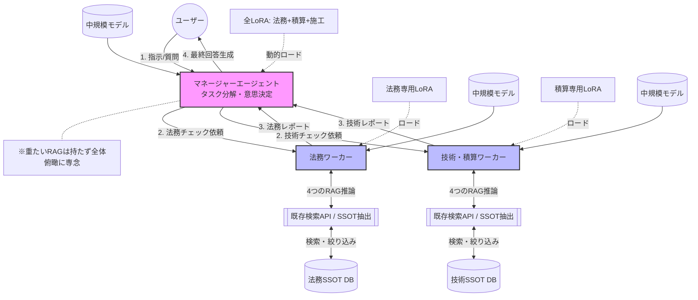
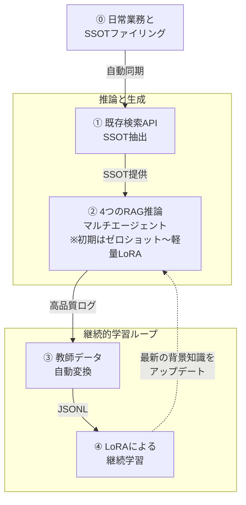

# 第7章 閉鎖環境におけるLoRAとSSOTの完全統合（継続的学習システム）

第5章で解説した「LoRAによる背景知識の実装」は、実は**完全閉鎖のOSS環境においてこそ最大の価値を発揮する**。

外部のクラウドAPI（Azure OpenAI等）を使用する場合、自社の機密データを含んだ学習データをクラウド側のファインチューニングサービスにアップロードする必要がある。しかし、閉鎖環境のローカルサーバーであれば、**学習データの生成（GraphRAG等の活用）から、LoRAアダプターの学習（Training）、そして実運用での推論（Serving）に至るまで、機密データを外部に一切出さずに完結できる**。

また、閉鎖環境でのマルチエージェント運用において、LoRAは以下のような技術アーキテクチャで組み込まれる：

**【図解】中規模モデル＋Multi-LoRAによる非対称マルチエージェント構成（完成形）**

## 7.1 Multi-LoRA Serving（vLLMの活用）
   - マルチエージェントでは、「法務エージェント」「技術エージェント」など複数の専門家が同時に稼働する。
   - すべてのエージェントごとに巨大な基盤モデル（数十GB）をメモリ（VRAM）にロードすると、ハードウェアコストが膨大になる。
   - `vLLM` 等の最新推論サーバーは **Multi-LoRA（動的アダプター切り替え）** に対応している。巨大な基盤モデル（例：Llama 3.1 70B）をVRAM上に1つだけ常駐させ、リクエストが来たエージェントに応じて、超軽量な「法務用LoRA（数MB）」や「技術用LoRA」を一瞬で適用して推論を行うことができる。
   - これにより、限られたGPU資源で多数の専門家AI（マルチエージェント）をオンプレミスで効率的に稼働させることが可能となる。

### 7.1.1 なぜ「巨大な単一モデル」ではなく「中規模モデル＋複数LoRAの同時・動的切り替え」が良いのか？

ここでのポイントは、エージェントを構成するモデルを「巨大な汎用モデル（例: 400Bクラス）」にするのではなく、**「取り回しの良い中規模モデル（例: 8B〜70Bクラス）＋ 特定業務に特化した複数LoRAの同時展開」**にするという点である。

実際の業務（例えば「土木事業管理」という1つのドメイン）においては、エージェントの単位が細分化され、「法務確認」「積算チェック」「施工計画レビュー」など複数の専門エージェントが同時に稼働することが想定される。これらは独立しているようでいて、常に1つの業務プロセスとして深く関連づいている。この状況下において、中規模モデル＋Multi-LoRAのアーキテクチャが真価を発揮する。

* **専門性の混線（カタストロフィック・フォーゲッティング）の回避:** 1つのモデルに「法務」も「積算」もすべて学習させようとすると、異なる知識が混線し、後から学んだ知識の重みが大きくなりすぎて過去の知識の精度が劣化する現象（破局的忘却）が起きる。特に同一ドメイン（例：土木事業）の中で継続学習を繰り返す場合、**「直近のプロジェクトのルール（後学習）」ばかりに過適合してしまい、基本的な汎用ルールを忘れてしまうリスクが高い**。ドメイン内の細分化された業務ごと、あるいはプロジェクトごとにLoRAを物理的に分けることで、後学習による重みの上書きを防ぎ、各専門知識の「純度」を極めて高く保つことができる。
* **役割の分離と制御（マルチエージェントの前提）:** マルチエージェントアーキテクチャでは、「法務の観点で厳しくチェックするAI」と「現場の視点で実現性を提案するAI」を意図的に対立・議論させることで精度を高める。同じ脳みそ（単一の巨大モデル）では、プロンプトで役割を分けても内部で知識が干渉し、自己矛盾を起こしやすい。ベースモデルが同じであっても、LoRAアダプターを明確に切り替える（あるいは同時に複数立ち上げる）ことで、**完全に思考回路が分断された「別の専門家」として振る舞わせる**ことが可能になる。

### 7.1.2 オーケストレーターと専門エージェントの役割分担の最適解

上記の構成を踏まえると、マルチエージェント全体を指揮する「総指揮者（オーケストレーター）」と、実務を担う「専門エージェント」とで、LoRAとRAGの持たせ方を変えるのが実践的である。

* **総指揮者（マネージャーエージェント）の構成：【全ガジェット付き ＋ RAGなし】**
  * 役割は「ユーザーの指示を理解し、タスクを分解し、専門エージェントの意見を統合・調停すること」である。
  * したがって、重たい外部文書の検索（RAG）は自ら行わず、**「法務・積算・施工」等の複数のLoRAガジェットを（浅く）同時に読み込んだ状態**で待機する。これにより、各専門領域の"基礎的な背景知識"を持った「現場監督」として、専門エージェントからの専門的な回答を素早く理解し、矛盾を指摘したり、全体を俯瞰した意思決定を下すことに専念できる。
* **専門エージェント（ワーカーエージェント）の構成：【特化型ガジェット ＋ SSOT専用RAG】**
  * 役割は「与えられた特定タスクに対して、根拠（SSOT）に基づいた確実な答えを出すこと」である。
  * 法務エージェントであれば「法務用LoRA」のみを深く被り、さらに**法務関連の規程や最新法令だけを検索する「SSOT専用RAG」**を武器として持つ。自らの専門背景知識（LoRA）を使って、RAGが検索してきたマニュアル（SSOT）を読み解き、精緻なレポートを総指揮者に返す。

この「総指揮者は広い背景知識で判断」「専門家は深い背景知識とRAGで根拠探索」という非対称な構成こそが、中規模モデル＋Multi-LoRA時代における最も洗練されたマルチエージェント・アーキテクチャである。

* **関連業務の同時並行処理とリソースの極限効率化:** オンプレミスのVRAMは非常に高価である。巨大な単一モデル（例えば数百Bクラス）を動かすには莫大なリソースが必要であり、かといって70Bクラスのモデルをエージェントの数だけ独立して起動することも現実的ではない。
  しかし、Multi-LoRA（vLLM等）であれば、**「ベースモデル1つ（約40GB）＋ 各専門LoRA数十個（数MB×数十）」**という構成で済む。これにより、限られた1台のGPUサーバーの中で、深く関連づいた複数の専門エージェント（法務、積算、施工等）を**同時に、かつ一瞬で切り替えながら**稼働させ、リアルタイムに議論させることが可能となる。まさに「一つのドメイン内で細分化された多数の専門家チーム」を、最小のハードウェアで実現する最適解である。

## 7.2 継続的学習ループのセキュアな運用
   - LAN内のユーザーが利用したRAGの検索ログや、マルチエージェントの推論ログは、外部に漏れる心配がない。
   - これら安全に蓄積された社内ログをそのまま良質な教師データとして定期的に再学習（Continuous Pre-training / LoRA）に回すことで、外部ネットワークから切り離された環境でありながら、AIモデルを日々「自社専用の専門家」として賢く育て続けることができる。

### 7.2.1 具体的な継続的学習（データフライホイール）の仕組み

   閉鎖環境における継続的学習は、単なる手作業の学習ではなく、以下のような自動化されたパイプライン（システム）として構築される。このループは、**「日常業務からの自動RAG構築とSSOTルール」→「既存システムによるSSOT抽出」→「4つの高度なRAG技術による推論」→「教師データへの自動変換」→「LoRAによる継続学習」という高度な循環システム**として機能する。

**【高度な循環システム（データフライホイール）の全体フロー】**

   * **⓪ ユーザーの日常業務とSSOTファイリングルール（循環の起点）**
     システムの起点はユーザーの日々の業務です。ユーザーは普段通りファイルサーバーやクラウドストレージ（特に、メタデータ管理や版数管理に優れSSOT管理に特化している**Box**などのエンタープライズ向けストレージ）にデータを保存するだけで、裏側で自動的に標準的なRAG（検索用ベクトルDB等）が構築される仕組みとします。
     ただし、AIが膨大なデータ（ノイズ）の中から確実な正解を抽出するためには、システムがSSOTを機械的に識別できる目印が必要です。したがって、**「ファイル名に【SSOT】と記載する」「Boxのカスタムメタデータで『SSOT：True』タグを付与する」「特定の承認済みフォルダにのみ保存する」といった明確なファイリングルール（データガバナンス）を組織として定めることが必須**となります。このルールに則って保存・管理されたファイルだけが、質の高い循環サイクルの対象となります。
   * **① 既存検索システム連携によるSSOT抽出とログの収集・評価（AI as a Judge）**
     まず、ユーザーの質問に対して、既存の社内検索API等が「ステップ⓪のルールに基づいて保存された真のSSOT文書」を膨大なデータから抽出する。そして、そのSSOTを起点にRAGとエージェントが推論・出力した回答、およびユーザーの評価（Good/Bad）をローカルデータベースに蓄積する。さらに、夜間バッチ等で「評価専用エージェント」を稼働させ、蓄積されたログの中から「根拠（SSOT）と回答の論理が正しく通っている高品質なやり取り」だけを自動採点・抽出する。
   * **② 学習データ（JSONL）への自動整形（4つのRAG資産の変換）**
     抽出された高品質なログ（特に、SSOTに基づいてエージェント同士が議論・推論したプロセス）を、LoRAが学習できる形式（Instruction / Input / Output のペア）に自動変換する。ここで、**4つのRAG技術がそれぞれ特有の「教師データ」を生み出す**。
     - *GraphRAGのログ* → 複雑な法令の「因果関係・論理ステップ」のデータへ
     - *VectorRAGのログ* → 現場の「優先順位・価値観（DPO用）」のデータへ
     - *オントロジーのログ* → 社内標準の「専門用語・語彙」のデータへ
     - *CogGRAGのログ* → 未知の問題に対する「タスク分解・思考プロセス（CoT）」のデータへ
     これにより、「プロの専門家がどのように法令と現場状況を照らし合わせて結論を出したか」という思考のプロセス自体が教師データ化される。
   * **③ ローカルGPUでの定期学習と「知識の新陳代謝」**
     週末の夜間などに、ローカルのGPUリソースを使って溜まったJSONLデータから自動でLoRAの追加学習（ファインチューニング）を回す。最新のOSSツール（Unsloth等）を使えば、限られたVRAMでも高速に学習が可能である。
     この際、直近のログデータだけで学習を回すと「後学習の重み」が大きくなりすぎ、過去の重要な知識を無差別に上書きしてしまう（破局的忘却）。一方で、過去のデータをすべて保持し続けると学習データが肥大化し、計算コストが爆発してしまう。
     そのため、継続学習のパイプラインでは**「基本ルール等の重要な代表データ（コア・バッファ）」のみを保護して一定割合混ぜつつ、古くなった同一ドメインの日常ログデータは思い切って削除（忘却）する「新陳代謝」の設計**を採用する。実務においては「ルール改定等により、むしろ古い知識は忘れてもらった方が良い」ケースも多いため、データの肥大化を防ぐ意味でも「意図的な忘却」と「コア知識の保護」のバランスを取ることが長期運用の鍵となる。
   * **④ 無停止でのモデル更新（Hot Swap）**
     学習が完了した新しいLoRAアダプター（数MB）は、月曜の朝までにvLLM等の推論サーバーにロードされる。Multi-LoRAの機能を使えば、数十GBのベースモデルを再起動（システム停止）することなく、新しいLoRAアダプターだけを動的に差し替える（Hot Swap）ことができるため、ユーザーはダウンタイムなしで「先週の未回答問題と新しい推論パターンを学習して賢くなったAI」を利用開始できる。

### 7.2.2 継続的学習と4つの高度なRAG技術のシナジー（学習循環エコシステム）

前項の通り、この閉鎖環境における継続的学習ループは、第3章で解説した「4つの高度なRAG技術」と組み合わせることで、単なる「よくある質問の暗記」を超えた、真の「専門的思考プロセスの獲得（循環）」へと昇華される。

*   **GraphRAG（関係性の学習）:**
    日々の業務でGraphRAGが複数文書から「AだからB、かつCの例外あり」という複雑な関連性を抽出して回答したログは、そのまま**「関係性を正しく辿るためのCoT（思考の連鎖）データ」**としてLoRAに学習される。これにより、モデルは推論時にグラフ検索を待たずとも、業務ドメイン特有の論理構造を背景知識として「直感的に」理解できるようになる。
*   **VectorRAG（価値基準の学習）:**
    VectorRAGが拾い上げた膨大な類似事例の中から、ユーザーや評価エージェント（AI as a Judge）が「正解」として選んだ情報をポジティブデータ、「ノイズ」として弾いた情報をネガティブデータとして蓄積する。これをDPO (Direct Preference Optimization) 等で学習させることで、モデルは「この現場の文脈では、どちらの事例を優先すべきか」という**自社特有の価値観や暗黙のルール**を獲得する。
*   **ドメインオントロジー（基礎語彙の定着）:**
    検索時にドメインオントロジーを用いて正規化された「正しい専門用語」のやり取りがログとして蓄積・再学習されるため、モデル自身の「基礎語彙」が自社標準にチューニングされる。結果として、揺れのある質問に対しても、モデル自身が息を吸うように公式な社内用語を用いて出力するようになる。
*   **CogGRAG（問題分解スキルの獲得）:**
    CogGRAGが行う「複雑な質問をサブクエリに分解して順序立てて解く」という実行プロセス自体が、最高品質のインストラクション（Instruction）データとなる。これをLoRAで継続学習することで、モデルは単なる知識の蓄積ではなく、**「未知の複雑な問題に出会ったときに、プロとしてどのように問題を切り分けて考えるか」という思考の型（タスク分解能力）**を身につける。

このように、4つのRAG技術は「精度の高い検索結果を返すツール」であると同時に、閉鎖環境の継続的学習においては**「モデルの専門性を高め続けるための、最高品質の教師データ生成エンジン」**として機能するのである。
