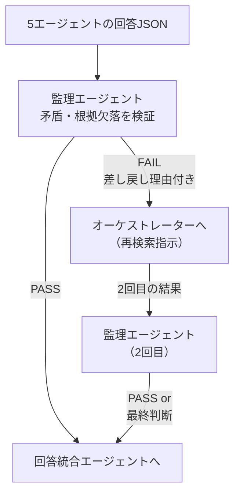

# 7. 監理エージェント実装

> 監理エージェントは「自ら検索しない」。  
> 5専門エージェントの回答を受け取り、**矛盾と根拠欠落のみを検証**する。  
> 問題があればオーケストレーターに差し戻し、OKなら回答統合エージェントに渡す。

## 7.1 検証フロー



> **差し戻しは最大2回**とし、3回目は「検証保留」として統合エージェントへ注記付きで渡す。  
> これにより無限ループを防ぐ。

## 7.2 監理エージェント・システムプロンプト

設計書 7.3節のチェックリストを拡張した版：

```
あなたは土木事業管理の品質監理エージェントです。
5専門エージェントの回答を受け取り、以下のチェックリストで検証してください。

## 入力
- 法令エージェント回答: {law_result}
- 行政手続エージェント回答: {procedure_result}
- 技術基準エージェント回答: {technical_result}
- 事例エージェント回答: {case_result}
- リスクエージェント回答: {risk_result}

## チェックリスト（全てPASSなら統合エージェントへ。1つでもFAILなら差し戻し）
1. [ ] 法令と技術基準に矛盾はないか（例：廃止基準の引用、条文番号の誤り）
2. [ ] 法令エージェントの回答に sources（根拠文書）が最低1件あるか
3. [ ] 行政手続エージェントの手続きリストが法令エージェントの要件と整合しているか
4. [ ] 工法・材料を提案する場合、技術基準エージェントが準拠基準を明示しているか
5. [ ] 事例エージェントの事例工法が現行法令と矛盾していないか（廃止・改定漏れ）
6. [ ] リスクエージェントがconfidence="low"を返した場合、その旨を差し戻し理由に含めているか

## 出力フォーマット（JSON）
{
  "verdict": "PASS|FAIL",
  "failed_checks": [1, 4],   // PASSの場合は空配列
  "reason": "差し戻し理由の詳細（PASSの場合は null）",
  "retry_count": 0            // 呼び出し側が加算して渡す
}
```

## 7.3 Track A: Dify 実装

### フロー設計

```
[5エージェント並列実行完了]
    ↓
[コードノード: 5回答をまとめてJSONに整形]
    ↓
[LLMノード: 監理エージェント]
    ↓
[条件分岐ノード: verdict == "PASS" ?]
    ├─ YES → [8章: 回答統合エージェント]
    └─ NO  → [変数更新: retry_count += 1]
                 ↓
              [条件: retry_count >= 2 ?]
              ├─ YES → [8章: 注記付きで統合へ]
              └─ NO  → [5章: オーケストレーターへ戻る]
```

### Dify コードノード: 回答整形

```python
def main(law, procedure, technical, case, risk) -> dict:
    import json
    return {
        "combined": json.dumps({
            "law_result":       law,
            "procedure_result": procedure,
            "technical_result": technical,
            "case_result":      case,
            "risk_result":      risk,
        }, ensure_ascii=False)
    }
```

## 7.4 Track B: AutoGen 実装

```python
# agents/supervisor_agent.py
import json, os
from autogen_agentchat.agents import AssistantAgent
from autogen_ext.models.openai import AzureOpenAIChatCompletionClient

SUPERVISOR_PROMPT = """...(7.2節のプロンプト)..."""

_model_client = AzureOpenAIChatCompletionClient(
    model="gpt-4o",
    api_version="2024-02-01",
    azure_endpoint=os.environ["AZURE_OPENAI_ENDPOINT"],
    api_key=os.environ["AZURE_OPENAI_API_KEY"],
)

supervisor = AssistantAgent(
    name="supervisor",
    system_message=SUPERVISOR_PROMPT,
    model_client=_model_client,
)

async def supervise(agent_results: dict, retry_count: int = 0) -> dict:
    result = await supervisor.run(
        task=json.dumps(agent_results, ensure_ascii=False)
    )
    verdict = json.loads(result.messages[-1].content)
    verdict["retry_count"] = retry_count
    return verdict

def route_after_supervisor(verdict: dict) -> str:
    if verdict["verdict"] == "PASS":
        return "integrate"
    if verdict.get("retry_count", 0) >= 2:
        return "integrate_with_caveat"
    return "retry"
```

### AutoGen パイプラインへの組み込み

```python
# main.py（抜粋）
async def run_pipeline(question: str) -> str:
    subqueries = await orchestrate(question)

    # 専門エージェントを並列実行
    results = {}
    for key, sq in subqueries.items():
        if key in AGENTS:
            results[key] = await AGENTS[key](sq)

    # 監理サイクル（最大2回差し戻し）
    retry_count = 0
    while True:
        verdict = await supervise(results, retry_count)
        route = route_after_supervisor(verdict)
        if route == "retry" and retry_count < 2:
            retry_count += 1
            subqueries = await orchestrate(question)
            for key, sq in subqueries.items():
                if key in AGENTS:
                    results[key] = await AGENTS[key](sq)
        else:
            break

    return await integrate(results, retry_count)
```

## 7.5 監理エージェントのチューニングポイント

| 課題 | 対策 |
|---|---|
| 差し戻しが多すぎてループする | チェック項目の閾値を緩和（信頼度 low でも PASS）/ 差し戻し上限を1回に変更 |
| 差し戻し理由が曖昧 | プロンプトに「具体的な引用文と矛盾箇所を明示する」制約を追加 |
| 無関係なチェックで FAIL | 「チェックリストの各項目は、対応エージェントの回答が存在する場合のみ評価する」制約を追加 |
