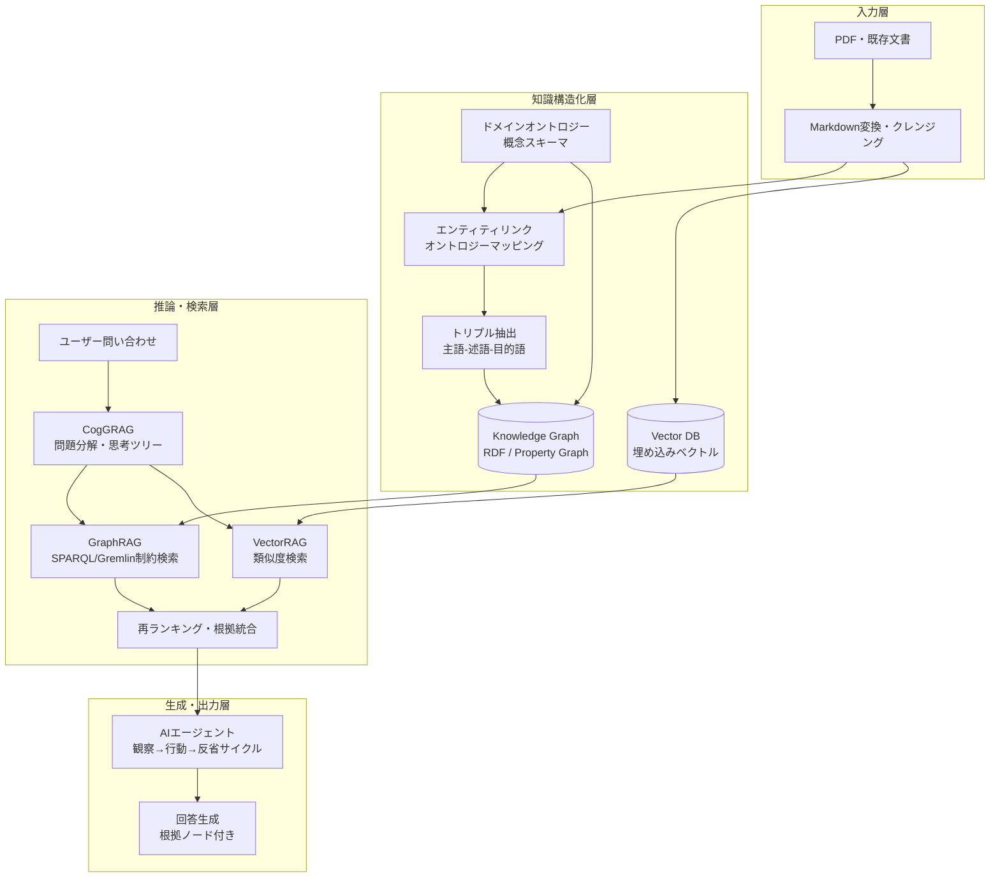
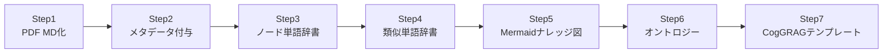
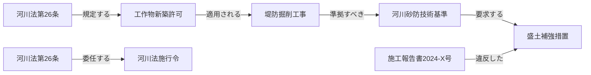
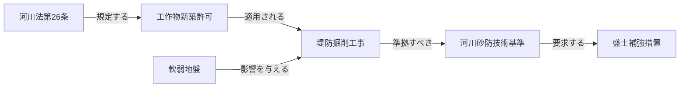
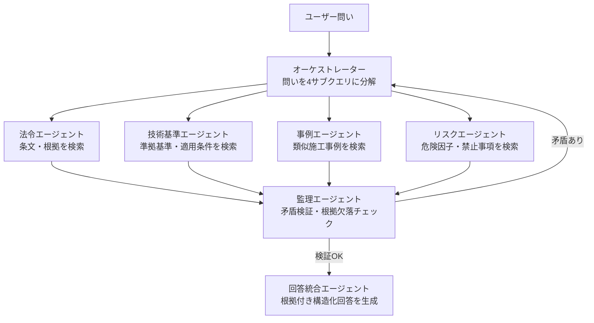
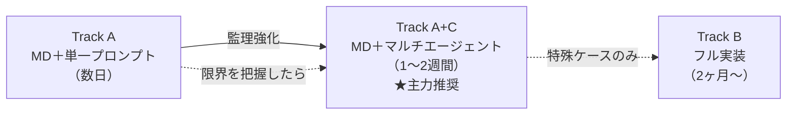
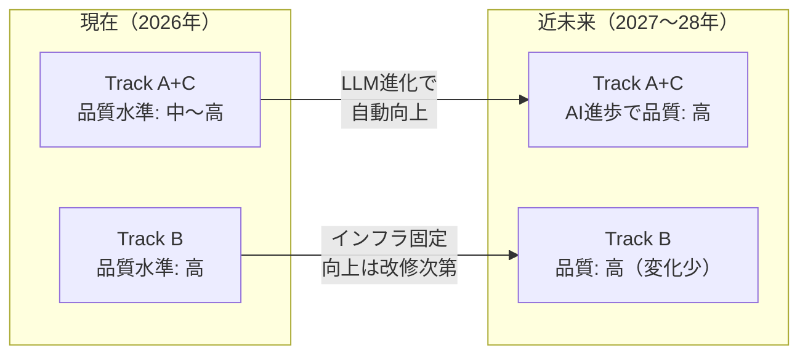
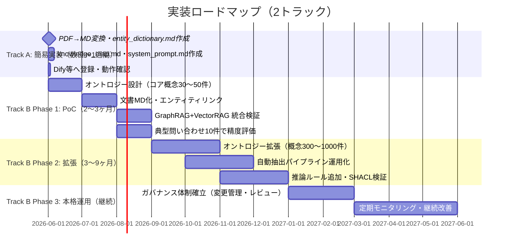

土木事業管理における知識・判断継承のためのRAGシステム構築提案書

**作成日**: 2026年5月  
**対象**: 事業管理部門・技術管理部門の意思決定者および技術担当者

---

## エグゼクティブサマリー

本提案は、土木事業管理における「ベテラン技術者の暗黙知・判断ロジックの消失」という構造的課題に対し、4つの先進技術を統合したRAGシステムで解決することを目指すものである。

| 技術要素 | 役割 | 主な効果 |
|---|---|---|
| **GraphRAG** | 法令・基準間の関係をグラフ構造で保持 | 多段推論（2ホップ以上）の実現 |
| **VectorRAG** | 非構造化テキストの意味検索 | 類似事例・実務知識の高速参照 |
| **ドメインオントロジー** | 概念・用語の公式スキーマ定義 | 用語の一意化・推論ルールの基盤 |
| **CogGRAG** | 人間の思考プロセスを模倣した問題分解 | 複雑な問いへの構造化した推論 |

従来のVectorRAG単体と比較して、**ハルシネーションの大幅抑制**・**根拠提示（Provenance）による説明可能性の向上**・**ナレッジ更新の自動化**を実現する。

**2トラック実装戦略**: 本提案は段階的に着手できる2トラック構成を採用する。

| トラック | アプローチ | 期間 | 対象 |
|---|---|---|---|
| **Track A（簡易）** | MD＋システムプロンプトで近似実現（§4-B） | 数日〜1週間 | PoC・試用・小規模運用 |
| **Track A+C（★主力推奨）** | MD＋マルチエージェント監理構造（§4-B/C） | 1〜2週間 | **大多数の実務用途に対応。AIの進歩を直接享受** |
| **Track B（本格）** | 7ステップ＋インフラ構築による完全実装（§4） | 2ヶ月〜 | 法的監査証跡・10万件超・複数組織スキーマ共有 |

---

# 1. 背景と目的

土木事業管理の実務は、河川法・道路法をはじめとする複雑な**法令**、膨大な**技術基準書**、および現場特有の専門用語（ドメイン知識）が高度に絡み合う領域である。

従来のVectorRAGでは、関連するテキスト断片（チャンク）を類似度だけで抽出するため、複数の文書や条文にまたがる「関係の連鎖」を辿ることができない。その結果、以下の土木実務特有の課題において回答精度が著しく低下していた。

- **多段推論の限界**: 「基準Aの改定が、それに紐づく基準Bの適用条件、さらには現場報告書Cの工法選択にどう波及するか」といった複数の関係性を順に辿る推論ができない。
- **知識の断片化**: 文書を機械的に分割してベクトル化するため、概念間の意味的なつながりや体系的な文脈が失われる。
- **用語の曖昧性**: 同一概念が複数の略語・表記で登場した際に同一エンティティとして認識できない。

本プロジェクトでは、「HybridRAG（GraphRAG × VectorRAG）」「CogGRAG」「ドメインオントロジー」を統合し、ベテラン技術者の判断ロジックをAIが正確に再現・継承できる知識基盤を構築する。

---

# 2. 全体アーキテクチャ



---

# 3. 採用技術の詳細

### 3.1 GraphRAG（ナレッジグラフ検索）

- **役割**: 法令・技術基準・マニュアル間の「依存関係」「包含関係」をノード（実体）とエッジ（関係）による知識グラフとして保持する。
- **適した問い**: 「〇〇工法の適用を制限する河川法の条文はどれか」など、事実に基づき明確に特定できる抽出的な問い。
- **利点**: 多段の依存関係を正確にトレースした回答生成が可能。

### 3.2 VectorRAG（ベクトル類似度検索）

- **役割**: 過去の施工トラブル報告書・現場進捗記録などの非構造化テキストから、意味的な類似性に基づいて類似事例を検索する。
- **適した問い**: 「過去の軟弱地盤対策におけるトラブルの共通傾向は何か」など、生データに直接明示されていない抽象的なニュアンスを汲み取る要約的な問い。

### 3.3 CogGRAG（認知思考型RAG）

- **役割**: 人間の専門家が複雑な問題に直面した際の「思考の構造化」を模倣するフレームワーク。
- **メカニズム**: 複雑な問いをマインドマップ状の「木構造」に自動分解し、各サブプロブレムに対してローカル・グローバル双方のナレッジグラフから構造的に検索し、ボトムアップで結論を導き出す。一足飛びの推論によるカスケードエラーを防ぐ。

### 3.4 ドメインオントロジー（知識の公式スキーマ）

オントロジーはシステム全体の「公式用語辞書」かつ「推論の基盤」であり、GraphRAGとCogGRAGの品質を根底から支える。

#### オントロジーが果たす役割

- **用語の一意定義**: 同義語・略語を正規化し、同一エンティティとして一貫して扱う（例: 「設計洪水位」「H.W.L」「計画高水位」を同一ノードに統合）。
- **概念間関係の明示**: 包含・依存・適用条件などの関係タイプを型として定義し、推論の精度を高める。
- **推論ルールの基盤**: 「条文Aが適用される場合、手続きXが必要」というルールをSHACLやOWL公理として表現し、自動判定を可能にする。

#### 土木事業管理オントロジーの最小スキーマ

| クラス | 主要プロパティ | 具体例 |
|---|---|---|
| `法令` | 施行年、所管省庁、委任先 | 河川法、道路法 |
| `技術基準` | 参照法令、工事区分、発行年度 | 河川砂防技術基準 |
| `工法` | 適用条件、制限条件、準拠基準 | 盛土補強工法 |
| `構造物` | 種別、適用法令、設計基準 | 堤防、橋梁 |
| `現場報告` | 工事番号、発注者、日付 | 施工報告書2024-X号 |
| `リスク要因` | 影響を与える工法・構造物 | 軟弱地盤、出水期 |

プロパティ（関係）: `適用する`, `参照する`, `定義する`, `委任する`, `影響を与える`, `準拠すべき`

#### TTLサンプル（説明用）

```turtle
@prefix ex: <http://example.org/ontology#> .
ex:河川法_第26条 a ex:法令 ;
    ex:適用する ex:工作物新築許可 .
ex:工作物新築許可 ex:適用される ex:堤防掘削 .
ex:堤防掘削 a ex:工法 ;
    ex:準拠すべき ex:河川砂防技術基準 .
```

#### オントロジーのシステム統合ポイント

1. **エンティティリンク**: 文書トークンをオントロジーのエントリにマップし、ノードIDを付与する。
2. **トリプル格納**: 抽出したトリプルをKnowledge Graph（RDF/Property Graph）へ投入し、ソース（文書ID/ページ）をノード・エッジプロパティとして保持する。
3. **制約検索**: GraphRAGはオントロジースキーマに基づくSPARQL/Gremlinクエリを実行する。
4. **推論エンジン**: OWL推論・SHACL検証・ルールエンジン（Drools等）でドメインルールと整合性検査を行う。
5. **生成フェーズ**: CogGRAGの各思考ステップにオントロジー由来の制約と根拠ノードリストを付与してLLMに渡す。

---

# 4. RAG知識整理の7ステップ実施手順

既存PDF等の資料をナレッジグラフ・オントロジーとして整備し、CogGRAGの推論テンプレートまで完成させるための具体的な実施手順を示す。各ステップは順番に依存しており、前ステップの成果物が次ステップのインプットとなる。



**各ステップと採用技術（§3）の対応**:

| Step | 作業内容 | 主に寄与する採用技術 | 成果物 |
|---|---|---|---|
| **1** | PDFのMD化 | **VectorRAG**（テキストチャンク生成） | `.md` ファイル群 |
| **2** | MDへのメタデータ付与 | **GraphRAG**（ノード候補の抽出） / **ドメインオントロジー**（エンティティ分類） | `.entities.json` |
| **3** | ノード単語辞書の作成 | **GraphRAG**（グラフノード定義） / **ドメインオントロジー**（クラスインスタンス登録） | `node_dictionary.json` |
| **4** | 類似単語辞書の作成 | **VectorRAG**（クエリ正規化・同義語展開） / **ドメインオントロジー**（`owl:sameAs`） | `synonym_dictionary.json` |
| **5** | Mermaidナレッジ図の作成 | **GraphRAG**（エッジ＝トリプルの可視化） | `triples.json` / Mermaid図 |
| **6** | オントロジーの作成 | **ドメインオントロジー**（クラス・推論ルール・SHACL制約の形式化） | `ontology.ttl` |
| **7** | CogGRAG推論テンプレートの作成 | **CogGRAG**（問題分解パターン・サブクエリ・推論チェーン設計） | `decomp_templates.yaml` |

> Step 1〜7 で4技術がすべてカバーされる。CogGRAG（Step 7）はStep 1〜6の成果物を組み合わせて機能するため、必ず最後に実施する。

---

### Step 1：PDFのMD化

**目的**: 原文書の構造（見出し・表・条文番号）を保持しながらテキストを機械処理可能な形式に変換する。

**推奨ツール**:

| ツール | 特徴 | 向いている文書 |
|---|---|---|
| `marker-pdf` | 高精度・レイアウト保持 | 技術基準書・マニュアル |
| `pymupdf4llm` | 高速・表変換が得意 | 表が多い仕様書 |
| `docling`（IBM） | 複雑レイアウト対応 | 図表混在の報告書 |

**出力フォーマット（YAMLフロントマター付き）**:

```markdown
---
doc_id: "kasen_law_26"
title: "河川法（抜粋）"
doc_type: "法令"
applicable_law: "河川法"
issue_date: "2023-04-01"
organization: "国土交通省"
work_type: ["河川", "堤防"]
---

## 第26条　工作物の新築等の許可

河川区域内の土地において工作物を新築し、改築し、又は除却しようとする者は、
国土交通省令で定めるところにより、河川管理者の許可を受けなければならない。
```

**チェックポイント**: 見出し階層・表・条文番号が正しく変換されているか人手で抜き取り確認する。

### Step 2：MDにノード単語のメタデータ付与

**目的**: MD内の専門用語をエンティティとして識別し、後続のノード辞書作成に必要なタグ情報を付与する。

**エンティティ種別（タイプ定義）**:

| タイプ | 例 |
|---|---|
| `法令` | 河川法第26条、道路法第32条 |
| `技術基準` | 河川砂防技術基準、道路設計要領 |
| `工法` | 盛土補強工法、深層混合処理工法 |
| `構造物` | 堤防、橋梁、擁壁 |
| `手続き` | 河川管理者許可、占用申請 |
| `リスク要因` | 軟弱地盤、出水期、液状化 |

**処理方法（LLMプロンプト例）**:

```
以下のMarkdownテキストから土木実務のエンティティを抽出し、
JSON形式で返してください。
タイプは[法令, 技術基準, 工法, 構造物, 手続き, リスク要因]から選択。

テキスト:
{chunk_text}

出力形式:
[{"text": "河川法第26条", "type": "法令", "start": 15, "end": 23}, ...]
```

**付与後のMD（サイドカーJSON方式）**:

```json
// kasen_law_26.entities.json
[
  {"text": "河川管理者の許可", "type": "手続き", "node_id": "河川管理者許可", "section": "第26条"},
  {"text": "工作物", "type": "構造物", "node_id": "工作物", "section": "第26条"}
]
```

> **注意**: サイドカーJSON方式のため、**MDファイル本体（`kasen_law_26.md`）は変更しない**。エンティティ情報は `kasen_law_26.entities.json` として隣に置く。Step 3でこのJSONをまとめてノード辞書へ統合する。

### Step 3：ノード単語辞書の作成

**目的**: Step 2で抽出した全エンティティを一元管理する辞書を作成し、ノードIDと正規形を確定する。

**辞書スキーマ（1レコード例）**:

```json
{
  "node_id": "河川法_第26条",
  "canonical_name": "河川法第26条",
  "entity_type": "法令",
  "definition": "河川区域内における工作物の新築・改築・除却に河川管理者の許可を義務付ける条文",
  "source": {
    "doc_id": "kasen_law_26",
    "section": "第26条",
    "page": 12
  },
  "aliases": []
}
```

**辞書MD版（人が読む形式）**:

```markdown
## 河川法第26条
- **ノードID**: 河川法_第26条
- **タイプ**: 法令
- **定義**: 河川区域内における工作物の新築・改築・除却に河川管理者の許可を義務付ける条文
- **出典**: 河川法 第26条（p.12）
```

**管理ファイル**: `node_dictionary.json` および `辞書MD/法令.md`, `辞書MD/工法.md` 等をタイプ別に分割して管理する。

### Step 4：ノード単語辞書の類似単語辞書の作成

**目的**: 同一概念の異なる表記・略語・関連語を一つの正規ノードに集約し、検索時の漏れを防ぐ。

**作成方法（2段階）**:

**① 埋め込みベクトルによる自動検出**:

```python
# 全ノードの canonical_name を埋め込みベクトル化
from sentence_transformers import SentenceTransformer
import numpy as np

model = SentenceTransformer("cl-nagoya/sup-simcse-ja-large")
names = [node["canonical_name"] for node in node_dict]
embeddings = model.encode(names)

# コサイン類似度でペアを抽出（閾値0.85以上を候補として提示）
from sklearn.metrics.pairwise import cosine_similarity
sim_matrix = cosine_similarity(embeddings)
```

**② LLMによる略語・同義語生成**:

```
以下の土木専門用語について、
同義語・略語・別称・関連表現を列挙してください。

用語: 設計洪水位
出力: ["H.W.L", "HWL", "計画高水位", "設計最高水位", "計画洪水位"]
```

**類似単語辞書スキーマ**:

```json
{
  "node_id": "設計洪水位",
  "canonical_name": "設計洪水位",
  "synonyms": ["H.W.L", "HWL", "計画高水位", "設計最高水位"],
  "related_terms": ["計画高水流量", "計画規模", "基本高水"],
  "narrower": [],
  "broader": ["洪水位"]
}
```

**辞書MD版（人が読む形式）**:

```markdown
## 設計洪水位
- **ノードID**: 設計洪水位
- **タイプ**: 技術基準値
- **同義語**: HWL, H.W.L, 計画高水位, 設計最高水位
- **関連語（上位）**: 洪水位
- **関連語（周辺）**: 計画高水流量, 計画規模, 基本高水
```

**管理ファイル**: `synonym_dictionary.json`（機械処理用）＋ `辞書MD/同義語.md`（人手レビュー用）。RAGの検索前処理でクエリ中の単語をこの辞書で正規化してから検索する。

### Step 5：ナレッジとしての単語連携Mermaid作成

**目的**: Step 3・4のノード間の関係（トリプル）を可視化し、ナレッジグラフの構造を人が確認・修正できる形にする。

**トリプル抽出プロンプト**:

```
以下のテキストから「主語 - 述語 - 目的語」の関係を抽出し、
JSON形式で返してください。
述語は[規定する, 適用される, 準拠すべき, 要求する, 委任する,
       定義する, 影響を与える, 違反した, 参照する]から選択してください。

テキスト: {chunk_text}

出力:
[{"subject": "河川法第26条", "predicate": "規定する", "object": "工作物新築許可", "source": "kasen_law_26:p12"}]
```

**Mermaid生成（トリプルからの自動変換）**:

```python
def triples_to_mermaid(triples: list[dict]) -> str:
    lines = ["graph LR"]
    for t in triples:
        s = t["subject"].replace(" ", "_")
        o = t["object"].replace(" ", "_")
        lines.append(f'    {s}["{t["subject"]}"] -- "{t["predicate"]}" --> {o}["{t["object"]}"]')
    return "\n".join(lines)
```

**出力例（土木事業管理コンテキスト）**:



**管理ファイル**: `triples.json`（全トリプル）＋ `knowledge_map/[テーマ名].md`（テーマ別Mermaid図）

**`knowledge_map/[テーマ名].md` のフォーマット**:

```markdown
---
doc_id: "knowledge_map_kasen"
title: "河川法関連ナレッジマップ"
doc_type: "ナレッジ図"
theme: "河川法"
source_steps: ["Step3", "Step4"]
---
```

## 河川法関連ナレッジマップ



## 収録トリプル一覧

| 主語 | 述語 | 目的語 | 出典 |
|---|---|---|---|
| 河川法第26条 | 規定する | 工作物新築許可 | kasen_law_26:p12 |
| 工作物新築許可 | 適用される | 堤防掘削工事 | kasen_law_26:p12 |
| 堤防掘削工事 | 準拠すべき | 河川砂防技術基準 | kasen_standard:p5 |


> テーマ別に1ファイル作成する（例: `knowledge_map/河川法.md`, `knowledge_map/道路法.md`）。収録トリプル一覧があることで、人手での確認・修正が容易になる。

---

### Step 6：オントロジー作成

**目的**: Step 3〜5で蓄積したノード・関係を形式化し、推論ルール・整合性制約を定義する。これによりRAGの検索精度と自動判定能力が向上する。

**① クラス・プロパティ定義（TTL形式）**:

```turtle
@prefix ex: <http://example.org/doboku#> .
@prefix owl: <http://www.w3.org/2002/07/owl#> .
@prefix rdfs: <http://www.w3.org/2000/01/rdf-schema#> .

# クラス定義
ex:法令      a owl:Class .
ex:技術基準  a owl:Class .
ex:工法      a owl:Class .
ex:構造物    a owl:Class .
ex:手続き    a owl:Class .
ex:リスク要因 a owl:Class .

# プロパティ定義
ex:規定する    a owl:ObjectProperty ; rdfs:domain ex:法令 ;     rdfs:range ex:手続き .
ex:適用される  a owl:ObjectProperty ; rdfs:domain ex:手続き ;   rdfs:range ex:工法 .
ex:準拠すべき  a owl:ObjectProperty ; rdfs:domain ex:工法 ;     rdfs:range ex:技術基準 .
ex:委任する    a owl:ObjectProperty ; rdfs:domain ex:法令 ;     rdfs:range ex:法令 .
ex:影響を与える a owl:ObjectProperty ; rdfs:domain ex:リスク要因 ; rdfs:range ex:工法 .
```

**② 同義語の統合（OWL sameAs）**:

```turtle
ex:設計洪水位 owl:sameAs ex:HWL .
ex:設計洪水位 owl:sameAs ex:計画高水位 .
```

**③ 推論ルール（SHACL制約の例）**:

```turtle
@prefix sh: <http://www.w3.org/ns/shacl#> .

ex:工法制約 a sh:NodeShape ;
    sh:targetClass ex:工法 ;
    sh:property [
        sh:path ex:準拠すべき ;
        sh:minCount 1 ;                  # 工法は必ず技術基準を持つ
        sh:class ex:技術基準 ;
        sh:message "工法には準拠すべき技術基準が必要です" ;
    ] .
```

**④ ステップ成果物とRAGへの接続**:

| 成果物 | 用途 |
|---|---|
| `ontology.ttl` | Knowledge GraphのスキーマとしてGraph DBに登録 |
| `node_dictionary.json` | エンティティリンク処理の正規化辞書 |
| `synonym_dictionary.json` | クエリ前処理・ベクトル検索の拡張辞書 |
| `triples.json` | Knowledge Graphのエッジデータ |
| `knowledge_map/*.md` | 人手レビュー・ドキュメント共有用 |

---

### Step 7：CogGRAG推論テンプレートの作成

**目的**: Step 1〜6で整備した知識基盤を活用して、CogGRAGが複雑な問いを「どう分解し・どの知識源をどの順で参照するか」を定義する問題分解テンプレートを作成する。これが存在しないとCogGRAGは汎用的な分解しかできず、土木実務特有の推論ができない。

**テンプレートの構成要素**:

| 要素 | 説明 |
|---|---|
| `query_pattern` | このテンプレートが対応する問いのパターン（正規表現またはキーワード） |
| `decomposition` | 問いを分解するサブクエリのリスト（順序・依存関係付き） |
| `knowledge_sources` | 各サブクエリで参照すべき知識源（GraphRAG / VectorRAG / オントロジー） |
| `reasoning_chain` | サブクエリの結果を統合するロジック（AND条件 / OR条件 / 推移的結合） |
| `validation_rule` | 最終回答の整合性チェックルール（例: SHACL制約との照合） |

**テンプレートYAMLサンプル**:

```yaml
# decomp_templates.yaml
templates:
  - id: "工法適用可否判定"
    query_pattern: "(?:工法|施工方法).+(?:適用|使用|採用).+(?:可能|問題|許可)"
    decomposition:
      - step: 1
        subquery: "対象工法はどの技術基準に準拠すべきか"
        source: GraphRAG        # triples.json + ontology.ttl
        sparql_hint: "SELECT ?standard WHERE { ?method ex:準拠すべき ?standard }"
      - step: 2
        subquery: "その技術基準に関連する法令条文は何か"
        source: GraphRAG        # 2ホップ: 工法→基準→法令
      - step: 3
        subquery: "現場条件（地盤・時期等）に類似した過去事例はあるか"
        source: VectorRAG       # synonym_dictionary.json で正規化後に検索
      - step: 4
        subquery: "法令・基準・事例に矛盾はないか"
        source: Ontology        # SHACL制約で整合性確認
    reasoning_chain: "step1 AND step2 → 法的根拠確定; step3 → 実績補強; step4 → 最終検証"
    validation_rule: "ex:工法制約（sh:minCount 1 on ex:準拠すべき）を満たすこと"

  - id: "法令改定影響分析"
    query_pattern: "(?:法令|基準|告示).+(?:改定|改正|変更).+(?:影響|波及|適用)"
    decomposition:
      - step: 1
        subquery: "改定された条文を参照しているノードを列挙"
        source: GraphRAG
        sparql_hint: "SELECT ?node WHERE { ?node ex:参照する <改定条文URI> }"
      - step: 2
        subquery: "そのノードに依存する工法・手続きを列挙（推移的閉包）"
        source: GraphRAG        # 多段ホップ
      - step: 3
        subquery: "影響を受ける工法の代替案はあるか"
        source: VectorRAG
    reasoning_chain: "step1 → step2（推移的）→ step3（代替案補完）"
    validation_rule: "影響ノード数 > 0 の場合は必ず根拠トリプルを出力"
```

**テンプレート作成手順**:

1. **典型問い収集**: 担当者へのヒアリングや過去のQAログから代表的な問いを20〜50件収集する。
2. **クラスタリング**: 問いを「工法適用可否」「法令解釈」「リスク評価」「手続き確認」等のカテゴリに分類する。
3. **分解パターン設計**: 各カテゴリに対してサブクエリ・知識源・統合ロジックをYAML化する。
4. **テスト検証**: `triples.json`・`node_dictionary.json`・`ontology.ttl` を使って実際にSPARQLクエリとベクトル検索を実行し、期待する回答が得られるか確認する。
5. **反復改善**: 回答が不十分な場合は Step 2〜6 に戻り、不足ノード・トリプル・制約を補強する。

**管理ファイル**: `decomp_templates.yaml`（全テンプレート）＋ `test_queries/[カテゴリ].md`（テストQAセット）

---

## 4-B. 簡易実装アプローチ：MD＋AI指示による近似実現

§4（7ステップ）はフル実装版である。PoC・小規模運用では、**4種のMDファイル＋システムプロンプト**で同等の効果を近似できる。インフラ不要・構築期間は数日単位。

### フル実装 vs 簡易実装の対応関係

| フル実装（7ステップ） | 採用技術 | 簡易実装での代替手段 |
|---|---|---|
| Step 1: PDF→MD変換 | VectorRAG | **同じ**（変換ツールは共通） |
| Step 2: エンティティ抽出 | GraphRAG / オントロジー | `entity_dictionary.md` の手動作成 |
| Step 3: ノード単語辞書 | GraphRAG / オントロジー | `entity_dictionary.md` の定義欄 |
| Step 4: 類似単語辞書 | VectorRAG / オントロジー | `entity_dictionary.md` の同義語欄 |
| Step 5: Mermaidナレッジ図 | GraphRAG | `knowledge_map.md`（Mermaid図のみ） |
| Step 6: OWL/SHACL オントロジー | ドメインオントロジー | `system_prompt.md` の制約ルール欄 |
| Step 7: CogGRAGテンプレート | CogGRAG | `system_prompt.md` の回答手順欄 |

### 簡易実装のファイル構成

```
knowledge/
├── source_docs/             # Step 1と同じ: PDF→MD変換済み文書
│   ├── 河川法抜粋.md
│   └── 河川砂防技術基準.md
├── entity_dictionary.md     # Steps 2-4の代替
├── knowledge_map.md         # Step 5と同じ（Mermaid図）
└── system_prompt.md         # Steps 6-7の代替（AIへの指示）
```

### entity_dictionary.md（Steps 2-4 代替）

エンティティ定義・タイプ・同義語をMarkdownテーブルで管理する。LLMはこのファイルをRAGで参照して用語を正規化する。

```markdown
---
doc_id: "entity_dictionary"
doc_type: "辞書"
---
```

## エンティティ辞書

| ノードID | 正規名 | タイプ | 定義（1行） | 同義語・略語 |
|---|---|---|---|---|
| 設計洪水位 | 設計洪水位 | 技術基準値 | 設計に用いる洪水時の水位 | HWL, H.W.L, 計画高水位, 設計最高水位 |
| 河川法_26 | 河川法第26条 | 法令 | 河川区域内工作物の新築等の許可義務 | 河川法26条, 第26条（河川） |
| 盛土補強工法 | 盛土補強工法 | 工法 | 軟弱地盤での盛土安定のための補強工法 | 盛土補強, 補強盛土 |
| 軟弱地盤 | 軟弱地盤 | リスク要因 | 沈下・液状化リスクのある地盤 | 軟弱地 |

## 関係定義

| 関係タイプ | 意味 | 例 |
|---|---|---|
| 規定する | 法令が手続きを定める | 河川法第26条 → 工作物新築許可 |
| 準拠すべき | 工法が技術基準に従う必要 | 盛土補強工法 → 河川砂防技術基準 |
| 影響を与える | リスク要因が工法選定に影響 | 軟弱地盤 → 盛土補強工法 |

### knowledge_map.md（Step 5 代替）

Mermaid図で概念間の関係を可視化する。RAGのコンテキストに含めることで、LLMが関係を辿って回答できる。

```markdown
---
doc_id: "knowledge_map"
doc_type: "ナレッジ図"
---
```

# 土木事業管理ナレッジマップ


### system_prompt.md（Steps 6-7 代替）

このファイルをDify・n8n等のRAGシステムの**システムプロンプト**として設定する。オントロジーの制約ルールとCogGRAGの分解手順をAIへの指示として記述する。

## 役割
あなたは土木事業管理専門のAIアシスタントです。
参照可能なファイルは `source_docs/`（法令・基準書）、
`entity_dictionary.md`（用語定義）、`knowledge_map.md`（概念関係図）です。

## 回答手順（CogGRAGの代替）
1. **問いの分解**: 問いを以下の観点に分解する
   - ① 関連する法令・条文は何か
   - ② 準拠すべき技術基準は何か
   - ③ 類似の過去事例はあるか
   - ④ リスク要因に影響はあるか
2. **用語の正規化**: `entity_dictionary.md` を参照し、略語・別称を正規名に統一する
3. **関係の確認**: `knowledge_map.md` の関係図を参照し、関連ノードを辿る
4. **回答の整合確認**: 以下の制約ルールに違反しないか確認してから回答する

## 制約ルール（オントロジー・SHACLの代替）
- **工法を提案する場合**: 必ず準拠すべき技術基準を明示すること
- **法令を引用する場合**: 条文番号（例: 第26条）まで特定すること
- **根拠の明示**: 回答の最後に「根拠: [文書名, セクション]」の形式で出典を記載すること
- **不明な場合**: 推測で回答せず「該当する規定が確認できませんでした」と明示すること

## 回答フォーマット
**回答**: [結論を1〜2文で]

**根拠**:
- 法令: [条文名・番号]
- 技術基準: [基準名・セクション]
- 事例: [関連文書名]（あれば）

---

## 3トラック比較

| 観点 | Track A<br>MD＋単一プロンプト | Track A+C<br>MD＋マルチエージェント | Track B<br>フル実装（7ステップ） |
|---|---|---|---|
| 構築期間 | 数日 | 1〜2週間 | 数ヶ月 |
| インフラ | 不要 | 不要 | Graph DB + Vector DB |
| **更新コスト** | **MD編集のみ（最低）** | **MD編集のみ（最低）** | 複数DB更新（高い） |
| **分業化** | **MD担当者のみで可** | **MD担当者のみで可** | 知識エンジニア必須 |
| 多段推論精度 | 低（LLM依存） | 中（エージェント連携） | 高（SPARQL厳密走査） |
| 整合性検証 | プロンプト依存 | 監理エージェントが検証 | SHACL自動検証 |
| 変化への対応 | **即日（MD更新のみ）** | **即日（MD更新のみ）** | 数時間〜数日（DB再構築） |
| AIの進歩の恩恵 | **直接受ける** | **直接受ける** | 限定的（インフラが固定） |
| **推奨用途** | **試用・小規模** | **★主力推奨** | 監査証跡・大規模・マルチ組織 |

---

## 4-C. マルチエージェント拡張：監理構造による品質向上

### 理論的な答え：「可能」— ただし限界は異なる

簡易実装（Track A）の弱点は「1回のLLM呼び出しがすべてを担う」ことにある。  
マルチエージェントで**役割を分離**し**相互監視**させることで、フル実装（Track B）の主要機能を段階的に代替できる。

### マルチエージェント構成（5エージェント）



**各エージェントの役割**:

| エージェント | 役割 | 参照先 | 代替する技術 |
|---|---|---|---|
| **オーケストレーター** | 問いを「法令/基準/事例/リスク」に分解し各エージェントに指示 | `system_prompt.md`の回答手順 | CogGRAG（分解） |
| **法令エージェント** | 関連する法令・条文を特定し根拠を返す | `source_docs/` + `entity_dictionary.md` | GraphRAG（法令ノード） |
| **技術基準エージェント** | 適用すべき基準・仕様を特定する | `source_docs/` + `knowledge_map.md` | GraphRAG（基準ノード） |
| **事例エージェント** | 類似施工事例・トラブル事例を検索する | `source_docs/`（報告書類） | VectorRAG |
| **リスクエージェント** | 禁止事項・リスク要因・注意事項を検索する | `entity_dictionary.md`（リスク要因欄） | GraphRAG（リスクノード） |
| **監理エージェント** | 4エージェントの回答の矛盾・根拠欠落を検証し、不十分なら差し戻す | `entity_dictionary.md` + `system_prompt.md`の制約ルール | SHACL制約検証 |
| **回答統合エージェント** | 検証済み情報を構造化回答（根拠付き）に統合する | 監理エージェントの出力 | CogGRAG（統合） |

---

### 監理エージェントのプロンプト（チェックリスト）

```
以下の4エージェントの回答を検証してください。

【法令エージェント回答】: {law_agent_result}
【技術基準エージェント回答】: {standard_agent_result}
【事例エージェント回答】: {case_agent_result}
【リスクエージェント回答】: {risk_agent_result}

## 検証項目（全てYESなら統合エージェントに渡す、NOなら差し戻し）
1. [ ] 法令と技術基準に矛盾はないか
2. [ ] 工法を提案する場合、準拠すべき技術基準が明示されているか
3. [ ] 事例の工法と現在の法令状態が整合しているか（廃止・改定漏れ）
4. [ ] リスクエージェントが指摘した禁止事項と提案内容が衝突していないか
5. [ ] 各エージェントの回答に具体的な根拠（文書名・条番号）があるか

検証結果: OK / 差し戻し（理由: [具体的な矛盾点]）
```

---

## 理論的な品質向上の限界

マルチエージェントは品質を向上させるが、**フル実装と等価にはならない**。

| 課題 | マルチエージェントでの限界 | フル実装での解決 |
|---|---|---|
| 3ホップ以上の推論 | エージェントが順次推論できるが、見落としが起きやすい | SPARQLによる厳密なグラフ走査で網羅的 |
| 用語の正規化漏れ | `entity_dictionary.md` にない略語は見落とす | OWL `owl:sameAs` で全略語を自動統合 |
| 大量ノードの処理 | コンテキスト長に上限があり200ノード超で精度低下 | Graph DBは原理的にノード数無制限 |
| 整合性の網羅性 | 監理エージェントのチェックリストに書いた項目しか検証しない | SHACLは定義した全制約を自動的に検証 |

**結論**:  
マルチエージェント拡張により、簡易実装の品質は**「Track A + マルチエージェント」≒「Track B のPoC相当」**まで引き上げ可能である。ただし、大規模・高信頼性・厳密な整合性保証が求められる本番運用にはフル実装への移行が必要。

---

## 3段階のアップグレードパス



---

## 4-D. MD分業管理とAI進歩を活用した変化対応戦略

### Track A+C が主力になる理由

AIの推論能力・コンテキスト長の急速な向上を考慮すると、「MDファイル + マルチエージェント」は単なる代替手段ではなく、**変化対応力において Track B を超える優位性を持つ**。

| 視点 | Track A+C の優位性 |
|---|---|
| **AIの進歩の恩恵** | LLMの推論能力向上・コンテキスト長拡大は即座に品質向上に直結。Track B はインフラ固定のため恩恵が限定的 |
| **法令・基準の改定対応** | 担当者がMDを1ファイル更新するだけで完結。Track B はGraph DB再構築・SHACL再検証が必要 |
| **分業化の容易さ** | 専門知識がある担当者がMarkdownを書けばよい。知識エンジニア不要 |
| **障害点の少なさ** | インフラ障害なし。MDファイルが壊れることはない |
| **コスト構造** | ランニングコストはLLM API費用のみ。Track B はDB運用・保守費が継続発生 |


---

### MD分業管理マトリクス
誰が・どのMDを・いつ更新するかを明確にすることで、Track A+C はチーム運営可能な持続可能なシステムになる。

| MDファイル | 担当者 | 更新トリガー | 目安工数 |
|---|---|---|---|
| `source_docs/法令.md` | 法務担当者 | 法令・告示の改定時 | 1〜2時間/件 |
| `source_docs/技術基準.md` | 技術担当者 | 基準書改定・通知発出時 | 2〜4時間/件 |
| `source_docs/施工事例.md` | 現場担当者 | 工事完了・トラブル発生時 | 1時間/件 |
| `entity_dictionary.md` | 知識管理担当 | 新規用語登場・略語追加時 | 30分/件 |
| `knowledge_map.md` | 知識管理担当 | 新しい概念関係の発見時 | 1時間/件 |
| `system_prompt.md` | AI担当者 | AI品質問題・新しい問いパターン時 | 半日 |

> **運用ポイント**: 各担当者は自分の専門領域のMDのみを管理すればよく、他の仕組みを知る必要がない。法令担当者はMarkdownの書き方を覚えるだけでシステムの精度向上に直接貢献できる。

---

#### AIの進歩による品質曲線



---

### Track B が依然必要な条件（限定的）

Track A+C で対応できない領域は以下に限定される。

| 条件 | 理由 |
|---|---|
| **法的監査証跡の要求** | どの法令バージョンに基づいて判断したかを証明する義務がある場合 |
| **文書数10万件超** | コンテキスト長の物理的上限を超える規模 |
| **複数組織間スキーマ共有** | 標準化されたOWLオントロジーで組織をまたいだデータ統合が必要 |
| **リアルタイム整合性保証** | ミリ秒単位でSHACL違反を検知・阻止する必要がある |

これらの条件に該当しない限り、**Track A+C がコスト・変化対応・維持管理の全面において Track B より優れた選択**である。


---

## 6. 導入効果と評価指標（KPI）

| 効果 | 説明 | KPI目標値 |
|---|---|---|
| **ハルシネーション抑制** | 全出力にグラフ上の具体ソース（根拠ノード）を明示 | 根拠提示率 ≥ 90% |
| **多段推論の自動化** | 2ホップ以上の法令依存を自動追跡 | 多段推論成功率 ≥ 80% |
| **用語の一意化** | 同義語・略語をオントロジーで正規化 | エンティティリンク精度（F1） ≥ 0.85 |
| **更新コスト削減** | 新規文書のKG統合を数時間で自動実行 | 文書統合工数 ≤ 4人時/件 |
| **ユーザー満足度** | 若手技術者・事業管理者の業務効率化 | 満足度スコア ≥ 4.0/5.0 |

---

## 7. 実装ロードマップ



---

## 8. 費用概算と人員計画

| フェーズ | 要員 | 期間 | 主なツール・インフラ |
|---|---|---|---|
| **PoC** | 知識エンジニア×1、ドメイン専門家×2（数日）、エンジニア×1 | 2〜3ヶ月 | Graph DB（Neo4j等）、Vector DB（Milvus等）、LLM API |
| **拡張** | 知識エンジニア×1〜2、SWE×1〜2、運用スタッフ×1 | 3〜9ヶ月 | ETLパイプライン、OWL推論エンジン、CI/CD |
| **運用** | 運用スタッフ×1（継続）、ドメイン専門家（レビュー体制） | 継続 | モニタリング基盤、ガバナンスツール |

---

## 9. リスク管理

| リスク | 影響 | 軽減策 |
|---|---|---|
| オントロジーのカバレッジ不足 | 未定義概念の検索精度低下 | PoCでコア概念に限定し段階的に拡張 |
| エンティティリンク誤認 | KGの汚染・回答誤り | 人手検査ループ＋モデル再学習のフィードバック |
| 運用コスト増大 | ガバナンス負荷の増加 | 変更管理のCI/CD化・自動整合性チェックの導入 |
| 文書改訂への追従遅れ | 旧情報による誤回答 | 文書更新トリガーによる差分自動再抽出パイプライン |
| LLM出力の不安定性 | 推論品質のばらつき | Dual-Process Verificationと人手エスカレーション閾値の設定 |

---

## 10. 結論と次のアクション

本システム（HybridRAG × CogGRAG × ドメインオントロジー × 観察駆動型エージェント）は、単なるドキュメント検索を超えた「知識の構造と判断プロセスの継承」を実現する。

**PoC成功基準**:

- 根拠提示率 ≥ 90%
- 多段推論成功率 ≥ 80%
- 典型問い合わせ10件のうち8件以上で実務利用可能な回答

**次のアクション（2トラック）**:

| # | Track A（簡易：即日着手可能） | Track B（本格：計画的着手） |
|---|---|---|
| 1 | 対象文書を選定してPDF→MD変換（1日） | PoCスコープ確定（主要概念30〜50件・典型問い合わせ10件） |
| 2 | `entity_dictionary.md`・`knowledge_map.md` を手動作成（2〜3日） | 概算見積り・人員確保（知識エンジニア・ドメイン専門家） |
| 3 | `system_prompt.md` をDify/ChatGPT等に設定して試用（1日） | 評価基準の関係者合意（KPI定義と判定基準） |
| 4 | 精度確認 → 限界を把握 → Track Bへの移行判断 | キックオフ（2026年6月〜、Track Aの知見を引継ぎ） |

> **推奨**: まず Track A で1週間以内に動く実証環境を作り、現場担当者に触れさせてフィードバックを収集する。その知見（どんな問いが多いか・どこで精度が落ちるか）をTrack Bの設計に活かすことで、本格実装の精度と費用対効果を最大化できる。
