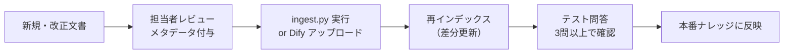

# 9. 本番展開・運用監視

## 9.1 本番移行チェックリスト

### セキュリティ

- [ ] OpenAI / Azure OpenAI の API キーを環境変数で管理（コードにハードコードしない）
- [ ] Dify / LangGraph サービスをプライベートネットワーク内に配置
- [ ] ナレッジベースのアクセス制御（部署・ロール別）を設定
- [ ] 機密文書（内部通達等）は社外 LLM API に送信しない設計を確認

> **Azure OpenAI 利用推奨**: 官公庁・公共インフラ案件では、  
> データが学習に使用されない Azure OpenAI または オンプレミス LLM を選択する。

### パフォーマンス

- [ ] 全エージェント並列実行時の平均レイテンシが要件内（≤30秒）
- [ ] VectorDB のインデックスが最適化されている（Chroma: `persist` 完了確認）
- [ ] リランキングモデルがローカル起動している場合、GPU メモリを確認

## 9.2 Track A: Dify 本番設定

| 項目 | 設定 |
|---|---|
| 公開設定 | 「埋め込み」or 「API アクセス」（社内 Intranet 限定） |
| ログ保存 | 会話ログを Dify 内に保存（監査証跡） |
| レート制限 | ユーザー毎 10回/分 に制限 |
| バックアップ | Dify の Docker Volume を週次バックアップ |

## 9.3 Track B: LangGraph 本番構成（例）

```
[Nginx / Azure App Gateway]
        ↓
[FastAPI サーバー]  ←── [LangGraph パイプライン]
        ↓                        ↓
[PostgreSQL / Redis]      [pgvector (VectorDB)]
        ↓
[Azure Monitor / Prometheus]
```

### Docker Compose（最小構成）

```yaml
# docker-compose.prod.yml
services:
  api:
    build: .
    environment:
      - OPENAI_API_KEY=${OPENAI_API_KEY}
      - DATABASE_URL=postgresql://...
    ports:
      - "8000:8000"
  db:
    image: pgvector/pgvector:pg16
    volumes:
      - pgdata:/var/lib/postgresql/data
volumes:
  pgdata:
```

## 9.4 運用監視項目

### 日次確認（自動アラート推奨）

| 監視項目 | 閾値 | アラート先 |
|---|---|---|
| 平均レイテンシ | > 45秒 | Slack / Teams |
| エラー率（5xx） | > 1% | PagerDuty |
| ハルシネーション疑い（confidence="low" 回答率） | > 30% | 担当者メール |
| ナレッジベースのチャンク数（急減） | 前日比 -5% 以上 | 担当者メール |

### 月次確認（手動）

- [ ] 法改正・新通達の反映漏れがないか文書を確認
- [ ] 新規文書のインポートと再インデックス
- [ ] E2E 評価問答セットを再実行し品質指標を記録
- [ ] ユーザーフィードバック（Bad ボタン等）のログを集計

## 9.5 ナレッジベース更新フロー



> **廃止文書の処理**: 廃止・改正された文書は削除せず  
> メタデータ `status: "obsolete"` を付与し検索スコープから除外する。  
> 削除すると事例エージェントの過去参照ができなくなるため。

## 9.6 バージョン管理方針

| 対象 | 管理方法 |
|---|---|
| プロンプト | Git で管理（`prompts/` ディレクトリ） |
| ナレッジベース文書 | 文書管理システム or SharePoint + バージョン番号 |
| LangGraph グラフ定義 | Git タグ（`v1.0`, `v1.1`） |
| Dify フロー | エクスポート（DSL YAML）を Git 管理 |

## 9.7 段階的展開ロードマップ（参考）

| フェーズ | 期間 | 内容 |
|---|---|---|
| **PoC** | 2週間 | Track A（Dify）で3〜5エージェント、部署内10ユーザー |
| **パイロット** | 1〜2ヶ月 | 全8エージェント、部署内全ユーザー、フィードバック収集 |
| **本番移行** | 1ヶ月 | Track B（LangGraph）に移行 or Dify 本番強化、全部門展開 |
| **継続改善** | 継続 | 月次ナレッジ更新、四半期評価、新エージェント追加検討 |
