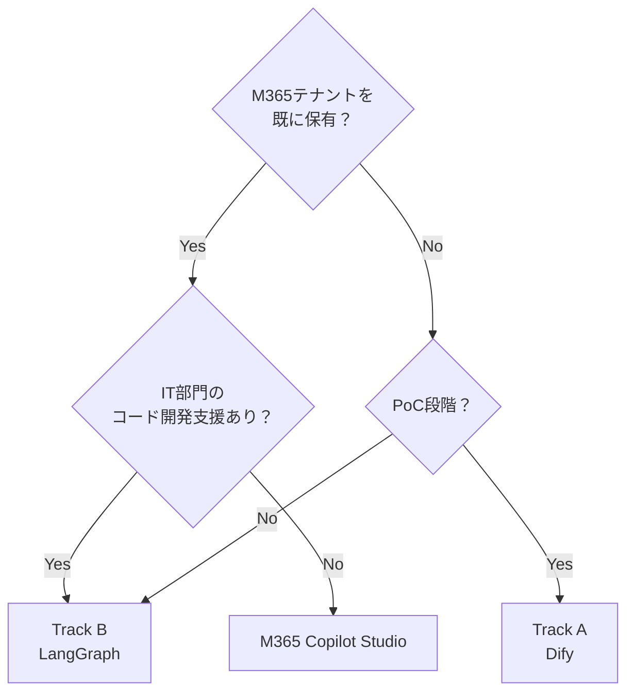

# 2. 実装プラットフォーム選択

## 2.1 選択肢の比較

| 観点 | Dify（Track A） | LangGraph（Track B） | M365 Copilot Studio |
|---|---|---|---|
| **セットアップ時間** | 数時間（Docker 1コマンド） | 1〜3日 | 数時間（テナント設定次第） |
| **エージェント間接続** | GUI でフロー設計 | Python コードで定義 | Power Automate フロー |
| **RAGナレッジ管理** | 組み込み UI で文書登録 | 外部VectorDB（Chroma/pgvector） | SharePoint / Copilot データソース |
| **カスタムロジック** | DSL / HTTP ノードで拡張 | 完全自由（Python） | Power FX / Azure Function 連携 |
| **コスト** | セルフホスト無料 | インフラ費のみ | M365 ライセンス必須 |
| **本番可用性** | ★★★☆☆ | ★★★★★ | ★★★★☆ |
| **向いているフェーズ** | PoC・部署展開 | 本番・大規模 | M365 統合重視環境 |

## 2.2 Track A: Dify 環境構築

### 2.2.1 前提

- Docker Desktop 4.x 以上インストール済み
- OpenAI API キー または Azure OpenAI エンドポイント

### 2.2.2 起動手順

```bash
git clone https://github.com/langgenius/dify.git
cd dify/docker
cp .env.example .env
# .env の OPENAI_API_KEY を設定
docker compose up -d
# http://localhost/install でセットアップ
```

### 2.2.3 モデル設定

Dify 管理画面 → **設定 > モデルプロバイダー** で以下を設定する。

| 用途 | 推奨モデル | 備考 |
|---|---|---|
| オーケストレーター | GPT-4o | 問い分解の品質が高い |
| 専門エージェント | GPT-4o-mini | コスト削減 |
| 埋め込み | text-embedding-3-large | 日本語精度優先 |
| リランキング | BGE-Reranker-v2-m3 | ローカルモデル可 |

### 2.2.4 Dify のマルチエージェント構成イメージ

```
Chatflow（オーケストレーター）
  └─ Agent ノード × 5（専門エージェント）
       └─ HTTP ノード or Agent ノード（監理エージェント）
            └─ LLM ノード（回答統合エージェント）
```

## 2.3 Track B: LangGraph 環境構築

### 2.3.1 前提

- Python 3.11 以上
- uv または pip

### 2.3.2 インストール

```bash
uv init rag-multiagent
cd rag-multiagent
uv add langgraph langchain-openai langchain-community chromadb
```

### 2.3.3 プロジェクト構成（推奨）

```
rag-multiagent/
├── agents/
│   ├── orchestrator.py
│   ├── law_agent.py
│   ├── procedure_agent.py
│   ├── technical_agent.py
│   ├── case_agent.py
│   ├── risk_agent.py
│   ├── supervisor_agent.py
│   └── integration_agent.py
├── knowledge/
│   ├── ingest.py          # 文書インポートスクリプト
│   └── vectorstore.py     # VectorDB ラッパー
├── prompts/               # プロンプトテンプレート
├── graph.py               # LangGraph 全体グラフ定義
├── main.py
└── tests/
```

## 2.4 プラットフォーム決定フロー


