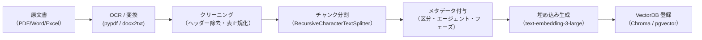

# 3. ナレッジベース構築

> 本章はすべてのエージェントの精度を左右する最重要工程である。  
> [設計書 11章のRAGスコープ設計](../rag-civil-engineering/11_rag_agent_scope.md)を参照し、  
> **エージェント別にナレッジベースを分割する**ことを原則とする。

## 3.1 文書分類とナレッジベース対応表

設計書 11章の①〜⑰区分に対応した登録先を決定する。

| ナレッジベース名 | 対応区分 | 参照エージェント |
|---|---|---|
| `kb-common-law` | ①法律 ②政令 ③府省令 | 全エージェント共通ベース |
| `kb-law-detail` | ④〜⑨（指針・省令詳細）⑪⑫ | 法令エージェント |
| `kb-procedure` | ⑨⑩（手続き系通達）⑪⑫ | 行政手続エージェント |
| `kb-technical` | ④⑩（技術系）⑬⑭⑰ | 技術基準エージェント |
| `kb-cases` | 施工報告書・トラブル記録・事例集 | 事例エージェント |
| `kb-risk` | ⑩（技術系）⑮⑯⑰ ＋ 事例文書 | リスクエージェント |

## 3.2 文書前処理パイプライン



### 3.2.1 チャンク設定（推奨値）

```python
from langchain_text_splitters import RecursiveCharacterTextSplitter

splitter = RecursiveCharacterTextSplitter(
    chunk_size=800,       # 日本語法令テキストは800字が目安
    chunk_overlap=150,    # 文脈保持のため約20%オーバーラップ
    separators=["\n\n", "\n", "。", "、", ""],
)
```

### 3.2.2 メタデータスキーマ

各チャンクに以下のメタデータを付与する。

```python
metadata = {
    "doc_id":       "河川法_2024改正",       # 文書識別子
    "category":     "①法律",                 # ①〜⑰区分
    "usage":        "law",                   # law / procedure / technical / estimation
    "phase":        ["plan", "design"],      # 適用フェーズ
    "agent":        ["law", "common"],       # 参照エージェント
    "last_updated": "2024-04-01",
    "source_url":   "https://elaws.e-gov.go.jp/...",
}
```

> **⑩通達の分類**: `usage` フィールドで `technical` / `estimation` / `procedure` を明示する（設計書 11.3節参照）。

## 3.3 Track A: Dify でのナレッジベース登録

1. **Dify 管理画面 → ナレッジ → 作成**
2. ナレッジ名を `kb-common-law` などの規約名で作成
3. **設定 > インデックスモード**: `高品質（Embedding＋リランキング）`
4. チャンク設定: サイズ 800 / オーバーラップ 150
5. 文書をアップロードし、メタデータを「カスタムメタデータ」欄に JSON で入力

### Dify メタデータ入力例

```json
{
  "category": "①法律",
  "usage": "law",
  "phase": "plan,design",
  "agent": "law,common"
}
```

## 3.4 Track B: LangGraph での一括インポート

```python
# knowledge/ingest.py
from langchain_community.document_loaders import PyPDFLoader
from langchain_openai import OpenAIEmbeddings
from langchain_chroma import Chroma

def ingest(file_path: str, metadata: dict, collection: str):
    loader = PyPDFLoader(file_path)
    docs = loader.load()
    for doc in docs:
        doc.metadata.update(metadata)
    splitter = RecursiveCharacterTextSplitter(chunk_size=800, chunk_overlap=150)
    chunks = splitter.split_documents(docs)
    embeddings = OpenAIEmbeddings(model="text-embedding-3-large")
    Chroma.from_documents(chunks, embeddings, collection_name=collection,
                          persist_directory="./chroma_db")
```

## 3.5 ナレッジベース品質チェックリスト

登録後、以下を確認してから次章へ進む。

- [ ] 全ナレッジベースに最低50チャンク以上が登録されている
- [ ] ⑩通達に `usage` メタデータが全件付与されている
- [ ] `kb-common-law` が全エージェントから参照可能になっている
- [ ] テスト検索（「河川法の適用基準は？」）で関連チャンクが上位5件に返る
- [ ] PDF の表・図がテキスト化されてチャンクに含まれている
