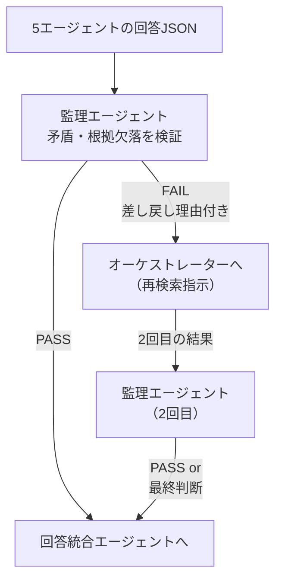

# 6. 監理エージェント実装

> 監理エージェントは「自ら検索しない」。  
> 5専門エージェントの回答を受け取り、**矛盾と根拠欠落のみを検証**する。  
> 問題があればオーケストレーターに差し戻し、OKなら回答統合エージェントに渡す。

## 6.1 検証フロー



> **差し戻しは最大2回**とし、3回目は「検証保留」として統合エージェントへ注記付きで渡す。  
> これにより無限ループを防ぐ。

## 6.2 監理エージェント・システムプロンプト

設計書 7.3節のチェックリストを拡張した版：

```
あなたは土木事業管理の品質監理エージェントです。
5専門エージェントの回答を受け取り、以下のチェックリストで検証してください。

## 入力
- 法令エージェント回答: {law_result}
- 行政手続エージェント回答: {procedure_result}
- 技術基準エージェント回答: {technical_result}
- 事例エージェント回答: {case_result}
- リスクエージェント回答: {risk_result}

## チェックリスト（全てPASSなら統合エージェントへ。1つでもFAILなら差し戻し）
1. [ ] 法令と技術基準に矛盾はないか（例：廃止基準の引用、条文番号の誤り）
2. [ ] 法令エージェントの回答に sources（根拠文書）が最低1件あるか
3. [ ] 行政手続エージェントの手続きリストが法令エージェントの要件と整合しているか
4. [ ] 工法・材料を提案する場合、技術基準エージェントが準拠基準を明示しているか
5. [ ] 事例エージェントの事例工法が現行法令と矛盾していないか（廃止・改定漏れ）
6. [ ] リスクエージェントがconfidence="low"を返した場合、その旨を差し戻し理由に含めているか

## 出力フォーマット（JSON）
{
  "verdict": "PASS|FAIL",
  "failed_checks": [1, 4],   // PASSの場合は空配列
  "reason": "差し戻し理由の詳細（PASSの場合は null）",
  "retry_count": 0            // 呼び出し側が加算して渡す
}
```

## 6.3 Track A: Dify 実装

### フロー設計

```
[5エージェント並列実行完了]
    ↓
[コードノード: 5回答をまとめてJSONに整形]
    ↓
[LLMノード: 監理エージェント]
    ↓
[条件分岐ノード: verdict == "PASS" ?]
    ├─ YES → [7章: 回答統合エージェント]
    └─ NO  → [変数更新: retry_count += 1]
                 ↓
              [条件: retry_count >= 2 ?]
              ├─ YES → [7章: 注記付きで統合へ]
              └─ NO  → [4章: オーケストレーターへ戻る]
```

### Dify コードノード: 回答整形

```python
def main(law, procedure, technical, case, risk) -> dict:
    import json
    return {
        "combined": json.dumps({
            "law_result":       law,
            "procedure_result": procedure,
            "technical_result": technical,
            "case_result":      case,
            "risk_result":      risk,
        }, ensure_ascii=False)
    }
```

## 6.4 Track B: LangGraph 実装

```python
# agents/supervisor_agent.py
import json
from langchain_openai import ChatOpenAI
from langchain_core.prompts import ChatPromptTemplate

SUPERVISOR_PROMPT = """...(6.2節のプロンプト)..."""

def supervise(state: dict) -> dict:
    results = state.get("agent_results", {})
    retry_count = state.get("retry_count", 0)
    
    llm = ChatOpenAI(model="gpt-4o", temperature=0)
    prompt = ChatPromptTemplate.from_messages([
        ("system", SUPERVISOR_PROMPT),
        ("human", json.dumps(results, ensure_ascii=False)),
    ])
    verdict_raw = (prompt | llm).invoke({})
    verdict = json.loads(verdict_raw.content)
    verdict["retry_count"] = retry_count
    state["supervisor_verdict"] = verdict
    return state

def route_after_supervisor(state: dict) -> str:
    verdict = state["supervisor_verdict"]
    if verdict["verdict"] == "PASS":
        return "integrate"
    if verdict.get("retry_count", 0) >= 2:
        return "integrate_with_caveat"
    state["retry_count"] = verdict["retry_count"] + 1
    return "retry"
```

### LangGraph グラフへの組み込み

```python
# graph.py（抜粋）
from langgraph.graph import StateGraph

builder = StateGraph(dict)
builder.add_node("orchestrate",  orchestrate)
builder.add_node("run_agents",   run_specialist_agents)
builder.add_node("supervise",    supervise)
builder.add_node("integrate",    integrate)

builder.add_conditional_edges("supervise", route_after_supervisor, {
    "integrate":             "integrate",
    "integrate_with_caveat": "integrate",
    "retry":                 "orchestrate",
})
```

## 6.5 監理エージェントのチューニングポイント

| 課題 | 対策 |
|---|---|
| 差し戻しが多すぎてループする | チェック項目の閾値を緩和（信頼度 low でも PASS）/ 差し戻し上限を1回に変更 |
| 差し戻し理由が曖昧 | プロンプトに「具体的な引用文と矛盾箇所を明示する」制約を追加 |
| 無関係なチェックで FAIL | 「チェックリストの各項目は、対応エージェントの回答が存在する場合のみ評価する」制約を追加 |
