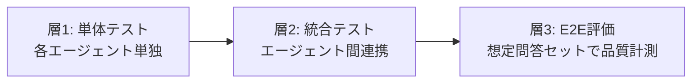

# 8. E2Eテスト・品質評価

## 8.1 評価の3層構造



## 8.2 層1: 単体テスト（エージェント別）

各エージェントに対して、以下の3パターンを最低1問ずつ実施する。

| テストパターン | 期待結果 |
|---|---|
| 正常系（根拠あり） | `confidence="high"`, `sources` に1件以上 |
| 根拠なし | `confidence="low"`, `answer` に「根拠文書未確認」 |
| 軸外の問い（null 入力） | エラーにならず空回答 or スキップ |

### 法令エージェント 正常系テスト例

```python
# tests/test_law_agent.py
def test_law_agent_normal():
    state = {
        "subqueries": {"law": "河川占用許可の根拠法令と許可要件は？"},
        "agent_results": {},
    }
    result = law_agent(state)
    parsed = json.loads(result["agent_results"]["kb-law-detail"])
    assert parsed["confidence"] in ("high", "medium")
    assert len(parsed["sources"]) >= 1
    assert "河川法" in parsed["answer"]
```

## 8.3 層2: 統合テスト（監理サイクル）

監理エージェントの差し戻し・再試行フローを意図的に発生させるテスト。

### テスト手順

1. 法令エージェントの回答に意図的に `sources: []`（根拠なし）を入れる
2. 監理エージェントを実行し `verdict == "FAIL"` かつ `failed_checks` に `[2]` が含まれることを確認
3. `retry_count = 2` でも `FAIL` の場合に `integrate_with_caveat` ルートに進むことを確認

```python
# tests/test_supervisor.py
def test_supervisor_fail_on_missing_sources():
    state = {
        "agent_results": {
            "kb-law-detail": json.dumps({"answer": "...", "sources": [], "confidence": "low"}),
            # 他エージェントの結果を省略...
        },
        "retry_count": 0,
    }
    result = supervise(state)
    verdict = result["supervisor_verdict"]
    assert verdict["verdict"] == "FAIL"
    assert 2 in verdict["failed_checks"]
```

## 8.4 層3: E2E評価（想定問答セット）

### 評価問答セット（最低10問推奨）

| # | 問い | 想定有効軸 | 評価ポイント |
|---|---|---|---|
| 1 | 河川占用許可の手順を教えてください | law / procedure | 法令条文と手続きリストの整合 |
| 2 | コンクリート橋梁の設計基準は？ | technical | 最新基準版の引用 |
| 3 | 急傾斜地での施工リスクは？ | risk / case | リスクレベルの付与 |
| 4 | 道路占用と河川占用が重複する場合の手続きは？ | law / procedure | 複数法令の統合回答 |
| 5 | 過去の護岸崩壊事例と原因は？ | case | 事例の出典明示 |
| 6 | 土砂崩れが想定される工区での法的義務は？ | law / procedure / risk | 3軸統合の整合性 |
| 7 | （根拠文書にない問い）量子コンピュータの活用方法は？ | なし（全null） | 全エージェントが "low" を返す |
| 8 | 工事着手前の届出書類一覧 | procedure | 手続きリストの網羅性 |
| 9 | 特記仕様書の作成ルールは？ | technical | 最新仕様書バージョン |
| 10 | 施工中に法改正があった場合の対応は？ | law / procedure / technical | 監理エージェントの矛盾検出 |

### 評価指標

| 指標 | 計測方法 | 合格基準 |
|---|---|---|
| **根拠付き回答率** | sources が1件以上の回答割合 | ≥ 80% |
| **差し戻し発生率** | FAIL 判定 / 全問 | ≤ 20%（精度上限） |
| **ハルシネーション率** | 人手確認でのソース不一致数 / 全出典 | ≤ 5% |
| **無効軸除去率** | null 軸がセクション省略されている割合 | 100% |
| **平均レイテンシ** | 問いから最終回答まで | ≤ 30秒（Track A）/ ≤ 15秒（Track B） |

## 8.5 評価ツール（Track B）

```python
# tests/e2e_eval.py
from ragas import evaluate
from ragas.metrics import faithfulness, answer_relevancy, context_precision

# RAGAS による自動評価（要 OpenAI API）
results = evaluate(
    dataset=eval_dataset,
    metrics=[faithfulness, answer_relevancy, context_precision],
)
print(results.to_pandas())
```

> RAGAS は英語ベースのため、日本語テキストでは faithfulness スコアが低めに出る傾向がある。  
> 8.4節の人手評価と組み合わせて判断する。
