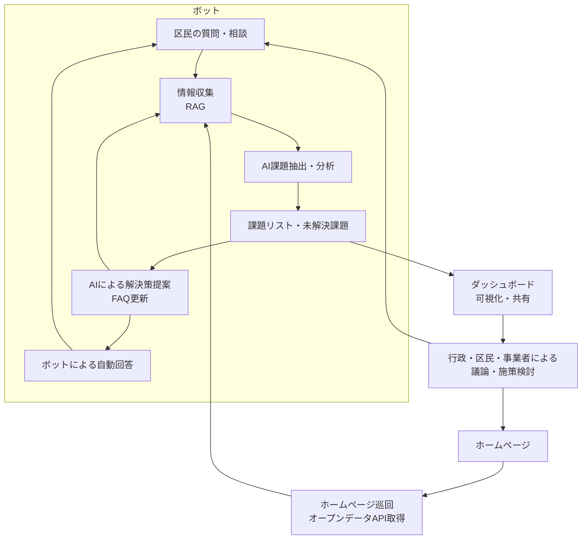

# 11. ボットによるWeb・オープンデータ活用型情報収集・課題解決誘導システム（シブヤAIコンシェルジュ）

## 概要

本システムは、市民（利用者）の質問・相談を起点に、ボットがWeb・オープンデータ・行政情報を自動収集し、RAG（Retrieval-Augmented Generation）技術で回答・課題抽出・解決提案までを一貫して支援する仕組みです。従来のSNSやアンケート等の受動的なデータ収集に加え、利用者との対話自体を最重要な情報源と位置づけ、課題の可視化・共有・解決サイクルを加速します。

## システムの流れ（フロー図に基づく）

1. **市民の質問・相談（起点）**  
	市民がボットに質問・相談を投稿。これ自体が新たな情報収集となる。

2. **情報収集（RAG）**  
	ボットは行政・地域団体・公共サービス等のホームページやオープンデータAPIを巡回し、関連情報を自動取得。RAG技術で最適な情報を抽出。

3. **自動回答**  
	収集した情報とAIの知見をもとに、ボットが市民へ自動回答。回答後も追加質問や相談を受け付け、対話が循環。

4. **AIによる課題抽出・分析**  
	利用者の投稿や質問内容、対話履歴をAIが分析し、未解決・新規課題を自動抽出。

5. **課題リスト化・可視化**  
	抽出した課題はリスト化され、ダッシュボード等で可視化。行政・市民・事業者が現状や課題を直感的に把握できる。

6. **解決策提案・FAQ更新**  
	AIが過去事例や関連データをもとに解決策を提案。FAQも自動で更新され、次回以降の回答精度が向上。

7. **議論・施策検討・循環**  
	ダッシュボード上で行政・市民・事業者が課題や解決策を共有・議論。必要に応じて施策検討や新たな市民参加へと循環。

## 特徴・期待される効果

- 市民の声が直接、課題抽出・解決サイクルに反映される
- オープンデータ・Web情報・市民対話を統合したリアルタイムな課題把握
- ダッシュボードによる可視化で、行政・市民・事業者の協働・議論が促進
- AIによる迅速な課題抽出・解決策提案で、まちづくりの好循環を実現

---

### 【引っ越しで新しく来た人向け】よくある課題例

1. 生活を始める上でこのような問題を抱えていませんか？
	- どんな手続きが必要か分からない（転入届、住民票、マイナンバー、保険など）
	- ごみの分別や収集日が分からない
	- 近くの病院や保育園、学校の情報が知りたい

2. 行政手続きや生活情報を調べるのが面倒
	- 役所の窓口やサイトを何度も探すのが手間
	- 必要な情報がまとまっていない

3. 何をすればいいかわからない
	- どの順番で手続きを進めればいいか不安
	- 困ったときの相談先が分からない

4. 自分にあったサービスや情報を知りたい
	- 子育て・高齢者・外国人など属性に応じた支援やイベントを知りたい
	- 地域のコミュニティや活動に参加したい
	
	
### 【システムとして必要な機能例（3グループ分類）】

#### 1. 生活・行政手続きサポート機能
- 引っ越し手続きナビゲーション機能
- ごみ分別・収集日案内機能
- 生活インフラ情報検索機能

#### 2. パーソナライズ・相談支援機能
- FAQ・自動応答チャットボット
- 属性別サポート情報提供機能
- 相談先・サポート窓口案内機能

#### 3. 地域参加・コミュニティ促進機能
- コミュニティ・地域活動紹介機能

