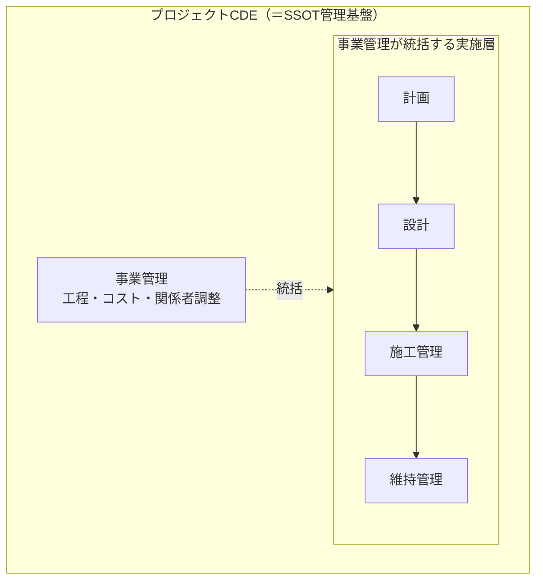
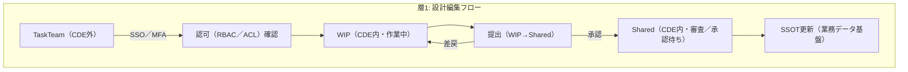
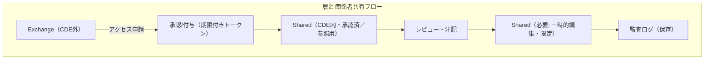
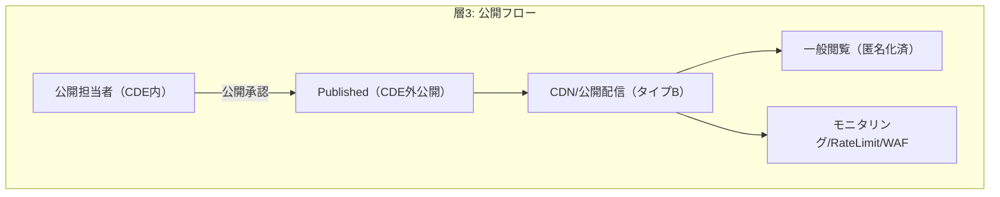
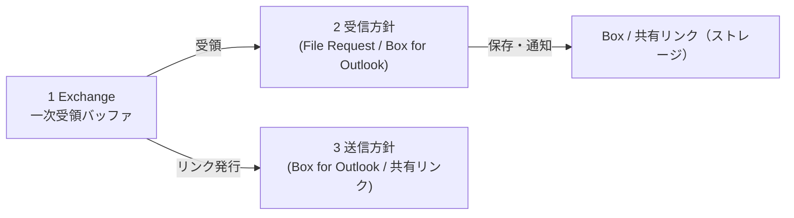
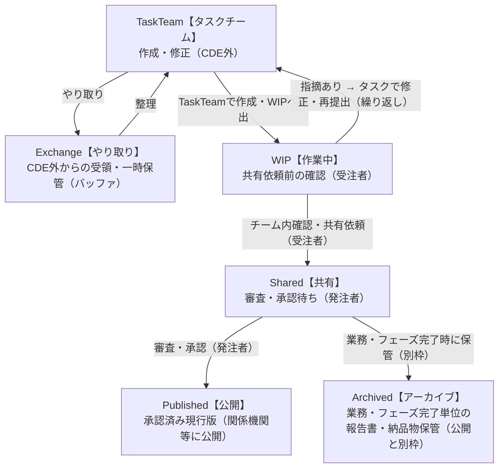
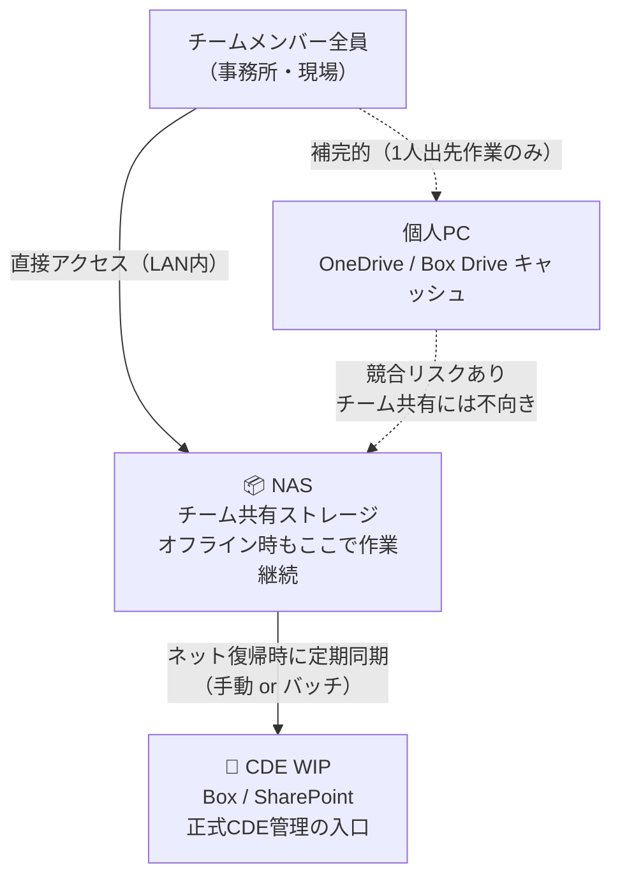
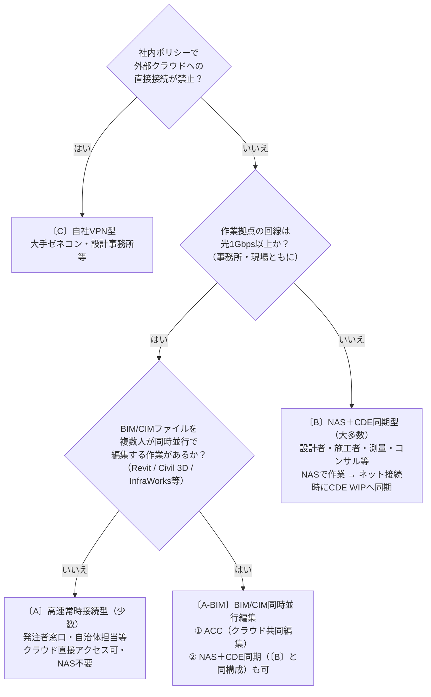

---
redirect_from:
  - /プロジェクトCDE/index.md
---

# 1. プロジェクトCDE

本資料はプロジェクトCDEのアジャイルな検討を目的とした草案（ドラフト）です。内容は整理途中であり、本資料にはAI支援ツールを用いて整理・作成した情報が含まれます。AIの出力は参考情報であり、事実関係や技術的妥当性の最終判断・承認は人が行ってください。実務で使用したり外部へ提示する前に、必ず関係者による確認・検証・正式な承認を行ってください。参考資料は下記リンクを参照してください。 

> 参考資料：[2025.3.7_プロジェクトCDEを中心としたデータマネジメントの取組案について（国土技術政策総合研究所）](https://www.nilim.go.jp/lab/peg/img/file2256.pdf)

## 1.1. プロジェクトCDE — 定義と要点（**可視化・共有**）
- プロジェクトCDEでは、SSOT上のデータを**可視化・共有**の単一の情報源と位置付け、公開用の派生物も必ずSSOTから生成・配信して整合性を担保する。

- **定義**:プロジェクトCDEとは、事業の計画・設計・施工・維持管理にわたる**業務そのものをCDE（Common Data Environment）によって管理・統制する仕組み**であり、単なるデータ保管庫ではない。各業務フェーズで生まれるデータをSSOT（唯一の正本）として管理しながら、**可視化・共有**を通じて事業関係者全体の意思決定を支える。
- **目的**: 各フェーズで生成されるデータをSSOT（Single Source of Truth）として保持し、**可視化・共有**を通じて関係者の意思決定を支援する。
- **管理対象**: 文書・図面・BIM/IFC・点群・台帳系属性など、事業管理・設計・施工管理・維持管理に関わるすべての成果データ。
- **運用ワークフロー**: ISO19650準拠のステータス管理（WIP → Shared（CDE内共有） → Published（CDE外公開））により、権威あるマスター（SSOT）を確立する。タスクチームの作業はCDE外で準備され、WIPへの提出をもって正式なCDE管理が開始される。

        - CDE外
            - Exchange【やり取り】: 受領・整理・一時保管（CDE外、必要に応じてTaskTeamで整理）
            - TaskTeam【タスクチーム】: 成果物の作成・修正・再提出（CDE外）
        - CDE内
            - WIP【作業中】: 正式CDE管理の入口・作業・指摘対応（当該タスクチームのみ変更可）
            - Shared【共有】: 発注者による審査・承認待ち（契約上の受理）
            - Published【公開】: 承認済み現行版・関係機関等への公開
            - Archived【アーカイブ】: 業務・フェーズ完了単位の報告書・納品物・承認済み議事録の保管
- **空間軸**: GISを位置情報の共通軸とし、空間的にデータを統合・照合する。
- **基盤構成（要点）**
    - 業務データ基盤: 取り込み（バッチ/ストリーム）、ETL/ELT、スキーマ・メタデータ管理、アクセス制御・監査、バックアップ、API公開、データガバナンス等を担い、SSOT（属性・履歴・トランザクション）を保持する。
    - 空間データ可視化基盤: CAD/BIM/CIM/GIS の可視化・解析・配信（3DTILES/glTF、ベクタタイル、OGC/Web API、タイル化・キャッシュ等）を担い、閲覧・解析・住民向け公開を実現する。公開は軽量化した派生物を `Published` として配信する。
- **設計上の重要項目**: ID連携（BIM↔GIS）、座標系・単位の整合、モデル変換（IFC→3DTILES 等）、メタデータ統合、更新同期、層別セキュリティと権限管理、性能対策（タイル化・キャッシュ）などを設計段階で定義する。

---

## 1.2. CDEが管理する業務フェーズ

プロジェクトCDEは以下の**管理対象業務**を包括的に管理する。その管理を実現するために①〜④の機能群が必要となる。

## 管理対象業務：事業管理・設計業務（CDEが管理・統制する業務全体）

CDEは各業務フェーズの「管理・承認・記録」を行う環境として機能する。日常的な作業準備はタスクチームの作業環境で行われ、WIP への提出を経て CDE 上で SSOT として管理・公開される。



> **プロジェクトCDEとは、実施層（計画・設計・施工管理・維持管理）を事業管理が統括しながら、すべての成果データをSSOTとして管理する基盤そのものである。**

---

## 1.3. プロジェクトCDEの機能群

プロジェクトCDEの本質は**SSOTによる共有・公開**であり、関係者全員が唯一の正本にアクセスできる環境を提供することが目的である。その目的を実現するために、以下の構造で機能群が成立する。

```
【目的】SSOTによる共有
    ↑ SSOTを活用
【事業監理業務】進捗管理・資料整理・可視化
    ↑ SSOTを構成
【データ基盤】空間データ可視化基盤 + 業務データ基盤
```

### データ基盤の役割
- **空間データ可視化基盤**: CAD／BIM／CIM／GIS 等を用いた可視化・編集・解析アプリ群と、それらの配信機能（タイル化、3DTILES/glTF、ベクタタイル、座標変換、空間解析エンジン、OGC/Web API など）を含むプラットフォーム。表示・解析・住民向け公開などの役割を担う。
- **業務データ基盤**: 単なるストレージ以上の役割を持ち、データ取り込み（バッチ／ストリーム）、ETL/ELT、スキーマ管理、メタデータカタログ、アクセス制御・監査ログ、バックアップ／リカバリ、検索／API公開、データガバナンス／品質管理などを含む。属性データ・履歴・トランザクション等のマスター（SSOT）を保持することが目的である。
- **両者の関係**: 業務データ基盤がマスター（属性・履歴・トランザクション）を保持し、空間可視化基盤はその空間表現・解析・配信を担当する。設計上の重要項目はID連携（BIM↔GIS マッピング）、座標系・単位整合、モデル変換（IFC→3DTILES 等）、メタデータ統合、更新同期、及びパフォーマンス対策（タイル化・キャッシュ）である。

# 2. データ基盤共有 — アクセス層（Access Layer）と共有方法

本章は「アクセス層（Access Layer）」を中心に、どのデータを誰がどの方法で共有するかを技術面と運用面で明確化することを目的とする。アクセス層は利用目的とリスクに基づき、以下の3層に分類する：

- 層1（設計編集）: 高忠実度データの編集・承認を行う内部作業層。
- 層2（関係者共有）: 発注者・施工者・監理者など関係者向けの限定共有層。
- 層3（公開）: 住民や一般公開を想定した匿名化・軽量化された公開層。

各層ごとに「認証（誰か）」「認可（何をできるか）」「配布方法（どの手段で共有するか）」「監査（いつ誰がアクセスしたか）」を定義し、技術（SSO／RBAC／API／監査ログ）と運用（承認フロー・有効期限・発行履歴）で強制する。以下では層ごとの共有モデルと必須要件、導入チェックリストを順に示す。

## 2.1 層別共有フロー図（簡易Mermaid）

以下は各層の共有フローを簡易的に示したMermaid図です。実運用ではフローに承認者・タイムアウト・エラーハンドリング等を追加してください。







図は簡易版です。詳細な承認フローや例外処理を追加したい場合はご指示ください。

## 要点（短期的合意）
- アクセス層は明確に定義し、技術（SSO/RBAC/API/ログ）で強制する。  
- 可視化基盤と業務データ基盤は責任分界を明確にし、SSOTは業務データ基盤に保持する。可視化は Published（CDE外公開）派生物のみ参照する。  
- 共有は自動化パイプライン（変換・バージョン・配信）で実施し、手動配布を禁止する。

## アクセス層（Access Layer）と共有方法

## 2.2 実施層（事業管理）との整合（Access Layer 対応）
事業管理は実施層（計画・設計・施工管理・維持管理）を横断して統括する立場であり、各フェーズで許容されるデータ粒度・編集権限・公開タイミングを定める必要がある。本節では、実施層とアクセス層の対照表を示し、事業管理が定めるべきルールと承認ゲートを明確化する。

- 対応の原則:
    - 事業管理はフェーズごとに「承認ゲート（WIP→Shared（CDE内共有）→Published（CDE外公開））」を設定し、承認された派生物のみを上位層（層2/層3）へ流通させる。
    - 編集権限は最小権限で付与し、外部委託先には期限付き・用途限定の編集ロールを発行する。
    - 事業管理はアクセスレビューと定期監査を主導し、ポリシー適合性を担保する。

- 実施層 → アクセス層（推奨マッピング）:
    - 計画: 主に層2（関係者共有）を中心に検討資料を共有。パブリックな意見募集時は層3を使用。初期検討の一部WIPは層1で管理可能。
    - 設計: 層1（設計編集）を中心に高忠実度データの編集・調整を行う。事業管理は承認後に Shared（CDE内共有）化して層2へ配布する。
    - 施工管理: 層2（関係者共有）を標準とし、施工業者向けに限定編集ロール（オブジェクトレベルの書込許可）を付与する場合は厳格なワークフローで管理する。
    - 維持管理: 層2/層3 を併用。資産管理者は層2で詳細データを参照・更新し、公衆向け情報は層3で公開する。

- 事業管理が実行すべき具体措置:
    - フェーズ毎のアクセスポリシー定義（どのデータが層1→層2→層3へ移行するか）と承認責任者の明記。
    - 外部委託先向けの短期トークン・契約連動のアクセス制御の整備。
    - 層横断の監査ポイント（承認日時、承認者、派生物ID）をメタデータに必須化し、追跡可能にする。

この整合により、事業管理の実施層統括とアクセス層の技術運用（認証・認可・監査）が一体化され、データの信頼性と公開の透明性が確保される。
- 層1 — 設計編集（設計担当者向け：編集可・高忠実度）: 設計者・BIMコーディネータ等。高忠実度データの編集・解析を許可。
- 層2 — 関係者共有（限定参照）: 発注者・施工管理者・監理者等。参照・注記・レビューを許可。
- 層3 — 公開（広報／住民向け）: 住民・一般閲覧者。匿名化・軽量化された派生物のみ公開。

## 各層の必須セキュリティ要件（まとめ）
- 共通要件（全層）:
    - 認証: SSO（OIDC/SAML）＋MFA を原則とする。  
    - 通信: TLS 1.2/1.3 による暗号化。  
    - ログ: 全アクセス・操作をSIEMへ送出し、少なくとも90日分を保持（要件に応じ延長）。  
    - データ所在: 公共案件は国内DC/ISMAP確認。バックアップの所在も明示。

-- 層1（設計編集）: 高度な保護
    - 認可: RBAC＋細粒度アクセス制御（オブジェクトレベルのACL）。  
    - 認証: 厳格なMFA（ハードトークン/OTP）、短めのセッション有効期限（例: 30分）。  
    - ネットワーク: 管理アクセスは企業VPN/ゼロトラスト経由・IP制限。  
    - データ保護: 透過的暗号化（SSE）、バージョン管理と変更承認ワークフロー。  
    - 監査: 変更ログ（誰が何を変更したか）を完全に記録、差分ロールバック対応。  
    - DLP/検査: エクスポート時の自動DLPチェック（機密情報・個人情報の流出防止）。

- 層2（関係者共有）: 制御付き参照
    - 認可: ロールベース＋時間・用途ベースの付与（短期アクセストークン／有効期限）。  
    - 認証: SSO + MFA 推奨（外部委託先は短期トークン＋ID連携）。  
    - 共有リンク: タイプA（ID＋パスワード、有効期限、ダウンロード制御）を標準化。  
    - データ: 派生物は必要最小限の属性のみ含め、原本への直接ダウンロードは制限。  
    - 監査: アクセスログ・ダウンロードログを保持し、定期レビューを実施。  

- 層3（公開）: 低リスク公開
    - データ: 完全匿名化／マスキング・解像度低減した派生物のみ公開。  
    - 共有方式: タイプB（公開リンク）だが公開期限・監視を設ける。  
    - 認証: 基本不要だが管理者用の公開設定変更はSSO権限で保護。  
    - セキュリティ: コンテンツ配信はWAF/RateLimit/キャッシュで保護、個人情報含む公開は厳禁。

## 技術的施策（導入チェックリスト）
- 認証基盤: OIDC/SAML IdP、SCIMによるユーザプロビジョニング（組織連携）。
- 認可基盤: RBAC / ABAC の実装、APIゲートウェイでスコープ管理。  
- 監査・監視: SIEM/ログ集約、アラート（不正アクセス、異常ダウンロード）。
- データパイプライン: 自動変換（IFC→3DTILES 等）に署名・ハッシュを付与し、配布前に承認チェックを必須化。
- ネットワーク: CDN + WAF、管理系はVPN/ゼロトラスト、IP allowlist の運用設計。
- DLP/匿名化: 画像/点群のPII検出・ぼかし自動化、エクスポート時の自動査定。 

## 運用ルール（短く）
- 権限付与は申請→承認→期限付き付与のワークフローを必須化する（SCIM 経由の自動化を推奨）。
- 共有リンクは発行履歴を残し、発行者と目的をメタデータで紐付ける。  
- 年次またはプロジェクト節目でアクセスレビューを実施する（未使用アカウントの削除）。

## 可視化基盤と業務データ基盤の分離に関する運用留意点
- 可視化基盤は閲覧・解析用の派生物配信を行い、業務データ基盤のSSOTとはAPIで同期する。  
- 派生物はバージョンと生成元SSOT IDを持ち、公開物の根拠を追えること。  
- 可視化サービス導入時はAPIでの権限連携（OIDCトークン検証）を必須条件とする。

## 初動タスク（優先順）
1. アクセス層定義の合意（層1/2/3 と具体例）とセキュリティ要件表を決定する。  
2. SSO/IdP と SCIM を用いたユーザプロビジョニングのPoCを構築する。  
3. IFC→3DTILES の変換パイプラインで「署名・承認・配信」の自動化を検証する。  
4. 共有リンク管理（発行/失効/監査）を運用導入し、外部委託先との短期共有フローを確立する。

---

## 2.3 データ分類とアクセス層（Access Layer）
- データ分類: 機密・個人情報・技術公開可の3種程度で区分し、分類ごとに公開条件を定める。
- アクセス層:
    - 層1（設計編集）: 高忠実度データ。アカウント＋厳格なRBAC。  
    - 層2（関係者共有）: 業務関係者向け。アカウントまたはタイプA共有リンク。  
    - 層3（公開）: 住民・一般向け。匿名化・軽量化した派生物をタイプBで公開。

## 2.4 共有方式（運用ルール）
- すべての外部共有は監査ログを残すこと（誰がいつ何をアクセスしたか）。
- 共有リンクは**有効期限・ダウンロード制御・パスワード**を必須項目とする（タイプA）。
- 公開（タイプB）は匿名化・軽量化を済ませた派生物のみとする。

## 2.5 インターフェースと自動化
- 取り込み: バッチ（夜間）・ストリーム（イベント）両対応のインジェストパイプラインを用意する。  
- 変換: IFC→glTF/3DTILES、点群→タイル点群、CAD→GeoJSON/DWG出力等の自動変換パイプラインを確立する。  
- API公開: 検索・参照・メタデータ取得・ダウンロード・Web配信用APIを明確に設計する。  
- イベント連携: Webhook やメッセージキューで WIP→Shared→Published の状態変化を通知し、派生物自動生成をトリガーする。

## 2.6 ガバナンス（役割と責任）
- **CDEオーナー**: 全体ポリシー・監査・承認ワークフローの最終責任者を明確化する。  
- **データオーナー**: 各データセットの正当性・保持期間・匿名化ルールを決定する責任者を設定する。  
- **運用チーム**: パイプライン・バックアップ・リストア・監査ログ維持を担当する。  
- メタデータ必須項目例: 作成者、作成日時、ソースID、ステータス、有効期限、関連案件ID。

## 2.7 最低限の技術構成（推奨）
- オブジェクトストレージ（SSOTファイル保管、バージョン管理対応）
- RDB / メタデータカタログ（Postgres + PostGIS 推奨）
- ETL/パイプライン（Airflow / Prefect 等）
- タイル生成パイプライン（IFC→3DTILES、点群タイル化ツール）
- タイル/可視化配信（Cesium/自前配信 or SaaS）
- APIゲートウェイと認証（OIDC/SSO、RBAC）
- ログ・監査格納（ELK/ログストレージ）

## 2.8 セキュリティ要点
- 認証: SSO (SAML / OIDC) を第一選択とし、MFA を適用する。  
- 暗号化: 保存時・転送時ともに暗号化（TLS, SSE）を必須とする。  
- 最小権限: データアクセスは必要最小限の権限で付与する。  
- データ所在: 公共案件では国内DC/ISMAP要件を確認し、要件に応じてホスティングを選定する。

## 2.9 すぐに実施すべき初動タスク（PoC優先）
1. インジェスト→変換→配信 の「最小パス」を作る（小規模IFC + 点群を用いた自動変換と Cesium での表示を確認）。
2. 認証と権限モデルを定義し、SSO でのログイン→権限検証までをPoCで実証する。 
3. メタデータ・SSOTルールを1件分で運用し、公開ワークフロー（WIP→Published）を検証する。 

---
# 3.空間データ可視化基盤と共有
## 3.1 可視化層起点の方針（最重要課題）

プロジェクトCDEにおける最大の運用上・設計上の課題は、可視化層ごとのセキュリティ対策である。可視化の「層（設計担当者向け／関係者共有／住民公開）」ごとに許容されるデータ粒度・認証レベル・配信手段が異なり、これが結果として「どのアプリを」「いつ」「どの権限で」使うかを決定する。

簡潔な意思決定フロー:
- データ分類（機密度・個人情報の有無）→
- 層の決定（層1: 設計編集 / 層2: 関係者共有 / 層3: 公開）→
- 必要なセキュリティ対策（認証・匿名化・ネットワーク制御・監査）→
- アプリ／配信方式の選定（例: Revit/Navisworks は層1、Cesium/KOLC+ は層2、Re:Earth は層3）→
- 公開タイミング（`Published` 承認後、派生物を配信）

この方針を第4章全体の設計起点とし、各機能群（共有・可視化・Web公開等）は本節で定めた層別セキュリティ要件に適合するように割り当て・運用ルールを定義する。

## 3.2 データ分類と層定義（要約）

| 層 | 共有方法 | 対象フェーズ | 対象者（想定） |
|---:|---|---|---|
| 層1 | アカウント（認証付き） | 設計・詳細設計・モデリング | 設計者、BIMコーディネータ、モデラー、専門設計チーム |
| 層2 | アカウント または 共有リンク（タイプA） | 調整・承認・施工前確認・施工管理 | 発注者担当、施工管理者、監理者、関係機関、下請け（参照） |
| 層3 | 共有リンク（タイプB: 公開） | 広報・住民説明・公表資料 | 住民、広報担当、一般閲覧者、報告先（非機密関係者） |

### 共有方法（簡潔）

- **アカウント（認証付き）**: 組織アカウントでのアクセス。SSO/MFA・RBAC・監査ログにより高忠実度データの安全共有に適する。
- **共有リンク（タイプA: ID＋パスワード／短期署名）**: 外部委託先や関係機関向けの限定共有。有効期限・ダウンロード制御・パスワードで安全性を高める。
- **共有リンク（タイプB: 公開）**: アカウント不要の一般公開リンク。公開対象は匿名化・軽量化した派生物に限定する。

## 3.3 事業監理業務（活用層）

SSOTとして管理されたデータを活用し、事業管理が実施層（計画・設計・施工管理・維持管理）を横断的に統括するための業務機能。

| 機能 | 内容 |
|------|------|
| 進捗管理 | 各フェーズの成果データ（工程表・出来形・承認状況等）をSSOTから参照し、事業全体の進捗をリアルタイムに把握する |
| 資料整理 | 各フェーズで蓄積された設計書・会議録・住民対応記録等をSSOTから集約・整理し、必要な情報を検索・抽出できる状態に保つ |
| 可視化 | SSOTのデータを地図・3D・グラフ等で表現し、複雑な事業状況を関係者が直感的に把握できるようにする |
| 報告書作成支援 | 可視化した地図・3Dデータと属性情報を組み合わせ、高品質な報告書を効率的に生成する |
| 状況把握レベル選択 | 概略〜詳細の複数粒度で表示を切り替え、意思決定の目的に応じた情報密度の確認ができる |
| VR連携 | VRへのデータ出力に対応し、複雑な構造物のイメージ共有や住民説明に活用する |
| 関係機関連携 | 許認可機関・ライフライン事業者・地方自治体等との情報共有を、SSOTから必要なデータを抽出・提供することで円滑化する |

---

## 3.4 関係機関との情報共有

事業管理において、プロジェクトCDE内のSSOTデータを**組織外の関係機関**と適切に共有することは不可欠である。関係機関ごとに共有が必要な情報・タイミング・手段が異なるため、整理が必要。

### 主な関係機関と共有内容

| 関係機関 | 共有が必要な情報 | タイミング | 共有手段 |
|----------|----------------|-----------|----------|
| 発注者（国・自治体） | 進捗・設計承認・出来形・報告書 | 随時・節目ごと | SSOT参照権限付与・報告書送付 |
| 許認可機関（河川・道路管理者等） | 設計図・施工計画・協議資料 | 協議時 | 図面・資料の外部共有URL |
| ライフライン事業者（電力・ガス・水道等） | 埋設物位置・施工範囲・工程 | 着工前・施工中 | GIS地図共有・平面図 |
| 地方自治体（市区町村） | 事業概要・工程・住民説明資料 | 計画〜施工中 | 閲覧URL・説明会資料 |
| 住民・地権者 | 事業概要・工程・影響範囲・騒音振動情報 | 説明会・随時 | パスワード付き閲覧URL・VR |
| 隣接工事・他事業者 | 施工範囲・工程・仮設計画 | 施工調整時 | 図面・工程表の共有 |

#### 情報共有の設計方針

| 方針 | 内容 |
|------|------|
| SSOTからの派生共有 | 関係機関への提供データは必ずSSOT（Published）から生成し、手動複製・メール添付による情報の分岐を排除する |
| 機関別アクセス権限 | 各関係機関に必要最小限のデータへのアクセス権限のみを付与し、機密情報の漏洩を防ぐ |
| 共有ログの保持 | 誰にいつ何を共有したかを記録し、協議・承認の証跡として活用する |
| フォーマットの柔軟対応 | 相手機関のシステムに合わせてDWG・PDF・CSV・GEOJSONなど形式を変換して提供する |

---

## 3.5 GIS基盤（空間統合軸）

すべての業務データを**位置情報（座標系）という共通軸**で統合し、SSOTの空間的な根幹をなす。

| 機能 | 内容 |
|------|------|
| 空間・属性管理 | 座標系（EPSGコード）による空間参照を全データに付与し、地物ごとの属性情報（台帳・数量・状態等）をGIS上で一元管理する |
| 台帳・属性連携 | 各業務フェーズで生まれる台帳類をCSVやDBで取り込み、GIS属性テーブルとして管理・検索・更新できる状態にする |
| 空間データ形式対応 | GEOJSON・Shape・XYZ等のGIS標準形式を入出力し、他システム・オープンデータとの相互運用性を確保する |
| 地図・位置情報表示 | GEOJSON/XYZ形式で空間データを地図上に重ね、位置情報による状況把握を可能にする |
| 3DTILES可視化 | 3DTILESを活用した大容量3Dモデルのブラウザ表示に特化し、構造物・地形を立体的に確認できる |

## 3.6 業務データ連携（専門データ取込）

各業務フェーズで生成される専門データをGIS空間基盤に統合し、SSOTの内容を充実させるための連携機能。

| 分類 | 機能 | 内容 |
|------|------|------|
| BIM/CIM | BIM/CIM・IFC対応 | IFC形式を含むBIM/CIMデータを受け入れ、施設・構造物の形状と属性をGIS空間基盤と統合管理する |
| CAD | CAD連携 | MAP3D・Civil3D（DWG2013出力対応）と連携し、設計図面・図形（寸法・文字情報）をDWGインポートで取り込む |
| 点群 | 点群データ対応 | 現地計測・LiDARで取得した点群データをGIS座標系に統合し、他データと空間的に重畳管理する |
| 型式変換 | フォーマット変換 | IFC・DWG・CSV・GEOJSON など各種形式を相互変換し、外部システム・既存業務フローとシームレスに連携する |

## 3.7 Web公開（BIM/CIMの可視化）

BIM/CIMデータは専用アプリと高性能PCでの編集・解析が基本だが、水平展開・関係者共有の観点からはブラウザベースでの可視化（Web化）が重要となる。本節では代表的な方式と運用上の留意点を整理する。

- **代表的な選択肢**: Autodesk Drive（共有ビューア）、Autodesk Forma（高品質な可視化サービス、商用）や、オープンな配信基盤としての Cesium + 3DTILES、Potree（点群）、iTowns、各種 glTF/3D Tiles 配信サービスなど。
- **現実課題**: 実務では Autodesk Drive のようなファイル共有型ビューアで大容量モデルの表示が遅く感じられることがあり、Autodesk Forma 等は表示品質・操作性は高いがコストが高くなるため公共事業では費用対効果の検討が必要である。

- **技術的対策**:
    - **ストリーミング配信**: 大容量3Dはタイル化（3DTILES/glTFストリーミング）して配信することでブラウザでの閲覧性を確保する。サーバ側でのタイル生成パイプラインが必須（IFC→glTF/3DTILES変換ツールの導入）。
    - **派生物公開**: 元のBIMファイル（IFC/DWG等）はCDEにマスター保管し、公開用は軽量化した派生データ（3DTILES/glTF/ビューア向けデータ）を `Published` として配信するワークフローを採る。

- **運用・コスト**:
    - SaaS（Forma等）は導入が容易で機能豊富だがライセンス費用が課題。自前ホスティング（Cesium + 3DTILES等）は初期導入と運用コストがかかるが長期的には柔軟で費用を抑えられる場合がある。
    - 公共プロジェクトでは**セキュリティ・国内保管要件（KO条件）**を満たすことを前提に、PoCでSaaSと自前配信の両方を評価することを推奨する。

- **推奨方針（概要）**:
    - CDEはあくまでマスター（SSOT）を保持し、Webは参照・説明用の派生物配信に特化する。承認フローは派生データの公開前に `Published` ステータスで確定させる。
    - まずはオープンな 3DTILES/Cesium ベースのタイル配信を基本とし、必要に応じて高機能SaaS（Forma等）を評価・導入するハイブリッド戦略を推奨する。

## 3.8 共有・公開（目的層）

プロジェクトCDEの存在目的。SSOTとして管理されたデータを、関係者の役割に応じて適切に届ける。

| 機能 | 内容 |
|------|------|
| データ共有基盤 | 事業全体〜工事単位の管理範囲で閲覧URLを発行し、誰でも利用できるブラウザベースの参照環境を提供する |
| アクセス権限管理 | パスワード設定により公開範囲を制御し、住民・施主・施工者など関係者ごとの閲覧制限を実現する |
| SSOT保証 | ISO 19650準拠の **WIP【作業中】→ Shared【共有】→ Published【活用】** のステータス管理により、共有・公開されるデータが常に唯一の正本であることを保証する。現実は各専門チーム（タスクチーム）が自己の作業環境で成果物を準備し、**WIPへの提出をもって正式CDE管理が始まる**。タスクチームの作業環境（ローカルPC・自社サーバ等）はCDEストレージの対象外 |

参考: 3DTILES や Cesium は既に本資料で想定している大容量3D配信の手段と整合する。KOLC+ の記載は本リポジトリ内に見当たらないため、必要であれば導入案を別途まとめる。

## 3.9 今後の課題（優先度付き）
以下は可視化を運用化する際に必須で検討・実施すべき課題群。PoC（表示性能・タイル生成・API連携）を優先し、その結果で運用ルール・コスト評価を確定する。

- 優先PoC項目（高）
    - 大規模データ表示性能（複数IFC + 点群）での応答性と同時閲覧性能検証
    - IFC→3DTILES/glTF、点群→タイル点群の自動生成パイプラインと処理時間評価
    - CDEと可視化サービス間の認証・権限連携（SSO・ユーザ同期・ロールマッピング）
    - 元データの完全エクスポート（可搬性）とリストア検証

- 運用ガバナンス（中）
    - SSOTの責任分界（どのデータが公式か・更新は誰が承認するか）の明文化
    - 公開層の匿名化基準（写真・点群の個人情報除去ルール）とチェック手順
    - ログ保管期間・監査プロセスの策定

- 技術改善・コスト（低〜中）
    - 自前ホスティング vs SaaS のTCO比較と冗長化設計
    - レンダリング最適化（LOD戦略・キャッシュ/タイル刷新の方針）
    - 出来形差分検出の自動化とアラート連携

- 体制・教育（継続課題）
    - 運用ハンドブックの作成（権限・承認・公開手順）
    - 運用担当（CDEオーナー）とデータ管理担当の役割定義
    - 関係者向けトレーニング計画とPoCフィードバックループ

上記を踏まえ、まずはPoC設計書（試験データ・評価指標・スケジュール）を作成し、実行→評価→運用ルール反映のサイクルを回すことを推奨する。

### KOLC＋（事例: 国内SaaS型の選択肢）

国内事例として KOLC＋（運営: KOLG Inc.／サービス頁: https://kolcx.com/）が挙げられる。主な特徴は以下の通り。

- **クラウドでのモデル統合**: BIM/CIM・点群・2D/3D CAD・地形・オルソ画像等を座標系で統合し、3Dタイル化してブラウザ高速表示を実現。
- **運用機能群**: 4D（工程）共有・編集（Timeliner／NETIS-VE）、土量計算、断面DXF出力、360度写真管理、GNSS/現場カメラや計測データのリアルタイム連携、Navisworksクラウド共有、指摘・バージョン管理、ワークフロー（ASP）等を提供。
- **導入実績と規模**: 官公庁や大手建設会社での導入実績が公表されており、官公庁向けプランや法人向けプランが用意されている。
- **セキュリティ・ホスティング**: 国内データセンター稼働、ISO27001（ISMS）等の認証取得を謳い、公共案件向けの運用に対応する構成がある。
- **料金感（公表値の例）**: 月額数万円〜のプラン（例: 3Dプラン 3万円/月、デジタルツイン向け 5万円/月、DXプラン 24万円/月、官公庁プラン 6万円/月など。詳細は見積・問合せが必要）。

**評価と留意点（推奨）**
- KOLC＋は「国内での公共案件対応」を念頭に置いたSaaS選択肢として有力。国内DC・ISMS・官公庁プランがある点は公共事業での採用を容易にする。 
- 一方で、SaaS導入は長期契約・データポータビリティ・コストが課題になり得るため、CDEのSSOT戦略と照らして「元データの管理場所」「派生公開データの生成ルール」「API連携・エクスポート可否」を事前に確認すること。
- 実務導入は PoC（大規模IFC/点群での表示性能、APIによるCDE連携、権限／保管場所の確認、コスト試算）を必須とする。

## 3.10 NETIS と類似サービスの確認

- **NETIS（新技術情報提供システム）**: 国土交通省が公開する新技術の情報データベースであり、公共事業で利用可能な技術を探索する一次情報源となる。技術の採用検討時はNETIS掲載や評価情報を確認することを推奨する（https://www.netis.mlit.go.jp/）。

- **類似／検討候補サービス（参考）**: 公共・建設分野で利用される代表的なWeb/BIMサービスを下記に挙げる。比較検討・PoCで性能・コスト・ホスティング（国内/海外）・API連携・データポータビリティを確認する。
    - **KOLC＋**（国内SaaS、KOLG Inc.）: BIM/CIM統合、3Dタイル化、4D工程管理、土量計算、写真管理、国内DC/ISMS対応 — https://kolcx.com/
    - **CIMPHONY Plus（クラウド）**（福井コンピュータ）: 3次元点群・3Dモデル・2D図面・写真をクラウドで統合し、3次元地図上での表示・計測・注釈・進捗管理をブラウザだけで提供。断面DXF出力、VR/AR連携、現場カメラ/GNSS連携など現場運用機能が豊富で、NETIS登録済の公共向けクラウドサービス。導入事例やNETIS評価を確認してPoCを推奨 — https://const.fukuicompu.co.jp/products/cimphonyplus/index.html
    - **Re:Earth**（Eukarya Inc.）: Cesium を含むオープン技術を活用した都市データプラットフォーム。CMS/Visualizer/Developer のエコシステムでデータ管理・可視化・配信をワンストップに提供し、PLATEAU 等の都市データ公開やストーリーテリングに強みがある。オープンソース／コミュニティが活発で拡張プラグインが豊富 — https://reearth.io/
    - **torinome**: Cesium 系の可視化ツール／サービスの一つ。ブラウザベースでの3D表示やタイル配信を想定した軽量ビューワー／ユーティリティ群が存在する（詳細は公式サイトを参照）。例: https://torinome.jp/（サイト参照）
    - **Autodesk（Forma / Construction Cloud / Drive）**: 大規模モデルのクラウド配信・建設向けワークフロー。商用SaaSで機能豊富だがコスト高の傾向 — https://www.autodesk.com/
    - **Bentley iTwin（iTwin Platform）**: デジタルツイン・BIMの統合基盤。インフラ向けの大規模運用実績あり — https://www.bentley.com/
    - **Trimble Connect / Quadri**: 建設・測量系のデータ共有・管理プラットフォーム。現場連携に強みあり — https://connect.trimble.com/
    - **Cesium + 3D Tiles / Cesium ion**: オープンなタイル配信＋ブラウザ表示の基盤。自前構築で可搬性高く、ストリーミング性能に優れる — https://cesium.com/
    - **Potree / iTowns / glTFワークフロー**: 点群や3D表示のオープンソースソリューション。軽量ビューワーやタイル化ツールとして有用。
    - **国内連携サービス（例: ichimill 等）**: 計測データ連携や現場向けツールとしてKOLC＋等と連携事例あり。

- **推奨手順**: NETISで該当技術・事例の有無をまず確認し、関係者向けPoC（大規模データでの表示性能試験、API/ワークフロー連携、データ保管・エクスポート可否、総所有コスト比較）を実施したうえで採用を決定する。

**注**: ここで挙げた KOLC+/CIMPHONY/Re:Earth/Cesium 等は、いずれもブラウザベースの可視化機能を持ちますが、実務上は可視化に加えて「データの取り込み・変換・保管・解析・ワークフロー・権限管理・API連携」などのプラットフォーム機能群を提供します。CDE方針としては、可視化を主に「公開・確認」の役割に限定し、マスターとなるデータ管理と承認ワークフロー（SSOTの管理）はCDE内で厳格に保持することを基本としてください。


## 役割別：工事関係者の可視化層割当（例）
以下は工事プロジェクトでの現実的な役割ごとの可視化層・共有方法・推奨アプリの例示です。プロジェクト規模・機密度に応じて調整してください。

| 役割 | 標準的な可視化層 | 推奨共有方法 | 推奨アプリ・備考 | アカウント要否（無料で可） | KO条件（国内DC/ISMAP等） |
|---|---|---|---|---:|---|
| 施工管理者（現場監督） | 層2（関係者広域参照） | 共有方法：アカウント（認証付き） / 必要時タイプA | Trimble Connect, KOLC＋, Cesium（進捗ビュー）, QGIS/Lizmap（監理用マップ） — 進捗・工程確認、承認ワークフロー利用 | 要（組織アカウント、無償枠はサービス次第） | 要確認（官公庁案件は国内DC/ISMAP要件） |
| 現場技術者（測量・出来形担当） | 主に層1（限定利用）＋層2併用 | 共有方法：アカウント（認証付き） | Potree（点群確認）、Navisworks, Revit, QGIS（点群比較） — 高忠実度ファイルの参照/計測が必要な場合は層1権限 | 要（多くは有料ライセンス） | 要確認（取り扱いデータにより国内保管要件） |
| 下請け業者 | 層2（作業指示／参照） | 共有リンク（タイプA：ID＋パスワード）または共有方法：アカウント（認証付き） | Cesium / KOLC＋ / Re:Earth — 作業範囲・指示資料の参照。編集は限定的に付与 | 要（短期はリンクで無アカウント可能） | 確認要（データ機密性により国内DC要件） |
| BIMコーディネータ / モデラー | 層1（設計担当者） | 共有方法：アカウント（認証付き） | Revit / Navisworks / Bentley iTwin — モデル調整・差分管理を行うため層1が標準 | 要（有料ライセンスが一般） | 要確認（ソースデータ保管場所／可搬性） |
| 品質管理・監理（第三者） | 層2（承認・検査） | 共有方法：アカウント（認証付き）またはタイプA | QGIS/Lizmap（台帳・検査箇所）、Cesium（3D確認） — 証跡・監査ログが必要 | 要（組織アカウント） | 要確認（監査証跡保存要件） |
| 発注者・行政（窓口担当） | 層2（公式参照）＋層3（広報用抜粋） | 共有方法：アカウント（認証付き）／公開はタイプBで抜粋提供 | ArcGIS Online（ダッシュボード）、Re:Earth（説明用ストーリー） — 公的報告向けのビューを用意 | 要（多くはアカウント提供） | KO: 多くの場合 国内DC/ISMAP等の遵守が必須 |
| 広報担当 / 住民向け公開 | 層3（広報） | 共有リンク（タイプB: 公開） | Re:Earth, ArcGIS Online, Lizmap — 匿名化済み低解像度の派生物を公開 | 不要（公開リンクで可） | 公開物は匿名化が必須 |

運用メモ:
- 役割に応じて「読み取りのみ」「注記可」「編集可」を明確に定義し、Boxの権限と可視化サービスのロールを整合させる。
- CDEと可視化サービス間はSSO/SCIMでユーザ同期し、権限差分はCDE側で一次管理する。
- 下請けや一時的参照は短期有効期限のタイプA共有リンクで運用し、終了時にアクセスを切る運用を徹底する。


### 共有方法（アカウント／共有リンク）と推奨運用
Box を可視化ワークフローで利用する場合、共有モードは大きく2種類に分かれる。

- **アカウント（コラボレータ）**
    - 概要: 相手にBoxアカウント（コラボレータ）を付与する方式。アクセスはアカウント単位で認証・監査可能。
    - 長所: 操作ログ・アクセス権限の精緻管理、ファイル単位での共同編集、監査証跡が明確。公共案件の許認可共有に適する。
    - 短所: 相手側でアカウント管理が必要、手続き負荷がある。
    - 推奨用途: 関係機関（許認可機関・ライフライン事業者・主要サプライヤ）との正式共有（可視化層 2）や設計データの限定共有（層1）

- **共有リンク（タイプA：ID＋パスワードで制限）**
    - 概要: リンクアクセスに加え、Boxアカウント（ID）でのログインを要求するか、リンクに対してパスワードを設定するなど二段階で制限をかける運用。
    - 長所: 訪問者の特定・監査が可能になり、ダウンロードや編集の制御が行いやすい。公共案件での正式共有に適する。
    - 推奨設定: 有効期限（短め）、パスワード強度、ダウンロード禁止またはプレビューのみ、ドメイン制限（組織ドメインのみ許可）、ウォーターマーク付与、アクセス要求の承認ワークフロー。
    - 推奨用途: 関係機関との公式な情報共有（可視化層2）や、限定公開が必要な資料の一時配布。

- **共有リンク（タイプB：何もなし＝完全公開）**
    - 概要: 認証・パスワードなしでアクセス可能な公開リンク（一般公開）。利便性は高いがアクセス者の特定や監査はできない。
    - 長所: 住民向け広報や報告資料の即時公開に適する。アカウント不要でアクセス障壁が低い。
    - 推奨設定（リスク低減）: 公開対象は低解像度・匿名化済みの派生物に限定、有効期限を短期間に設定、ダウンロード不可または限定的にする、公開URLの監視と定期失効を実施。
    - 推奨用途: 住民向け公開資料・広報コンテンツ（可視化層3）や大会／イベント等の一時公開。

推奨運用:
- 設計／関係者共有（層1/2）は原則アカウント（コラボレータ）で、共有リンクは副次的に低リスク情報のみ許可する。
- 共有リンクを使う場合は**有効期限・パスワード・ダウンロード制限**を設け、重要ファイルはダウンロード不可設定または透過的に追跡できる仕組みにする。
- Box と可視化サービス間の連携では、Box API／Webhook を用いた自動同期・承認トリガーを検討する（例: WIP→Shared の自動配信）。

## 付録A: 可視化アプリ対応表（詳細）
下表は主要可視化アプリ・プラットフォームについて「主に対応する可視化層」「主な機能」「認証・連携の観点」を短く整理したものである。実際の導入可否は各製品の最新仕様・契約条件で確認すること。

- **Cesium / 3D Tiles (Cesium ion)**: 層2/3、3DTILES/glTF対応、自己ホスト可／Cesium ion SaaS、認証はカスタムSSO/APIトークン、Box連携はAPI経由の導入支援が必要。
- **KOLC＋**: 層2（企業・公共向け）、3Dタイル・点群・4D・注記・ワークフロー、国内DC/ISMS対応が強み、SSO対応／API提供、BoxとはAPI/ファイル連携で親和性高い（要確認）。
- **CIMPHONY Plus**: 層2、点群統合・注記・計測・断面出力、NETIS登録、SSO/法人向け連携、エンタープライズ用途向け。
- **Re:Earth**: 層2/3、CesiumベースのCMS・ストーリーテリング、自己ホスト可・SaaSあり、プラグインで認証連携可能、BoxはAPIで連携可能。
- **torinome**: 層2/3、軽量ビューワー・タイル配信、自己ホスト前提、簡易認証が主体（追加の認証レイヤ推奨）。
- **Potree**: 層1/2（点群重視）、点群ビューワー・タイル化ツール、自己ホスト推奨、認証機能は薄いためリバースプロキシやWAFで保護する運用が必要。
- **iTowns**: 層2/3、地理空間3D表示・タイル対応、自己ホスト、認証はカスタム実装でSSO連携が可能。
- **Autodesk (Forma / Construction Cloud / Drive)**: 層1/2、BIM表示・注記・4D/管理機能、商用SaaS、SSO/OAuth対応、Box連携はコネクタやAPIでの連携可能性あり（要確認）。
- **Bentley iTwin**: 層1/2、IFC・BIM・デジタルツイン統合、エンタープライズ向け、SSO/API対応、企業向けの堅牢な認証・監査機能を提供。
- **Trimble Connect / Quadri**: 層1/2、BIM点群データ共有・管理、SSO/API対応、現場連携機能が強い。
- **QGIS**: 層1/2/3、オープンソースのデスクトップGISで豊富な解析機能とプラグインを持つ。QGIS Server と Lizmap 等で地図公開が可能。認証は外部（LDAP/SSO）連携が可能で、自己ホスティングで国内データ所在を担保できる。
- **ArcGIS Pro**: 層1/2、EsriのデスクトップGIS。高度な解析・編集機能を備える。ArcGIS Enterprise や ArcGIS Online と連携して公開ワークフローを構築可能。SSO/SAML対応、企業向けの監査機能あり。
- **Lizmap (QGIS 向け公開プラットフォーム)**: 層2/3、QGISによる地図をWeb公開するための自己ホスト／SaaSオプション。公開層向けのストーリーテリングや権限設定を提供し、Box等からエクスポートした派生タイルを配信可能。
- **ArcGIS Online**: 層2/3、Esri のクラウドマッピングサービス。Webマップ・ダッシュボード・ストーリーマップ等を迅速に公開できる。認証はArcGIS組織アカウント／SAML、データ所在や契約で国内要件を確認する必要がある。

注意点:
- 各アプリの「認証方式（SAML/OAuth/独自）」「API の有無」「データ所在（国内DC要件）」は導入前に必ず確認する。
- Potree 等のオープンソースは機能は豊富だが認証・監査は自前実装が必要であり、公共案件ではBox等のファイル共有と組み合わせた運用設計が必須となる。

---

## 3.11 測量・設計・監理の使い分け（事業管理視点）

本資料の事業管理観点からの結論：測量、設計、監理は役割を明確に分け、それぞれに最適なデータ形式とツールを割り当てることが運用上妥当である。

- **測量（現況取得） = 点群中心**：現地の高精度な3次元取得を行い、点群（LAS/LAZ）と写真をCDEの原本として保管。Potree等で共有・比較表示を行う。測量は出来形管理・差分検出の根拠となる。
- **設計 = BIM/CIM・CAD中心**：IFC/DWG等で設計情報・部材属性・施工手順を管理。設計マスターはWIP→Shared→PublishedのCDEワークフローで運用し、Navisworks/BIMプラットフォームで整合性を確認する。
- **監理 = GIS中心（属性管理）**：支障物、工区・工程・出来形、台帳などの属性情報をGISレイヤで一元管理し、承認・移設・報告・住民共有のインターフェースとする。派生した軽量3D（3DTILES/glTF）を紐付けて可視化。

実務上の必須設計指針:
- **ID連携**：BIM要素・点群領域・GIS地物に一意IDを付し、トレーサビリティを担保する。 
- **ソース規定**：どのシステム上のどのステータスが権威（SSOT）かを明文化する（例: 設計は `Published` のIFC、監理は `Published` のGIS属性テーブル）。
- **派生物ワークフロー**：IFC/点群からは公開用の3DTILES/glTF/タイル点群を自動生成し、監理・公開用に配備する。

結論：ご提示の「測量：点群／設計：BIM・CAD／監理：GIS」の仕分けは事業管理上妥当であり、本ドキュメントの運用方針として正式に採用する。


---

## 付録: 可視化アプリの認証・API・国内DC（暫定まとめ）

下表は本資料で収集した公式情報を基にした暫定まとめです。各項目は導入前にベンダー公式ページで再確認してください（特に国内DC/ISMAP/ISMSは契約形態によって異なります）。

| ベンダー | 認証方式（確認済/注記） | API / 開発者向け（確認済/注記） | 国内DC / ISMAP / ISMS（確認済/注記） | ソース・メモ（要点・次の確認事項） |
|---|---|---:|---|---|
| KOLC＋ | SAML2.0（SSO）・2段階認証（公式） | REST API 提供（公式にAPI欄あり） | さくらのクラウド／AWS東京で稼働。ISMAP 登録・ISO27001（ISMS）取得を明記（公式） | 確認元: KOLC＋ セキュリティ頁（https://kolcx.com/feature/security/）。大量アカウント運用やSCIMについてはベンダー確認推奨。 |
| ArcGIS (Esri) | OAuth2 / SAML / APIキー（開発者ドキュメントで明記） | 豊富な REST API（ArcGIS Platform） | ArcGIS Online はグローバル SaaS。ArcGIS Enterprise はセルフホスト可能で国内リージョン運用可（契約次第） | 確認元: Trust.ArcGIS（https://trust.arcgis.com/）、Developers（https://developers.arcgis.com/）、Security & Authentication（https://developers.arcgis.com/documentation/security-and-authentication/）。SSO: SAML / OAuth2（Enterprise で ID フェデレーション対応）。ライセンスはユーザータイプ（seat）ベースで大量アカウントは契約による対応。SCIM 等のプロビジョニングは要確認（営業窓口に要問合せ）。 |
| Autodesk (APS / Forge) | OAuth2（2-legged/3-legged/PKCE） — APS ドキュメントで明記 | APS（旧 Forge）各種 REST API（認証フロー詳細あり） | 基本はグローバル SaaS。国内DC/ガバメント向けプランは製品・契約で確認必要 | 確認元: Autodesk Platform Services（https://aps.autodesk.com/）、OAuth ドキュメント（https://aps.autodesk.com/en/docs/oauth/v2/）。認証: OAuth2（2-legged/3-legged/PKCE）。課金: 無償トライアル / トークンベース課金（Pay-as-you-go / 事前購入トークン）を提供。大規模アカウントは Flex/エンタープライズ契約で対応。SSO/SCIM 等のエンタープライズ機能は契約に依存するため要確認。 |
| Bentley iTwin | OAuth2 / SSO（プラットフォームでサポート） | iTwin Platform APIs（公式） | データセンターのロケーションは公開されているがサービス毎に対応が異なるため要確認 | 確認元: iTwin Platform（https://www.bentley.com/en/products/brands/itwin-platform）、Developers（https://developer.bentley.com/）、Data center locations（https://developer.bentley.com/data-centers/）、Trust Center（https://www.bentley.com/en/trust）。認証: OAuth2 / SSO を提供。`connect.bentley.com` は OIDC/OAuth フローへリダイレクトされる（開発者向け認証挙動を確認）。価格・大量アカウント対応はカスタムのエンタープライズ契約（問い合わせ）。SCIM/プロビジョニング情報は公開情報が限定的なため営業確認推奨。 |
| Trimble Connect | SSO / OAuth 系（製品によりサポート、公式は要確認） | Trimble Connect API（開発者向け情報あり） | サービス形態により国内DC対応は異なるため要確認 | 確認元: Trimble Developer（https://developer.trimble.com/）、製品ページ（https://www.trimble.com/products/trimble-connect）。課金: ユーザー（seat）ベースのプラン（Pro/Innovate）やトライアルあり。SSO/企業向け統合は提供例あり（営業確認）。SCIM等の大規模プロビジョニングは要確認。 |
| Cesium / Cesium ion | ion トークン（APIキー/トークン）、カスタム認証での連携可 | CesiumJS（OSS）＋Cesium ion（SaaS tiler/API） | Cesium ion は海外 SaaS。自己ホスト（CesiumJS + 自前タイル配信）で国内運用可能 | 確認元: Cesium Docs（https://cesium.com/docs/）、Cesium ion（https://ion.cesium.com/）、Cesium ion Self-Hosted（https://cesium.com/platform/cesium-ion/cesium-ion-self-hosted/）、Pricing（https://ion.cesium.com/pricing）。認証: ion トークン / サードパーティログイン（GitHub/Google 等）をサポート。セルフホストは Kubernetes 展開・SAML による IdP 連携を想定。料金は多くが問い合わせベース（Contact Sales）。SCIM は要確認。 |
| Re:Earth | REST / GraphQL API（CMS）・アクセス制御あり（公式） | API でデータ管理・配信可能（公式） | 日本事業者として国内運用を謳うが ISMS/国内DC の明示は要確認 | 確認元: Re:Earth（https://reearth.io/）、料金ページ（https://reearth.io/pricing）、CMS 製品ページ（https://reearth.io/product/cms）。課金: 無料プラン（Open & Public）とシート（seat）ベースの有料プランあり。Enterprise はカスタム見積。SSO/大規模アカウントは Enterprise で対応する可能性が高く、SCIM 等は要確認。 |
| Potree (OSS) | 認証機能は標準組込なし（自己ホストで外部認証を追加） | ビューワ＋PotreeConverter（変換ツール） | 自己ホストで国内DC運用可能（ただし標準で ISMS 等はない） | 確認元: Potree GitHub（https://github.com/potree/potree）、PotreeConverter（https://github.com/potree/PotreeConverter）。公共案件ではリバースプロキシ/認証連携を前提に運用設計が必要。 |
| QGIS / QGIS Server | LDAP / HTTP 認証 / 外部 SSO と連携可能（運用で対応） | OGC（WMS/WFS/OGC API）および PyQGIS 等 | 自己ホスティングが中心で国内DC運用可 | 確認元: QGIS 公式ドキュメント（https://qgis.org/）。Lizmap 経由での公開や LDAP 連携が一般的。 |
| Lizmap | LDAP 等の認証連携やグループ管理が可能（公式ドキュメント） | WMS/WMTS 等で公開。Lizmap Cloud（SaaS）あり | 自己ホスト可。Lizmap Cloud の契約条件は要確認 | 確認元: Lizmap ドキュメント（https://docs.lizmap.com/）。Lizmap Cloud のデータ所在・ISMSは契約確認が必要。 |

注: 「国内DC / ISMAP / ISMS」欄は公開情報を基にした暫定評価です。特に公共案件での KO 判定（国内DC 必須等）を想定する場合、各ベンダーの**官公庁向けプラン／ガバメントクラウド対応／契約書面での所在地明記**を必ず取得してください。また「大量アカウント」「SSO/SCIM」「無償枠」などの運用条件はプラン依存のため、導入前にベンダーへ具体的な要求（想定アカウント数・SCIM 要否・SSO IdP の種類）を提示して確認を得ることを推奨します。


# 5. 想定される利用シーン・期待される効果・対応データ形式

## 5.1 想定される利用シーン
- 設計フェーズ：概略〜詳細の状況把握、複雑情報の整理。
- 施工・工程管理：施工計画、積算（数量計算）との連携。
- 管理・報告：位置情報を用いた見える化、報告書作成の効率化。
- 住民共有：成果や進捗を関係者に共有（閲覧権限・パスワード設定可能）。

## 5.2 期待される効果
- 複雑な情報の整理・一元管理
- 位置情報による可視化で理解促進
- 高品質な報告書作成の工数削減
- 多様なデータ変換・出力で他システム連携が容易に

---

# 6. SSOTデータ保存先（ストレージ）の選定

プロジェクトCDEはSSOTによる共有・公開が目的であるが、**まずデータを保存・管理できるストレージが前提条件**となる。ストレージが決まらなければ、GIS基盤も業務データ連携も成立しない。

なお、プロジェクトCDEで扱うデータは性質が異なるため、**「文書・図面系」と「GIS・BIM系」を使い分ける**ことが現実的である。

### 6.1 文書・図面系とGIS・BIM系の使い分け

```
【文書・図面系】設計書・報告書・会議録・CAD図面・写真
    → ファイルストレージ（SharePoint / Box / NAS）で管理

【GIS・BIM系】空間データ・IFC・点群・3Dモデル
    → GIS/BIMプラットフォームと連携（別途選定）
    ただし元ファイルの保管先はファイルストレージと統一が望ましい
```

---

## 6.2 選定要件

要件は「**必須条件（KO条件）**」と「**評価要件（重みづけ）**」の2段階で設定する。KO条件を満たさない候補はその時点で不適合となり、採点対象から除外される。

#### 必須条件（KO条件）

| # | 要件 | 必須とする理由 |
|---|------|------------|
| **KO-A** | **認証付き外部共有（アカウント相当）** | 許認可機関・ライフライン事業者等との**公式な協議・承認**には、Boxアカウント（コラボレータ）のようなアカウント認証＋アクセス権限管理＋操作ログを備えた外部共有機能が必要。パスワード付きURLの共有リンクのみの場合はアクセス者の特定・証跡管理が困難なため**KO-A不適合**とする。なお住民向け閲覧公開等の低リスク用途には共有リンクで補完可 |
| **KO-B** | **国内データセンター（または同等のセキュリティ保証）** | 公共事業データの所在国要件・ガバメントクラウド方針への適合。発注者（国・自治体）のセキュリティポリシー上、原則として国内DC必須 |

#### 評価要件（重みづけ）

> 評価点：◎＝3点 ／ ○＝2点 ／ △＝1点　　R8（コスト）は低いほど高得点（低〜中＝3、中＝2、初期高＝1）

| # | 要件 | 重み | 重みの根拠 |
|---|------|:----:|----------|
| R1 | 複数人・複数組織からのアクセス | ×2 | KO条件でも前提とされているが、同時アクセス数・組織数の多さに応じた品質差（速度劣化・制限）が業務に影響するため評価要件に残す |
| R2 | フォルダ・ファイル単位のアクセス権限管理 | ×3 | ISO 19650のWIP/Shared/PublishedステータスとSSOT管理の根幹。各タスクチームが提出したデータに対し、フェーズ・役割・機関ごとの公開範囲拡大を精緻に制御できなければCDEとして機能しない。最重要 |
| R3 | バージョン管理・変更履歴 | ×2 | SSOTの改訂履歴（誰がいつ何を変更したか）の保持に直結。設計変更の追跡可能性・原因分析に必要 |
| R4 | 大容量ファイル対応 | ×2 | BIM/CIM・点群データは数GB〜数十GBになり、容量制限・転送速度が業務の可否に直接影響する。**容量無制限**かどうかが評価の分岐点（◎：無制限、○：大容量だが上限あり、△：制限が厳しい） |
| R7 | 既存業務ツールとの親和性 | ×1 | 導入効果・学習コストに関わるが、慣れや教育で補える部分もあり、セキュリティ・機能要件より優先度低め |
| R8 | 長期運用コスト | ×1 | 数年〜数十年の累積コストは無視できないが、セキュリティ・機能要件を優先したうえでの比較要素 |
| R9 | 外部関係機関の操作ログ・承認証跡 | ×2 | 公共事業の協議記録・承認は法的証跡としての意味を持つ。アカウント単位でアクセス履歴を追跡できることが必要。KO-Aを通過した候補内でも品質差がある |

---

## 6.3 ストレージ候補の比較・総合評価

> KO判定が⚠️・❌の候補の総合点は**参考値**（KO要件の解消を前提とした場合の機能評価）。実際の採用判断はKO判定の解消が前提。

| ストレージ | 種別 | KO-A<br/>外部共有 | KO-B<br/>国内DC | **KO判定** | R1<br/>×2 | R2<br/>×3 | R3<br/>×2 | R4<br/>×2 | R7<br/>×1 | R8<br/>×1 | R9<br/>×2 | **総合点**<br/>（/39点） |
|-----------|------|:---:|:---:|:---:|:---:|:---:|:---:|:---:|:---:|:---:|:---:|:---:|
| **Box** | クラウド | ◎ | ◎ | **✅ 適合** | ◎ | ◎ | ◎ | ◎ | ○ | 中 | ◎ | **37** |
| **SharePoint / OneDrive** | クラウド | ○（※4） | ◎ | **⚠️ 要確認** | ◎ | ◎ | ◎ | ○ | ◎ | 中 | ◎ | *36（参考）* |
| **Dropbox Business** | クラウド | ○（※3） | ○（※1） | **⚠️ 要確認** | ◎ | ○ | ◎ | ○ | ○ | 中 | △ | *28（参考）* |
| **Google Drive / Workspace** | クラウド | ○（※3） | △（※1） | **⚠️ 要確認** | ◎ | ○ | ○ | ○ | ○ | 低〜中 | △ | *27（参考）* |
| **NAS（オンプレミス）** | 自前サーバ | △（※2） | ◎ | **❌ 不適合** | △ | ○ | △ | ◎ | ○ | 初期高 | △ | *21（参考）* |

> ※1 Dropbox BusinessはISMAP登録済み（C24-0075-2）だが、データセンター所在国の扱いは発注者のセキュリティポリシー確認が必要なため「要確認」とする。Google WorkspaceもISMAP登録済み（C21-0005-2）だが同様。  
> ※2 NASは外部組織との共有にVPN設定が必要で、認証付き外部共有手段がなく、KO-A不適合とする。  
> ※3 Google Workspace・Dropbox BusinessのKO-Aは○：外部共有にそれぞれGoogleアカウント・Dropboxアカウントが必要。技術的には認証付き共有は可能だが、相手方がアカウントを持たない場合は成立しない。これらのKO判定が⚠️要確認なのは**KO-B（国内DC）が満たせていないため**であり、KO-Aの問題ではない。  
> ※4 SharePointのKO-Aは○：Azure AD B2Bゲスト招待は相手方がMicrosoftアカウントを持つか、相手方組織のポリシーでゲスト招待が許可されていることが前提であり、許認可機関・行政機関では制限されるケースが多い。KO-Aが条件付きであるため⚠️要確認とする。KO-B（国内DC）は◎であり、**関係機関がゲスト招待を許可できることを事前に確認できれば✅利用可**。  
> ※R4評価の根拠（容量）：Box◎＝**容量無制限**（Business以上）／SharePoint○＝1TBベース＋ライセンス加算・1ファイル上限250GB／Dropbox○＝プランにより上限あり（Advancedで無制限）／Google○＝Workspace Businessは共有プール制・Enterpriseで無制限／NAS◎＝自前ハード増設で無制限だが初期コスト大

#### 総合評価の内訳（全候補・参考）

| ストレージ | KO判定 | R1（6） | R2（9） | R3（6） | R4（6） | R7（3） | R8（3） | R9（6） | **合計** |
|-----------|:------:|:---:|:---:|:---:|:---:|:---:|:---:|:---:|:---:|
| Box | ✅ | 6 | 9 | 6 | 6 | 2 | 2 | 6 | **37** |
| SharePoint | ⚠️ | 6 | 9 | 6 | 4 | 3 | 2 | 6 | *36* |
| Dropbox Business | ⚠️ | 6 | 6 | 6 | 4 | 2 | 2 | 2 | *28* |
| Google Workspace | ⚠️ | 6 | 6 | 4 | 4 | 2 | 3 | 2 | *27* |
| NAS | ❌ | 2 | 6 | 2 | 6 | 2 | 1 | 2 | *21* |

---

## 6.4 ISMAP登録状況

公共事業において政府調達対象となるには、原則としてISMAP（情報システムセキュリティ管理・評価制度）への登録が必要。

| 登録番号 | クラウドサービスの名称 | 事業者名 | 当該クラウドサービスのホームページ | 備考（更新日など） |
|:--------:|----------------------|---------|--------------------------------------|--------------------|
| C21-0013-2 | Microsoft Office 365（クラウド：SharePoint / OneDrive 等） | 日本マイクロソフト株式会社 | https://www.office.com/ | 2026/04/24：登録情報・言明の対象範囲更新（詳細は言明を参照） |
| C21-0017-2 | Box | Box, Inc. | https://www.box.com/ja-jp/home | 2026/02/27：登録情報更新（言明の対象範囲を参照） |
| C21-0005-2 | Google Workspace | Google LLC | https://workspace.google.com/ | 2025/09/01：登録情報更新。2026/03/02に更新申請あり（有効継続） |
| C24-0075-2 | Dropbox Business（各プラン含む） | Dropbox, Inc. | https://www.dropbox.com | 2025/12/22：登録情報更新 |
| — | NAS（オンプレミス） | — | — | クラウドサービスではないためISMAP対象外。庁内管理として別途評価が必要 |

> 出典：[ISMAPクラウドサービスリスト](https://www.ismap.go.jp/csm?id=cloud_service_list)（2026年4月時点）

---

## 6.5 推奨

| 状況 | 推奨 | 根拠 |
|------|------|------|
| **国・自治体が発注者（ISMAP準拠必須）** | **SharePoint (Microsoft 365)** | ISMAP登録済み（C21-0013-2）。国内リージョン（東日本・西日本）でデータ所在国要件を満たす。発注者・設計者・施工者等、**M365を使用する組織間**での承認ワークフロー・共有ログを標準機能で実現できる。M365を持たない関係機関（許認可機関・住民等）へはゲストリンク・パスワード付きURL共有で対応するが、相手方の操作習熟が課題 |
| **建設コンソーシアム・外部共有が多い** | **Box** | ISMAP登録済み（C21-0017-2）。外部組織との共有手段として2方式を使い分けられる。①**アカウント（コラボレータ）**（Boxアカウント＋本人認証・アクセス権限・操作ログ管理）は許認可機関・ライフライン事業者等との**公式な情報共有**に適した高セキュリティ方式。②**共有リンク**（パスワード付きURL）は便利だが誰がアクセスしたか追跡が困難なため、住民向け閲覧公開等の低リスク用途に限定すべき。関係機関との協議・承認はアカウント（コラボレータ）で行うことが原則。大容量ファイル（BIM/CIM・点群）対応 |
| **ISMAP要件の確認が取れない・調達が間に合わない** | **NAS + VPN（暫定）** | 庁内・事務所内に閉じた環境として暫定利用可。外部共有はVPN接続が必要で運用コストが高く、長期運用には適さない |

## 6.6 推奨フォルダ構成例（SharePoint / Box 共通）

国土交通省「事業促進PPPに関するガイドライン（令和6年4月改正）」の業務分類6項目をフォルダ名にそのまま使用する。

**フォルダ階層の設計方針：ステータス（Exchange / TaskTeam / WIP / Shared / Published / Archived）を最上位に置く理由**

CDE のステータスは「誰が見られるか・変更できるか」＝**公開対象者と変更可否の変化**を表す：

| ステータス | 公開対象 | 変更 | 用途 |
|-----------|---------|------|------|
| **Exchange【やり取り】** | **当該チームのみ** | **可** | **【例外措置】CDE外からのやり取りファイルの一時保管（業務分類せず年月等で管理）** |
| **TaskTeam【タスクチーム】** | **当該チームのみ（CDE外）** | **可** | **草稿・内部調整・WIP提出前の作業** |
| **WIP【作業中】** | **当該タスクチームのみ** | **可** | **正式CDE管理の入口・作業・レビュー・指摘対応** |
| **Shared【共有】** | **プロジェクト関係者全員** | **不可** | **発注者による審査・承認待ち（契約上の受理）** |
| **Published【活用】** | **関係機関・外部関係者** | **不可** | **関係機関等への公開版・現行正本** |
| **Archived【アーカイブ】** | **全関係者** | **不可（確定・固定）** | **業務・フェーズ完了単位の報告書・納品物の保管** |

`TaskTeam` は厳密にはCDE外（各チームのローカルPC・NAS等）だが、CDE上に置く場合は**当該チームのみアクセス可の作業フォルダ**として機能する。草稿がまとまった段階で `WIP/` へ提出することで正式CDE管理が開始される。

業務フォルダを最上位にすると `02_設計/WIP`・`03_関係機関協議/WIP`… と**フォルダ数 × 6 回**の権限設定が必要になり、設定漏れ・担当変更時のメンテナンスコストが増大する。ステータスを最上位にすれば各ステータスフォルダへの権限付与が**各1回**で全業務フォルダに継承される。ISO 19650 のCDE概念（ステータスが情報管理の主軸）にも忠実であることから、**ステータス → 業務** の順を採用する。

```
📁 [事業名]-プロジェクトCDE
│
├── 📁 Exchange【やり取り】   ← 【例外措置】CDE外でやり取りされたファイルを一時保管する場所
│   │              ※業務分類（01〜07）は行わず、年月等で管理。重要なものは後でShared等に移す。
│   ├── 📁 202604_〇〇省から受領
│   └── 📁 202604_地元説明会資料_送信控え
│
├── 📁 TaskTeam【タスクチーム】   ← CDE上の各チーム作業フォルダ（当該チームのみアクセス可）
│   │              ローカルPC・NAS等CDE外で作業する場合はこのフォルダは不要
│   └── 📁 [業務名]                                    ← 当該チーム個別設定
│       ├── 📁 01_事業全体計画の整理
│       ├── 📁 02_測量・調査・設計業務等の指導・調整等
│       ├── 📁 03_地元及び関係行政機関等との協議
│       ├── 📁 04_事業管理
│       ├── 📁 05_施工管理
│       ├── 📁 06_BIM-CIM（統合モデル）活用支援    ※フォルダ名の "/" は "-" に置換
│       └── 📁 07_その他（維持管理・電子納品等）
│
├── 📁 WIP【作業中】        ← 当該タスクチームのみ書込可・正式CDE管理の入口
│   │              TaskTeam またはCDE外から成果物を提出する
│   └── 📁 [業務名]                                    ← 当該チーム個別設定
│       ├── 📁 01_事業全体計画の整理
│       ├── 📁 02_測量・調査・設計業務等の指導・調整等
│       ├── 📁 03_地元及び関係行政機関等との協議
│       ├── 📁 04_事業管理
│       ├── 📁 05_施工管理
│       ├── 📁 06_BIM-CIM（統合モデル）活用支援
│       └── 📁 07_その他（維持管理・電子納品等）
│
├── 📁 Shared【共有】     ← 承認済み・プロジェクト関係者全員閲覧可（ここに一括設定・全業務フォルダへ継承）
│   │              WIPで承認完了した成果物。ここかPublished【活用】とArchived【アーカイブ】に並行分岐
│   ├── 📁 01_事業全体計画の整理
│   ├── 📁 02_測量・調査・設計業務等の指導・調整等
│   ├── 📁 03_地元及び関係行政機関等との協議
│   ├── 📁 04_事業管理
│   ├── 📁 05_施工管理
│   ├── 📁 06_BIM-CIM（統合モデル）活用支援
│   └── 📁 07_その他（維持管理・電子納品等）
│
├── 📁 Published【活用】  ← 関係機関等への公開版（ここに一括設定・全業務フォルダへ継承）
│   │              Sharedから分岐。関係機関・外部関係者等に提示する現行正本
│   ├── 📁 01_事業全体計画の整理
│   ├── 📁 02_測量・調査・設計業務等の指導・調整等
│   ├── 📁 03_地元及び関係行政機関等との協議
│   ├── 📁 04_事業管理
│   ├── 📁 05_施工管理
│   ├── 📁 06_BIM-CIM（統合モデル）活用支援
│   └── 📁 07_その他（維持管理・電子納品等）
│
├── 📁 Archived【アーカイブ】   ← 変更不可（原則：発注者・関係機関は直接編集不可。編集はWIP提出元・承認者のみ）
│   │              電子納品・保管管理システムの代替。業務・工事完了時の成果物・納品物を保管する
│   │              ※Published【公開】（現行公開版）と並立して「完了分」を蓄積する場所
│   ├── 📁 01_土木設計業務等   ← 設計・測量・調査・事業管理等の業務完了時の報告書・成果品
│   └── 📁 02_工事完成図書     ← 工事完了時の完成図・施工記録・出来形・品質管理書類等
```

## 6.7 Exchange【やり取り】の運用ルール（例外措置）

CDEの理想は「全関係者が同じシステム上で完結すること」です。実務上はメール添付やチャット等でCDE外にファイルが流れるため、最上位に `Exchange` フォルダを設け、やり取りの一時バッファとする運用を許容します。ただし `Exchange` はあくまで「一時保管」であり、正本（SSOT）と同列扱いにしてはいけません。原則として受信・送信は Box のアカウント（コラボレータ）（認証付き共有）による運用を優先し、共有リンクや `Exchange` の利用は例外的・暫定的な措置とします。

**1) Exchange の位置づけ（一次受領）**

- 原則：正式受領は Box のアカウント（コラボレータ）共有（認証付き）で行う。`Exchange` はコラボレータ外からの例外的な受領や緊急時の一時バッファとしてのみ使用する。
- `Exchange` で受領したファイルは速やかに検査・分類し、重要なものはまず TaskTeam 側で整理した上で TaskTeam が `WIP` に提出し、そこで承認プロセスを経て `Shared`／`Published` 等の正式フォルダへ移行する。業務フォルダ（WIP/Shared/Published/Archived）はアカウント（コラボレータ）限定の厳格なアクセス制御を維持する。

**2) 受信方針（Box File Request / Box for Outlook）**

- 原則：外部正式受領は Box の `File Request` を使用する。必要に応じて送信者情報を収集し、識別できる手段を併用する。
- File Request で受領したファイルは Box 上で保管・管理し、フォルダの通知（フォルダ通知／アカウント通知）を有効にする。
- 組織内のメール添付は `Box for Outlook` で Box に保存し、保存後に共有リンクを利用することで添付の重複と追跡不備を防ぐ。

**3) 送信方針（Box for Outlook 前提）**

- 原則：送信は Box のアカウント（コラボレータ）共有（認証付き）を基本とする。共有リンクは、受信者が Box アカウントを持たない等の例外的な場合に限定して利用する。`Box for Outlook` は添付を Box に保存し、アカウント（コラボレータ）共有または必要に応じリンク発行を行うためのツールである。
- デフォルトの共有設定は view-only。必要に応じて有効期限、パスワード、ダウンロード可否を設定する。重要文書はアカウント（コラボレータ）共有を基本とする。
- 受信者が Box アカウントを持たない場合は短期パスワード付きリンクを例外的に利用するが、常態化させない。

**4) アクセス制御・セキュリティ**

- `Exchange` は一次受領用バッファとし、`WIP`/`Shared`/`Published` 等の正式フォルダはコラボレータ限定など厳格に管理する。
- メール側の対策：トランスポートルール（添付隔離・ブロック）、受信時マルウェア検査、隔離キューの運用を整備する。重要ファイル移行時には再スキャンと承認を必須とする。

**5) 導入・運用チェックリスト（要点）**

- テスト送受信：File Request と Box for Outlook を用い、通知・アクセス・期限などの動作を検証する。
- 手順整備：送信テンプレ、受領確認手順、障害時の連絡先を用意する。
- 権限レビュー：定期的に `Exchange` と業務フォルダの権限を確認する（例：四半期ごと）。
- 移行期限：`Exchange` 内の重要ファイルは原則 72 時間以内に分類・TaskTeamで整理し `WIP` に提出する（その後 Shared/Published へ移行）。

## 簡易関係図（1〜3）



**参考リンク**

- [Box と Outlook の統合オプション（公式サポート）](https://support.box.com/hc/ja/articles/360044195733-Box%E3%81%A8Outlook%E3%81%AE%E7%B5%B1%E5%90%88%E3%82%AA%E3%83%97%E3%82%B7%E3%83%A7%E3%83%B3%E3%81%AB%E3%81%A4%E3%81%84%E3%81%A6)

上記は SSOT（唯一正本）と監査性を優先した運用方針の例です。発注者のセキュリティ要件に応じて S/MIME や AIP ラベリング等を適用してください。


> ストレージ選定の詳細は以上です。次章では、ストレージ上で実施する**承認フロー（決済・ワークフロー）**を整理します。

---

# 7. CDEの承認フロー（決済・ワークフロー）

CDE 上のファイルを WIP → Shared → Published へ昇格させる「決済プロセス」と、その承認を実装するためのシステム構成パターンをまとめます。

## 7.1 CDEの決済フロー（WIP → Shared → Published / Archived）

ISO 19650 のステータス遷移は単なるデータ管理の便宜ではなく、**正式な決済（承認）プロセス**を表す：



**Exchangeの位置付け（TaskTeamの隣接）**

`Exchange` は TaskTeam と並列に存在する CDE 外の受領・やり取りバッファです。受領後はまず TaskTeam 側で検査・整理を行い、整理済みのファイルを TaskTeam が `WIP` に提出して SSOT 化します。`Exchange` は CDE の正式フローではなく例外的な受領経路として独立して明示してください。

**フローの説明**

| 遷移 | アクション | 実行者 |
|------|--------|------|
| TaskTeam ↔ Exchange | 受領・一時保管・整理 | タスクチーム |
| WIP → Shared | チーム内確認・共有依頼 | 受注者（各担当） |
| Shared → Published | 審査・承認（契約上の受理） | 発注者（監督職員等） |
| Shared → Archived | 業務・フェーズ完了時に保管 ※公開とは独立した別枠 | 発注者/システム |

正しい使い分け（CDE外 / CDE内）：

- CDE外
    - **Exchange【やり取り】**: 受領・整理・一時保管（CDE外、必要に応じてTaskTeamで整理）
    - **TaskTeam【タスクチーム】**: 成果物の作成・修正・再提出（CDE外）

- CDE内
    - **WIP【作業中】**: 正式CDE管理の入口・作業・指摘対応（当該タスクチームのみ変更可）
    - **Shared【共有】**: 発注者による審査・承認待ち（契約上の受理）
    - **Published【公開】**: 承認済み現行版・関係機関等への公開
    - **Archived【アーカイブ】**: 業務・フェーズ完了単位の報告書・納品物・承認済み議事録の保管

> 💡 `WIP→Shared` は受注者の共有依頼、`Shared→Published` は発注者の審査・承認。`Archived` は公開とは別枠の保管専用ステータスで、Shared から独立して分岐する。

> **最優先確認事項**：発注者（国・自治体）の情報セキュリティポリシーおよびガバメントクラウド方針によりクラウド利用可否・使用可能サービスが限定される場合がある。ストレージ選定は事業開始前に発注者と合意が必要。


## 7.2 承認フロー推奨パターン（要旨）

以下は、承認フローを含むプロジェクトCDEを構築する際の推奨パターンを、運用性とUI/UXの観点からおすすめ順に整理したものです。表は「パターン」を主軸に、例・概要（UI起点／処理）・長所・短所を示します。詳細設計は選択後に詰めてください。


## 推奨度（パターン比較表）

| 推奨度 | パターン番号 | パターン | 例（サービス） | 概要 | 長所 | 短所 |
|---:|---|---|---|---|---|---|
| **1** | P1 | **【推奨ハイブリッド】タスク管理ツール + フルスタック** | Backlog + FastAPI ワーカー + React/Next.js (Coolify) | **UI**: プロジェクト専用のフルスタック承認画面（フルスタックUIを含むハイブリッド構成）<br> **トリガ**: フルスタックUI からの API 呼び出し または Backlog Webhook<br> **処理**: FastAPI 等の外部APIワーカーが Box 操作・監査ログ・バッチを実行します。 | 監査証跡と高品質な承認UIを両立するハイブリッド構成（P1）で、発注者担当者が直接操作する `Shared→Published` に最適です。 | 初期開発コストが最大。PoC は P2 単体から開始し、承認UI課題が顕在化した段階でフルスタック承認画面を追加するロードマップを推奨。 |
| 2 | P3 | フルスタック | Coolify | UI: Coolify 上の React フロントで承認UIを提供<br> 処理: 同一環境の API ワーカーで Box 操作・監査ログ・バッチ処理を実行します。 | UX と柔軟性が最大。フロント・API・ワークフローを同一環境で統合可能。フルスタックUI単体での構築に向く。 | バックエンドの監査証跡は P1 より弱いため、P1 ハイブリッドが理想。セルフホストの監視・バックアップ・運用負荷が必要。 |
| 3 | P6 | Serverless / Managed | Vercel | UI: Vercel のフロント/Serverless 関数で簡易 UI を提供<br> 処理: Serverless 関数または外部ワーカーで Box 呼び出し・キュー投入を実行します（必要に応じ Cloud Tasks 等と併用）。 | マネージドでスケーラブル、フロントと関数の統合が容易。 | 監査証跡・トレーサビリティが P1 に比べ弱い。公共事業での証跡要件を別途設計する必要あり。マネージド制約（コールドスタート・実行時間等）に注意。 |
| 4 | P2 | タスク管理ツール + 外部APIワーカー | Backlog + 外部APIワーカー（FastAPI等） | UI: Backlog（タスク完了/承認）<br> トリガ: Webhook（起点）<br> 処理: FastAPI 等の外部APIワーカーが enqueue → Box 操作・権限変更・大容量バッチを実行します。承認UIはタスク管理側または外部ローコードで提供。 | 既存のタスク運用をそのまま活用でき、導入が速い。PoC 開始に最適。 | タスクとファイルの紐付け設計、Webhook 署名検証、冪等性・キュー管理等の実装が必要。発注者担当者向け承認UIは汎用的なため、本番移行時は P1 への移行を検討。 |
| 5 | P4 | **【KO-U】** ローコード + 外部APIワーカー | Power Automate + Azure Functions | UI: Power Automate / Teams Approvals（ローコード）<br> 処理: 外部APIワーカー（Azure Functions / FastAPI等）で Box 操作・署名検証・バッチ処理を実行します。 | Office/Teams との統合が容易で導入が速い。MS 環境が整備済みの組織向け。 | 承認画面が汎用UIのためプロジェクト固有の承認項目・状況確認に対応不可。**発注者正式承認フローへの適用は KO-U**。受注者内部フロー限定。 |
| 6 | P5 | **【KO-U】** ローコード + 外部APIワーカー | Box Relay + FastAPI | UI: Box Relay（Box 内のローコード承認）<br> 処理: 外部APIワーカー（FastAPI等）でフォルダ移動・権限設定・大容量バッチ等の実処理を行います。 | Box ネイティブで導入が速い。受注者内部フロー（WIP系）への適用に限定するなら有効。 | 承認UIは Box 内の固定フォームに限られる。差戻し理由の構造化・複数案件並行管理が致命的に困難。**発注者正式承認フローへの適用は KO-U**。 |
| 7 | P7 | **【KO-U】** ローコード + 外部APIワーカー | n8n + FastAPI | UI: n8n のワークフロー/承認UI（ローコード）; 処理: 外部APIワーカー（FastAPI等）で重い Box 操作・バッチ処理・監査ログを実行します。 | 自ホストで柔軟に連携可能。受注者内部・PoC 限定なら有効。 | n8n の承認UIは開発者向けで一般業務担当者には事実上使用不可。**発注者向け承認フローへの適用は KO-U**。受注者内部フロー・PoC に限定して使用してください。 |

注: 表の「例（サービス）」に挙げたサービスは実現のコア要素を示していますが、いずれのパターンでもサービス名だけで運用が完結するわけではありません。実運用では下記の最小追加要素を必ず用意してください。

- 認証・ID管理と安全なシークレット保管（例: AAD / service account + Key Vault / Vault）
- 永続キュー／バッチ基盤（例: Cloud Tasks / SQS / Redis） — 大容量・長時間処理のため
- Webhook 署名検証と冪等性・再試行制御（受信側で必須）
- 監査ログの永続保存とロギング／監視（外部DB・オブジェクトストレージ・Prometheus/Datadog 等）
- 一時ストレージ・オブジェクトストレージ（大容量ファイルの一時保管・バックアップ）
- CI/CD、運用監視、バックアップ／復旧手順（運用ドキュメント）

運用上の共通注意事項（必須）
- 認証/権限：Box の JWT/OAuth をサーバ側で安全に管理（Vault等推奨）。  
- Webhook：必ず `Box‑Signature` を検証し、冪等性対策を実装する。  
- 大容量データ：フォルダ丸ごと操作は非同期キュー（Redis/SQS）でバッチ処理する。  
- 監査ログ：承認ログ・移動ログは外部DBに保存し、ロールバック手順を定義する。  
- テスト：小規模フォルダで移動・リンク・権限挙動を事前検証する。


### 事業監理業務観点の評価

以下は、上記 7.2 本文の推奨パターンを事業監理（発注者側の監理・監査業務）観点で定量評価した参考値です。評価基準と重みは監査性とセキュリティを重視しています。貴社の優先順位（重み）に応じて再評価してください。

 - 評価基準（重み - 推奨バランス案）: 監査性(Auditability) 40、セキュリティ/コンプライアンス 30、Usability（従量制UX）20、インフラ・保守運用 7、導入コスト 3（合計100）。
 - 注: 目的に応じて UI/UX をさらに重視する「UI/UX重視案（監査性30/セキュリティ25/Usability35/インフラ7/導入3）」も検討可能ですが、本ドキュメントではまず上記バランス案を推奨します。
- 各基準は配点（満点）に対する獲得点数で評価し、そのまま合算して100点満点で採点しています。
- **承認UI/UX は KO-U（二値・足切り）で評価**します。得点軸には含みません。KO-U をクリアしたパターンのみ得点が有効です。

**評価軸の定義**

| 評価軸 | 重み | 測定対象（何を評価するか） | 高スコア(8–10)の条件 | 低スコア(1–4)の条件 |
|---|:---:|---|---|---|
| **監査性** (Auditability) | 40 | 操作ログ・承認証跡・差戻し履歴が外部DB等に永続保存され、task_id/file_id 等のキーでタスク↔ファイル↔承認イベントを横断追跡・検索・証跡出力できるか（トレーサビリティを含む） | 操作イベントを構造化ログとして外部DBに保存、task_id/user_id/timestamp で横断検索・CSV出力可。タスク管理ツールが task_id を Webhook ペイロードで自動提供し追加設計なしに紐付け可能 | ログが標準機能の範囲のみで後から検索・出力できない、またはタスク↔ファイルの紐付けが手動運用・IDが引き継がれない |
| **Usability（従量制UX）** | 20 | 課金表示の明瞭さ、リアルタイム利用量表示、しきい値アラート、誤請求時のユーザー復旧フロー、オンボーディング時間、操作フローの直感性。特に従量制における利用量→料金の因果関係がユーザーへ明確に提示されるかを評価。 | 利用量と料金がリアルタイムに可視化され、しきい値通知・請求予測が提供される。誤請求や差額調整のワークフローが自動化／迅速で、ユーザーテストでタスク成功率が高い。 | 利用量や料金が不透明で、請求ミスが発生しやすく対応が手動で遅い。ユーザーが課金影響を予測できず、オンボーディングに時間がかかる。 |
| **セキュリティ/コンプライアンス** | 30 | シークレット管理・認証方式・Webhook署名検証・最小権限・通信暗号化が適切か | Vault等でシークレット一元管理、サービスアカウント最小権限、署名検証・冪等性実装済み | シークレットがコードや環境変数に平文保存、署名検証なし、権限が過剰 |
| **インフラ・保守運用** | 7 | IT管理者・運用担当者がシステムを維持するコスト。サーバ/コンテナの監視・パッチ適用・バックアップ・障害対応等の運用負荷 | フルマネージド、監視・スケーリング・パッチが自動、運用担当者の作業量が少ない | セルフホスト・24時間監視が必要、パッチ・バックアップ・障害対応を手動で行う必要あり |
| **導入コスト** | 3 | 初期構築・設定・ライセンス取得・PoC開始までの時間・費用 | 既存ツールの設定変更のみ、追加費用ゼロ、1週間以内に PoC 開始可 | カスタム開発が必要、新規サービス契約・インフラ構築・社内審査に数ヶ月を要する |

**KO条件（足切り基準）**

点数評価の前に、以下の KO 条件を確認してください。いずれかに該当するパターンは**該当フローへの適用が不可**です。

| KO条件 | 説明 | 適用フロー |
|---|---|---|
| **KO-U**: 承認UI/UX が一般業務担当者向けとして機能しない | 発注者担当者が直接操作する正式承認フロー（`Shared→Published` 等）で、UI品質が低いと運用そのものが破綻する | `Shared→Published`（発注者正式承認） |

## 7.3 得点順（承認パターン比較表）

**得点順（高→低） — 承認パターン比較表**

| パターン番号 | パターン | KO-U | 得点 (100) | 監査性(40) | セキュリティ(30) | Usability(20) | インフラ・保守運用(7) | 導入コスト(3) | 根拠（要約） |
|---|---|:---:|---:|---:|---:|---:|---:|---:|---|
| P1 | **【推奨ハイブリッド】タスク管理ツール + フルスタック** | ✅ 適合 | **94** | **40** | **30** | **20** | **3** | **1** | タスク管理による `task_id` による監査証跡・横断追跡と、専用設計のフルスタック承認UIを組み合わせたハイブリッド（P1）。発注者担当者が直接操作する `Shared→Published` に最適で、KO-U を確実にクリアします。 |
| P2 | タスク管理ツール + 外部APIワーカー (Backlog + FastAPI) | ❌ **KO-U** | ~~88~~ | ~~36~~ | ~~30~~ | ~~15~~ | ~~4~~ | ~~3~~ | Shared→Published 適用不可（承認UIが KO-U）。受注者内部フローやWIP用途に限定。 |
| P3 | フルスタック (Coolify) | ✅ 適合 | **76** | 28 | 25 | 18 | 3 | 2 | フルスタックUIを完全構築可でKO-U確実にクリア。監査証跡は設計次第。 |
| P4 | ローコード + 外部APIワーカー (Power Automate + Azure Functions) | ❌ **KO-U** | ~~76~~ | 32 | 30 | 6 | 6 | 2 | Shared→Published 適用不可（承認UIが KO-U）。バックエンドは高水準。 |
| P5 | ローコード + 外部APIワーカー (Box Relay + FastAPI) | ❌ **KO-U** | ~~76~~ | 32 | 30 | 6 | 6 | 2 | Shared→Published 適用不可（承認UIが KO-U）。 |
| P6 | Serverless / Managed (Vercel) | ✅ 適合 | **74** | 24 | 25 | 17 | 6 | 2 | フルスタックUI構築可でKO-U確実にクリア。マネージドでインフラ保守が軽い。 |
| P7 | ローコード + 外部APIワーカー (n8n + FastAPI) | ❌ **KO-U** | ~~68~~ | 28 | 25 | 8 | 5 | 2 | Shared→Published 適用不可（承認UIが KO-U）。 |

> **KO 凡例**: ✅ 適合 = KO-U をクリア / ⚠️ 要確認 = 利用者属性（7.2.3 C1）による / ❌ KO = 発注者向け正式承認フローへの適用不可（得点は取り消し線）

推奨（事業監理観点）: 本番運用では **P1 ハイブリッド**を目標に据え、まず **P2 単体**で PoC を実施し、承認UI の課題が顕在化した段階で P3 のフルスタック承認画面を追加するロードマップが最も現実的です。P4〜P7 単体は「受注者内部フロー（TaskTeam/WIP系）」に限定し、発注者が直接操作する `Shared → Published` 承認への適用は原則避けてください。

補足（類似の選択肢）

- Coolify の代替：Docker Compose + 自ホスト Kubernetes
- Power Automate / Azure Functions の類似：Power Automate と連携する Azure Logic Apps、または Power Automate を使わず直接 Azure Functions を呼ぶ構成
- Box Relay の類似：Box Webhook を他のワークフローエンジン（n8n, Zapier）で受ける構成
- n8n の類似：Workflow automation サービス（n8n Cloud, n8n self-host）
- Vercel の類似：Cloud Run / Cloud Functions / Netlify Functions（Serverless Functions）

補足（タスク管理ツールを発火源とする場合）

- 多くのタスク管理ツール（Backlog 等）は Webhook を標準で備えており、タスク完了を Webhook 起点としてワークフローを起動する運用が一般的です（例: タスク管理ツール → Webhook → FastAPI 等の外部APIワーカー → 処理）。

注: 以下の採点は、タスク管理ツールを含むパターンについて「途中経過のトレース性」が実務上有用であることを考慮し、監査性やUsabilityの一部を補正した上で提示しています。


## 7.4 推奨理由（事業監理の観点）

この節は「事業監理（発注者側）の観点」で、各パターンが監査性・運用性で何を満たすかを簡潔に示します。

以下は事業監理（発注者側の監理・監査）視点で、なぜ「タスク管理ツール + 外部APIワーカー（例: Backlog + FastAPI）」が初期選定として優れているかを整理したポイントです。FastAPI は実装例であり、要件に応じて同等の外部APIワーカーへ置き換え可能です。

- ストレージとの確実な連携: タスクIDやメタデータでファイルのWIP→Shared移行、権限設定、監査用の紐付けが容易。Box 等のストレージ操作は外部ワーカーが責任を持って実行できるため、誤操作リスクを低減できます。
- 承認プロセス直結: タスク管理上で承認を回し、その完了イベントを Webhook（起点）にすることで、承認ログと実処理を明確に対応付け可能。発注者が求める監査証跡が得やすい構成です。
- 監査性とトレーサビリティの確保: ワーカー側で操作ログ・監査ログを外部DBへ保存し、task_id をキーに検索・証跡出力が可能。監査対応や報告書作成が効率化されます。
- セキュリティと権限分離: 承認UI（タスク管理）と実稼働処理（ワーカー）を分離することで、シークレット／サービスアカウントの管理を集中化でき、最小権限での実行が容易になります（Vault 等推奨）。
- 大容量ファイル対応と再試行性: ワーカーでキュー（Redis/SQS/Cloud Tasks）を介した非同期バッチ実行により、大容量処理の安定化・再試行・進捗管理が可能です。
- 運用定着と導入速度: 多くの組織で既にタスク管理が運用されているため、既存の業務フローに自然に組み込みやすく PoC から本番導入までの期間を短縮できます。

これらの理由により、事業監理が重視する「監査性」「トレーサビリティ」「ストレージ連携」「セキュリティ分離」をバランス良く満たせるため、初期の推奨候補として優先度が高い選択肢となります。

## 7.5 Webhook起点での実装方式（比較） 

この節は「実装方式の比較」で、Webhook起点の利点・欠点と主要候補の使いどころを短く整理します。

結論として、Webhook起点の構成で FastAPI は有力ですが、常に唯一のベストではありません。最適解は「運用責任の持ち方」「クラウド制約」「将来の拡張方針」で決まります。

| 方式 | 向いている条件 | 汎用性/拡張性 | 監理・運用の注意点 |
|---|---|---|---|
| FastAPI（VM/コンテナ） | 仕様変更が多い、独自ロジックが厚い、ベンダロックを避けたい | 高い（Python資産を再利用しやすく、他基盤へ移しやすい） | ランタイム/パッチ適用/監視を自前運用する必要 |
| Azure Functions / AWS Lambda / Cloud Functions | 初期導入を速くしたい、サーバ運用を最小化したい | 中〜高（クラウド依存が増えるが拡張は可能） | 実行時間制約、ネットワーク制御、監査ログ設計を要確認 |
| Cloud Run / App Service 等のマネージドコンテナ | FastAPI資産を活かしつつ運用負荷を下げたい | 高い（コンテナ標準で移植性を保ちやすい） | IAM・ネットワーク境界・コスト監視の設計が必要 |
| n8n / Logic Apps 等のローコード受信 | 早期PoC、ワークフロー可視化を重視 | 中（分岐追加は容易、複雑ロジックは外部化が前提） | 署名検証・冪等性・再試行制御を明示実装すること |

事業監理案件での実務的な推奨順は次の通りです。

- PoC/初期導入: `Backlog Webhook -> FastAPI（または同等HTTPワーカー） -> Queue -> Worker` を基準構成にする
- 本番で運用負荷を下げる段階: マネージドコンテナ（Cloud Run / App Service 等）へ寄せる
- 組織標準がクラウド関数中心の場合: Azure Functions 等を第一候補にしてもよい

重要なのは実装言語やフレームワーク名ではなく、以下の非機能要件を満たすことです。

- Webhook署名検証と再送時の冪等性
- キューによる非同期化（大容量処理・再試行）
- task_id 等による監査トレーサビリティ
- シークレット分離と最小権限実行

## 7.6 ローコードUIの限界と承認対象ごとの推奨実装 

この節は「UI選定の判断基準」を示し、ローコードUIの限界と、どの条件でフルスタックUIが必要かを点数化で判断できるように整理します。

ご指摘のとおり、P4〜P7 の「ローコード + 外部APIワーカー」パターンの承認UIは、**エンドユーザー（監督職員・担当者等）が直接操作する場面では操作しにくいケースがある**という現実的な課題があります。

### ローコードUIの限界（KO判定の根拠）

P4〜P7 の承認UIは「壊滅的」と評価されるケースが多く、**発注者担当者が直接操作する正式承認フロー（Shared → Published）への適用は不可（KO-U該当）**です。

| パターン番号 | パターン | 標準UI | KO判定 | 限界・操作しにくくなる場面 |
|---|---|---|:---:|---|
| P2 | タスク管理ツール（Backlog 等） + 外部APIワーカー | Backlog / JIRA 等のタスクカードUI | ❌ KO-U | タスクカード主体の承認UIは汎用的でプロジェクト固有の一覧表示や構造化された差戻し理由記録に弱い。発注者が直接操作する正式承認（Shared→Published）では、操作性・監査性で不足する可能性が高く、本番適用は要検討。 |
| P4 | Power Automate + Azure Functions | Teams Approvals / Adaptive Card | ❌ KO-U | プロジェクト固有の表示（図面番号・工区・版数等）や複数案件一覧に対応できない。Teams 利用が前提のため発注者側環境に依存する。 |
| P5 | Box Relay + FastAPI | Box の承認フォーム | ❌ KO-U | 差戻し理由の構造化入力不可、承認状況の一覧確認・複数案件の並行管理が致命的に困難。発注者承認への適用は不可。 |
| P6 | n8n + FastAPI | n8n ワークフロー画面 | ❌ KO-U | 完全に開発者向けUI。一般業務担当者が承認操作する場面では事実上使用不可。受注者内部・PoC 限定。 |

### フルスタックUI必要性チェックシート（点数化）

> **前提**: `Shared → Published`（発注者正式承認）のフローについては、C1〜C7 の合否に関わらず **フルスタックUI（P1 ハイブリッド）を強く推奨**します。P4〜P7 の汎用UIは、発注者担当者が直接触れる正式承認フローでは事実上KO条件として機能します。以下のチェックシートは「受注者内部フロー（TaskTeam/WIP系）や簡易フローに標準UIを使うか否か」の判断に活用してください。

「フルスタックUIが必要かどうか」は一般的にプロジェクトごとに判断が必要です。以下のチェックシートで合計点を算出してください。

| # | 評価項目 | 配点 | 判断のポイント |
|---|---|:---:|---|
| C1 | 承認者・申請者に **IT に不慣れな一般業務担当者**（現場監督員・発注者担当等）が含まれる | 3 | ローコードUIの操作習熟コストが高くなるため最重要 |
| C2 | 承認画面に**プロジェクト固有の情報**（図面番号・工区・担当者・版数等）を一覧表示したい | 2 | 標準UIでは任意項目の追加が困難またはカスタマイズ範囲が限定される |
| C3 | **差戻し理由・コメント**を構造化（項目ごと）して記録・検索したい（監査証跡として必要） | 2 | 標準UIはフリーテキスト入力のみで構造化記録ができない |
| C4 | **複数案件を一覧で並行管理・一括承認**したい（大規模プロジェクト・多工区等） | 2 | 標準UIは1件ずつの処理が基本で件数が増えると運用負荷が高い |
| C5 | **承認ステータスのダッシュボード**（未承認件数・滞留日数・差戻し率等）を発注者に提供したい | 2 | 標準UIに集計・可視化機能はなく別途BIツール等が必要 |
| C6 | **モバイル（スマートフォン）から承認操作**ができる必要がある | 1 | P4（Teams）はモバイル対応あり。P5/P6 は限定的 |
| C7 | 組織の**ブランディング・デザインガイドライン**に合わせた画面が求められる | 1 | 発注者側の正式書類として対外的に利用する場合など |

**合計点による判定**

| 合計点 | 判定 | 推奨アクション |
|:---:|---|---|
| 0〜2点 | 標準UIで十分 | P2（または受注者内部フロー限定で P4〜P7）の標準承認UIで運用開始。モニタリングを継続する。 |
| 3〜4点 | 標準UIで運用しつつ改善余地あり | まず標準UIで PoC を実施し、課題が顕在化した箇所のみフルスタックUI化を検討する。 |
| 5〜7点 | 重要フローのみフルスタックUI化を推奨 | Shared → Published（発注者正式承認）等の高頻度・高重要フローから着手する。 |
| 8点以上 | フルスタックUI構築を推奨（P3/P6） | P3（Coolify/フルスタック）または P6（Vercel / Cloud Run）で専用承認ポータルを構築する。 |

> 参考: 公共インフラ系の大規模プロジェクト（複数工区・発注者～受注者間の正式承認が必要）では C1+C2+C3+C4 が揃うことが多く、合計7〜9点になるケースが一般的です。

### フルスタックUI追加の現実的なアプローチ

フルスタックUIを追加する際も、**処理バックエンドは外部APIワーカー（P2・P4〜P7 のワーカー部分）を流用**できます。UIだけを差し替えるイメージです。

```
【フルスタックUIを加えた構成（例）】

承認者ブラウザ
    ↓ 操作（承認ボタン/差戻し/コメント入力）
フルスタック承認UI（React/Next.js 等: P3/P6 で構築）
    ↓ API呼び出し
外部APIワーカー（FastAPI等: P2・P4〜P7 のワーカー部分と共通）
    ↓
Box 操作 / 権限変更 / 監査ログ保存
```

- **短期（PoC）**: まず P2 の標準UIで運用開始 → 使いにくさが顕在化した段階でフルスタック承認画面を追加
- **中期（本番安定後）**: フルスタックUIを P3（Coolify）または P6（Vercel / Cloud Run）として構築し、バックエンドAPIは流用
- **フルスタックUIが必要な承認のみ**: Shared → Published（発注者正式承認）などの重要フローだけフルスタックUI化し、他は標準UIのままでもよい

> ポイント: 最初からフルスタックUIを作ろうとすると開発コストが高くなります。まず標準UIで PoC を動かし、実際の「使いにくさ」を確認してから必要最小限の画面だけ作るのが最も現実的です。


### 承認対象ごとの推奨実装（TaskTeam/WIP 以外を含む）

`タスク管理ツール + 外部APIワーカー` は、特に `TaskTeam -> WIP` と `WIP -> Shared` の運用に適しています。一方で、承認対象ごとに責務を分けると全体最適になります。

| 承認対象 | 主な承認主体 | 推奨実装 | 対応パターン（番号・内容） | 理由 |
|---|---|---|---|---|
| TaskTeam 内部レビュー（草稿合意） | 受注者チーム内 | タスク管理ツール（Backlog 等） | P2: タスク管理ツール + 外部APIワーカー（標準） | 日常業務に近く、担当・期限・差戻しを管理しやすい |
| TaskTeam -> WIP 提出可否 | 受注者側責任者 | タスク管理ツール + 外部APIワーカー | P2: タスク管理ツール + 外部APIワーカー（推奨） | 承認イベントを Webhook 起点にして、WIP への登録処理を自動化しやすい |
| WIP -> Shared 共有依頼 | 受注者側責任者 | タスク管理ツール + 外部APIワーカー（必須） | P2: タスク管理ツール + 外部APIワーカー（推奨） | 監査で重要な遷移。task_id とファイルIDの紐付けを残しやすい |
| Shared -> Published 正式承認 | 発注者（監督職員等） | **ハイブリッド（タスク管理ツール + フルスタック）** を強く推奨。短期は P2 単体で代替可。 | **P1: タスク管理ツール + フルスタック（推奨）**<br>短期代替: P2 単体 | 発注者担当者が直接操作する正式承認フロー。承認UI品質が低いと運用が破綻するため、UI/UXは事実上のKO条件。P4〜P7 の汎用UIは本フローへの適用は原則非推奨。 |
| Shared -> Archived 保管判断 | 発注者/PMO | **ハイブリッド（タスク管理ツール + フルスタック）** | **P1: タスク管理ツール + フルスタック（推奨）** | 公開とは別の保管判断だが、保存・証跡管理の一貫性確保のため P1 統一を推奨。バッチワーカーは外部APIワーカーで実行可能。 |
| 緊急差替え・取り下げ | 発注者責任者 + システム管理者 | **手動承認（オンコール） + 証跡記録（P1）** | **P1: タスク管理ツール + フルスタック（推奨）** | 例外処理は即時性を優先し手動で実行、事後に P1 の承認UI／外部APIワーカーで操作ログ・差戻し理由を永続化して監査性を保つ運用を推奨。 |

実務上は、次の分担が最も安定します。

- 受注者運用の承認（TaskTeam/WIP系）: タスク管理ツール + 外部APIワーカー
- 発注者が責任を持つ承認（Shared/Published系）: CDEネイティブ承認または組織標準の承認基盤
- 大容量処理・反映処理: すべて外部APIワーカーで非同期実行

番号対応の見方:

- `P1〜P6` は、以降の「推奨度表」「評価表」「承認対象ごとの推奨実装」で共通に使う識別子です。
- 例: `WIP -> Shared` の推奨実装が `P1` と示されている場合、推奨度表の `P1` と評価表の `P1` を参照すれば、方式・順位・評価根拠を一貫して確認できます。


# 8. タスクチーム作業環境のストレージ

タスクチームの作業環境は**CDEの外側・各チーム裁量**であり、CDE（SSOT）ストレージとは目的・要件が根本的に異なる。

## 8.1 位置づけの整理

```
【タスクチーム作業環境】            【CDE（SSOT）ストレージ】
  各チームの草稿・内部調整             WIP → Shared → Published
  自チーム裁量・組織内利用             発注者管理・全関係者参照
  ISMAP/外部共有 不要                 ISMAP/認証付き外部共有 必須
         ↓ 成果物をWIPへ提出
         ここが境界線
```

CDE選定で課したKO-A（認証付き外部共有）・KO-B（国内DC）は**基本的に不要**。代わりに、チーム内共有・ツール統合・CDEへの搬入しやすさが重要な評価軸となる（詳細は [8.3節](#83-評価要件t1t5)）。

## 8.2 作業環境の分類（前提条件：先に確認）

候補を評価する前に、**チームがどのネット環境で作業するか**を先に確認する。これは評価点ではなく、**選択できる環境の範囲を決める前提条件**である。

> **重要**：建設・インフラプロジェクトの大多数のチームは「事務所＋現場の両方で作業する」。  
> オフライン同期の主体は**個人PCではなくNAS（チーム共有ストレージ）**である。  
> 個人PCのOneDrive/Box Driveキャッシュは各自に分散するため、チームで同じファイルに同時アクセスすると**同期競合が発生し作業に支障をきたす**。  
> **NASをチームの共有作業ベースに置き、ネット復帰時にNAS→CDEへ定期同期する構成**が現実的な標準パターン。


> 【タスクチーム作業環境の標準構成（〔B〕の実態）】個人PCのOneDrive/Box Driveキャッシュはチーム共有には不向き（競合リスク）。NASをチームの共有作業ベースに置くのが標準パターン。



| 分類 | 典型的なチーム | 前提条件 | 作業環境の実態 |
|------|--------------|---------|--------------|
| **〔A〕高速常時接続型**（少数） | 発注者窓口・自治体担当（事務所専従） | **光1Gbps以上（事務所固定回線）が前提**。低速回線では大容量ファイルの直接クラウドアクセスは非現実的 | クラウド直接アクセス可。NAS不要 |
| **〔B〕NAS＋CDE同期型**（**大多数**） | 設計者・施工者・測量・コンサル（事務所＋現場） | 現場・移動中はネット不安定・低速。事務所回線も1Gbps未満のケースあり | **NASがチーム共有作業の基盤**。ネット復帰時にNAS→CDE WIPへ同期提出 |
| **〔A-BIM〕BIM/CIM同時並行編集** | BIM/CIM担当（Revit・Civil 3D・InfraWorks等）かつ**光1Gbps以上** | **複数人がBIM/CIMファイルを同時並行編集する**＋高速回線確保済み | **①ACCクラウド共同編集**（Revit: Cloud Worksharing等）または**②NAS＋CDE同期（〔B〕と同構成）**。プロジェクト条件・ACCライセンス保有状況に応じて選択 |
| **〔C〕自社VPN型** | 大手ゼネコン・設計事務所（情報セキュリティポリシーによりVPN必須） | 社内ポリシー上、外部クラウドへの直接接続不可 | 自社サーバ＋VPN。CDEへの提出は専用経路 |

> 〔A-BIM〕チームに光1Gbps未満の環境でACCクラウド同期を強いることはKO相当の問題。回線が不十分な場合は〔B〕NAS＋CDE同期型で対応する。ACCライセンスがない場合やプロジェクト規模が小さい場合も〔B〕NAS構成で十分対応できる。

## 8.3 評価要件（T1〜T5）

前提条件〔A〕〔B〕〔C〕の分類内で以下の要件で評価する。

> 評価点：◎＝3点 ／ ○＝2点 ／ △＝1点　　T5（コスト）は低いほど高得点（無料〜安価＝3、中程度＝2、高い＝1）

| # | 要件 | 重み | 重みの根拠 |
|---|------|:----:|----------|
| T1 | チーム内共有・同時編集 | ×3 | 複数メンバーが並行して草稿を作成・調整する場面が日常的に発生。作業効率に直結するため最重要 |
| T2 | 既存ツールとの統合（CAD・Office・BIM等） | ×3 | 設計者・施工者が普段使うツールと連携できれば学習コスト・摩擦がなくなり、導入の成否を左右する |
| T3 | バージョン管理・変更履歴 | ×2 | 草稿段階での誤上書き・誤削除からの復元。チーム内レビュー履歴の保持 |
| T4 | CDEへの搬入しやすさ（WIP提出） | ×3 | WIPへの提出が手間だと提出漏れ・遅延が発生しSSOTが崩れる。CDEと同一サービスなら理想的 |
| T5 | コスト・導入障壁 | ×2 | 各チームが追加費用なく使えることが普及の前提。既存ライセンスで賄えるかが重要 |

---

## 8.4 候補・総合評価

各チームが**すでに持っている環境を使うのが現実的**。強制統一はコスト・運用負荷が高く不要。

#### 〔B〕NAS＋CDE同期型（大多数のチームが該当）

> NASがチームの共有作業ベース。ネット接続時にNAS→CDE（WIP）へ同期・提出する構成が標準。  
> 個人PCのOneDrive/Box DriveはNASの代替にはならない（チーム複数人が同じファイルを触ると競合する）。

| 環境 | 想定チーム | T1<br/>×3 | T2<br/>×3 | T3<br/>×2 | T4<br/>×3 | T5<br/>×2 | **総合点**<br/>（/39点） |
|------|-----------|:---:|:---:|:---:|:---:|:---:|:---:|
| **NAS ＋ SharePoint同期**（M365） | 設計者・コンサル・施工者（M365保有） | ◎ | ◎ | ◎ | ◎（※a） | ○ | **37** |
| **NAS ＋ Box同期** | BoxをCDEとして採用した場合 | ◎ | ◎ | ◎ | ◎（※a） | ○ | **37** |
| **NAS ＋ 手動アップロード** | クラウドサービス未契約チーム | ◎ | ◎ | ◎ | ○（※b） | ◎ | **35** |

> ※NAS自体のバージョン管理機能は製品依存（QNAP・Synology等はスナップショット機能あり）。バージョン管理をCDE側（WIP以降）に委ねる運用でもよい。

#### 〔A〕常時接続型（事務所専従の一部チームのみ）

> 〔B〕のサービスはすべて〔A〕でも使用可。発注者窓口・自治体担当等、事務所から動かない担当者に限り、NASなしのクラウド直接アクセスも問題ない。特別な選択肢はない。

#### 〔A-BIM〕BIM/CIM同時並行編集（〔A〕高速常時接続型のうちBIM/CIM同時並行編集を行うチーム）

> 〔A〕高速常時接続型のうち、**複数人がBIM/CIMファイルを同時並行編集する**チームが該当。光1Gbps以上が確保されているため、**①ACCクラウド共同編集**または**②NAS＋CDE同期（〔B〕と同構成）**のどちらも選択できる。アクセス頻度・コスト・ライセンス保有状況・プロジェクト規模に応じて選択する。

| 環境 | 想定チーム | T1<br/>×3 | T2<br/>×3 | T3<br/>×2 | T4<br/>×3 | T5<br/>×2 | **総合点**<br/>（/39点） |
|------|-----------|:---:|:---:|:---:|:---:|:---:|:---:|
| **ACC（Autodesk Construction Cloud）** | BIM/CIM担当・光1Gbps以上・ACCライセンスあり | ◎（※f） | ◎ | ◎ | △（※c） | ○ | **31** |
| **NAS ＋ SharePoint/Box同期**（〔B〕と同構成） | BIM/CIM担当・光1Gbps以上・ACCライセンスなし等 | ◎ | ◎ | ◎ | ◎（※a） | ○ | **37** |

#### 〔C〕自社VPN型（セキュリティポリシー制約のあるチーム）

| 環境 | 想定チーム | T1<br/>×3 | T2<br/>×3 | T3<br/>×2 | T4<br/>×3 | T5<br/>×2 | **総合点**<br/>（/39点） |
|------|-----------|:---:|:---:|:---:|:---:|:---:|:---:|
| **自社サーバ・VPN環境** | ゼネコン・大手設計事務所（VPN必須） | ○ | ◎ | ○ | △（※c） | △ | **24** |

> ※a NASをCDEと同一サービスの同期対象に設定することで、NAS上の更新ファイルがWIPに自動または半自動で反映できる。SharePoint/OneDriveはNASマウント（WebDAV・Azure File Sync等）に対応。  
> ※b 手動アップロードの場合は「提出ルール（ファイル命名・提出連絡）」の徹底が提出漏れ防止の鍵  
> ※c 提出時はNAS→CDEへのコピーまたはエクスポート操作が必要。提出ミス・タイムラグが生じやすい  
> ※f **BIM/CIMツールとクラウドの対応状況**：Revit・Civil 3D・InfraWorksは**Autodesk Construction Cloud（ACC）経由であればクラウド保存・共同編集に対応済み**（Revit: Cloud Worksharing◎、Civil 3D: ACC対応・xref構造に注意、InfraWorks: .imxをACC/BIM 360 Docsに保存可）。ただし**ACCはAutodesk専用プラットフォームであり、Box・SharePoint等の汎用クラウドストレージとは別物**。BIM/CIM作業ファイル（.rvt/.dwg/.imx等）を汎用クラウドストレージに直接保存・同期することは非推奨または動作保証外（特にInfraWorksの.imxは多数の関連ファイルを参照する構造のため、汎用ファイル同期ツールで構造が破損するリスクがある）。**CDEをBox/SharePointとする場合、ACCとのデータ連携はIFC・PDF等へのエクスポートによる提出ワークフロー、またはACC提供のAPIコネクタ（ACC↔Box連携等）の別途検討が必要**。

#### 総合評価の内訳

| 分類 | 環境 | T1（9） | T2（9） | T3（6） | T4（9） | T5（6） | **合計** |
|:----:|------|:---:|:---:|:---:|:---:|:---:|:---:|
| 〔B〕 | NAS＋SharePoint同期 | 9 | 9 | 6 | 9 | 4 | **37** |
| 〔B〕 | NAS＋Box同期 | 9 | 9 | 6 | 9 | 4 | **37** |
| 〔B〕 | NAS＋手動アップロード | 9 | 9 | 6 | 6 | 6 | **35** |
| 〔A-BIM〕 | NAS＋SharePoint/Box同期 | 9 | 9 | 6 | 9 | 4 | **37** |
| 〔A-BIM〕 | ACC（クラウド共同編集） | 9 | 9 | 6 | 3 | 4 | **31** |
| 〔C〕 | 自社サーバ・VPN | 6 | 9 | 4 | 3 | 2 | **24** |

> **重要な留意点①**: タスクチーム作業環境は**各チームが自チームで決める**性格のものであり、プロジェクト全体で強制統一する性質ではない。点数はCDE選定候補を検討する際の参考情報として位置づける。  

> **重要な留意点②（BIM/CIM）**: InfraWorks・Civil 3D・RevitはACC（Autodesk Construction Cloud）経由でのクラウド保存・共同編集に対応済みだが、**ACCは汎用ファイルストレージではなくAutodesk専用CDEプラットフォーム**。CDEをBox/SharePointとする場合、BIM/CIMチームの作業ファイルはACC内に留まり、完成成果物（IFC・PDF・点群等）をCDE（Box/SharePoint）のWIPへエクスポート提出するワークフローが基本。ACCをプロジェクトのBIM/CDE基盤として採用する場合は、Box/SharePointとの役割分担（BIM/CIM層＝ACC、文書・図面層＝Box/SharePoint）を明確にし、相互連携方法を別途設計する必要がある。

---

## 8.5 CDEとの接続ルール（重要）

タスクチーム作業環境が何であれ、**WIPへの提出ルールを統一**することが最重要。環境を強制統一するより、提出プロセスを標準化する方が現実的。

```
提出ルール（例）
① 成果物がチーム内でレビュー・合意済みであること
② ファイル命名規則に従っていること（[事業コード]_[図面番号]_[版数]_[日付]）
③ CDEのWIPフォルダの所定の場所にアップロード
④ 提出連絡（チャット・メール等）で発注者担当に通知
→ 以降はCDE管理（Shared→Published）へ移行
```

> **統合パターン（理想）**: CDEをBoxまたはSharePointとした場合、同一サービスの別フォルダをタスクチーム作業環境として使うことで、提出操作がフォルダ間の移動・コピーで完結する。ただしタスクチームフォルダのアクセス権限をCDE（WIP以降）と明確に分離することが必要。


