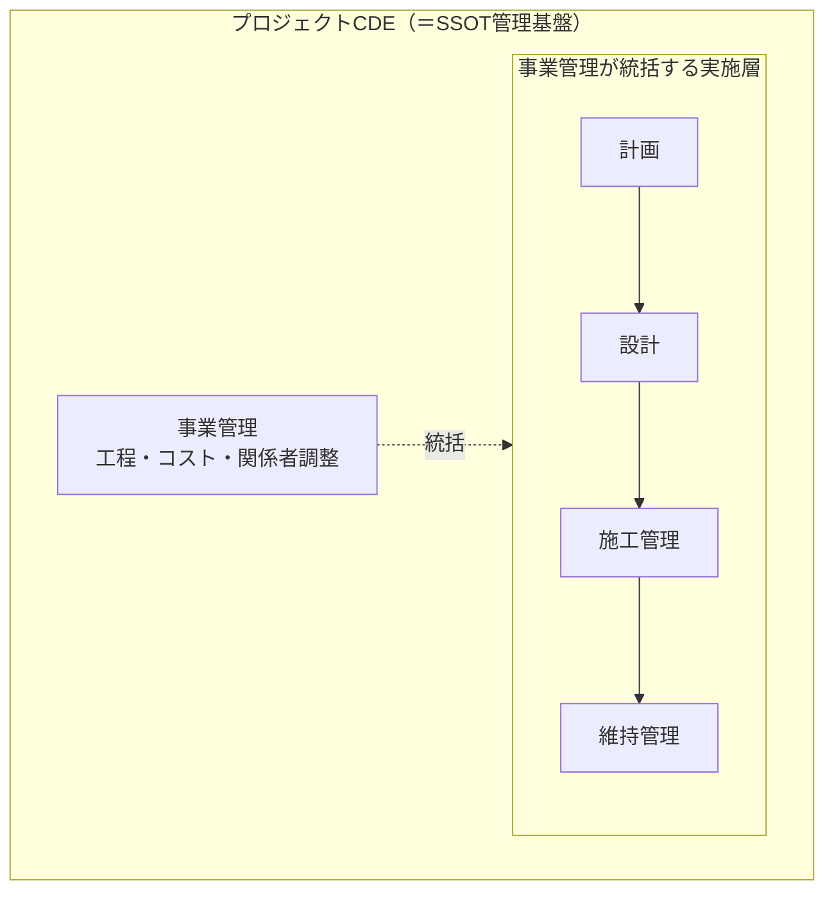
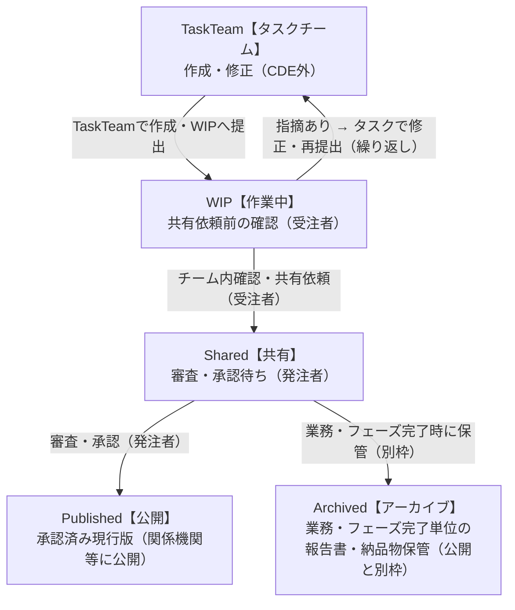
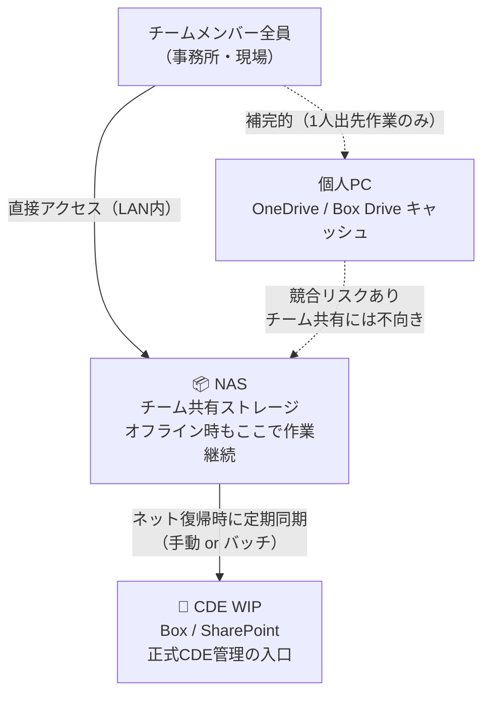
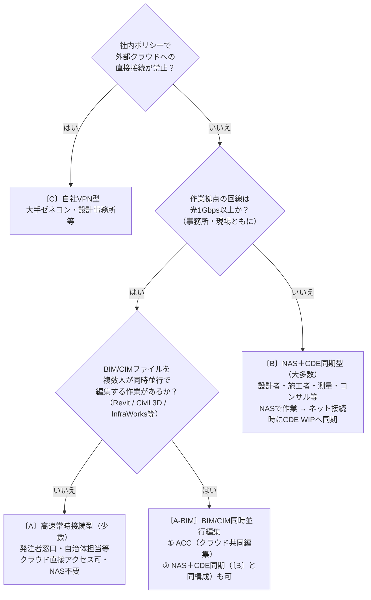

# プロジェクトCDE — Zenn投稿用

> このファイルは GitHub Pages 用の `index.md` から Zenn 投稿向けに整形した版です。
> 元ページ: https://yamamoto-ryuzo.github.io/portal/プロジェクトCDE/

# プロジェクトCDE — 構想・機能・運用ガイド

> 参考資料：[2025.3.7_プロジェクトCDEを中心としたデータマネジメントの取組案について（国土技術政策総合研究所）](https://www.nilim.go.jp/lab/peg/img/file2256.pdf)

---

## 目次

- [プロジェクトCDE — Zenn投稿用](#プロジェクトcde--zenn投稿用)
- [プロジェクトCDE — 構想・機能・運用ガイド](#プロジェクトcde--構想機能運用ガイド)
  - [目次](#目次)
  - [1. プロジェクトCDEとは](#1-プロジェクトcdeとは)
    - [概要](#概要)
  - [2. CDEの根本概念（ISO 19650 / SSOT）](#2-cdeの根本概念iso-19650--ssot)
  - [3. CDEが管理する業務フェーズ](#3-cdeが管理する業務フェーズ)
    - [管理対象業務：事業管理・設計業務（CDEが管理・統制する業務全体）](#管理対象業務事業管理設計業務cdeが管理統制する業務全体)
  - [4. プロジェクトCDEの機能群](#4-プロジェクトcdeの機能群)
    - [4.1 共有・公開（目的層）](#41-共有公開目的層)
    - [4.2 事業監理業務（活用層）](#42-事業監理業務活用層)
    - [4.3 関係機関との情報共有](#43-関係機関との情報共有)
      - [主な関係機関と共有内容](#主な関係機関と共有内容)
        - [情報共有の設計方針](#情報共有の設計方針)
    - [4.4 GIS基盤（空間統合軸）](#44-gis基盤空間統合軸)
    - [4.5 業務データ連携（専門データ取込）](#45-業務データ連携専門データ取込)
  - [5. 想定される利用シーン・期待される効果・対応データ形式](#5-想定される利用シーン期待される効果対応データ形式)
    - [5.1 想定される利用シーン](#51-想定される利用シーン)
    - [5.2 期待される効果](#52-期待される効果)
  - [6. SSOTデータ保存先（ストレージ）の選定](#6-ssotデータ保存先ストレージの選定)
    - [6.1 文書・図面系とGIS・BIM系の使い分け](#61-文書図面系とgisbim系の使い分け)
    - [6.2 選定要件](#62-選定要件)
        - [必須条件（KO条件）](#必須条件ko条件)
        - [評価要件（重みづけ）](#評価要件重みづけ)
    - [6.3 ストレージ候補の比較・総合評価](#63-ストレージ候補の比較総合評価)
        - [総合評価の内訳（全候補・参考）](#総合評価の内訳全候補参考)
    - [6.4 ISMAP登録状況](#64-ismap登録状況)
    - [6.5 推奨](#65-推奨)
    - [6.6 推奨フォルダ構成例（SharePoint / Box 共通）](#66-推奨フォルダ構成例sharepoint--box-共通)
    - [6.7 Exchange【やり取り】の運用ルール（例外措置）](#67-exchangeやり取りの運用ルール例外措置)
    - [6.8 CDEの決済フロー（WIP → Shared → Published / Archived）](#68-cdeの決済フローwip--shared--published--archived)
  - [7. タスクチーム作業環境のストレージ（別枠検討）](#7-タスクチーム作業環境のストレージ別枠検討)
    - [7.1 位置づけの整理](#71-位置づけの整理)
    - [7.2 作業環境の分類（前提条件：先に確認）](#72-作業環境の分類前提条件先に確認)
    - [7.3 評価要件（T1〜T5）](#73-評価要件t1t5)
    - [7.4 候補・総合評価](#74-候補総合評価)
        - [〔B〕NAS＋CDE同期型（大多数のチームが該当）](#bnascde同期型大多数のチームが該当)
        - [〔A〕常時接続型（事務所専従の一部チームのみ）](#a常時接続型事務所専従の一部チームのみ)
        - [〔A-BIM〕BIM/CIM同時並行編集（〔A〕高速常時接続型のうちBIM/CIM同時並行編集を行うチーム）](#a-bimbimcim同時並行編集a高速常時接続型のうちbimcim同時並行編集を行うチーム)
        - [〔C〕自社VPN型（セキュリティポリシー制約のあるチーム）](#c自社vpn型セキュリティポリシー制約のあるチーム)
        - [総合評価の内訳](#総合評価の内訳)
    - [7.5 CDEとの接続ルール（重要）](#75-cdeとの接続ルール重要)

---

## 1. プロジェクトCDEとは

### 概要
- 本資料は「**プロジェクトCDE（事業管理基盤）**」の構想・機能整理を示す。プロジェクトCDEとは、事業の計画・設計・施工・維持管理にわたる**業務そのものをCDE（Common Data Environment）によって管理・統制する仕組み**であり、単なるデータ保管庫ではない。各業務フェーズで生まれるデータをSSOT（唯一の正本）として管理しながら、可視化・共有を通じて事業関係者全体の意思決定を支える。

---

## 2. CDEの根本概念（ISO 19650 / SSOT）
**CDE（ISO 19650準拠）がプロジェクトCDEの根本**である。CDEとは、事業ライフサイクル全体の業務（計画・設計・施工・維持管理・事業管理）を、関係者全員が唯一の正本（SSOT: Single Source of Truth）に基づいて遂行できるよう管理・統制する共通データ環境である。

> 「CDEを使って業務を管理する」のであり、「業務の結果をCDEに格納する」のではない。業務とCDEは不可分一体であることがプロジェクトCDEの根本である。

- **管理対象**: 事業管理・設計業務・施工管理・維持管理の全フェーズにわたる業務活動とその成果データ
- **空間的根幹**: GIS（地理情報システム）がすべてのデータを「位置」という共通軸で統合する
- **データの権威性**: タスクチーム（各専門チームの作業環境・各チーム裁量）から成果物を**CDEに提出**し、WIP【作業中】→ Shared【共有】→ Published【公開】のステータス管理で、業務上の判断・承認をCDE内で完結させる。**現実はタスクチームからすべてが始まる**が、その作業環境（ローカルPC・自社サーバ等）はCDEの外側であり、**WIPへの提出が正式CDE管理の入口**となる

---

## 3. CDEが管理する業務フェーズ

プロジェクトCDEは以下の**管理対象業務**を包括的に管理する。その管理を実現するために①〜④の機能群が必要となる。

### 管理対象業務：事業管理・設計業務（CDEが管理・統制する業務全体）

CDEは以下の各業務フェーズを**CDE内で遂行・承認・記録**する環境として機能する。各フェーズの業務はCDE外では行わず、CDE上で発生・管理されることでSSOTが保証される。



> **プロジェクトCDEとは、実施層（計画・設計・施工管理・維持管理）を事業管理が統括しながら、すべての成果データをSSOTとして管理する基盤そのものである。**

---

## 4. プロジェクトCDEの機能群

プロジェクトCDEの本質は**SSOTによる共有・公開**であり、関係者全員が唯一の正本にアクセスできる環境を提供することが目的である。その目的を実現するために、以下の構造で機能群が成立する。

```
【目的】SSOTによる共有・公開
    ↑ SSOTを活用
【事業監理業務】進捗管理・資料整理・可視化
    ↑ SSOTを構成
【データ基盤】GIS基盤 ＋ 業務データ連携
```

---

### 4.1 共有・公開（目的層）

プロジェクトCDEの存在目的。SSOTとして管理されたデータを、関係者の役割に応じて適切に届ける。

| 機能 | 内容 |
|------|------|
| データ共有基盤 | 事業全体〜工事単位の管理範囲で閲覧URLを発行し、誰でも利用できるブラウザベースの参照環境を提供する |
| アクセス権限管理 | パスワード設定により公開範囲を制御し、住民・施主・施工者など関係者ごとの閲覧制限を実現する |
| SSOT保証 | ISO 19650準拠の **WIP【作業中】→ Shared【共有】→ Published【公開】** のステータス管理により、共有・公開されるデータが常に唯一の正本であることを保証する。現実は各専門チーム（タスクチーム）が自己の作業環境で成果物を準備し、**WIPへの提出をもって正式CDE管理が始まる**。タスクチームの作業環境（ローカルPC・自社サーバ等）はCDEストレージの対象外 |

---

### 4.2 事業監理業務（活用層）

SSOTとして管理されたデータを活用し、事業管理が実施層（計画・設計・施工管理・維持管理）を横断的に統括するための業務機能。

| 機能 | 内容 |
|------|------|
| 進捗管理 | 各フェーズの成果データ（工程表・出来形・承認状況等）をSSOTから参照し、事業全体の進捗をリアルタイムに把握する |
| 資料整理 | 各フェーズで蓄積された設計書・会議録・住民対応記録等をSSOTから集約・整理し、必要な情報を検索・抽出できる状態に保つ |
| 可視化 | SSOTのデータを地図・3D・グラフ等で表現し、複雑な事業状況を関係者が直感的に把握できるようにする |
| 報告書作成支援 | 可視化した地図・3Dデータと属性情報を組み合わせ、高品質な報告書を効率的に生成する |
| 状況把握レベル選択 | 概略〜詳細の複数粒度で表示を切り替え、意思決定の目的に応じた情報密度の確認ができる |
| VR連携 | VRへのデータ出力に対応し、複雑な構造物のイメージ共有や住民説明に活用する |
| 関係機関連携 | 許認可機関・ライフライン事業者・地方自治体等との情報共有を、SSOTから必要なデータを抽出・提供することで円滑化する |

---

### 4.3 関係機関との情報共有

事業管理において、プロジェクトCDE内のSSOTデータを**組織外の関係機関**と適切に共有することは不可欠である。関係機関ごとに共有が必要な情報・タイミング・手段が異なるため、整理が必要。

#### 主な関係機関と共有内容

| 関係機関 | 共有が必要な情報 | タイミング | 共有手段 |
|----------|----------------|-----------|----------|
| 発注者（国・自治体） | 進捗・設計承認・出来形・報告書 | 随時・節目ごと | SSOT参照権限付与・報告書送付 |
| 許認可機関（河川・道路管理者等） | 設計図・施工計画・協議資料 | 協議時 | 図面・資料の外部共有URL |
| ライフライン事業者（電力・ガス・水道等） | 埋設物位置・施工範囲・工程 | 着工前・施工中 | GIS地図共有・平面図 |
| 地方自治体（市区町村） | 事業概要・工程・住民説明資料 | 計画〜施工中 | 閲覧URL・説明会資料 |
| 住民・地権者 | 事業概要・工程・影響範囲・騒音振動情報 | 説明会・随時 | パスワード付き閲覧URL・VR |
| 隣接工事・他事業者 | 施工範囲・工程・仮設計画 | 施工調整時 | 図面・工程表の共有 |

##### 情報共有の設計方針

| 方針 | 内容 |
|------|------|
| SSOTからの派生共有 | 関係機関への提供データは必ずSSOT（Published）から生成し、手動複製・メール添付による情報の分岐を排除する |
| 機関別アクセス権限 | 各関係機関に必要最小限のデータへのアクセス権限のみを付与し、機密情報の漏洩を防ぐ |
| 共有ログの保持 | 誰にいつ何を共有したかを記録し、協議・承認の証跡として活用する |
| フォーマットの柔軟対応 | 相手機関のシステムに合わせてDWG・PDF・CSV・GEOJSONなど形式を変換して提供する |

---

### 4.4 GIS基盤（空間統合軸）

すべての業務データを**位置情報（座標系）という共通軸**で統合し、SSOTの空間的な根幹をなす。

| 機能 | 内容 |
|------|------|
| 空間・属性管理 | 座標系（EPSGコード）による空間参照を全データに付与し、地物ごとの属性情報（台帳・数量・状態等）をGIS上で一元管理する |
| 台帳・属性連携 | 各業務フェーズで生まれる台帳類をCSVやDBで取り込み、GIS属性テーブルとして管理・検索・更新できる状態にする |
| 空間データ形式対応 | GEOJSON・Shape・XYZ等のGIS標準形式を入出力し、他システム・オープンデータとの相互運用性を確保する |
| 地図・位置情報表示 | GEOJSON/XYZ形式で空間データを地図上に重ね、位置情報による状況把握を可能にする |
| 3DTILES可視化 | 3DTILESを活用した大容量3Dモデルのブラウザ表示に特化し、構造物・地形を立体的に確認できる |

### 4.5 業務データ連携（専門データ取込）

各業務フェーズで生成される専門データをGIS空間基盤に統合し、SSOTの内容を充実させるための連携機能。

| 分類 | 機能 | 内容 |
|------|------|------|
| BIM/CIM | BIM/CIM・IFC対応 | IFC形式を含むBIM/CIMデータを受け入れ、施設・構造物の形状と属性をGIS空間基盤と統合管理する |
| CAD | CAD連携 | MAP3D・Civil3D（DWG2013出力対応）と連携し、設計図面・図形（寸法・文字情報）をDWGインポートで取り込む |
| 点群 | 点群データ対応 | 現地計測・LiDARで取得した点群データをGIS座標系に統合し、他データと空間的に重畳管理する |
| 型式変換 | フォーマット変換 | IFC・DWG・CSV・GEOJSON など各種形式を相互変換し、外部システム・既存業務フローとシームレスに連携する |

---

## 5. 想定される利用シーン・期待される効果・対応データ形式

### 5.1 想定される利用シーン
- 設計フェーズ：概略〜詳細の状況把握、複雑情報の整理。
- 施工・工程管理：施工計画、積算（数量計算）との連携。
- 管理・報告：位置情報を用いた見える化、報告書作成の効率化。
- 住民共有：成果や進捗を関係者に共有（閲覧権限・パスワード設定可能）。

### 5.2 期待される効果
- 複雑な情報の整理・一元管理
- 位置情報による可視化で理解促進
- 高品質な報告書作成の工数削減
- 多様なデータ変換・出力で他システム連携が容易に

---

## 6. SSOTデータ保存先（ストレージ）の選定

プロジェクトCDEはSSOTによる共有・公開が目的であるが、**まずデータを保存・管理できるストレージが前提条件**となる。ストレージが決まらなければ、GIS基盤も業務データ連携も成立しない。

なお、プロジェクトCDEで扱うデータは性質が異なるため、**「文書・図面系」と「GIS・BIM系」を使い分ける**ことが現実的である。

### 6.1 文書・図面系とGIS・BIM系の使い分け

```
【文書・図面系】設計書・報告書・会議録・CAD図面・写真
    → ファイルストレージ（SharePoint / Box / NAS）で管理

【GIS・BIM系】空間データ・IFC・点群・3Dモデル
    → GIS/BIMプラットフォームと連携（別途選定）
    ただし元ファイルの保管先はファイルストレージと統一が望ましい
```

---

### 6.2 選定要件

要件は「**必須条件（KO条件）**」と「**評価要件（重みづけ）**」の2段階で設定する。KO条件を満たさない候補はその時点で不適合となり、採点対象から除外される。

##### 必須条件（KO条件）

| # | 要件 | 必須とする理由 |
|---|------|------------|
| **KO-A** | **認証付き外部共有（コラボレータ相当）** | 許認可機関・ライフライン事業者等との**公式な協議・承認**には、Boxコラボレータのようなアカウント認証＋アクセス権限管理＋操作ログを備えた外部共有機能が必要。パスワード付きURLの共有リンクのみの場合はアクセス者の特定・証跡管理が困難なため**KO-A不適合**とする。なお住民向け閲覧公開等の低リスク用途には共有リンクで補完可 |
| **KO-B** | **国内データセンター（または同等のセキュリティ保証）** | 公共事業データの所在国要件・ガバメントクラウド方針への適合。発注者（国・自治体）のセキュリティポリシー上、原則として国内DC必須 |

##### 評価要件（重みづけ）

> 評価点：◎＝3点 ／ ○＝2点 ／ △＝1点　　R8（コスト）は低いほど高得点（低〜中＝3、中＝2、初期高＝1）

| # | 要件 | 重み | 重みの根拠 |
|---|------|:----:|----------|
| R1 | 複数人・複数組織からのアクセス | ×2 | KO条件でも前提とされているが、同時アクセス数・組織数の多さに応じた品質差（速度劣化・制限）が業務に影響するため評価要件に残す |
| R2 | フォルダ・ファイル単位のアクセス権限管理 | ×3 | ISO 19650のWIP/Shared/PublishedステータスとSSOT管理の根幹。各タスクチームが提出したデータに対し、フェーズ・役割・機関ごとの公開範囲拡大を精緻に制御できなければCDEとして機能しない。最重要 |
| R3 | バージョン管理・変更履歴 | ×2 | SSOTの改訂履歴（誰がいつ何を変更したか）の保持に直結。設計変更の追跡可能性・原因分析に必要 |
| R4 | 大容量ファイル対応 | ×2 | BIM/CIM・点群データは数GB〜数十GBになり、容量制限・転送速度が業務の可否に直接影響する。**容量無制限**かどうかが評価の分岐点（◎：無制限、○：大容量だが上限あり、△：制限が厳しい） |
| R7 | 既存業務ツールとの親和性 | ×1 | 導入効果・学習コストに関わるが、慣れや教育で補える部分もあり、セキュリティ・機能要件より優先度低め |
| R8 | 長期運用コスト | ×1 | 数年〜数十年の累積コストは無視できないが、セキュリティ・機能要件を優先したうえでの比較要素 |
| R9 | 外部関係機関の操作ログ・承認証跡 | ×2 | 公共事業の協議記録・承認は法的証跡としての意味を持つ。コラボレータ単位でアクセス履歴を追跡できることが必要。KO-Aを通過した候補内でも品質差がある |

---

### 6.3 ストレージ候補の比較・総合評価

> KO判定が⚠️・❌の候補の総合点は**参考値**（KO要件の解消を前提とした場合の機能評価）。実際の採用判断はKO判定の解消が前提。

| ストレージ | 種別 | KO-A<br/>外部共有 | KO-B<br/>国内DC | **KO判定** | R1<br/>×2 | R2<br/>×3 | R3<br/>×2 | R4<br/>×2 | R7<br/>×1 | R8<br/>×1 | R9<br/>×2 | **総合点**<br/>（/39点） |
|-----------|------|:---:|:---:|:---:|:---:|:---:|:---:|:---:|:---:|:---:|:---:|:---:|
| **Box** | クラウド | ◎ | ◎ | **✅ 適合** | ◎ | ◎ | ◎ | ◎ | ○ | 中 | ◎ | **37** |
| **SharePoint / OneDrive** | クラウド | ○（※4） | ◎ | **⚠️ 要確認** | ◎ | ◎ | ◎ | ○ | ◎ | 中 | ◎ | *36（参考）* |
| **Dropbox Business** | クラウド | ○（※3） | ○（※1） | **⚠️ 要確認** | ◎ | ○ | ◎ | ○ | ○ | 中 | △ | *28（参考）* |
| **Google Drive / Workspace** | クラウド | ○（※3） | △（※1） | **⚠️ 要確認** | ◎ | ○ | ○ | ○ | ○ | 低〜中 | △ | *27（参考）* |
| **NAS（オンプレミス）** | 自前サーバ | △（※2） | ◎ | **❌ 不適合** | △ | ○ | △ | ◎ | ○ | 初期高 | △ | *21（参考）* |

> ※1 Dropbox BusinessはISMAP登録済み（C24-0075-2）だが、データセンター所在国の扱いは発注者のセキュリティポリシー確認が必要なため「要確認」とする。Google WorkspaceもISMAP登録済み（C21-0005-2）だが同様。  
> ※2 NASは外部組織との共有にVPN設定が必要で、認証付き外部共有手段がなく、KO-A不適合とする。  
> ※3 Google Workspace・Dropbox BusinessのKO-Aは○：外部共有にそれぞれGoogleアカウント・Dropboxアカウントが必要。技術的には認証付き共有は可能だが、相手方がアカウントを持たない場合は成立しない。これらのKO判定が⚠️要確認なのは**KO-B（国内DC）が満たせていないため**であり、KO-Aの問題ではない。  
> ※4 SharePointのKO-Aは○：Azure AD B2Bゲスト招待は相手方がMicrosoftアカウントを持つか、相手方組織のポリシーでゲスト招待が許可されていることが前提であり、許認可機関・行政機関では制限されるケースが多い。KO-Aが条件付きであるため⚠️要確認とする。KO-B（国内DC）は◎であり、**関係機関がゲスト招待を許可できることを事前に確認できれば✅利用可**。  
> ※R4評価の根拠（容量）：Box◎＝**容量無制限**（Business以上）／SharePoint○＝1TBベース＋ライセンス加算・1ファイル上限250GB／Dropbox○＝プランにより上限あり（Advancedで無制限）／Google○＝Workspace Businessは共有プール制・Enterpriseで無制限／NAS◎＝自前ハード増設で無制限だが初期コスト大

##### 総合評価の内訳（全候補・参考）

| ストレージ | KO判定 | R1（6） | R2（9） | R3（6） | R4（6） | R7（3） | R8（3） | R9（6） | **合計** |
|-----------|:------:|:---:|:---:|:---:|:---:|:---:|:---:|:---:|:---:|
| Box | ✅ | 6 | 9 | 6 | 6 | 2 | 2 | 6 | **37** |
| SharePoint | ⚠️ | 6 | 9 | 6 | 4 | 3 | 2 | 6 | *36* |
| Dropbox Business | ⚠️ | 6 | 6 | 6 | 4 | 2 | 2 | 2 | *28* |
| Google Workspace | ⚠️ | 6 | 6 | 4 | 4 | 2 | 3 | 2 | *27* |
| NAS | ❌ | 2 | 6 | 2 | 6 | 2 | 1 | 2 | *21* |

---

### 6.4 ISMAP登録状況

公共事業において政府調達対象となるには、原則としてISMAP（情報システムセキュリティ管理・評価制度）への登録が必要。

| サービス | ISMAP登録番号 | 事業者名 | 備考 |
|---------|:------------:|---------|------|
| **SharePoint / OneDrive (Office 365)** | **C21-0013-2** | 日本マイクロソフト株式会社 | 「Microsoft Office 365」として登録。言明の対象範囲はPDF参照 |
| **Box** | **C21-0017-2** | Box, Inc. | 「Box」として登録。言明の対象範囲はPDF参照 |
| **Google Workspace** | **C21-0005-2** | Google LLC | 「Google Workspace」として登録。言明の対象範囲はPDF参照。ただしデータ所在国は契約プランで確認要 |
| **Dropbox Business** | **C24-0075-2** | Dropbox, Inc. | 「Dropbox Business、Dropbox Business Plus、Dropbox Standard、Dropbox Advanced、Dropbox Enterprise、およびDropbox Education」として登録 |
| **NAS（オンプレミス）** | — | — | クラウドサービスではないためISMAP対象外。庁内管理として別途セキュリティ評価が必要 |

> 出典：[ISMAPクラウドサービスリスト](https://www.ismap.go.jp/csm?id=cloud_service_list)（2026年4月時点）

---

### 6.5 推奨

| 状況 | 推奨 | 根拠 |
|------|------|------|
| **国・自治体が発注者（ISMAP準拠必須）** | **SharePoint (Microsoft 365)** | ISMAP登録済み（C21-0013-2）。国内リージョン（東日本・西日本）でデータ所在国要件を満たす。発注者・設計者・施工者等、**M365を使用する組織間**での承認ワークフロー・共有ログを標準機能で実現できる。M365を持たない関係機関（許認可機関・住民等）へはゲストリンク・パスワード付きURL共有で対応するが、相手方の操作習熟が課題 |
| **建設コンソーシアム・外部共有が多い** | **Box** | ISMAP登録済み（C21-0017-2）。外部組織との共有手段として2方式を使い分けられる。①**コラボレータ**（Boxアカウント＋本人認証・アクセス権限・操作ログ管理）は許認可機関・ライフライン事業者等との**公式な情報共有**に適した高セキュリティ方式。②**共有リンク**（パスワード付きURL）は便利だが誰がアクセスしたか追跡が困難なため、住民向け閲覧公開等の低リスク用途に限定すべき。関係機関との協議・承認はコラボレータで行うことが原則。大容量ファイル（BIM/CIM・点群）対応 |
| **ISMAP要件の確認が取れない・調達が間に合わない** | **NAS + VPN（暫定）** | 庁内・事務所内に閉じた環境として暫定利用可。外部共有はVPN接続が必要で運用コストが高く、長期運用には適さない |

### 6.6 推奨フォルダ構成例（SharePoint / Box 共通）

国土交通省「事業促進PPPに関するガイドライン（令和6年4月改正）」の業務分類6項目をフォルダ名にそのまま使用する。

**フォルダ階層の設計方針：ステータス（Exchange / TaskTeam / WIP / Shared / Published / Archived）を最上位に置く理由**

CDE のステータスは「誰が見られるか・変更できるか」＝**公開対象者と変更可否の変化**を表す：

| ステータス | 公開対象 | 変更 | 用途 |
|-----------|---------|------|------|
| **Exchange【やり取り】** | **当該チームのみ** | **可** | **【例外措置】CDE外からのやり取りファイルの一時保管（業務分類せず年月等で管理）** |
| **TaskTeam【タスクチーム】** | **当該チームのみ（CDE外）** | **可** | **草稿・内部調整・WIP提出前の作業** |
| **WIP【作業中】** | **当該タスクチームのみ** | **可** | **正式CDE管理の入口・作業・レビュー・指摘対応** |
| **Shared【共有】** | **プロジェクト関係者全員** | **不可** | **発注者による審査・承認待ち（契約上の受理）** |
| **Published【公開】** | **関係機関・外部関係者** | **不可** | **関係機関等への公開版・現行正本** |
| **Archived【アーカイブ】** | **全関係者** | **不可（確定・固定）** | **業務・フェーズ完了単位の報告書・納品物の保管** |

`TaskTeam` は厳密にはCDE外（各チームのローカルPC・NAS等）だが、CDE上に置く場合は**当該チームのみアクセス可の作業フォルダ**として機能する。草稿がまとまった段階で `WIP/` へ提出することで正式CDE管理が開始される。

業務フォルダを最上位にすると `02_設計/WIP`・`03_関係機関協議/WIP`… と**フォルダ数 × 6 回**の権限設定が必要になり、設定漏れ・担当変更時のメンテナンスコストが増大する。ステータスを最上位にすれば各ステータスフォルダへの権限付与が**各1回**で全業務フォルダに継承される。ISO 19650 のCDE概念（ステータスが情報管理の主軸）にも忠実であることから、**ステータス → 業務** の順を採用する。

```
📁 [事業名]-プロジェクトCDE
│
├── 📁 Exchange【やり取り】   ← 【例外措置】CDE外でやり取りされたファイルを一時保管する場所
│   │              ※業務分類（01〜07）は行わず、年月等で管理。重要なものは後でShared等に移す。
│   ├── 📁 202604_〇〇省から受領
│   └── 📁 202604_地元説明会資料_送信控え
│
├── 📁 TaskTeam【タスクチーム】   ← CDE上の各チーム作業フォルダ（当該チームのみアクセス可）
│   │              ローカルPC・NAS等CDE外で作業する場合はこのフォルダは不要
│   └── 📁 [業務名]                                    ← 当該チーム個別設定
│       ├── 📁 01_事業全体計画の整理
│       ├── 📁 02_測量・調査・設計業務等の指導・調整等
│       ├── 📁 03_地元及び関係行政機関等との協議
│       ├── 📁 04_事業管理
│       ├── 📁 05_施工管理
│       ├── 📁 06_BIM-CIM（統合モデル）活用支援    ※フォルダ名の "/" は "-" に置換
│       └── 📁 07_その他（維持管理・電子納品等）
│
├── 📁 WIP【作業中】        ← 当該タスクチームのみ書込可・正式CDE管理の入口
│   │              TaskTeam またはCDE外から成果物を提出する
│   └── 📁 [業務名]                                    ← 当該チーム個別設定
│       ├── 📁 01_事業全体計画の整理
│       ├── 📁 02_測量・調査・設計業務等の指導・調整等
│       ├── 📁 03_地元及び関係行政機関等との協議
│       ├── 📁 04_事業管理
│       ├── 📁 05_施工管理
│       ├── 📁 06_BIM-CIM（統合モデル）活用支援
│       └── 📁 07_その他（維持管理・電子納品等）
│
├── 📁 Shared【共有】     ← 承認済み・プロジェクト関係者全員閲覧可（ここに一括設定・全業務フォルダへ継承）
│   │              WIPで承認完了した成果物。ここかPublished【公開】とArchived【アーカイブ】に並行分岐
│   ├── 📁 01_事業全体計画の整理
│   ├── 📁 02_測量・調査・設計業務等の指導・調整等
│   ├── 📁 03_地元及び関係行政機関等との協議
│   ├── 📁 04_事業管理
│   ├── 📁 05_施工管理
│   ├── 📁 06_BIM-CIM（統合モデル）活用支援
│   └── 📁 07_その他（維持管理・電子納品等）
│
├── 📁 Published【公開】  ← 関係機関等への公開版（ここに一括設定・全業務フォルダへ継承）
│   │              Sharedから分岐。関係機関・外部関係者等に提示する現行正本
│   ├── 📁 01_事業全体計画の整理
│   ├── 📁 02_測量・調査・設計業務等の指導・調整等
│   ├── 📁 03_地元及び関係行政機関等との協議
│   ├── 📁 04_事業管理
│   ├── 📁 05_施工管理
│   ├── 📁 06_BIM-CIM（統合モデル）活用支援
│   └── 📁 07_その他（維持管理・電子納品等）
│
├── 📁 Archived【アーカイブ】   ← 変更不可（ここに一括設定・全業務フォルダへ継承）
│   │              電子納品・保管管理システムの代替。業務・工事完了時の成果物・納品物を保管する
│   │              ※Published【公開】（現行公開版）と並立して「完了分」を蓄積する場所
│   ├── 📁 01_土木設計業務等   ← 設計・測量・調査・事業管理等の業務完了時の報告書・成果品
│   └── 📁 02_工事完成図書     ← 工事完了時の完成図・施工記録・出来形・品質管理書類等
```

### 6.7 Exchange【やり取り】の運用ルール（例外措置）

CDEの理想は「全関係者が同じシステム上で完結すること」ですが、メール添付やチャットなどCDE外の手段でやり取りされた未整理データを受け止めるバッファとして、ステータス階層の最上位に `Exchange` フォルダを設けることを許容します。

**【Exchangeの運用ルール】**
1. **正本（SSOT）として扱わない**
   `Exchange` に入っているファイルは、あくまで「やり取りの記録（コピー）」であり、プロジェクトの公式な最新データ（正本）として扱ってはいけません。
2. **重要なものだけ後から `Shared` 等に移動する**
   事業の前提条件が変わるような重要な要領や、確定した設計図など、後続の作業で全員が参照しなければならない重要データだけは、定期的に見直し、本来の業務フォルダ（`Shared` や `Published`）へ手動で移します。
3. **フォルダの整理は「年月」や「相手先」等のゆるいルールでOK**
   `Exchange` 内まで厳密に「業務分類（01〜07）」で分けようとすると破綻します。「2026年4月」といった年月ごとのフォルダや、「〇〇省」といった相手先別のフォルダなど、放り込む人が直感的に分類できる（手間がかからない）構成にしておくのが長続きのコツです。

### 6.8 CDEの決済フロー（WIP → Shared → Published / Archived）

ISO 19650 のステータス遷移は単なるデータ管理の便宜ではなく、**正式な決済（承認）プロセス**を表す：



**フローの説明**

| 遷移 | アクション | 実行者 |
|------|--------|------|
| WIP → Shared | チーム内確認・共有依頼 | 受注者（各担当） |
| Shared → Published | 審査・承認（契約上の受理） | 発注者（監督職員等） |
| Shared → Archived | 業務・フェーズ完了時に保管 ※公開とは独立した別枠 | 発注者/システム |

正しい使い分け：
- **TaskTeam【タスクチーム】**: 成果物の作成・修正・再提出（CDE外）
- **WIP【作業中】**: 正式CDE管理の入口・作業・指摘対応（当該タスクチームのみ変更可）
- **Shared【共有】**: 発注者による審査・承認待ち（契約上の受理）
- **Published【公開】**: 承認済み現行版・関係機関等への公開
- **Archived【アーカイブ】**: 業務・フェーズ完了単位の報告書・納品物・承認済み議事録の保管

> 💡 `WIP→Shared` は受注者の共有依頼、`Shared→Published` は発注者の審査・承認。`Archived` は公開とは別枠の保管専用ステータスで、Shared から独立して分岐する。

> **最優先確認事項**：発注者（国・自治体）の情報セキュリティポリシーおよびガバメントクラウド方針によりクラウド利用可否・使用可能サービスが限定される場合がある。ストレージ選定は事業開始前に発注者と合意が必要。

---

## 7. タスクチーム作業環境のストレージ（別枠検討）

タスクチームの作業環境は**CDEの外側・各チーム裁量**であり、CDE（SSOT）ストレージとは目的・要件が根本的に異なる。

### 7.1 位置づけの整理

```
【タスクチーム作業環境】            【CDE（SSOT）ストレージ】
  各チームの草稿・内部調整             WIP → Shared → Published
  自チーム裁量・組織内利用             発注者管理・全関係者参照
  ISMAP/外部共有 不要                 ISMAP/認証付き外部共有 必須
         ↓ 成果物をWIPへ提出
         ここが境界線
```

CDE選定で課したKO-A（認証付き外部共有）・KO-B（国内DC）は**基本的に不要**。代わりに、チーム内共有・ツール統合・CDEへの搬入しやすさが重要な評価軸となる（詳細は [7.3節](#73-評価要件t1t5)）。

### 7.2 作業環境の分類（前提条件：先に確認）

候補を評価する前に、**チームがどのネット環境で作業するか**を先に確認する。これは評価点ではなく、**選択できる環境の範囲を決める前提条件**である。

> **重要**：建設・インフラプロジェクトの大多数のチームは「事務所＋現場の両方で作業する」。  
> オフライン同期の主体は**個人PCではなくNAS（チーム共有ストレージ）**である。  
> 個人PCのOneDrive/Box Driveキャッシュは各自に分散するため、チームで同じファイルに同時アクセスすると**同期競合が発生し作業に支障をきたす**。  
> **NASをチームの共有作業ベースに置き、ネット復帰時にNAS→CDEへ定期同期する構成**が現実的な標準パターン。


> 【タスクチーム作業環境の標準構成（〔B〕の実態）】個人PCのOneDrive/Box Driveキャッシュはチーム共有には不向き（競合リスク）。NASをチームの共有作業ベースに置くのが標準パターン。



| 分類 | 典型的なチーム | 前提条件 | 作業環境の実態 |
|------|--------------|---------|--------------|
| **〔A〕高速常時接続型**（少数） | 発注者窓口・自治体担当（事務所専従） | **光1Gbps以上（事務所固定回線）が前提**。低速回線では大容量ファイルの直接クラウドアクセスは非現実的 | クラウド直接アクセス可。NAS不要 |
| **〔B〕NAS＋CDE同期型**（**大多数**） | 設計者・施工者・測量・コンサル（事務所＋現場） | 現場・移動中はネット不安定・低速。事務所回線も1Gbps未満のケースあり | **NASがチーム共有作業の基盤**。ネット復帰時にNAS→CDE WIPへ同期提出 |
| **〔A-BIM〕BIM/CIM同時並行編集** | BIM/CIM担当（Revit・Civil 3D・InfraWorks等）かつ**光1Gbps以上** | **複数人がBIM/CIMファイルを同時並行編集する**＋高速回線確保済み | **①ACCクラウド共同編集**（Revit: Cloud Worksharing等）または**②NAS＋CDE同期（〔B〕と同構成）**。プロジェクト条件・ACCライセンス保有状況に応じて選択 |
| **〔C〕自社VPN型** | 大手ゼネコン・設計事務所（情報セキュリティポリシーによりVPN必須） | 社内ポリシー上、外部クラウドへの直接接続不可 | 自社サーバ＋VPN。CDEへの提出は専用経路 |

> 〔A-BIM〕チームに光1Gbps未満の環境でACCクラウド同期を強いることはKO相当の問題。回線が不十分な場合は〔B〕NAS＋CDE同期型で対応する。ACCライセンスがない場合やプロジェクト規模が小さい場合も〔B〕NAS構成で十分対応できる。

### 7.3 評価要件（T1〜T5）

前提条件〔A〕〔B〕〔C〕の分類内で以下の要件で評価する。

> 評価点：◎＝3点 ／ ○＝2点 ／ △＝1点　　T5（コスト）は低いほど高得点（無料〜安価＝3、中程度＝2、高い＝1）

| # | 要件 | 重み | 重みの根拠 |
|---|------|:----:|----------|
| T1 | チーム内共有・同時編集 | ×3 | 複数メンバーが並行して草稿を作成・調整する場面が日常的に発生。作業効率に直結するため最重要 |
| T2 | 既存ツールとの統合（CAD・Office・BIM等） | ×3 | 設計者・施工者が普段使うツールと連携できれば学習コスト・摩擦がなくなり、導入の成否を左右する |
| T3 | バージョン管理・変更履歴 | ×2 | 草稿段階での誤上書き・誤削除からの復元。チーム内レビュー履歴の保持 |
| T4 | CDEへの搬入しやすさ（WIP提出） | ×3 | WIPへの提出が手間だと提出漏れ・遅延が発生しSSOTが崩れる。CDEと同一サービスなら理想的 |
| T5 | コスト・導入障壁 | ×2 | 各チームが追加費用なく使えることが普及の前提。既存ライセンスで賄えるかが重要 |

---

### 7.4 候補・総合評価

各チームが**すでに持っている環境を使うのが現実的**。強制統一はコスト・運用負荷が高く不要。

##### 〔B〕NAS＋CDE同期型（大多数のチームが該当）

> NASがチームの共有作業ベース。ネット接続時にNAS→CDE（WIP）へ同期・提出する構成が標準。  
> 個人PCのOneDrive/Box DriveはNASの代替にはならない（チーム複数人が同じファイルを触ると競合する）。

| 環境 | 想定チーム | T1<br/>×3 | T2<br/>×3 | T3<br/>×2 | T4<br/>×3 | T5<br/>×2 | **総合点**<br/>（/39点） |
|------|-----------|:---:|:---:|:---:|:---:|:---:|:---:|
| **NAS ＋ SharePoint同期**（M365） | 設計者・コンサル・施工者（M365保有） | ◎ | ◎ | ◎ | ◎（※a） | ○ | **37** |
| **NAS ＋ Box同期** | BoxをCDEとして採用した場合 | ◎ | ◎ | ◎ | ◎（※a） | ○ | **37** |
| **NAS ＋ 手動アップロード** | クラウドサービス未契約チーム | ◎ | ◎ | ◎ | ○（※b） | ◎ | **35** |

> ※NAS自体のバージョン管理機能は製品依存（QNAP・Synology等はスナップショット機能あり）。バージョン管理をCDE側（WIP以降）に委ねる運用でもよい。

##### 〔A〕常時接続型（事務所専従の一部チームのみ）

> 〔B〕のサービスはすべて〔A〕でも使用可。発注者窓口・自治体担当等、事務所から動かない担当者に限り、NASなしのクラウド直接アクセスも問題ない。特別な選択肢はない。

##### 〔A-BIM〕BIM/CIM同時並行編集（〔A〕高速常時接続型のうちBIM/CIM同時並行編集を行うチーム）

> 〔A〕高速常時接続型のうち、**複数人がBIM/CIMファイルを同時並行編集する**チームが該当。光1Gbps以上が確保されているため、**①ACCクラウド共同編集**または**②NAS＋CDE同期（〔B〕と同構成）**のどちらも選択できる。アクセス頻度・コスト・ライセンス保有状況・プロジェクト規模に応じて選択する。

| 環境 | 想定チーム | T1<br/>×3 | T2<br/>×3 | T3<br/>×2 | T4<br/>×3 | T5<br/>×2 | **総合点**<br/>（/39点） |
|------|-----------|:---:|:---:|:---:|:---:|:---:|:---:|
| **ACC（Autodesk Construction Cloud）** | BIM/CIM担当・光1Gbps以上・ACCライセンスあり | ◎（※f） | ◎ | ◎ | △（※c） | ○ | **31** |
| **NAS ＋ SharePoint/Box同期**（〔B〕と同構成） | BIM/CIM担当・光1Gbps以上・ACCライセンスなし等 | ◎ | ◎ | ◎ | ◎（※a） | ○ | **37** |

##### 〔C〕自社VPN型（セキュリティポリシー制約のあるチーム）

| 環境 | 想定チーム | T1<br/>×3 | T2<br/>×3 | T3<br/>×2 | T4<br/>×3 | T5<br/>×2 | **総合点**<br/>（/39点） |
|------|-----------|:---:|:---:|:---:|:---:|:---:|:---:|
| **自社サーバ・VPN環境** | ゼネコン・大手設計事務所（VPN必須） | ○ | ◎ | ○ | △（※c） | △ | **24** |

> ※a NASをCDEと同一サービスの同期対象に設定することで、NAS上の更新ファイルがWIPに自動または半自動で反映できる。SharePoint/OneDriveはNASマウント（WebDAV・Azure File Sync等）に対応。  
> ※b 手動アップロードの場合は「提出ルール（ファイル命名・提出連絡）」の徹底が提出漏れ防止の鍵  
> ※c 提出時はNAS→CDEへのコピーまたはエクスポート操作が必要。提出ミス・タイムラグが生じやすい  
> ※f **BIM/CIMツールとクラウドの対応状況**：Revit・Civil 3D・InfraWorksは**Autodesk Construction Cloud（ACC）経由であればクラウド保存・共同編集に対応済み**（Revit: Cloud Worksharing◎、Civil 3D: ACC対応・xref構造に注意、InfraWorks: .imxをACC/BIM 360 Docsに保存可）。ただし**ACCはAutodesk専用プラットフォームであり、Box・SharePoint等の汎用クラウドストレージとは別物**。BIM/CIM作業ファイル（.rvt/.dwg/.imx等）を汎用クラウドストレージに直接保存・同期することは非推奨または動作保証外（特にInfraWorksの.imxは多数の関連ファイルを参照する構造のため、汎用ファイル同期ツールで構造が破損するリスクがある）。**CDEをBox/SharePointとする場合、ACCとのデータ連携はIFC・PDF等へのエクスポートによる提出ワークフロー、またはACC提供のAPIコネクタ（ACC↔Box連携等）の別途検討が必要**。

##### 総合評価の内訳

| 分類 | 環境 | T1（9） | T2（9） | T3（6） | T4（9） | T5（6） | **合計** |
|:----:|------|:---:|:---:|:---:|:---:|:---:|:---:|
| 〔B〕 | NAS＋SharePoint同期 | 9 | 9 | 6 | 9 | 4 | **37** |
| 〔B〕 | NAS＋Box同期 | 9 | 9 | 6 | 9 | 4 | **37** |
| 〔B〕 | NAS＋手動アップロード | 9 | 9 | 6 | 6 | 6 | **35** |
| 〔A-BIM〕 | NAS＋SharePoint/Box同期 | 9 | 9 | 6 | 9 | 4 | **37** |
| 〔A-BIM〕 | ACC（クラウド共同編集） | 9 | 9 | 6 | 3 | 4 | **31** |
| 〔C〕 | 自社サーバ・VPN | 6 | 9 | 4 | 3 | 2 | **24** |

> **重要な留意点①**: タスクチーム作業環境は**各チームが自チームで決める**性格のものであり、プロジェクト全体で強制統一する性質ではない。点数はCDE選定候補を検討する際の参考情報として位置づける。  

> **重要な留意点②（BIM/CIM）**: InfraWorks・Civil 3D・RevitはACC（Autodesk Construction Cloud）経由でのクラウド保存・共同編集に対応済みだが、**ACCは汎用ファイルストレージではなくAutodesk専用CDEプラットフォーム**。CDEをBox/SharePointとする場合、BIM/CIMチームの作業ファイルはACC内に留まり、完成成果物（IFC・PDF・点群等）をCDE（Box/SharePoint）のWIPへエクスポート提出するワークフローが基本。ACCをプロジェクトのBIM/CDE基盤として採用する場合は、Box/SharePointとの役割分担（BIM/CIM層＝ACC、文書・図面層＝Box/SharePoint）を明確にし、相互連携方法を別途設計する必要がある。

---

### 7.5 CDEとの接続ルール（重要）

タスクチーム作業環境が何であれ、**WIPへの提出ルールを統一**することが最重要。環境を強制統一するより、提出プロセスを標準化する方が現実的。

```
提出ルール（例）
① 成果物がチーム内でレビュー・合意済みであること
② ファイル命名規則に従っていること（[事業コード]_[図面番号]_[版数]_[日付]）
③ CDEのWIPフォルダの所定の場所にアップロード
④ 提出連絡（チャット・メール等）で発注者担当に通知
→ 以降はCDE管理（Shared→Published）へ移行
```

> **統合パターン（理想）**: CDEをBoxまたはSharePointとした場合、同一サービスの別フォルダをタスクチーム作業環境として使うことで、提出操作がフォルダ間の移動・コピーで完結する。ただしタスクチームフォルダのアクセス権限をCDE（WIP以降）と明確に分離することが必要。


